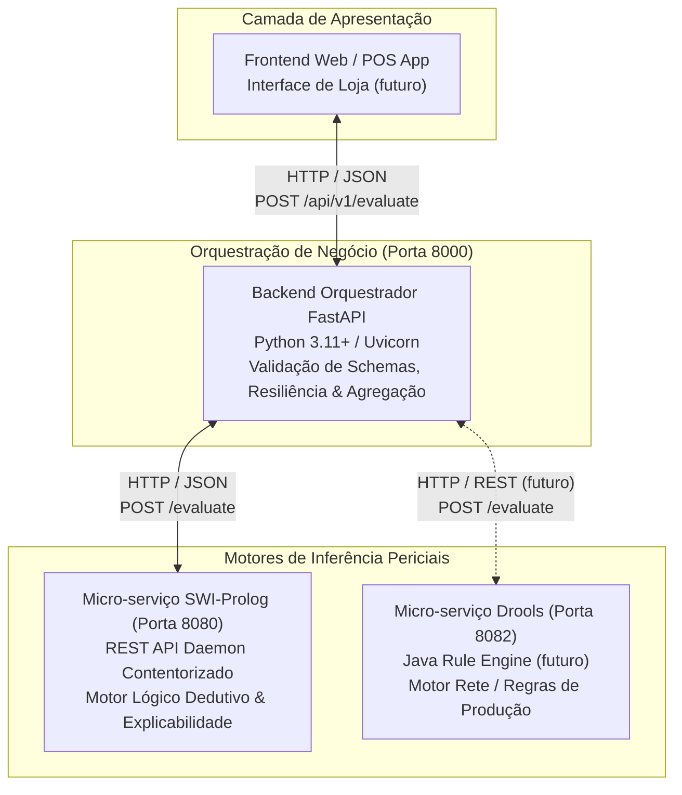

# Sistema Pericial de Diagnóstico para Devoluções e Trocas no Retalho
### *Retail Returns & Exchanges Diagnostic Expert System*

[](LICENSE)
[](https://fastapi.tiangolo.com/)
[](https://www.python.org/)
[](https://www.swi-prolog.org/)


> **Mestrado em Engenharia de Inteligência Artificial (MEIA)** 
> **Unidades Curriculares:** Engenharia do Conhecimento em IA (ENGCIA) & Paradigmas de Programação em IA (PPROGIA) 
> **Desafio:** Challenges 4Teams — **Equipa 3** (Ano Letivo 2026/2027) 
> **Perito de Domínio:** Dustin Hopper (Especialista em fluxos operacionais e atendimento de retalho)

---

## 1. Visão Geral do Projeto

O objetivo deste projeto consiste em **incorporar conhecimento humano especializado em sistemas modernos de Inteligência Artificial**, traduzindo a experiência operacional de retalho na linha da frente em decisões de triagem de devoluções automatizadas, determinísticas, instantâneas e integralmente auditáveis.

O caso de uso modelado abrange o fluxo operacional de **Devoluções e Trocas no Retalho** (*Returns & Exchanges*), abordando os múltiplos fatores com que as equipas de loja lidam diariamente:
* **Elegibilidade do Artigo:** Categoria do produto, peças íntimas (*bodywear* / restrições de higiene e *biohazard*), estado de conservação (usado, lavado, com danos ou defeito de fabrico) e presença de etiquetas originais.
* **Comprovativo de Compra:** Recibo físico ou digital, devoluções sem comprovativo (*blind return*), compras em regime de presente (*gift receipt*).
* **Prazos Operacionais:** Janela padrão de devolução (ex.: 30 dias), janelas de ajuste de preço (*price adjustment*, ex.: 14 dias) e transações fora de prazo elegíveis para crédito de loja.
* **Canais de Venda:** Loja física, *outlet* ou comércio eletrónico (*online*).
* **Métodos de Pagamento (*Tenders*):** Dinheiro, cartão bancário, plataformas de pagamento diferido (*Afterpay*, *Klarna*), vales de loja ou *PayPal*.

### Requisito Primordial: Explicabilidade (*Explainability & Transparency*)
O sistema transcende o modelo de "caixa negra". Para além da ação ou desfecho categórico (`approved`, `rejected`, `store_credit_only`, `manager_override`), o sistema gera obrigatoriamente uma **cadeia de justificações explícita** (*Why / Why not*), detalhando as políticas e regras de negócio que fundamentaram a decisão para o cliente e operador de caixa.

---

## 2. Arquitetura da Solução Global

O sistema adota uma arquitetura modular de micro-serviços desacoplados, orquestrados via rede Docker:



* **Frontend:** Ponto de interação do utilizador, comunicando exclusivamente com a API pública do backend orquestrador.
* **Backend Orquestrador (FastAPI):** Valida schemas de entrada/saída (DTOs Pydantic v2), gere timeouts e pools de ligação HTTP assíncronos (`httpx`), e agrega justificações. **Regra de Ouro:** O orquestrador não embuti regras de negócio de retalho.
* **Motor SWI-Prolog (Implementado):** Daemon HTTP multi-threaded com Clean Architecture (`api/` vs `core/`), focado na inferência dedutiva e geração explicativa de diagnósticos.
* **Motor Java Drools (Próxima Fase):** Motor de regras de produção para comparação e auditoria cruzada.

---

## 3. Guia de Início Rápido (Quick Start em 3 Comandos)

O ecossistema está totalmente contentorizado e pronto para execução via **Docker Compose**:

```bash
# 1. Compilar as imagens e iniciar todo o ecossistema em segundo plano
docker compose up --build -d

# 2. Verificar a saúde dos serviços e a ligação entre FastAPI e Prolog
curl -X GET http://localhost:8000/health

# 3. Executar uma inferência de teste (POC) com retorno de justificação
curl -X POST http://localhost:8000/api/v1/evaluate \
  -H "Content-Type: application/json" \
  -d '{"scenario": "test", "value": 42}'
```

A documentação interativa Swagger UI fica imediatamente acessível em: **[http://localhost:8000/docs](http://localhost:8000/docs)** (ou ReDoc em **[http://localhost:8000/redoc](http://localhost:8000/redoc)**).

Para parar o ecossistema:
```bash
docker compose down
```

---

## 4. Execução Local de Desenvolvimento (Sem Docker)

Caso pretenda executar os serviços nativamente na sua máquina local:

### 4.1 Pré-requisitos
* **Python 3.11+** e gestor de pacotes `pip`
* **SWI-Prolog 9.x ou 10.x** (64-bit) com executável `swipl` no PATH de sistema

### 4.2 Terminal 1 — Iniciar o Motor SWI-Prolog (Porta 8080)
```bash
cd prolog_engine
swipl src/main.pl
```

### 4.3 Terminal 2 — Iniciar o Backend FastAPI (Porta 8000)
```bash
# Ativar o ambiente virtual
# No Windows (PowerShell):
.\.venv\Scripts\Activate.ps1
# No Linux / macOS (Bash):
source .venv/bin/activate

# Iniciar o servidor com Hot Reload
uvicorn app.main:app --app-dir backend_orchestrator --reload --port 8000
```

*(Consulte o [Guia de Primeiros Passos](docs/development/getting_started.md) para instruções detalhadas de setup).*

---

## 5. Suíte de Testes Automatizados (65/65 Passing)

O projeto possui uma cobertura integral de testes automatizados unitários e de integração:

### 5.1 Testes do Motor Prolog (12 Testes PLUnit)
```bash
# Testes unitários do motor lógico puro (7 testes)
swipl -g "run_tests, halt" -s prolog_engine/tests/test_rules.pl

# Testes de integração da API HTTP e rotas (5 testes)
swipl -g "run_tests, halt" -s prolog_engine/tests/test_api.pl
```

### 5.2 Testes do Backend Orquestrador (53 Testes Pytest)
```bash
# Execução da suíte completa de testes assíncronos
pytest backend_orchestrator/tests -v
```

*(Consulte o documento de [Estratégia e Execução de Testes](docs/development/testing.md) para detalhes da cobertura).*

---

## 6. Estrutura do Repositório

```text
meia-equipa3-challenge1-26_27/
├── .gitignore                      # Regras de exclusão Git (Python, Prolog, SO, IDEs)
├── docker-compose.yml              # Orquestração multi-contentor (Prolog :8080 + FastAPI :8000)
├── pyrightconfig.json              # Configuração de type checking rigoroso para Python
├── README.md                       # Apresentação do projeto e guia rápido de onboarding
│
├── backend_orchestrator/           # Backend Orquestrador (Python / FastAPI)
│   ├── Dockerfile                  # Contentorização baseada em python:3.11-slim
│   ├── .dockerignore               # Otimização de contexto de build Docker
│   ├── .env.example                # Template de variáveis de ambiente
│   ├── requirements.txt            # Dependências de produção e testes
│   ├── app/                        # Código fonte modular da aplicação
│   │   ├── main.py                 # Entry point, lifespan e configuração CORS
│   │   ├── api/v1/                 # Endpoints REST versionados (/health, /evaluate)
│   │   ├── clients/                # Clientes HTTP assíncronos (PrologClient via httpx)
│   │   ├── core/                   # Definições centrais e Settings (Pydantic BaseSettings)
│   │   ├── schemas/                # Modelos de dados e validações (DTOs Pydantic v2)
│   │   └── services/               # Orquestração e coordenação de inferência
│   └── tests/                      # Suíte de testes Pytest (53 testes automatizados)
│
├── prolog_engine/                  # Micro-serviço de Inferência Lógica (SWI-Prolog)
│   ├── Dockerfile                  # Contentorização baseada em swipl:latest
│   ├── .dockerignore               # Otimização de contexto de build Docker
│   ├── src/
│   │   ├── main.pl                 # Entry point, leitura de PORT e ciclo de vida
│   │   ├── api/                    # Camada de transporte (server.pl e routes.pl)
│   │   └── core/                   # Camada de domínio puro (rules.pl)
│   └── tests/                      # Suíte de testes PLUnit (12 testes automatizados)
│
└── docs/                           # Documentação Técnica Profissional
    ├── README.md                   # Índice geral e mapa da documentação
    ├── domain/                     # Contexto de negócio, perito Dustin Hopper e explicabilidade
    ├── architecture/               # Arquitetura global, Prolog Clean Arch, FastAPI e sequências
    ├── api/                        # Especificação de APIs, OpenAPI v1, Prolog interno e schemas
    ├── deployment/                 # Dockerfiles, Docker Compose, variáveis de ambiente e troubleshooting
    ├── development/                # Primeiros passos, testes automatizados e convenções de código
    └── history/                    # Planos de implementação faseados e relatórios de progresso
```

---

## 7. Documentação Técnica Completa

Para aprofundar qualquer aspeto do sistema, consulte a documentação dedicada em [`docs/`](docs/README.md):

* **Domínio de Negócio e Conhecimento:**
  * [Contexto de Negócio e Académico](docs/domain/business_context.md)
  * [Heurísticas do Perito Dustin Hopper](docs/domain/expert_knowledge.md)
  * [Requisito de Explicabilidade (Why / Why not)](docs/domain/explainability.md)
* **Arquitetura de Software:**
  * [Visão Global do Sistema](docs/architecture/system_overview.md)
  * [Arquitetura do Motor Prolog](docs/architecture/prolog_engine.md)
  * [Arquitetura do Orquestrador FastAPI](docs/architecture/fastapi_orchestrator.md)
  * [Interação entre Serviços e Fluxos de Dados](docs/architecture/service_interactions.md)
* **Referência de APIs e Schemas:**
  * [API Pública v1 do Orquestrador](docs/api/orchestrator_api_v1.md)
  * [API Interna do Motor Prolog](docs/api/prolog_engine_api.md)
  * [Catálogo de Modelos Pydantic e Schemas](docs/api/schemas.md)
* **Deploy e Operações:**
  * [Contentorização e Dockerfiles](docs/deployment/docker.md)
  * [Guia do Docker Compose](docs/deployment/docker_compose.md)
  * [Variáveis de Ambiente e Configuração](docs/deployment/environment_variables.md)
  * [Resolução de Problemas (Troubleshooting)](docs/deployment/troubleshooting.md)
* **Guias de Desenvolvimento:**
  * [Guia de Primeiros Passos (Getting Started)](docs/development/getting_started.md)
  * [Estratégia e Execução de Testes](docs/development/testing.md)
  * [Convenções de Código e Boas Práticas](docs/development/coding_conventions.md)
* **Arquivo Histórico:**
  * [Planos de Implementação Anteriores](docs/history/README.md)

---

## 8. Próximos Passos (Roadmap)

1. **Formalização das Regras de Retalho em Prolog:** Transpor as árvores concetuais recolhidas com o perito Dustin Hopper para predicados lógicos dedutivos (regras de vestuário, etiquetas, prazos de 30/14 dias e métodos de pagamento).
2. **Implementação do Micro-Serviço Drools:** Desenvolver o segundo motor de inferência em Java com regras de produção (Rete algorithm) para validação cruzada.
3. **Frontend de Simulação:** Construir uma aplicação web interativa para operadores de loja simularem devoluções em tempo real com auditoria explicativa transparente.

---

## 9. Licença

Este projeto está licenciado sob os termos da licença **GNU General Public License v3.0 (GPL-3.0)**. Consulte o ficheiro [LICENSE](LICENSE) para obter o texto integral e condições legais de utilização e distribuição.

