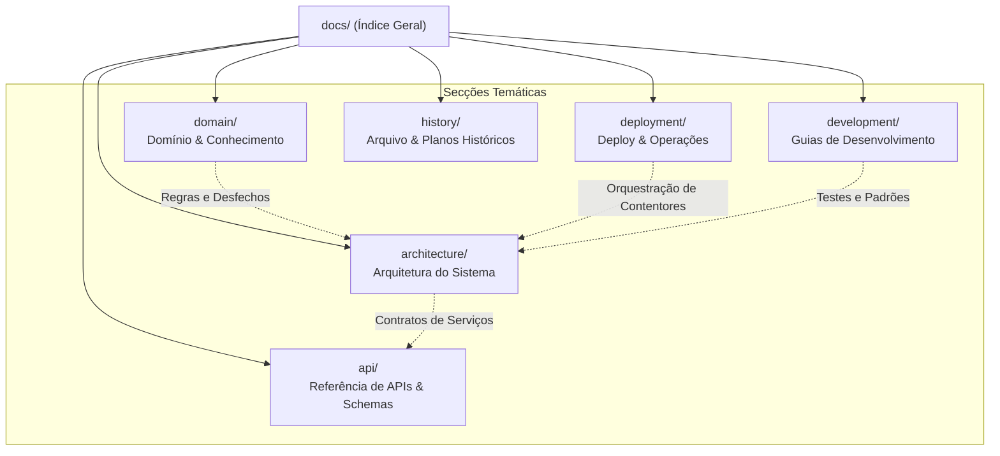
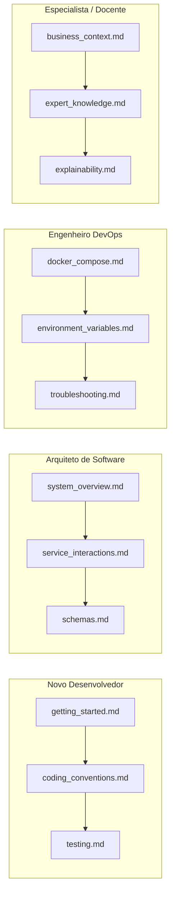

# Índice Geral da Documentação Técnica
### *Sistema Pericial de Diagnóstico para Devoluções e Trocas no Retalho*
#### *Mestrado em Engenharia de Inteligência Artificial (MEIA 2026/2027) — Challenges 4Teams, Equipa 3*

---

## 1. Visão Geral e Boas-Vindas

Bem-vindo ao repositório central de documentação técnica do **Retail Returns & Exchanges Diagnostic Expert System**. 

Este sistema foi concebido para resolver o problema de triagem e diagnóstico de devoluções no retalho, incorporando conhecimento humano especializado num ecossistema distribuído de micro-serviços. O projeto combina raciocínio dedutivo em lógica declarativa (**SWI-Prolog**), orquestração assíncrona orientada a serviços (**Python / FastAPI**) e, na próxima fase, regras de produção em **Java / Drools**.

O principal requisito não-funcional do sistema é a **Explicabilidade Nativa** (*Why / Why not*): nenhuma devolução é aprovada ou rejeitada sem uma cadeia estruturada de justificações auditáveis.

---

## 2. Mapa Estrutural da Documentação

A documentação está organizada em seis áreas temáticas perfeitamente delimitadas e desacopladas:



---

## 3. Catálogo Completo de Documentos

### 3.1 Domínio de Negócio e Conhecimento Pericial (`docs/domain/`)
*Diretório:* [`docs/domain/`](domain/README.md)

Documenta os fundamentos de negócio, enquadramento curricular e as regras empíricas fornecidas pelo perito humano de retalho.

| Documento | Ficheiro | Descrição e Propósito |
|:---|:---|:---|
| **Contexto de Negócio** | [`business_context.md`](domain/business_context.md) | Enquadramento académico no mestrado MEIA (ENGCIA & PPROGIA), desafio Challenges 4Teams (Equipa 3), caso de uso de retalho e papel do perito Dustin Hopper. |
| **Heurísticas do Perito** | [`expert_knowledge.md`](domain/expert_knowledge.md) | Árvores concetuais de decisão do perito, variáveis críticas (etiquetas, recibo, prazos, tender), categorias de desfecho e formalização lógica planeada. |
| **Explicabilidade e Transparência** | [`explainability.md`](domain/explainability.md) | Filosofia *Why / Why not*, estrutura do vetor `justification[]`, propagação de justificações desde o motor lógico até ao cliente e conformidade ética. |

---

### 3.2 Arquitetura do Sistema (`docs/architecture/`)
*Diretório:* [`docs/architecture/`](architecture/README.md)

Documenta o desenho técnico da solução, princípios de engenharia (Clean Architecture) e o funcionamento interno de cada serviço.

| Documento | Ficheiro | Descrição e Propósito |
|:---|:---|:---|
| **Visão Global do Sistema** | [`system_overview.md`](architecture/system_overview.md) | Arquitetura macro em micro-serviços, princípios de desenho ("Regra de Ouro"), stack tecnológica, segmentação dos dois motores Prolog (Retalho vs Exemplo dos Professores), feature toggles e portas de rede. |
| **Arquitetura do Motor Prolog** | [`prolog_engine.md`](architecture/prolog_engine.md) | Micro-serviço SWI-Prolog, Clean Architecture, isolando o motor de domínio de retalho (`rules.pl`) e o motor de exemplo dos professores (`sp_exp2.pl` / Moodle) com explicabilidade causal (*How* / *Why Not*). |
| **Arquitetura do Orquestrador FastAPI** | [`fastapi_orchestrator.md`](architecture/fastapi_orchestrator.md) | Backend orquestrador Python, camadas de software, ciclo de vida (*lifespan*), connection pooling com `httpx.AsyncClient` e injeção de dependências. |
| **Interações e Fluxos de Dados** | [`service_interactions.md`](architecture/service_interactions.md) | Diagrama de sequência ponta-a-ponta, pipeline de dados Pydantic $\rightarrow$ Prolog Dict $\rightarrow$ EvaluationResponse, DNS interno Docker e tratamento de falhas. |

---

### 3.3 Referência de APIs e Schemas (`docs/api/`)
*Diretório:* [`docs/api/`](api/README.md)

Especificação exaustiva de endpoints, contratos JSON, modelos Pydantic e matrizes de erros HTTP.

| Documento | Ficheiro | Descrição e Propósito |
|:---|:---|:---|
| **API Pública v1 do Orquestrador** | [`orchestrator_api_v1.md`](api/orchestrator_api_v1.md) | Endpoints públicos do FastAPI: avaliação do retalho (`POST /api/v1/evaluate`) e motor de exemplo dos professores (`/api/v1/inference/*` sob a tag Swagger `Academic Example Engine`), feature toggle `INFERENCE_ENGINE_ENABLED` e erros HTTP. |
| **API Interna do Motor Prolog** | [`prolog_engine_api.md`](api/prolog_engine_api.md) | Interface HTTP interna do daemon SWI-Prolog: endpoint de retalho (`POST /evaluate`), endpoints do motor de exemplo dos professores (`POST/GET /inference/*`), contratos da POC e evolução para contratos de retalho. |
| **Modelos de Dados e Schemas** | [`schemas.md`](api/schemas.md) | Catálogo de modelos Pydantic v2 (DTOs): `ScenarioInput`, `EvaluationResponse`, `DecisionEnum`, `HealthResponse`, modelos de retalho e schemas do motor de exemplo dos professores (`LoadKnowledgeBaseRequest`, `RunEngineResponse`, etc.). |

---

### 3.4 Deploy, Contentorização e Operações (`docs/deployment/`)
*Diretório:* [`docs/deployment/`](deployment/README.md)

Instruções e guias operacionais para build, arranque de contentores Docker e manutenção do ecossistema.

| Documento | Ficheiro | Descrição e Propósito |
|:---|:---|:---|
| **Contentorização e Dockerfiles** | [`docker.md`](deployment/docker.md) | Análise dos Dockerfiles (`prolog_engine` e `backend_orchestrator`), camadas de cache, `.dockerignore` e compilação independente de imagens. |
| **Orquestração com Docker Compose** | [`docker_compose.md`](deployment/docker_compose.md) | Guia operacional completo de `docker-compose.yml`, rede bridge `retail-network`, ordem de arranque (`depends_on`) e comandos operacionais. |
| **Variáveis de Ambiente** | [`environment_variables.md`](deployment/environment_variables.md) | Mapeamento exaustivo de variáveis suportadas (`PORT`, `PROLOG_ENGINE_URL`, `CORS_ORIGINS`, `INFERENCE_ENGINE_ENABLED` para toggle do motor de exemplo dos professores), defaults e precedência. |
| **Resolução de Problemas** | [`troubleshooting.md`](deployment/troubleshooting.md) | Diagnóstico e resolução de incidentes comuns: portas em conflito, falhas DNS entre contentores, timeouts e erros de CORS. |

---

### 3.5 Guias de Desenvolvimento e Testes (`docs/development/`)
*Diretório:* [`docs/development/`](development/README.md)

Manuais para novos contribuidores, configuração do ambiente local, convenções de código e execução da suíte de testes.

| Documento | Ficheiro | Descrição e Propósito |
|:---|:---|:---|
| **Primeiros Passos (Getting Started)** | [`getting_started.md`](development/getting_started.md) | Configuração do ambiente local (Python venv, SWI-Prolog, Docker), arranque nativo dos serviços e validação rápida (*smoke test*). |
| **Estratégia e Execução de Testes** | [`testing.md`](development/testing.md) | Estratégia e pirâmide de testes do projeto (104+ testes automatizados): suíte PLUnit em Prolog (regras e motor de inferência) e testes unitários e de integração assíncronos com Pytest (89 testes no orquestrador). |
| **Convenções de Código e Boas Práticas** | [`coding_conventions.md`](development/coding_conventions.md) | Padrões linguísticos (código em inglês, documentação em pt-PT), estrutura de módulos, tipagem estática e convenções Git. |

---

### 3.6 Histórico e Planos de Implementação (`docs/history/`)
*Diretório:* [`docs/history/`](history/README.md)

Arquivo imutável com os planos de implementação faseados e relatórios de execução das etapas concluídas do projeto.

| Documento | Ficheiro | Descrição e Propósito |
|:---|:---|:---|
| **Plano do Micro-Serviço Prolog** | [`prolog_implementation_plan.md`](history/prolog_implementation_plan.md) | Roteiro de 4 fases concluídas: setup, motor core, camada HTTP e contentorização Docker. |
| **Plano do Orquestrador FastAPI** | [`fastapi_implementation_plan.md`](history/fastapi_implementation_plan.md) | Roteiro de 6 fases concluídas: configuração, schemas, cliente HTTP, rotas REST, suíte Pytest e Compose. |
| **Plano da Documentação Profissional** | [`documentation_implementation_plan.md`](history/documentation_implementation_plan.md) | Roteiro de reorganização e criação da estrutura hierárquica e profissional da documentação técnica. |
| **Plano do Motor de Inferência Pericial** | [`inference_engine_implementation_plan.md`](history/inference_engine_implementation_plan.md) | Roteiro de 5 fases concluídas: integração modular do motor pedagógico dos professores `sp_exp2.pl` do Moodle (`vehicles`), rotas Prolog, proxy FastAPI, suíte PLUnit + Pytest e documentação. |

---

## 4. Roteiros de Leitura Recomendados por Perfil

Dependendo do seu objetivo ao consultar esta documentação, sugerimos os seguintes percursos de leitura:



* **Novo Desenvolvedor:** Comece por [Primeiros Passos](development/getting_started.md), leia as [Convenções de Código](development/coding_conventions.md) e execute a suíte de [Testes Automatizados](development/testing.md).
* **Arquiteto de Software:** Analise a [Visão Global do Sistema](architecture/system_overview.md), o fluxo de [Interações entre Serviços](architecture/service_interactions.md) e os [Modelos e Schemas](api/schemas.md).
* **Engenheiro DevOps / SysAdmin:** Consulte o guia do [Docker Compose](deployment/docker_compose.md), configure as [Variáveis de Ambiente](deployment/environment_variables.md) e consulte o guia de [Resolução de Problemas](deployment/troubleshooting.md).
* **Especialista em Domínio / Avaliador Académico:** Explore o [Contexto de Negócio](domain/business_context.md), as [Heurísticas do Perito](domain/expert_knowledge.md) e os requisitos de [Explicabilidade e Transparência](domain/explainability.md).

---

## 5. Resumo Rápido de Execução

Se pretender iniciar todo o sistema de imediato recorrendo ao Docker Compose:

```bash
# 1. Levantar o ecossistema (Prolog :8080 + FastAPI :8000)
docker compose up --build -d

# 2. Verificar a saúde de ambos os serviços
curl -X GET http://localhost:8000/health

# 3. Executar uma inferência POC de teste
curl -X POST http://localhost:8000/api/v1/evaluate \
  -H "Content-Type: application/json" \
  -d '{"scenario": "test", "value": 42}'

# 4. Executar o ciclo do motor pericial forward-chaining
curl -X POST http://localhost:8000/api/v1/inference/run

# 5. Obter rastreabilidade causal explicativa (How)
curl -X POST http://localhost:8000/api/v1/inference/how \
  -H "Content-Type: application/json" \
  -d '{"fact_id": 4}'
```

Para mais detalhes sobre endpoints, parâmetros e documentação interativa, aceda à interface Swagger em [http://localhost:8000/docs](http://localhost:8000/docs).
