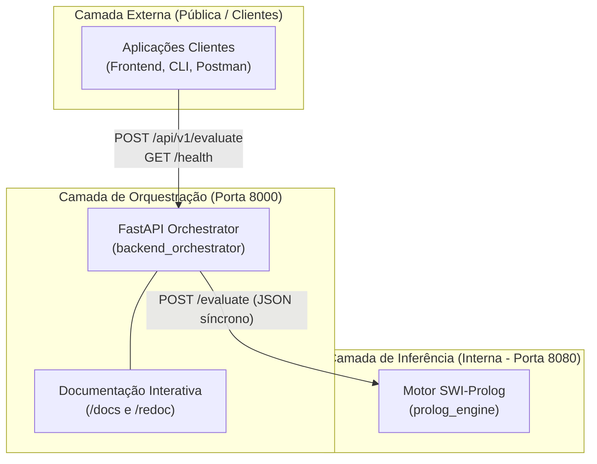

# Referência de APIs e Contratos de Comunicação
### *Sistema Pericial de Diagnóstico para Devoluções e Trocas no Retalho*

---

## 1. Visão Geral

Esta secção contém a documentação técnica de referência de todas as interfaces de programação (APIs) e contratos de dados (*schemas*) que compõem o sistema. 

O ecossistema adota uma abordagem orientada a micro-serviços com separação estrita entre a **camada de orquestração externa** e a **camada de inferência interna**:

---

## 2. Índice de Documentos da Secção

| Documento | Ficheiro | Descrição e Propósito |
|:---|:---|:---|
| **API Pública v1 do Orquestrador** | [`orchestrator_api_v1.md`](orchestrator_api_v1.md) | Especificação completa da API REST do FastAPI: endpoints `/health` e `/api/v1/evaluate`, exemplos cURL/PowerShell, payloads de aprovação/rejeição e matriz de erros HTTP. |
| **API Interna do Motor Prolog** | [`prolog_engine_api.md`](prolog_engine_api.md) | Especificação do contrato HTTP interno do micro-serviço SWI-Prolog: endpoint `/evaluate`, contratos POC e proposta para o domínio de retalho. |
| **Modelos de Dados e Schemas** | [`schemas.md`](schemas.md) | Catálogo de todos os modelos Pydantic v2 (DTOs): `ScenarioInput`, `EvaluationResponse`, `DecisionEnum`, `HealthResponse` e modelos do domínio de retalho. |

---

## 3. Resumo dos Endpoints Disponíveis

### 3.1 Backend Orquestrador (FastAPI — Porta 8000)

| Método | Endpoint | Acesso | Descrição |
|:---|:---|:---:|:---|
| `GET` | `/health` | Público | Verificação de estado operacional e sondagem de conectividade ao Prolog. |
| `GET` | `/api/v1/health` | Público | Alias versionado do endpoint de diagnóstico de saúde. |
| `POST` | `/api/v1/evaluate` | Público | Submissão de cenários para inferência lógica com retorno explicativo (*Why/Why not*). |
| `GET` | `/docs` | Navegador | Interface Swagger UI OpenAPI 3.1 interativa. |
| `GET` | `/redoc` | Navegador | Interface de documentação técnica ReDoc. |

### 3.2 Motor de Inferência (SWI-Prolog — Porta 8080)

| Método | Endpoint | Acesso | Descrição |
|:---|:---|:---:|:---|
| `POST` | `/evaluate` | **Interno** | Endpoint de avaliação lógica pura consumido exclusivamente pelo Orquestrador. |

---

## 4. Convenções e Normas Técnicas

1. **Formatos de Dados:** Todos os endpoints com corpo de pedido ou resposta utilizam estritamente `application/json` codificado em UTF-8.
2. **Explicabilidade por Desenho:** Toda a resposta de avaliação inclui obrigatoriamente um vetor `justification: list[str]`, permitindo ao cliente auditar a cadeia de raciocínio.
3. **Validação Rigorosa:** Qualquer incompatibilidade de tipos ou atributos em falta no orquestrador é intercetada na fronteira com erro `HTTP 422 Unprocessable Entity`, protegendo os motores lógicos.

---

## 5. Referências Cruzadas

* [Visão Geral da Arquitetura](../architecture/system_overview.md) — Diagrama e posicionamento de cada serviço.
* [Interação e Fluxos entre Serviços](../architecture/service_interactions.md) — Diagrama de sequência ponta-a-ponta e mapeamento de exceções.
* [Explicabilidade e Transparência](../domain/explainability.md) — Requisitos de justificação das decisões.
* [Ambiente e Variáveis de Configuração](../deployment/environment_variables.md) — Configuração de portas, timeouts e URLs.
