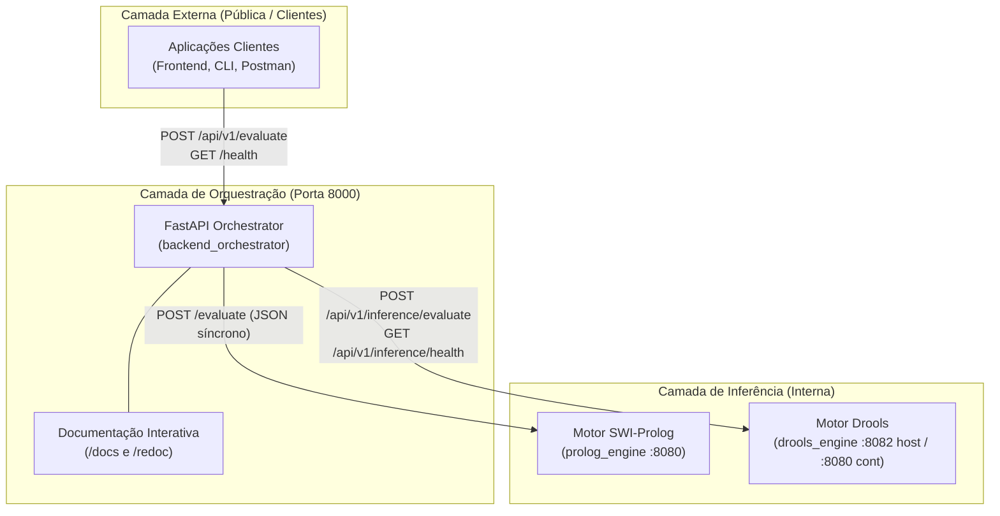

# Referência de APIs e Contratos de Comunicação
### *Sistema Pericial de Diagnóstico para Devoluções e Trocas no Retalho*

---

## 1. Visão Geral

Esta secção contém a documentação técnica de referência de todas as interfaces de programação (APIs) e contratos de dados (*schemas*) que compõem o sistema. 

O ecossistema adota uma abordagem orientada a micro-serviços com separação estrita entre a **camada de orquestração externa** e a **camada de inferência interna**:

---

## 2. Índice de Documentos da Secção

| Documento | Ficheiro | Descrição e Propósito |
|:---|:---|:---|
| **API Pública v1 do Orquestrador** | [`orchestrator_api_v1.md`](orchestrator_api_v1.md) | Especificação completa da API REST do FastAPI: endpoints `/health` e `/api/v1/evaluate`, exemplos cURL/PowerShell, payloads de aprovação/rejeição e matriz de erros HTTP. |
| **API Interna do Motor Prolog** | [`prolog_engine_api.md`](prolog_engine_api.md) | Especificação do contrato HTTP interno do micro-serviço SWI-Prolog: endpoints `/evaluate` e `/inference/*`, contratos POC e proposta para o domínio de retalho. |
| **API Interna do Motor Drools** | [`drools_engine_api.md`](drools_engine_api.md) | Especificação da API REST do motor Drools (Java 21 / Spring Boot 3): endpoints `/api/v1/inference/health` e `/api/v1/inference/evaluate`, matriz de evidências clínicas, cenários diagnósticos e erros padronizados. |
| **Modelos de Dados, Schemas e DTOs** | [`schemas.md`](schemas.md) | Catálogo exaustivo de todos os modelos Pydantic v2 e DTOs Java / Spring Boot: contratos REST, validações `@Pattern`, normalização defensiva e factos de domínio. |

---

## 3. Resumo dos Endpoints Disponíveis

### 3.1 Backend Orquestrador (FastAPI — Porta 8000)

| Método | Endpoint | Acesso | Descrição |
|:---|:---|:---:|:---|
| `GET` | `/health` | Público | Verificação de estado operacional e sondagem de conectividade ao Prolog. |
| `GET` | `/api/v1/health` | Público | Alias versionado do endpoint de diagnóstico de saúde. |
| `POST` | `/api/v1/evaluate` | Público | Submissão de cenários para inferência lógica com retorno explicativo (*Why/Why not*). |
| `GET` | `/docs` | Navegador | Interface Swagger UI OpenAPI 3.1 interativa. |
| `GET` | `/redoc` | Navegador | Interface de documentação técnica ReDoc. |

### 3.2 Motor de Inferência (SWI-Prolog — Porta 8080)

| Método | Endpoint | Acesso | Descrição |
|:---|:---|:---:|:---|
| `POST` | `/evaluate` | **Interno** | Endpoint de avaliação lógica pura consumido exclusivamente pelo Orquestrador. |
| `POST` | `/inference/load` | **Interno** | Carregamento dinâmico de base de conhecimento em memória. |
| `POST` | `/inference/run` | **Interno** | Execução do ciclo de encadeamento para a frente (*forward-chaining*). |
| `GET` | `/inference/facts` | **Interno** | Listagem de todos os factos ativos na memória de trabalho. |
| `POST` | `/inference/how` | **Interno** | Explicação causal de derivação de um facto (*How*). |
| `POST` | `/inference/whynot` | **Interno** | Explicação de ausência de derivação (*Why Not*). |
| `POST` | `/inference/reset` | **Interno** | Reposição e limpeza da sessão do motor pericial. |

### 3.3 Motor de Inferência (Drools Engine — Porta 8082 Host / 8080 Contentor)

| Método | Endpoint | Acesso | Descrição |
|:---|:---|:---:|:---|
| `GET` | `/api/v1/inference/health` | **Interno** | Verificação de disponibilidade, KieBase ativa e contagem de regras compiladas. |
| `POST` | `/api/v1/inference/evaluate` | **Interno** | Avaliação dedutiva de 13 sintomas de hemorragia, dedução de hipóteses e diagnóstico final com `firedRules`. |

---

## 4. Convenções e Normas Técnicas

1. **Formatos de Dados:** Todos os endpoints com corpo de pedido ou resposta utilizam estritamente `application/json` codificado em UTF-8.
2. **Explicabilidade por Desenho:** Toda a resposta de avaliação inclui rastreabilidade: lista `justification` no motor Prolog e lista `firedRules` no motor Drools.
3. **Validação Rigorosa:** Incompatibilidades de tipos são intercetadas na fronteira: `HTTP 422 Unprocessable Entity` no FastAPI e `HTTP 400 Bad Request` no Spring Boot.
4. **Isolamento de Memória:** Sessões de inferência Drools (`KieSession`) são efémeras e descartadas (`dispose()`) após cada pedido para evitar retenção indesejada de factos e fugas de memória.

---

## 5. Referências Cruzadas

* [Visão Geral da Arquitetura](../architecture/system_overview.md) — Diagrama e posicionamento de cada serviço.
* [Arquitetura do Motor Drools](../architecture/drools_engine.md) — Camadas internas, ciclo de vida da KieSession e regras DRL.
* [Arquitetura do Motor Prolog](../architecture/prolog_engine.md) — Camadas de transporte e prova lógica do Prolog.
* [Interação e Fluxos entre Serviços](../architecture/service_interactions.md) — Diagrama de sequência ponta-a-ponta e fluxos de dados.
* [Explicabilidade e Transparência](../domain/explainability.md) — Requisitos de justificação das decisões.
* [Ambiente e Variáveis de Configuração](../deployment/environment_variables.md) — Configuração de portas, timeouts e URLs.

