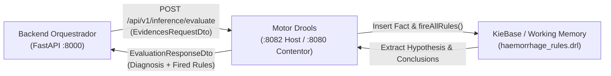

# API Interna do Motor de Inferência Drools (Drools Engine)
### *Sistema Pericial de Diagnóstico para Devoluções e Trocas no Retalho*

---

## 1. Visão Geral e Natureza da API

O micro-serviço **Drools Engine** disponibiliza uma API REST síncrona em formato JSON, desenvolvida sobre **Java 21** e **Spring Boot 3.3**, para execução de inferência baseada em regras de produção e algoritmos de correspondência de padrões (**Rete-OO** via Apache KIE Drools 8.44).

O domínio de conhecimento implementado no motor foca-se no **diagnóstico diferencial de hemorragias**, avaliando um vetor de 13 evidências clínicas binárias observadas num paciente, inferindo hipóteses intermédias de localização (tipo superior ou inferior) e deduzindo diagnósticos periciais finais acompanhados pela lista exaustiva de regras acionadas (*fired rules*) para fins de explicabilidade e auditoria médica.

> [!IMPORTANT]
> **API Exclusivamente Interna:** Este micro-serviço não deve ser exposto diretamente à Internet ou a clientes públicos sem autenticação/autorização prévia. No ecossistema do projeto, o **Backend Orquestrador (FastAPI)** atua como cliente principal, fachada e agregador de decisões periciais.



### 1.1 Configuração Base e Resolução de Rede

| Ambiente | URL Base | Contexto de Execução | Porta Host | Porta Contentor |
|:---|:---|:---|:---:|:---:|
| **Ambiente Local (Host)** | `http://localhost:8082` | Executado nativamente via `java -jar target/*.jar` ou redirecionamento de porta | `8082` | — |
| **Ambiente Docker (Inter-contentor)** | `http://drools-engine:8080` | Resolução interna DNS do Docker Compose na rede `retail-network` | `8082` | `8080` |

* **Protocolo:** HTTP/1.1
* **Formato de Dados:** `application/json; charset=UTF-8`
* **Especificação REST:** Versionamento uniforme sob o prefixo `/api/v1/inference`

---

## 2. Health Check e Diagnóstico do Motor

### 2.1 `GET /api/v1/inference/health`

Verifica a disponibilidade operacional do serviço e inspeciona o estado interno da base de regras de produção (*KieBase*), retornando a contagem de regras ativas compiladas em memória.

* **Método HTTP:** `GET`
* **Caminho:** `/api/v1/inference/health`
* **Autenticação:** Nenhuma (acesso interno)
* **Headers de Resposta:** `Content-Type: application/json`

#### 2.1.1 Resposta de Sucesso (`HTTP 200 OK`)

```json
{
  "status": "UP",
  "service": "drools-engine",
  "version": "1.0.0",
  "activeKieBase": "haemorrhageKBase",
  "totalRules": 13,
  "timestamp": "2026-10-01T14:30:00.000000Z"
}
```

#### 2.1.2 Especificação dos Campos da Resposta (`HealthResponseDto`):

| Campo | Tipo JSON | Formato / Restrições | Descrição |
|:---|:---|:---|:---|
| `status` | `string` | Constante `"UP"` | Estado de prontidão do serviço Spring Boot e do motor Drools. |
| `service` | `string` | Constante `"drools-engine"` | Identificador do micro-serviço. |
| `version` | `string` | SemVer (ex.: `"1.0.0"`) | Versão da aplicação em execução. |
| `activeKieBase` | `string` | Nome da KieBase | Identificador da base de conhecimento ativa carregada a partir do `kmodule.xml`. |
| `totalRules` | `integer` | Não-negativo (`>= 0`) | Quantidade total de regras DRL compiladas nos pacotes da KieBase ativa. |
| `timestamp` | `string` | ISO-8601 UTC | Carimbo temporal do momento da verificação de saúde. |

---

## 3. Avaliação de Evidências Clínicas

### 3.1 `POST /api/v1/inference/evaluate`

Recebe um conjunto de indicadores clínicos observados num paciente, instancia e normaliza um facto de domínio `Evidences`, submete-o a uma nova sessão de memória de trabalho (*KieSession* efémera), dispara as regras de produção via `fireAllRules()`, recolhe as hipóteses e conclusões inferidas e devolve o diagnóstico diferencial com explicabilidade transparente.

* **Método HTTP:** `POST`
* **Caminho:** `/api/v1/inference/evaluate`
* **Headers Obrigatórios:**
  * `Content-Type: application/json`
  * `Accept: application/json`

---

### 3.2 Especificação do Pedido (`EvidencesRequestDto`)

O payload consiste num objeto JSON contendo 13 indicadores clínicos binários. Cada campo aceita os valores `"yes"`, `"no"`, string vazia `""` ou valor nulo `null` (insensível a maiúsculas/minúsculas).

> [!NOTE]
> **Comportamento Padrão e Normalização Defensiva:** Durante o processamento interno, o método `toDomain()` aplica normalização defensiva: qualquer atributo omitido, nulo ou vazio é automaticamente convertido para `"no"`, garantindo que o motor Drools opera sempre sobre um facto completamente preenchido e determinístico.

#### Tabela de Campos do Pedido:

| Campo JSON | Tipo | Validação (@Pattern) | Valor por Omissão | Descrição Clínica |
|:---|:---|:---|:---:|:---|
| `bloodEar` | `string` | `^(?i)(yes\|no)?$` | `"no"` | Presença de hemorragia no ouvido (*Otorragia*). |
| `earAche` | `string` | `^(?i)(yes\|no)?$` | `"no"` | Presença de otalgia ou dor de ouvido aguda. |
| `deafness` | `string` | `^(?i)(yes\|no)?$` | `"no"` | Perda de audição ou surdez temporária/permanente. |
| `cerebrospinal` | `string` | `^(?i)(yes\|no)?$` | `"no"` | Fuga de líquido cefalorraquidiano pelo ouvido/nariz. |
| `bloodNose` | `string` | `^(?i)(yes\|no)?$` | `"no"` | Hemorragia nasal (*Epistaxe*). |
| `vomiting` | `string` | `^(?i)(yes\|no)?$` | `"no"` | Presença de vómitos no quadro sintomático. |
| `bloodBrown` | `string` | `^(?i)(yes\|no)?$` | `"no"` | Presença de sangue de tonalidade castanha/escura. |
| `bloodMouth` | `string` | `^(?i)(yes\|no)?$` | `"no"` | Hemorragia com saída pela cavidade bucal. |
| `bloodPenis` | `string` | `^(?i)(yes\|no)?$` | `"no"` | Presença de sangue pela uretra/pénis (*Hematúria*). |
| `bloodAnus` | `string` | `^(?i)(yes\|no)?$` | `"no"` | Presença de sangue anal exteriorizado nas fezes. |
| `bloodCoffee` | `string` | `^(?i)(yes\|no)?$` | `"no"` | Sangue com aspeto característico de borras de café. |
| `headAche` | `string` | `^(?i)(yes\|no)?$` | `"no"` | Cefaleia ou dor de cabeça relatada pelo paciente. |
| `bloodVagina` | `string` | `^(?i)(yes\|no)?$` | `"no"` | Hemorragia ginecológica fora do ciclo (*Metrorragia*). |

---

### 3.3 Especificação da Resposta (`EvaluationResponseDto`)

#### Tabela de Campos da Resposta:

| Campo JSON | Tipo | Descrição |
|:---|:---|:---|
| `status` | `string` | Estado do processamento pericial (`"SUCCESS"`). |
| `primaryDiagnosis` | `string` | Diagnóstico principal deduzido pelo motor (ou mensagem de fallback). |
| `conclusions` | `array[string]` | Lista de todas as conclusões diagnósticas inseridas pelas regras na memória de trabalho. |
| `hypothesis` | `string` (ou `null`) | Hipótese intermédia deduzida na árvore de classificação (`"upper type"` ou `"lower type"`). |
| `firedRules` | `array[string]` | Lista ordenada de identificadores de regras DRL disparadas durante o ciclo de inferência. |
| `timestamp` | `string` | Carimbo temporal ISO-8601 UTC de conclusão da avaliação. |
| `evidencesEvaluated` | `object` | Cópia do payload `EvidencesRequestDto` original submetido para validação cruzada. |

---

### 3.4 Cenários Diagnósticos e Exemplos de Payloads

#### 3.4.1 Cenário A: Diagnóstico Superior — Otorragia (`upper type`)

* **Condições Clínicas:** Sangue no ouvido (`bloodEar = "yes"`) acompanhado de dor no ouvido (`earAche = "yes"`).
* **Regras Acionadas:** `r1_upper_type_classification` (salience 100), `r3_otorrhagia_ear_ache` (salience 90).

**Pedido (`POST /api/v1/inference/evaluate`):**
```json
{
  "bloodEar": "yes",
  "earAche": "yes",
  "deafness": "no",
  "cerebrospinal": "no",
  "bloodNose": "no",
  "vomiting": "no",
  "bloodBrown": "no",
  "bloodMouth": "no",
  "bloodPenis": "no",
  "bloodAnus": "no",
  "bloodCoffee": "no",
  "headAche": "no",
  "bloodVagina": "no"
}
```

**Resposta (`HTTP 200 OK`):**
```json
{
  "status": "SUCCESS",
  "primaryDiagnosis": "Otorrhagia",
  "conclusions": [
    "Otorrhagia"
  ],
  "hypothesis": "upper type",
  "firedRules": [
    "r1_upper_type_classification",
    "r3_otorrhagia_ear_ache"
  ],
  "timestamp": "2026-10-01T14:31:10.123456Z",
  "evidencesEvaluated": {
    "bloodEar": "yes",
    "earAche": "yes",
    "deafness": "no",
    "cerebrospinal": "no",
    "bloodNose": "no",
    "vomiting": "no",
    "bloodBrown": "no",
    "bloodMouth": "no",
    "bloodPenis": "no",
    "bloodAnus": "no",
    "bloodCoffee": "no",
    "headAche": "no",
    "bloodVagina": "no"
  }
}
```

---

#### 3.4.2 Cenário B: Diagnóstico Superior — Fratura de Crânio (`upper type`)

* **Condições Clínicas:** Sangue no ouvido (`bloodEar = "yes"`) com perda de líquido cefalorraquidiano (`cerebrospinal = "yes"`).
* **Regras Acionadas:** `r1_upper_type_classification` (salience 100), `r5_skull_fracture` (salience 90).

**Pedido (`POST /api/v1/inference/evaluate`):**
```json
{
  "bloodEar": "yes",
  "cerebrospinal": "yes"
}
```

**Resposta (`HTTP 200 OK`):**
```json
{
  "status": "SUCCESS",
  "primaryDiagnosis": "Skull fracture",
  "conclusions": [
    "Skull fracture"
  ],
  "hypothesis": "upper type",
  "firedRules": [
    "r1_upper_type_classification",
    "r5_skull_fracture"
  ],
  "timestamp": "2026-10-01T14:31:25.654321Z",
  "evidencesEvaluated": {
    "bloodEar": "yes",
    "cerebrospinal": "yes"
  }
}
```

---

#### 3.4.3 Cenário C: Diagnóstico Inferior — Epistaxe (`lower type`)

* **Condições Clínicas:** Sem sangue no ouvido (`bloodEar = "no"`), mas com hemorragia nasal (`bloodNose = "yes"`).
* **Regras Acionadas:** `r2_lower_type_classification` (salience 100), `r6_epistaxe` (salience 90).

**Pedido (`POST /api/v1/inference/evaluate`):**
```json
{
  "bloodEar": "no",
  "bloodNose": "yes"
}
```

**Resposta (`HTTP 200 OK`):**
```json
{
  "status": "SUCCESS",
  "primaryDiagnosis": "Epistaxe",
  "conclusions": [
    "Epistaxe"
  ],
  "hypothesis": "lower type",
  "firedRules": [
    "r2_lower_type_classification",
    "r6_epistaxe"
  ],
  "timestamp": "2026-10-01T14:31:40.789012Z",
  "evidencesEvaluated": {
    "bloodEar": "no",
    "bloodNose": "yes"
  }
}
```

---

#### 3.4.4 Cenário D: Diagnóstico Inferior — Melena (`lower type`)

* **Condições Clínicas:** Sem sangue no ouvido (`bloodEar = "no"`), com sangue no ânus (`bloodAnus = "yes"`) e aspeto de borras de café (`bloodCoffee = "yes"`).
* **Regras Acionadas:** `r2_lower_type_classification` (salience 100), `r11_melena` (salience 90).

**Pedido (`POST /api/v1/inference/evaluate`):**
```json
{
  "bloodEar": "no",
  "bloodAnus": "yes",
  "bloodCoffee": "yes"
}
```

**Resposta (`HTTP 200 OK`):**
```json
{
  "status": "SUCCESS",
  "primaryDiagnosis": "Melena",
  "conclusions": [
    "Melena"
  ],
  "hypothesis": "lower type",
  "firedRules": [
    "r2_lower_type_classification",
    "r11_melena"
  ],
  "timestamp": "2026-10-01T14:31:55.334455Z",
  "evidencesEvaluated": {
    "bloodEar": "no",
    "bloodAnus": "yes",
    "bloodCoffee": "yes"
  }
}
```

---

#### 3.4.5 Cenário E: Fallback — Diagnóstico Inconclusivo / Desconhecido

* **Condições Clínicas:** Nenhum sintoma patognomónico fornecido, ou apenas cefaleia isolada (`headAche = "yes"`).
* **Regras Acionadas:** `r2_lower_type_classification` (salience 100), seguida pela regra de salvaguarda `r13_unknown_diagnosis_fallback` (salience -100).
* **Diagnóstico Deduzido:** `"Look for the the doctor!"` (`Conclusion.UNKNOWN`).

**Pedido (`POST /api/v1/inference/evaluate`):**
```json
{
  "headAche": "yes"
}
```

**Resposta (`HTTP 200 OK`):**
```json
{
  "status": "SUCCESS",
  "primaryDiagnosis": "Look for the the doctor!",
  "conclusions": [
    "Look for the the doctor!"
  ],
  "hypothesis": "lower type",
  "firedRules": [
    "r2_lower_type_classification",
    "r13_unknown_diagnosis_fallback"
  ],
  "timestamp": "2026-10-01T14:32:10.998877Z",
  "evidencesEvaluated": {
    "headAche": "yes"
  }
}
```

---

## 4. Respostas de Erro e Tratamento de Exceções

O micro-serviço integra um componente centralizado [`GlobalExceptionHandler`](../../drools_engine/src/main/java/com/expert/drools/controllers/GlobalExceptionHandler.java) (`@RestControllerAdvice`) que converte anomalias de entrada ou exceções de execução num payload estruturado canónico (`ErrorResponseDto`).

### 4.1 Especificação dos Campos de Erro (`ErrorResponseDto`)

| Campo JSON | Tipo | Descrição |
|:---|:---|:---|
| `status` | `integer` | Código de estado HTTP (ex.: `400`, `500`). |
| `error` | `string` | Título padronizado do estado HTTP (ex.: `"Bad Request"` ou `"Internal Server Error"`). |
| `message` | `string` | Descrição sumária da anomalia identificada. |
| `timestamp` | `string` | Carimbo temporal ISO-8601 UTC do momento em que o erro foi intercetado. |
| `details` | `array[string]` | Lista de mensagens específicas de validação ou detalhes da causa-raiz. |

---

### 4.2 Falha de Validação de Dados (`HTTP 400 Bad Request`)

Ocorre quando um ou mais campos violam a expressão regular `@Pattern(regexp = "^(?i)(yes|no)?$")` (por exemplo, submissão de valores como `"maybe"`, `"true"` ou `123`).

**Resposta (`HTTP 400 Bad Request`):**
```json
{
  "status": 400,
  "error": "Bad Request",
  "message": "Input validation failed",
  "timestamp": "2026-10-01T14:32:30.123456Z",
  "details": [
    "bloodEar: Value must be either 'yes' or 'no'"
  ]
}
```

---

### 4.3 Payload JSON Malformado (`HTTP 400 Bad Request`)

Ocorre quando o analisador sintático do Jackson falha ao descodificar a mensagem HTTP (`HttpMessageNotReadableException`), por exemplo devido a chaves em falta, aspas não fechadas ou sintaxe inválida.

**Resposta (`HTTP 400 Bad Request`):**
```json
{
  "status": 400,
  "error": "Bad Request",
  "message": "Malformed JSON request body",
  "timestamp": "2026-10-01T14:32:45.654321Z",
  "details": [
    "Unexpected character ('}' (code 125)): was expecting a colon to separate field name and value"
  ]
}
```

---

### 4.4 Erro Interno do Servidor (`HTTP 500 Internal Server Error`)

Ocorre caso surja uma exceção não tratada na máquina virtual ou no ciclo de inferência do Drools (`Exception.class`).

**Resposta (`HTTP 500 Internal Server Error`):**
```json
{
  "status": 500,
  "error": "Internal Server Error",
  "message": "An unexpected error occurred while processing the inference request",
  "timestamp": "2026-10-01T14:33:00.789012Z",
  "details": [
    "Unable to initialize KieSession: unexpected failure"
  ]
}
```

---

## 5. Exemplos Práticos de Teste (Bash e PowerShell)

Estes comandos destinam-se a testes operacionais diretos do micro-serviço Drools no host (porta `8082` mapeada pelo Docker Compose ou porta `8080` caso executado nativamente via Maven).

### 5.1 Health Check do Motor

**Em Bash / cURL:**
```bash
curl -X GET http://localhost:8082/api/v1/inference/health \
  -H "Accept: application/json"
```

**Em PowerShell (`curl.exe`):**
```powershell
curl.exe -X GET http://localhost:8082/api/v1/inference/health `
  -H "Accept: application/json"
```

**Em PowerShell (`Invoke-RestMethod`):**
```powershell
Invoke-RestMethod -Uri "http://localhost:8082/api/v1/inference/health" -Method Get
```

---

### 5.2 Avaliação Diagnóstica — Otorragia (Upper Type)

**Em Bash / cURL:**
```bash
curl -X POST http://localhost:8082/api/v1/inference/evaluate \
  -H "Content-Type: application/json" \
  -d '{
    "bloodEar": "yes",
    "earAche": "yes"
  }'
```

**Em PowerShell (`curl.exe`):**
```powershell
curl.exe -X POST http://localhost:8082/api/v1/inference/evaluate `
  -H "Content-Type: application/json" `
  -d '{\"bloodEar\": \"yes\", \"earAche\": \"yes\"}'
```

**Em PowerShell (`Invoke-RestMethod`):**
```powershell
$body = @{
    bloodEar = "yes"
    earAche  = "yes"
} | ConvertTo-Json

Invoke-RestMethod -Uri "http://localhost:8082/api/v1/inference/evaluate" `
  -Method Post `
  -ContentType "application/json" `
  -Body $body
```

---

### 5.3 Avaliação Diagnóstica — Epistaxe (Lower Type)

**Em Bash / cURL:**
```bash
curl -X POST http://localhost:8082/api/v1/inference/evaluate \
  -H "Content-Type: application/json" \
  -d '{
    "bloodEar": "no",
    "bloodNose": "yes"
  }'
```

**Em PowerShell (`curl.exe`):**
```powershell
curl.exe -X POST http://localhost:8082/api/v1/inference/evaluate `
  -H "Content-Type: application/json" `
  -d '{\"bloodEar\": \"no\", \"bloodNose\": \"yes\"}'
```

**Em PowerShell (`Invoke-RestMethod`):**
```powershell
$body = @{
    bloodEar  = "no"
    bloodNose = "yes"
} | ConvertTo-Json

Invoke-RestMethod -Uri "http://localhost:8082/api/v1/inference/evaluate" `
  -Method Post `
  -ContentType "application/json" `
  -Body $body
```

---

### 5.4 Avaliação Diagnóstica — Fallback (Sintoma Inconclusivo)

**Em Bash / cURL:**
```bash
curl -X POST http://localhost:8082/api/v1/inference/evaluate \
  -H "Content-Type: application/json" \
  -d '{
    "headAche": "yes"
  }'
```

**Em PowerShell (`Invoke-RestMethod`):**
```powershell
$body = @{
    headAche = "yes"
} | ConvertTo-Json

Invoke-RestMethod -Uri "http://localhost:8082/api/v1/inference/evaluate" `
  -Method Post `
  -ContentType "application/json" `
  -Body $body
```

---

### 5.5 Teste de Erro de Validação (`400 Bad Request`)

**Em Bash / cURL:**
```bash
curl -X POST http://localhost:8082/api/v1/inference/evaluate \
  -H "Content-Type: application/json" \
  -d '{
    "bloodEar": "invalid_value"
  }'
```

**Em PowerShell (`curl.exe`):**
```powershell
curl.exe -X POST http://localhost:8082/api/v1/inference/evaluate `
  -H "Content-Type: application/json" `
  -d '{\"bloodEar\": \"invalid_value\"}'
```

---

## 6. Documentos Relacionados

* [Arquitetura Interna: Micro-serviço Drools Engine](../architecture/drools_engine.md) — Camadas de configuração, KieContainer e ciclo de vida da KieSession.
* [Visão Geral da Arquitetura](../architecture/system_overview.md) — Diagrama de conectividade e papéis de cada micro-serviço.
* [Interação e Fluxos entre Serviços](../architecture/service_interactions.md) — Sequência de chamadas entre FastAPI Orchestrator e Drools Engine.
* [Modelos de Dados e Schemas (DTOs)](schemas.md) — Catálogo dos contratos de dados Java e Pydantic.
* [Referência de APIs e Contratos](README.md) — Catálogo central de todas as APIs do ecossistema.
* [Docker e Contentorização](../deployment/docker.md) — Especificação do Dockerfile multi-stage e runtime do Drools.
