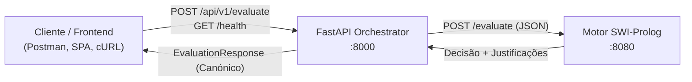

# API Pública v1 do Orquestrador (FastAPI)
### *Sistema Pericial de Diagnóstico para Devoluções e Trocas no Retalho*

---

## 1. Visão Geral

A camada de orquestração do sistema é exposta através de uma API REST desenvolvida em **FastAPI** (Python 3.11+). Esta API funciona como ponto de contacto único para clientes externos e futuras interfaces web (*Frontends*), ocultando a complexidade dos motores de inferência subjacentes (SWI-Prolog e futuramente Drools).



### 1.1 Configuração Base e URLs

| Ambiente | Host / Base URL | Descrição |
|:---|:---|:---|
| **Desenvolvimento Local (Host)** | `http://localhost:8000` | Acesso direto quando executado no host da máquina |
| **Rede Docker Compose** | `http://orchestrator:8000` | Acesso inter-contentor dentro da rede `retail-network` |
| **Documentação Interativa (Swagger)** | `http://localhost:8000/docs` | Interface OpenAPI interativa para testes no browser |
| **Documentação Alternativa (ReDoc)** | `http://localhost:8000/redoc` | Interface de documentação técnica detalhada |
| **Especificação OpenAPI JSON** | `http://localhost:8000/openapi.json` | Schema JSON nativo OpenAPI 3.1 |

### 1.2 Políticas Globais da API
* **Autenticação:** Aberta (nesta fase de desenvolvimento / POC).
* **Formatos Suportados:** `application/json` obrigatório em pedidos com *body*.
* **CORS:** Configurado para suportar os domínios definidos na variável `CORS_ORIGINS` (por omissão: `http://localhost:3000`, `http://localhost:5173`, `http://localhost:8000`).

---

## 2. Endpoints de Diagnóstico e Monitorização

### 2.1 `GET /health` e `GET /api/v1/health`

Verifica a saúde operacional do serviço orquestrador e testa ativamente a conectividade com o motor de inferência SWI-Prolog.

> [!NOTE]
> Este endpoint está registado tanto na raiz (`/health`) para compatibilidade com *healthchecks* do Docker Compose, como no router v1 (`/api/v1/health`).

* **Método HTTP:** `GET`
* **Caminho:** `/health` ou `/api/v1/health`
* **Autenticação:** Nenhuma
* **Headers Recomendados:**
  * `Accept: application/json`

#### 2.1.1 Resposta de Sucesso — Motor Conectado (`200 OK`)

Retornado quando o orquestrador está saudável e consegue contactar com sucesso o endpoint `/evaluate` do SWI-Prolog.

```json
{
  "status": "healthy",
  "prolog_engine": "connected",
  "timestamp": "2026-09-27T20:00:00.123456Z"
}
```

#### 2.1.2 Resposta de Diagnóstico — Motor Desconectado (`200 OK`)

Quando o orquestrador está em execução mas o motor Prolog não responde ou a conexão falha, o serviço reporta o estado em JSON com HTTP 200 para permitir diagnóstico sem derrubar o orquestrador.

```json
{
  "status": "healthy",
  "prolog_engine": "disconnected",
  "timestamp": "2026-09-27T20:00:05.654321Z"
}
```

#### 2.1.3 Campos da Resposta

| Campo | Tipo | Descrição |
|:---|:---|:---|
| `status` | `string` | Estado do orquestrador FastAPI (sempre `"healthy"` se o serviço responder). |
| `prolog_engine` | `string` | Estado de ligação ao motor de regras: `"connected"` ou `"disconnected"`. |
| `timestamp` | `string` (ISO-8601 UTC) | Data e hora em que a verificação de saúde foi executada. |

#### 2.1.4 Exemplos de Execução

**Em Bash / cURL:**
```bash
curl -X GET http://localhost:8000/health \
  -H "Accept: application/json"
```

**Em PowerShell (Windows — `curl.exe`):**
```powershell
curl.exe -X GET http://localhost:8000/health -H "Accept: application/json"
```

**Em PowerShell (Windows — `Invoke-RestMethod`):**
```powershell
(Invoke-RestMethod -Uri http://localhost:8000/health -Method Get) | ConvertTo-Json
```

---

## 3. Endpoints de Avaliação de Regras

### 3.1 `POST /api/v1/evaluate`

Recebe os factos de um cenário de devolução ou teste, valida a conformidade dos dados através dos modelos Pydantic e encaminha o pedido para o motor de inferência configurado (atualmente SWI-Prolog). Retorna uma decisão determinística acompanhada de uma **cadeia de justificação explicativa** (*Why / Why not*).

* **Método HTTP:** `POST`
* **Caminho:** `/api/v1/evaluate`
* **Headers Obrigatórios:**
  * `Content-Type: application/json`
  * `Accept: application/json`

---

### 3.2 Estrutura do Pedido (Request Body)

O corpo do pedido deve respeitar o schema [`ScenarioInput`](schemas.md#2-schemas-do-poc-atual-appschemasscenariopy):

```json
{
  "scenario": "test",
  "value": 42
}
```

| Campo | Tipo | Obrigatório | Restrições | Descrição |
|:---|:---|:---:|:---|:---|
| `scenario` | `string` | **Sim** | Mínimo 1 caractere | Identificador do tipo de cenário a avaliar (ex.: `"test"`). |
| `value` | `integer` / `number` | **Sim** | Numérico válido | Valor numérico submetido às regras de inferência lógica. |

---

### 3.3 Estrutura da Resposta Canónica (`EvaluationResponse`)

A resposta do endpoint segue sempre o modelo [`EvaluationResponse`](schemas.md#1-schemas-canónicos-de-resposta-appschemascommonpy):

```json
{
  "status": "success",
  "decision": "approved",
  "justification": [
    "Value is 42",
    "Dummy rule matched"
  ],
  "engine": "prolog",
  "timestamp": "2026-09-27T19:35:00.000000Z",
  "message": null
}
```

| Campo | Tipo | Descrição |
|:---|:---|:---|
| `status` | `string` | Indicador do resultado do processamento: `"success"` ou `"error"`. |
| `decision` | `string` (Enum) | Decisão tomada: `"approved"`, `"rejected"`, `"store_credit_only"`, `"manager_override"` ou `"error"`. |
| `justification` | `array[string]` | Lista ordenada de justificações lógicas que fundamentam a decisão (*Explainability*). |
| `engine` | `string` (Enum) | Motor de inferência que gerou a decisão: `"prolog"`, `"drools"` ou `"aggregated"`. |
| `timestamp` | `string` (ISO-8601 UTC) | Carimbo temporal UTC de geração da resposta. |
| `message` | `string` / `null` | Mensagem operacional adicional (em caso de diagnóstico ou erro). |

---

## 4. Cenários de Utilização e Exemplos Práticos

### 4.1 Cenário 1: Aprovação de Regra (`value = 42`)

Demonstra o disparo com sucesso de uma regra no motor Prolog que satisfaz os critérios de aprovação.

#### Pedido (Payload JSON):
```json
{
  "scenario": "test",
  "value": 42
}
```

#### Comandos de Invocação:

**Bash / Linux / macOS:**
```bash
curl -X POST http://localhost:8000/api/v1/evaluate \
  -H "Content-Type: application/json" \
  -d '{"scenario": "test", "value": 42}'
```

**PowerShell (Windows — `curl.exe`):**
```powershell
curl.exe -X POST http://localhost:8000/api/v1/evaluate `
  -H "Content-Type: application/json" `
  -d '{\"scenario\": \"test\", \"value\": 42}'
```

**PowerShell (Windows — `Invoke-RestMethod`):**
```powershell
$body = @{ scenario = "test"; value = 42 } | ConvertTo-Json
Invoke-RestMethod -Uri http://localhost:8000/api/v1/evaluate -Method Post -ContentType "application/json" -Body $body
```

#### Resposta Esperada (`HTTP 200 OK`):
```json
{
  "status": "success",
  "decision": "approved",
  "justification": [
    "Value is 42",
    "Dummy rule matched"
  ],
  "engine": "prolog",
  "timestamp": "2026-09-27T19:35:00.123456Z",
  "message": null
}
```

---

### 4.2 Cenário 2: Rejeição com Explicabilidade (*Why Not*) (`value = 15`)

Quando o valor não cumpre a regra de aprovação, o motor aplica a regra de salvaguarda (*fallback*) e produz a cadeia de justificação correspondente.

#### Pedido (Payload JSON):
```json
{
  "scenario": "test",
  "value": 15
}
```

#### Comandos de Invocação:

**Bash / Linux / macOS:**
```bash
curl -X POST http://localhost:8000/api/v1/evaluate \
  -H "Content-Type: application/json" \
  -d '{"scenario": "test", "value": 15}'
```

**PowerShell (Windows — `curl.exe`):**
```powershell
curl.exe -X POST http://localhost:8000/api/v1/evaluate `
  -H "Content-Type: application/json" `
  -d '{\"scenario\": \"test\", \"value\": 15}'
```

#### Resposta Esperada (`HTTP 200 OK`):
```json
{
  "status": "success",
  "decision": "rejected",
  "justification": [
    "Value is not 42",
    "Default fallback rule applied"
  ],
  "engine": "prolog",
  "timestamp": "2026-09-27T19:35:10.654321Z",
  "message": null
}
```

---

### 4.3 Cenário 3: Erro de Validação de Dados (`HTTP 422 Unprocessable Entity`)

Se o cliente enviar tipos incompatíveis (ex.: `value` como string não numérica) ou omitir campos obrigatórios, o FastAPI interseta o pedido antes de invocar o Prolog.

#### Pedido Inválido (Exemplo: `value` inválido):
```json
{
  "scenario": "test",
  "value": "quarenta-e-dois"
}
```

#### Resposta de Erro do Pydantic (`HTTP 422`):
```json
{
  "detail": [
    {
      "type": "int_parsing",
      "loc": ["body", "value"],
      "msg": "Input should be a valid integer, unable to parse string as an integer",
      "input": "quarenta-e-dois"
    }
  ]
}
```

---

### 4.4 Cenário 4: Erro de Rejeição pelo Motor Lógico (`HTTP 400 Bad Request`)

Se o motor Prolog rejeitar o payload por dados semânticos inválidos ou contrato violado internamente, o orquestrador captura `PrologResponseError` e converte em HTTP 400.

#### Resposta de Erro (`HTTP 400 Bad Request`):
```json
{
  "detail": "Prolog engine returned an error response: Invalid scenario type"
}
```

---

### 4.5 Cenário 5: Motor Prolog Indisponível ou Timeout (`HTTP 503 Service Unavailable`)

Se o contentor Prolog estiver desligado, inacessível na rede ou a inferência exceder o tempo limite configurado (`PROLOG_TIMEOUT_SECONDS = 5.0`), o cliente HTTP assíncrono dispara uma exceção tratada elegantemente.

#### Resposta de Erro (`HTTP 503 Service Unavailable`):
```json
{
  "detail": "Failed to connect to Prolog engine at http://localhost:8080: [Errno 111] Connection refused"
}
```

---

## 5. Matriz de Códigos de Estado HTTP

| Código HTTP | Significado | Causa Principal | Formato da Resposta |
|:---|:---|:---|:---|
| **`200 OK`** | Sucesso | Inferência concluída com sucesso (decisão `"approved"`, `"rejected"`, etc.) ou healthcheck operacional. | Schema `EvaluationResponse` ou `HealthResponse` |
| **`400 Bad Request`** | Pedido Inválido | O motor de inferência reportou erro de processamento semântico (`PrologResponseError`). | `{"detail": "..."}` |
| **`422 Unprocessable Entity`** | Validação Falhou | O payload não respeita os tipos ou restrições dos modelos Pydantic (`ScenarioInput`). | Matriz de erros padrão do FastAPI / Pydantic |
| **`503 Service Unavailable`** | Motor Inacessível | O orquestrador não conseguiu comunicar com o Prolog (`PrologConnectionError` ou `PrologTimeoutError`). | `{"detail": "..."}` |

---

## 6. Documentos Relacionados

* [Catálogo de Schemas Pydantic](schemas.md) — Definição exaustiva de todos os modelos de dados e DTOs.
* [API Interna do Motor Prolog](prolog_engine_api.md) — Contrato direto do micro-serviço SWI-Prolog.
* [Arquitetura do Orquestrador](../architecture/fastapi_orchestrator.md) — Implementação das camadas e serviços FastAPI.
* [Fluxos e Interação entre Serviços](../architecture/service_interactions.md) — Diagrama de sequência ponta-a-ponta e tratamento de exceções.
