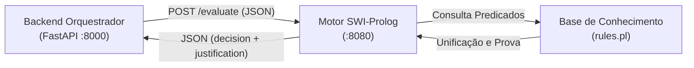

# API Interna do Motor de Inferência (SWI-Prolog)
### *Sistema Pericial de Diagnóstico para Devoluções e Trocas no Retalho*

---

## 1. Visão Geral e Natureza da API

O micro-serviço **Prolog Engine** disponibiliza uma API HTTP/JSON mínima e especializada para execução de inferência dedutiva e geração de justificações lógicas (*Why / Why not*).

> [!IMPORTANT]
> **API Exclusivamente Interna:** Este serviço não deve ser exposto diretamente a clientes externos ou ao *Frontend*. Apenas o **Backend Orquestrador (FastAPI)** comunica com este micro-serviço. O orquestrador atua como fachada, camada de validação e agregador.



### 1.1 Configuração Base e Resolução de Rede

| Ambiente | URL Base | Contexto de Execução |
|:---|:---|:---|
| **Ambiente Local (Host)** | `http://localhost:8080` | Executado diretamente na máquina host via `swipl src/main.pl` |
| **Ambiente Docker (Inter-contentor)** | `http://prolog-engine:8080` | Resolução de nome de serviço interna na rede `retail-network` |

O servidor é implementado em SWI-Prolog utilizando as bibliotecas nativas `library(http/thread_httpd)` e `library(http/http_dispatch)`, operando em modo multi-threaded.

---

## 2. Endpoint de Avaliação de Regras

### 2.1 `POST /evaluate`

Avalia um conjunto de factos contra a base de conhecimento dedutiva carregada no motor lógico e devolve uma decisão determinística acompanhada pela respetiva cadeia de justificação.

* **Método HTTP:** `POST`
* **Caminho:** `/evaluate`
* **Headers Obrigatórios:**
  * `Content-Type: application/json`
  * `Accept: application/json`

---

## 3. Especificação do Contrato POC Inicial

### 3.1 Pedido (Request Body)

O payload submetido deve ser um objeto JSON com o cenário de teste e o valor numérico a testar pelas regras lógicas de demonstração:

```json
{
  "scenario": "test",
  "value": 42
}
```

#### Tabela de Campos do Pedido:

| Campo | Tipo JSON | Unificação Prolog | Obrigatório | Descrição |
|:---|:---|:---|:---:|:---|
| `scenario` | `string` | Átomo ou String Prolog (`Request.scenario`) | **Sim** | Identificador do tipo de cenário a processar (ex.: `"test"`). |
| `value` | `number` / `integer` | Número Prolog (`Request.value`) | **Sim** | Valor numérico sujeito às cláusulas e predicados de validação. |

---

### 3.2 Respostas do Motor

#### 3.2.1 Resposta de Sucesso — Aprovação (`HTTP 200 OK`)

Quando os factos unificam com uma regra positiva de decisão (ex.: `value =:= 42`):

```json
{
  "status": "success",
  "decision": "approved",
  "justification": [
    "Value is 42",
    "Dummy rule matched"
  ]
}
```

#### 3.2.2 Resposta de Sucesso — Rejeição / Fallback (`HTTP 200 OK`)

Quando a condição de aprovação falha, o predicado `evaluate_scenario/3` dispara a regra alternativa de salvaguarda (*fallback rule*):

```json
{
  "status": "success",
  "decision": "rejected",
  "justification": [
    "Value is not 42",
    "Default fallback rule applied"
  ]
}
```

#### Tabela de Campos da Resposta de Sucesso:

| Campo | Tipo JSON | Mapeamento Prolog | Descrição |
|:---|:---|:---|:---|
| `status` | `string` | Átomo `"success"` | Indica que a inferência foi executada sem erros no motor. |
| `decision` | `string` | Átomo (`approved` ou `rejected`) | Veredito final determinado pelas regras lógicas. |
| `justification` | `array[string]` | Lista de termos convertida para JSON | Lista sequencial dos passos de prova e regras aplicadas (*Explainability*). |

---

### 3.3 Respostas de Erro

#### 3.3.1 Payload Inválido ou Parâmetros Ausentes (`HTTP 400 Bad Request`)

Gerado quando o leitor JSON do Prolog (`http_read_json_dict/3`) falha ao descodificar o payload ou quando a estrutura de dados não contém as chaves exigidas:

```json
{
  "status": "error",
  "message": "Invalid JSON payload or missing required parameters",
  "decision": "error",
  "justification": []
}
```

#### 3.3.2 Erro Interno do Motor (`HTTP 500 Internal Server Error`)

Ocorre caso seja gerada uma exceção lógica não capturada durante o ciclo de prova no predicado Prolog. O servidor SWI-Prolog devolve uma resposta de erro HTTP com a descrição da anomalia.

---

## 4. Exemplos Práticos de Teste Direto (Host Local)

Estes comandos destinam-se a testes pontuais e validação operacional do micro-serviço Prolog de forma isolada (porta 8080):

### 4.1 Teste de Aprovação (`value = 42`)

**Em Bash / cURL:**
```bash
curl -X POST http://localhost:8080/evaluate \
  -H "Content-Type: application/json" \
  -d '{"scenario": "test", "value": 42}'
```

**Em PowerShell (Windows — `curl.exe`):**
```powershell
curl.exe -X POST http://localhost:8080/evaluate `
  -H "Content-Type: application/json" `
  -d '{\"scenario\": \"test\", \"value\": 42}'
```

**Em PowerShell (Windows — `Invoke-RestMethod`):**
```powershell
$body = @{ scenario = "test"; value = 42 } | ConvertTo-Json
Invoke-RestMethod -Uri http://localhost:8080/evaluate -Method Post -ContentType "application/json" -Body $body
```

### 4.2 Teste de Rejeição (`value = 15`)

**Em Bash / cURL:**
```bash
curl -X POST http://localhost:8080/evaluate \
  -H "Content-Type: application/json" \
  -d '{"scenario": "test", "value": 15}'
```

**Em PowerShell (Windows — `curl.exe`):**
```powershell
curl.exe -X POST http://localhost:8080/evaluate `
  -H "Content-Type: application/json" `
  -d '{\"scenario\": \"test\", \"value\": 15}'
```

---

## 5. Evolução Futura: Contrato do Domínio de Retalho

Com a formalização completa das heurísticas do perito Dustin Hopper para devoluções e trocas, o endpoint `/evaluate` suportará cenários ricos de retalho.

### 5.1 Proposta de Payload de Retalho (`scenario = "retail_return"`)

```json
{
  "scenario": "retail_return",
  "item": {
    "category": "apparel",
    "is_underwear": false,
    "has_tags": true,
    "condition": "unworn_clean"
  },
  "purchase": {
    "has_receipt": true,
    "is_gift_receipt": false,
    "days_since_purchase": 18,
    "channel": "physical_store",
    "payment_method": "credit_card"
  }
}
```

### 5.2 Mapeamento Interno em Prolog Dicts

O SWI-Prolog consome o payload diretamente como um dicionário estruturado:

```prolog
evaluate_scenario(Request, Decision, Justifications) :-
    Request.scenario == "retail_return",
    Item = Request.item,
    Purchase = Request.purchase,
    % Exemplo de unificação de regras do perito
    check_item_eligibility(Item, ItemJustifications),
    check_receipt_timeline(Purchase, TimelineJustifications),
    resolve_decision(ItemJustifications, TimelineJustifications, Decision, Justifications).
```

### 5.3 Proposta de Resposta com Decisões de Negócio

O contrato de resposta manterá a estrutura uniforme (`status`, `decision`, `justification`), expandindo os valores de `decision` para o domínio de retalho:

```json
{
  "status": "success",
  "decision": "approved",
  "justification": [
    "Item satisfies hygiene criteria (not underwear, original tags intact)",
    "Original purchase receipt verified",
    "Return requested within the 30-day policy window (18 elapsed days)",
    "Eligible for full refund via original tender (credit_card)"
  ]
}
```

Possíveis decisões suportadas pelo sistema pericial:
* `"approved"` — Devolução aprovada com reembolso total no método original.
* `"store_credit_only"` — Devolução aceite apenas como vale de loja (ex.: talão de oferta ou sem recibo com autorização).
* `"manager_override"` — Exceção que requer validação presencial do gerente de loja (ex.: defeito de fabrico).
* `"rejected"` — Devolução recusada com indicação clara dos motivos (*Why not*).

---

## 6. Documentos Relacionados

* [Arquitetura do Motor Prolog](../architecture/prolog_engine.md) — Camadas de transporte (`api/`) e domínio (`core/`).
* [API Pública v1 do Orquestrador](orchestrator_api_v1.md) — Ponto de entrada público do sistema.
* [Catálogo de Schemas Pydantic](schemas.md) — DTOs Python correspondentes a este contrato.
* [Requisito de Explicabilidade](../domain/explainability.md) — Princípios de transparência e estrutura de justificações.
