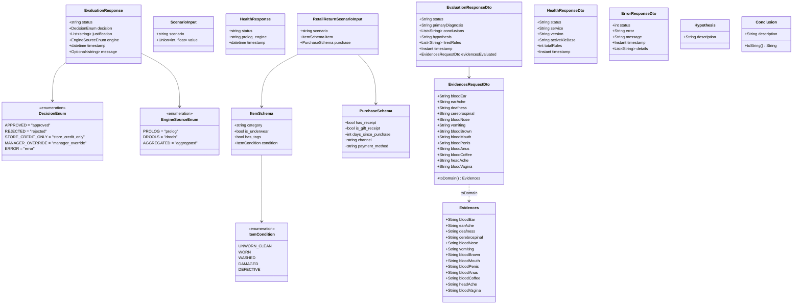

# Modelos de Dados, Schemas e DTOs (Pydantic e Java)
### *Sistema Pericial de Diagnóstico para Devoluções e Trocas no Retalho*

---

## 1. Visão Geral

O ecossistema adota contratos de dados estritos (*Data Transfer Objects* — DTOs) em dois níveis tecnológicos complementares:

1. **Camada de Orquestração (FastAPI / Python 3.12):** Utiliza o **Pydantic v2** para validação em runtime de pedidos externos, coerção segura de tipos e geração dinâmica da especificação OpenAPI 3.1 (Swagger UI).
2. **Camada de Inferência Drools (Spring Boot 3.3 / Java 21):** Utiliza classes Java anotadas com **Jakarta Bean Validation** (`@Pattern`, `@Valid`), **Lombok** (`@Data`, `@Builder`) e **Jackson** (`@JsonProperty`, `@JsonInclude`) para garantir integridade e isolamento estrito entre os DTOs de transporte HTTP e os factos de domínio inseridos na memória de trabalho (*Working Memory*).

Os modelos de dados estão organizados nas seguintes estruturas de pacotes:

```text
backend_orchestrator/app/schemas/
├── __init__.py           # Exportação centralizada dos schemas
├── common.py             # Enums de decisão e modelo canónico EvaluationResponse
├── scenario.py           # Schemas de entrada do POC (ScenarioInput)
├── retail.py             # Modelos avançados do domínio de devoluções no retalho
├── health.py             # Schema de resposta de saúde e conectividade (HealthResponse)
└── inference.py          # Schemas do motor de inferência pericial

drools_engine/src/main/java/com/expert/drools/
├── dtos/
│   ├── EvidencesRequestDto.java    # DTO de entrada: 13 sintomas clínicos com validação @Pattern
│   ├── EvaluationResponseDto.java  # DTO de saída: diagnóstico, conclusões e regras disparadas
│   ├── HealthResponseDto.java      # DTO de saída de saúde: contagem de regras e KieBase ativa
│   └── ErrorResponseDto.java       # DTO padronizado de erro HTTP 400/500
└── models/
    ├── Evidences.java              # Facto Drools: evidências clínicas normalizadas na Working Memory
    ├── Hypothesis.java             # Facto Drools: classificação intermédia (upper/lower type)
    └── Conclusion.java             # Facto Drools: conclusão diagnóstica com constantes de diagnóstico
```



---

## 2. Schemas Canónicos e Enumerações (`common.py`)

Ficheiro fonte: [`backend_orchestrator/app/schemas/common.py`](../../backend_orchestrator/app/schemas/common.py)

### 2.1 Enumeração `DecisionEnum`

Define os possíveis vereditos determinísticos de diagnóstico gerados pelos motores de inferência.

```python
class DecisionEnum(str, Enum):
    APPROVED = "approved"
    REJECTED = "rejected"
    STORE_CREDIT_ONLY = "store_credit_only"
    MANAGER_OVERRIDE = "manager_override"
    ERROR = "error"
```

| Valor | Significado no Domínio de Retalho |
|:---|:---|
| `"approved"` | Devolução aceite; cliente tem direito a reembolso integral pelo método original de pagamento. |
| `"rejected"` | Devolução rejeitada por violação de política (ex.: fora de prazo, sem etiquetas, artigo íntimo). |
| `"store_credit_only"` | Devolução permitida exclusivamente sob a forma de vale de loja / crédito em conta. |
| `"manager_override"` | Situação de exceção ou litígio que exige intervenção e autorização do gerente de loja. |
| `"error"` | Falha de avaliação decorrente de payload inválido ou erro no motor de regras. |

---

### 2.2 Enumeração `EngineSourceEnum`

Identifica a proveniência da inferência ou da regra disparada.

```python
class EngineSourceEnum(str, Enum):
    PROLOG = "prolog"
    DROOLS = "drools"
    AGGREGATED = "aggregated"
```

| Valor | Descrição |
|:---|:---|
| `"prolog"` | Decisão originada no micro-serviço SWI-Prolog. |
| `"drools"` | Decisão originada no motor de regras Drools (Java 21 / Spring Boot 3). |
| `"aggregated"` | Decisão consolidada a partir da execução combinada de múltiplos motores. |

---

### 2.3 Modelo `EvaluationResponse`

É o formato de resposta canónico devolvido pelo orquestrador a todas as aplicações clientes e interfaces web.

#### Especificação dos Campos:

| Campo | Tipo Python | Default | Restrições | Descrição |
|:---|:---|:---:|:---|:---|
| `status` | `str` | *Obrigatório* | `"success"` ou `"error"` | Indicador global do sucesso do processamento. |
| `decision` | `DecisionEnum` | *Obrigatório* | Membro de `DecisionEnum` | Veredito final inferido pelas regras. |
| `justification` | `List[str]` | `[]` | Lista de strings | Cadeia explicativa (*Why/Why not*) fundamentando a decisão. |
| `engine` | `EngineSourceEnum` | `EngineSourceEnum.PROLOG` | Membro de `EngineSourceEnum` | Motor que produziu a conclusão. |
| `timestamp` | `datetime` | `datetime.now(timezone.utc)` | ISO-8601 UTC | Carimbo temporal exato da produção da resposta. |
| `message` | `Optional[str]` | `None` | String ou nulo | Mensagem operacional adicional em cenários de erro ou alerta. |

#### Configuração Pydantic:
* `use_enum_values = True` — Garante que nas serializações JSON os valores strings são emitidos em vez dos objetos Enum.

#### Exemplo de Serialização JSON (`model_dump_json()`):

```json
{
  "status": "success",
  "decision": "approved",
  "justification": [
    "Value is 42",
    "Dummy rule matched"
  ],
  "engine": "prolog",
  "timestamp": "2026-09-27T19:35:00.000000Z",
  "message": null
}
```

---

## 3. Schemas de Entrada do POC Atual (`scenario.py`)

Ficheiro fonte: [`backend_orchestrator/app/schemas/scenario.py`](../../backend_orchestrator/app/schemas/scenario.py)

### 3.1 Modelo `ScenarioInput`

Representa o payload recebido no endpoint `POST /api/v1/evaluate` durante a fase atual de prova de conceito (POC).

#### Especificação dos Campos:

| Campo | Tipo Python | Obrigatório | Validações | Descrição |
|:---|:---|:---:|:---|:---|
| `scenario` | `str` | **Sim** | `min_length=1` | Identificador do tipo de cenário a processar. |
| `value` | `Union[int, float]` | **Sim** | Numérico (int ou float) | Valor numérico sujeito à inferência das regras lógicas. |

#### Exemplo de Serialização JSON:

```json
{
  "scenario": "test",
  "value": 42
}
```

---

## 4. Schemas de Saúde e Monitorização (`health.py`)

Ficheiro fonte: [`backend_orchestrator/app/schemas/health.py`](../../backend_orchestrator/app/schemas/health.py)

### 4.1 Modelo `HealthResponse`

Retornado pelos endpoints `GET /health` e `GET /api/v1/health`.

#### Especificação dos Campos:

| Campo | Tipo Python | Default | Descrição |
|:---|:---|:---:|:---|
| `status` | `str` | `"healthy"` | Estado operacional do FastAPI Orchestrator. |
| `prolog_engine` | `str` | *Obrigatório* | Estado da ligação ao SWI-Prolog (`"connected"` ou `"disconnected"`). |
| `timestamp` | `datetime` | `datetime.now(timezone.utc)` | Carimbo temporal UTC da verificação. |

#### Exemplo de Serialização JSON:

```json
{
  "status": "healthy",
  "prolog_engine": "connected",
  "timestamp": "2026-09-27T20:00:00.123456Z"
}
```

---

## 5. Schemas de Extensão para o Domínio de Retalho (`retail.py`)

Ficheiro fonte: [`backend_orchestrator/app/schemas/retail.py`](../../backend_orchestrator/app/schemas/retail.py)

Estes modelos foram desenhados antecipadamente para suportar a evolução completa do sistema pericial para o negócio de devoluções e trocas no retalho, formalizando os atributos recolhidos com o perito de domínio Dustin Hopper.

### 5.1 Enumeração `ItemCondition`

Classifica a condição física da mercadoria devolvida:

```python
class ItemCondition(str, Enum):
    UNWORN_CLEAN = "unworn_clean"
    WORN = "worn"
    WASHED = "washed"
    DAMAGED = "damaged"
    DEFECTIVE = "defective"
```

| Valor | Critério no Domínio |
|:---|:---|
| `"unworn_clean"` | Artigo novo, sem sinais de uso, manchas ou odores. |
| `"worn"` | Artigo apresenta sinais visíveis de utilização pelo cliente. |
| `"washed"` | Artigo foi lavado pelo cliente (alteração do estado original). |
| `"damaged"` | Danificado por mau uso, rasgado ou incompleto. |
| `"defective"` | Apresenta defeito de fabrico comprovado (elegível para garantia). |

---

### 5.2 Modelo `ItemSchema`

Especifica os atributos físicos e de higiene do produto:

| Campo | Tipo Python | Default | Restrições | Descrição |
|:---|:---|:---:|:---|:---|
| `category` | `str` | *Obrigatório* | `min_length=1` | Categoria de retalho (ex.: `"apparel"`, `"footwear"`, `"electronics"`). |
| `is_underwear` | `bool` | `False` | Booleano | Se o artigo é classificado como roupa interior/íntima (restrição de higiene). |
| `has_tags` | `bool` | *Obrigatório* | Booleano | Indica se as etiquetas e embalagem originais estão intactas. |
| `condition` | `ItemCondition` | *Obrigatório* | Membro de `ItemCondition` | Estado físico avaliado no momento da devolução. |

---

### 5.3 Modelo `PurchaseSchema`

Especifica o contexto transacional da compra:

| Campo | Tipo Python | Default | Restrições | Descrição |
|:---|:---|:---:|:---|:---|
| `has_receipt` | `bool` | *Obrigatório* | Booleano | Apresentação de talão/fatura de compra válida. |
| `is_gift_receipt` | `bool` | `False` | Booleano | Se o comprovativo apresentado é talão de oferta. |
| `days_since_purchase` | `int` | *Obrigatório* | `ge=0` (não negativo) | Número de dias decorridos desde a data da compra. |
| `channel` | `str` | `"physical_store"` | String | Canal de venda: `"physical_store"` ou `"online"`. |
| `payment_method` | `str` | `"credit_card"` | String | Meio de pagamento original (`"credit_card"`, `"cash"`, `"store_credit"`). |

---

### 5.4 Modelo `RetailReturnScenarioInput`

Payload completo para avaliação de devoluções no retalho:

```json
{
  "scenario": "retail_return",
  "item": {
    "category": "apparel",
    "is_underwear": false,
    "has_tags": true,
    "condition": "unworn_clean"
  },
  "purchase": {
    "has_receipt": true,
    "is_gift_receipt": false,
    "days_since_purchase": 18,
    "channel": "physical_store",
    "payment_method": "credit_card"
  }
}
```

---

## 6. Schemas do Motor de Exemplo dos Professores (`sp_exp2.pl` do Moodle — `inference.py`)

Ficheiro fonte: [`backend_orchestrator/app/schemas/inference.py`](../../backend_orchestrator/app/schemas/inference.py)

Estes modelos tipados em Pydantic v2 suportam a família de endpoints `/api/v1/inference/*` do **motor de inferência de exemplo dos professores (`sp_exp2.pl`)** fornecido no Moodle (`prolog_engine/Ficheiros de Apoio Sistemas Periciais_ sp_exp1.pl, sp_exp2.pl e base de conhecimento-20260928/`), validando parâmetros de entrada, restringindo identificadores e garantindo serialização canónica com documentação OpenAPI integrada sob a tag `Academic Example Engine (sp_exp2 / Moodle)`.

Os schemas do domínio de retalho (`RetailReturnScenarioInput`, `ItemSchema`, etc.) mantêm-se documentados na [Secção 5](#5-schemas-de-extensão-para-o-domínio-de-retalho-retailpy).

### 6.1 `LoadKnowledgeBaseRequest` e `LoadKnowledgeBaseResponse`
Modelos para carregamento de bases de conhecimento periciais.

```python
class LoadKnowledgeBaseRequest(BaseModel):
    knowledge_base: str = Field(..., min_length=1, description="Name of the knowledge base to load")

class LoadKnowledgeBaseResponse(BaseModel):
    status: str
    message: str
    initial_facts_count: int
```

| Campo | Tipo | Validação | Descrição |
|:---|:---|:---:|:---|
| `knowledge_base` | `str` | `min_length=1` | Nome identificador da base de conhecimento (ex.: `"vehicles"`). |
| `status` | `str` | — | Estado do carregamento (`"success"` ou `"error"`). |
| `message` | `str` | — | Mensagem descritiva do resultado da operação. |
| `initial_facts_count` | `int` | — | Quantidade de factos pré-definidos carregados na memória. |

---

### 6.2 `RunEngineResponse` e `DerivedFactSchema`
Modelos representativos da execução do ciclo dedutivo forward-chaining.

```python
class DerivedFactSchema(BaseModel):
    id: int = Field(..., ge=1, description="Sequential identifier of the derived fact")
    fact: str = Field(..., min_length=1, description="String representation of the derived fact")
    rule_id: int = Field(..., ge=1, description="Identifier of the rule that fired")
    justified_by: list[int | str] = Field(default_factory=list, description="List of fact IDs or conditions")

class RunEngineResponse(BaseModel):
    status: str
    initial_facts_count: int
    derived_facts_count: int
    total_facts: int
    derived_facts: list[DerivedFactSchema]
```

---

### 6.3 `GetFactsResponse` e `FactSchema`
Modelos para obtenção de todos os factos ativos em memória de trabalho.

```python
class FactSchema(BaseModel):
    id: int = Field(..., ge=1, description="Sequential identifier of the fact")
    fact: str = Field(..., min_length=1, description="String representation of the fact")

class GetFactsResponse(BaseModel):
    status: str
    facts_count: int
    facts: list[FactSchema]
```

---

### 6.4 `ExplainHowRequest` e `ExplainHowResponse`
Modelos para pedido e resposta de rastreabilidade causal (*How*).

```python
class ExplainHowRequest(BaseModel):
    fact_id: int = Field(..., ge=1, description="Sequential ID of the fact to explain")

class ExplainHowResponse(BaseModel):
    status: str
    fact_id: int
    explanation: list[str]
```

---

### 6.5 `ExplainWhynotRequest` e `ExplainWhynotResponse`
Modelos para investigação de falha na dedução de um facto (*Why Not*).

```python
class ExplainWhynotRequest(BaseModel):
    fact: str = Field(..., min_length=1, description="Prolog term string of the fact to investigate")

class ExplainWhynotResponse(BaseModel):
    status: str
    fact: str
    explanation: list[str]
```

---

### 6.6 `ResetEngineResponse`
Modelo de confirmação de reposição da memória de trabalho.

```python
class ResetEngineResponse(BaseModel):
    status: str
    message: str
```

---

## 7. Contratos de Dados do Motor Drools (Java / Spring Boot DTOs e Modelos)

O micro-serviço **Drools Engine** implementa uma arquitetura desacoplada em Java 21, dividida estritamente entre contratos de transporte de rede (`com.expert.drools.dtos`) e entidades de domínio/memória de trabalho (`com.expert.drools.models`).

### 7.1 Arquitetura de Separação entre DTOs e Factos de Domínio

Os DTOs nunca entram diretamente na memória de trabalho (*Working Memory*) do Drools. O isolamento assegura que:
* Alterações no contrato REST ou serialização JSON não afetam a compilação das regras DRL.
* O motor Drools opera unicamente sobre factos limpos, normalizados e sem anotações de serialização ou validação web.
* O método de conversão `toDomain()` garante integridade defensiva contra valores nulos ou vazios.

---

### 7.2 `EvidencesRequestDto`

Ficheiro fonte: [`drools_engine/src/main/java/com/expert/drools/dtos/EvidencesRequestDto.java`](../../drools_engine/src/main/java/com/expert/drools/dtos/EvidencesRequestDto.java)

Payload de entrada consumido no endpoint `POST /api/v1/inference/evaluate`. Contém 13 indicadores clínicos binários. Cada atributo é validado pela anotação Bean Validation:
`@Pattern(regexp = "^(?i)(yes|no)?$", message = "... Value must be either 'yes' or 'no'")`.

```java
@Data
@Builder
@NoArgsConstructor
@AllArgsConstructor
@JsonInclude(JsonInclude.Include.NON_NULL)
public class EvidencesRequestDto {
    private String bloodEar;
    private String earAche;
    private String deafness;
    private String cerebrospinal;
    private String bloodNose;
    private String vomiting;
    private String bloodBrown;
    private String bloodMouth;
    private String bloodPenis;
    private String bloodAnus;
    private String bloodCoffee;
    private String headAche;
    private String bloodVagina;

    public Evidences toDomain() { ... }
}
```

#### Tabela de Campos e Mapeamento:

| Campo | Tipo Java | Validação | Omissão | Descrição Clínica |
|:---|:---|:---|:---:|:---|
| `bloodEar` | `String` | `@Pattern(yes\|no)` | `"no"` | Hemorragia no canal auditivo exterior. |
| `earAche` | `String` | `@Pattern(yes\|no)` | `"no"` | Dor aguda de ouvido (otalgia). |
| `deafness` | `String` | `@Pattern(yes\|no)` | `"no"` | Hipoacusia ou perda súbita de audição. |
| `cerebrospinal` | `String` | `@Pattern(yes\|no)` | `"no"` | Fuga de líquido cefalorraquidiano. |
| `bloodNose` | `String` | `@Pattern(yes\|no)` | `"no"` | Hemorragia nasal (epistaxe). |
| `vomiting` | `String` | `@Pattern(yes\|no)` | `"no"` | Vómitos associados ao quadro clínico. |
| `bloodBrown` | `String` | `@Pattern(yes\|no)` | `"no"` | Sangue de coloração castanha escura. |
| `bloodMouth` | `String` | `@Pattern(yes\|no)` | `"no"` | Sangramento visível na boca. |
| `bloodPenis` | `String` | `@Pattern(yes\|no)` | `"no"` | Sangue na urina/pénis (hematúria). |
| `bloodAnus` | `String` | `@Pattern(yes\|no)` | `"no"` | Sangramento anal/retal exteriorizado. |
| `bloodCoffee` | `String` | `@Pattern(yes\|no)` | `"no"` | Sangue escuro com padrão de borras de café. |
| `headAche` | `String` | `@Pattern(yes\|no)` | `"no"` | Cefaleia ou dor de cabeça aguda. |
| `bloodVagina` | `String` | `@Pattern(yes\|no)` | `"no"` | Hemorragia vaginal atípica (metrorragia). |

#### Normalização Defensiva em `toDomain()`:

```java
private static String normalize(String value) {
    if (value == null || value.trim().isEmpty()) {
        return "no";
    }
    return value.trim().toLowerCase();
}
```

---

### 7.3 `EvaluationResponseDto`

Ficheiro fonte: [`drools_engine/src/main/java/com/expert/drools/dtos/EvaluationResponseDto.java`](../../drools_engine/src/main/java/com/expert/drools/dtos/EvaluationResponseDto.java)

Payload de resposta emitido pelo endpoint `POST /api/v1/inference/evaluate`.

```java
@Data
@Builder
@NoArgsConstructor
@AllArgsConstructor
@JsonInclude(JsonInclude.Include.NON_NULL)
public class EvaluationResponseDto {
    private String status;
    private String primaryDiagnosis;
    private List<String> conclusions;
    private String hypothesis;
    private List<String> firedRules;
    private Instant timestamp;
    private EvidencesRequestDto evidencesEvaluated;
}
```

#### Tabela de Campos da Resposta:

| Campo | Tipo Java | Exemplo | Descrição |
|:---|:---|:---|:---|
| `status` | `String` | `"SUCCESS"` | Indicador de execução com sucesso da inferência. |
| `primaryDiagnosis` | `String` | `"Otorrhagia"` | Diagnóstico principal deduzido pelas regras. |
| `conclusions` | `List<String>` | `["Otorrhagia"]` | Lista integral de todas as conclusões deduzidas. |
| `hypothesis` | `String` | `"upper type"` | Hipótese intermédia deduzida (`"upper type"` ou `"lower type"`). |
| `firedRules` | `List<String>` | `["r1_upper_type_classification", "r3_otorrhagia_ear_ache"]` | Lista sequencial das regras DRL disparadas no ciclo. |
| `timestamp` | `Instant` | `2026-10-01T14:30:00Z` | Carimbo temporal UTC da avaliação. |
| `evidencesEvaluated` | `EvidencesRequestDto` | `{ "bloodEar": "yes", ... }` | Cópia do payload recebido para rastreabilidade e auditoria. |

#### Exemplo de Serialização JSON:

```json
{
  "status": "SUCCESS",
  "primaryDiagnosis": "Otorrhagia",
  "conclusions": [
    "Otorrhagia"
  ],
  "hypothesis": "upper type",
  "firedRules": [
    "r1_upper_type_classification",
    "r3_otorrhagia_ear_ache"
  ],
  "timestamp": "2026-10-01T14:30:00Z",
  "evidencesEvaluated": {
    "bloodEar": "yes",
    "earAche": "yes"
  }
}
```

---

### 7.4 `HealthResponseDto`

Ficheiro fonte: [`drools_engine/src/main/java/com/expert/drools/dtos/HealthResponseDto.java`](../../drools_engine/src/main/java/com/expert/drools/dtos/HealthResponseDto.java)

Payload de resposta emitido pelo endpoint `GET /api/v1/inference/health`.

```java
@Data
@Builder
@NoArgsConstructor
@AllArgsConstructor
@JsonInclude(JsonInclude.Include.NON_NULL)
public class HealthResponseDto {
    private String status;
    private String service;
    private String version;
    private String activeKieBase;
    private int totalRules;
    private Instant timestamp;
}
```

#### Tabela de Campos:

| Campo | Tipo Java | Exemplo | Descrição |
|:---|:---|:---|:---|
| `status` | `String` | `"UP"` | Estado de prontidão do serviço Spring Boot. |
| `service` | `String` | `"drools-engine"` | Identificador do serviço no ecossistema. |
| `version` | `String` | `"1.0.0"` | Versão do artefacto construído. |
| `activeKieBase` | `String` | `"haemorrhageKBase"` | Nome da KieBase ativa carregada do classpath. |
| `totalRules` | `int` | `13` | Contagem total de regras DRL compiladas e ativas. |
| `timestamp` | `Instant` | `2026-10-01T14:30:00Z` | Carimbo temporal UTC da verificação. |

#### Exemplo de Serialização JSON:

```json
{
  "status": "UP",
  "service": "drools-engine",
  "version": "1.0.0",
  "activeKieBase": "haemorrhageKBase",
  "totalRules": 13,
  "timestamp": "2026-10-01T14:30:00Z"
}
```

---

### 7.5 `ErrorResponseDto`

Ficheiro fonte: [`drools_engine/src/main/java/com/expert/drools/dtos/ErrorResponseDto.java`](../../drools_engine/src/main/java/com/expert/drools/dtos/ErrorResponseDto.java)

Payload unificado de erro emitido pelo `GlobalExceptionHandler` em cenários HTTP 400 ou HTTP 500.

```java
@Data
@Builder
@NoArgsConstructor
@AllArgsConstructor
@JsonInclude(JsonInclude.Include.NON_NULL)
public class ErrorResponseDto {
    private int status;
    private String error;
    private String message;
    private Instant timestamp;
    private List<String> details;
}
```

#### Tabela de Campos:

| Campo | Tipo Java | Exemplo | Descrição |
|:---|:---|:---|:---|
| `status` | `int` | `400` | Código numérico de estado HTTP. |
| `error` | `String` | `"Bad Request"` | Título canónico do estado HTTP. |
| `message` | `String` | `"Input validation failed"` | Descrição sumária do erro intercetado. |
| `timestamp` | `Instant` | `2026-10-01T14:30:00Z` | Carimbo temporal UTC da ocorrência. |
| `details` | `List<String>` | `["bloodEar: Value must be either 'yes' or 'no'"]` | Detalhes exatos da causa do erro ou campos inválidos. |

---

### 7.6 Factos de Domínio Drools (`com.expert.drools.models`)

Estes objetos Java são inseridos diretamente na memória de trabalho (*Working Memory*) e manipulados pelas regras compiladas em `haemorrhage_rules.drl`:

1. **`Evidences`:**
   POJO anotado com `@Data` e `@Builder`, espelhando os 13 atributos clínicos binários normalizados (`"yes"` ou `"no"`). É inserido no início de cada avaliação via `kSession.insert(evidences)`.
2. **`Hypothesis`:**
   POJO contendo o atributo `description: String`. É inserido pelas regras de classificação de nível 1 (`r1_upper_type_classification` e `r2_lower_type_classification`) com valores `"upper type"` ou `"lower type"`.
3. **`Conclusion`:**
   POJO contendo a conclusão terminal do diagnóstico (`description: String`). Define constantes estáticas para os diagnósticos suportados:
   * `Conclusion.OTORRHAGIA = "Otorrhagia"`
   * `Conclusion.SKULL_FRACTURE = "Skull fracture"`
   * `Conclusion.EPISTAXE = "Epistaxe"`
   * `Conclusion.HEMATHESE = "Hemathese"`
   * `Conclusion.MOUTH_HAEMORRHAGE = "Mouth haemorrhage"`
   * `Conclusion.METRORRHAGIA = "Metrorrhagia"`
   * `Conclusion.HEMATURIA = "Hematuria"`
   * `Conclusion.MELENA = "Melena"`
   * `Conclusion.RECTAL_BLEEDING = "Rectal bleeding"`
   * `Conclusion.UNKNOWN = "Look for the the doctor!"`

---

## 8. Validação e Tratamento de Erros de Schema

### 8.1 Validação no Backend Orquestrador (FastAPI / Pydantic v2)

Quando um cliente submete um pedido a qualquer endpoint da API pública que viole as restrições de schema:

1. O Pydantic rejeita o pedido no momento da instanciação antes de atingir o serviço.
2. O FastAPI converte automaticamente os erros numa resposta estruturada com código `HTTP 422 Unprocessable Entity`:

```json
{
  "detail": [
    {
      "type": "missing",
      "loc": ["body", "value"],
      "msg": "Field required",
      "input": {
        "scenario": "test"
      }
    }
  ]
}
```

### 8.2 Validação no Motor Drools (Spring Boot / Bean Validation)

Quando um pedido submetido a `POST /api/v1/inference/evaluate` viola as restrições de validação ou apresenta formato JSON malformado:

1. A anotação `@Valid` no controlador deteta violações das regras `@Pattern` e aciona `MethodArgumentNotValidException`.
2. O `GlobalExceptionHandler` interceta a exceção e devolve uma resposta estruturada `HTTP 400 Bad Request` através do `ErrorResponseDto`:

```json
{
  "status": 400,
  "error": "Bad Request",
  "message": "Input validation failed",
  "timestamp": "2026-10-01T14:30:00Z",
  "details": [
    "bloodEar: Value must be either 'yes' or 'no'"
  ]
}
```

---

## 9. Documentos Relacionados

* [API Pública v1 do Orquestrador](orchestrator_api_v1.md) — Documentação dos endpoints que consomem os schemas Pydantic.
* [API Interna do Motor Drools](drools_engine_api.md) — Especificação detalhada dos endpoints do micro-serviço Drools.
* [API Interna do Motor Prolog](prolog_engine_api.md) — Mapeamento dos contratos com o motor lógico Prolog.
* [Arquitetura Interna: Micro-serviço Drools Engine](../architecture/drools_engine.md) — Detalhes da arquitetura interna, KieContainer e regras DRL.
* [Domínio e Heurísticas do Perito](../domain/expert_knowledge.md) — Fundamentação teórica dos atributos de retalho.
* [Explicabilidade e Transparência](../domain/explainability.md) — Justificação do campo `justification` e rastreabilidade via `firedRules`.
