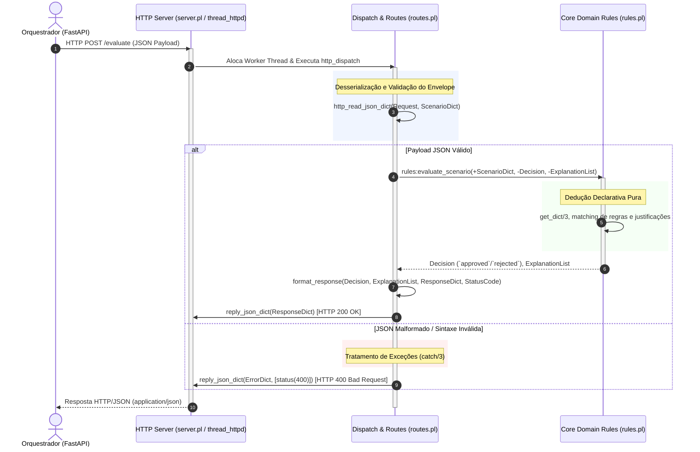
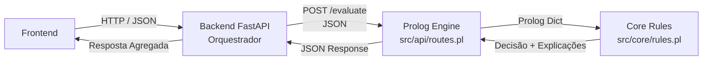

# Arquitetura da Solução: Micro-serviço SWI-Prolog

## 1. Visão Geral e Contexto
O presente micro-serviço constitui o motor de inferência pericial baseado em lógica dedutiva (**SWI-Prolog**) para o **Sistema Pericial de Diagnóstico de Devoluções e Trocas no Retalho**, no âmbito do Mestrado em Engenharia de Inteligência Artificial (MEIA - ENGCIA / PPROGIA).

O objetivo primordial deste componente é receber dados factuais sobre um pedido de devolução/troca (ex.: tipo de artigo, estado físico, etiquetas, comprovativo de compra, prazos e método de pagamento), aplicar regras formais de inferência e produzir uma decisão acompanhada de uma justificação detalhada e auditável (**Explicabilidade / Transparência**).

---

## 2. Princípios de Desenho e Separação de Preocupações (Clean Architecture)

Para assegurar manutenibilidade, testabilidade e evolução independente, o micro-serviço segue os princípios de **Clean Architecture**, dividindo estritamente as responsabilidades do sistema:

```
prolog_engine/
├── Dockerfile
└── src/
    ├── api/              # Camada de Transporte HTTP / I/O
    │   ├── server.pl     # Gestão do daemon HTTP e ciclo de vida do servidor
    │   └── routes.pl     # Mapeamento de rotas e serialização/deserialização JSON
    ├── core/             # Camada de Domínio / Regras de Negócio (Prolog Puro)
    │   └── rules.pl      # Base de conhecimento, predicados e motor de inferência
    └── main.pl           # Ponto de entrada (Entry Point) e orquestração do arranque
```

### 2.1 Camada de Transporte (`src/api/`)
* **Isolamento HTTP:** Responsável exclusivamente por escutar pedidos de rede, validar envelopes de transporte e mapear dados entre JSON e termos nativos do Prolog (*dicts*).
* **Ficheiros:**
  * `server.pl`: Inicialização do servidor em multi-threading através dos módulos nativos `http/thread_httpd` e `http/http_dispatch`.
  * `routes.pl`: Registo dos *handlers* REST (usando `http/http_json`), receção do payload, invocação da camada de domínio e formatação da resposta JSON.
* **Regra Fundamental:** A camada de API **não** contém nem aplica regras de negócio; limita-se a delegar na camada de domínio.

### 2.2 Camada de Domínio / Core (`src/core/`)
* **Prolog Puro:** Esta camada desconhece por completo a existência de HTTP, portas de rede, sockets ou formato JSON.
* **Ficheiros:**
  * `rules.pl`: Define os predicados de inferência (`evaluate_scenario/3`) que operam sobre factos e regras lógicas, consumindo estruturas de dados abstratas (*dicts*) e retornando decisões lógicas e respetivas justificações.
* **Vantagens:** Permite testes unitários diretos na consola SWI-Prolog (`swipl`), sem necessidade de iniciar servidores HTTP ou configurar mocks de rede.

### 2.3 Ponto de Entrada (`src/main.pl`)
* Carrega os módulos da aplicação, lê parâmetros de ambiente (como `PORT`), inicializa o servidor de transporte e bloqueia a thread principal para manter o contentor em execução contínua.

### 2.4 Passagem de Dados entre Camadas: O Papel dos *Prolog Dicts*
* **Estrutura Nativa e Desacoplamento:** A fronteira entre a Camada de Transporte (`src/api/routes.pl`) e a Camada de Domínio (`src/core/rules.pl`) assenta exclusivamente no uso de **Prolog Dicts** (dicionários nativos do SWI-Prolog, tais como `_{scenario: "test", value: 42}`).
* **Isolamento de Serialização:** A camada Core não tem qualquer conhecimento de JSON, *headers* ou envelopes HTTP. Ao receber o pedido, a camada de transporte utiliza a biblioteca `http/http_json` (`http_read_json_dict/3`) para converter o corpo JSON diretamente num dicionário Prolog.
* **Acesso aos Dados e Validação Declarativa:**
  * O predicado de domínio `rules:evaluate_scenario(+ScenarioDict, -Decision, -ExplanationList)` recebe o dicionário e valida a sua estrutura (`is_dict/1`).
  * A extração e verificação de atributos é realizada de forma declarativa e segura através de `get_dict/3` (ex.: `get_dict(value, ScenarioDict, Value)`), garantindo que chaves ausentes ou formatos inválidos não provocam falhas de runtime e conduzem de forma determinística aos ramos de *fallback*.
* **Saída Estruturada e Rastreabilidade:** A camada Core produz termos simbólicos puros (`Decision`, ex.: `approved`, `rejected`) e listas de cadeias de caracteres nativas com as justificações (`ExplanationList`), permitindo que a camada de API reconstrua um dicionário de resposta limpo e proceda à serialização final via `reply_json_dict/1`.

---

## 3. Fluxo do Ciclo de Vida do Pedido (Request-Response Lifecycle)

O ciclo de vida de um pedido de avaliação desde a sua emissão pelo orquestrador até à devolução da inferência diagnóstica obedece a um fluxo rigorosamente controlado e desacoplado através das seguintes etapas:



### Detalhe Passo-a-Passo do Ciclo de Vida:
1. **Receção e Alocação de Conexão (`server.pl` / `thread_httpd`):**
   * O cliente (Backend FastAPI) submete um pedido HTTP `POST /evaluate` com cabeçalho `Content-Type: application/json`.
   * O daemon HTTP baseado em pool de threads (`library(http/thread_httpd)`) aceita o socket TCP e delega a transação numa worker thread dedicada, garantindo suporte nativo a múltiplos pedidos simultâneos sem bloqueio do processo central.
2. **Encaminhamento de Rota (`routes.pl` / `http_dispatch`):**
   * O mecanismo central de despacho (`http_dispatch`) localiza o handler associado ao path `/evaluate` e método `post`, invocando o predicado `routes:handle_evaluate/1`.
3. **Leitura e Desserialização Segura (`http_read_json_dict`):**
   * A camada de rota recorre a `http_read_json_dict/2` para ler os bytes do fluxo de entrada e convertê-los diretamente num dicionário Prolog (*Prolog Dict*, ex.: `json{scenario: "test", value: 42}`).
   * Um bloco de proteção com `catch/3` interceta eventuais erros de sintaxe JSON ou corpo malformado, gerando imediatamente uma resposta estruturada de erro com código HTTP `400 Bad Request`.
4. **Execução da Dedução Lógica no Domínio (`rules.pl`):**
   * O dicionário desestruturado é fornecido ao predicado determinístico `rules:evaluate_scenario/3`.
   * A camada Core opera em Prolog puro: valida a presença dos atributos requeridos via `get_dict/3` e unifica a decisão (`Decision`, ex.: `approved`, `rejected`) juntamente com a lista de evidências lógicas e regras acionadas (`ExplanationList`).
5. **Formatação e Serialização da Resposta (`reply_json_dict`):**
   * O handler compõe o dicionário de resposta canónico (`ResponseDict`) integrando o estado (`status`), a decisão obtida e a lista de justificações.
   * Através de `reply_json_dict/1` (ou `reply_json_dict/2`), a biblioteca define os cabeçalhos HTTP adequados (`Content-Type: application/json; charset=UTF-8`, `Status: 200 OK` ou `400 Bad Request`) e emite a carga JSON serializada diretamente para a stream de saída.

---

## 4. Integração no Ecossistema Global

No ecossistema global do projeto, este micro-serviço não comunica diretamente com o utilizador final:
1. **Frontend:** Interface de retalho que submete o cenário ao Backend Orquestrador.
2. **Backend Orquestrador (FastAPI em Python):** Atua como o canal agregador e coordenador. Recebe o cenário, valida os dados do cliente e envia os factos via HTTP POST em formato JSON para o micro-serviço Prolog.
3. **Prolog Engine (Este Serviço):** Processa os factos, executa a dedução lógica e devolve a resposta estruturada com diagnóstico e explicações.



---

## 5. Requisito Crítico: Explicabilidade (Explainability)
A inferência de diagnósticos no retalho exige transparência operacional:
* Para além da decisão binária ou de ação (`approved`, `rejected`, `store_credit_only`, `manager_override`), o motor retorna sempre uma lista explícita de justificações (`justification`).
* Este histórico de dedução fundamenta o porquê de uma regra ter disparado ou falhado, permitindo auditoria das decisões pela equipa de loja e pelo cliente.

---

## 6. Contentorização e Operação (Docker & CLI)

De forma a garantir consistência de ambiente, facilidade de implantação e isolamento de dependências, o micro-serviço Prolog encontra-se totalmente contentorizado recorrendo à imagem base oficial `swipl:latest`.

### 6.1 Estrutura e Especificação do Contentor (`Dockerfile`)

O ficheiro [`prolog_engine/Dockerfile`](file:///c:/Users/santi/Desktop/meia-equipa3-challenge1-26_27/prolog_engine/Dockerfile) define a imagem de execução:
1. **Imagem Base:** `swipl:latest` (distribuição Linux oficial com SWI-Prolog pré-instalado e otimizado com suporte nativo a multi-threading e bibliotecas HTTP/JSON).
2. **Diretório de Trabalho:** `/app`.
3. **Cópia de Ficheiros:** A pasta `src/` é copiada para `/app/src/`.
4. **Porta Exposta:** Porta `8080/tcp` (configurável através da variável de ambiente `PORT`).
5. **Comando de Arranque:** `CMD ["swipl", "-s", "src/main.pl", "-g", "main", "-t", "halt"]`, que carrega o ponto de entrada, executa o predicado `main/0` e garante a finalização graciosa quando o contentor é interrompido.

---

### 6.2 Comandos de Linha de Comandos (CLI)

#### 1. Construir a Imagem Docker (Build)

A partir da raiz do repositório:
```bash
docker build -t prolog-engine -f prolog_engine/Dockerfile prolog_engine
```

Em alternativa, acedendo diretamente ao diretório `prolog_engine/`:
```bash
cd prolog_engine
docker build -t prolog-engine .
```

#### 2. Executar o Contentor (Run)

Para iniciar o micro-serviço em segundo plano (modo *detached*), mapeando a porta 8080 do anfitrião para a porta 8080 do contentor:
```bash
docker run -d --name prolog-service -p 8080:8080 prolog-engine
```

*Nota:* Se pretender executar numa porta diferente no anfitrião (ex.: porta 8085) e passar a variável de ambiente `PORT`:
```bash
docker run -d --name prolog-service -p 8085:8085 -e PORT=8085 prolog-engine
```

#### 3. Monitorizar e Consultar Logs

Para acompanhar o arranque do servidor e os registos de pedidos HTTP:
```bash
docker logs -f prolog-service
```

#### 4. Parar e Remover o Contentor

```bash
# Parar o serviço
docker stop prolog-service

# Remover o contentor
docker rm prolog-service
```

---

### 6.3 Testar o Endpoint com `curl` e Linha de Comandos

Com o contentor em execução e a escutar em `http://localhost:8080`, podem ser submetidos pedidos via linha de comandos:

#### Cenário A: Caso de Aprovação (`value = 42`)

* **Bash / Linux / macOS:**
```bash
curl -X POST http://localhost:8080/evaluate \
  -H "Content-Type: application/json" \
  -d '{"scenario": "test", "value": 42}'
```

* **Windows PowerShell:**
```powershell
Invoke-RestMethod -Uri "http://localhost:8080/evaluate" -Method Post -ContentType "application/json" -Body '{"scenario": "test", "value": 42}' | ConvertTo-Json
```
Ou com `curl.exe`:
```powershell
curl.exe -X POST http://localhost:8080/evaluate -H "Content-Type: application/json" -d "{\"scenario\": \"test\", \"value\": 42}"
```

* **Resposta Esperada (HTTP 200 OK):**
```json
{
  "status": "success",
  "decision": "approved",
  "justification": [
    "Value is 42",
    "Dummy rule matched"
  ]
}
```

#### Cenário B: Caso de Rejeição (`value != 42`)

* **Bash / Linux / macOS:**
```bash
curl -X POST http://localhost:8080/evaluate \
  -H "Content-Type: application/json" \
  -d '{"scenario": "test", "value": 15}'
```

* **Windows PowerShell:**
```powershell
Invoke-RestMethod -Uri "http://localhost:8080/evaluate" -Method Post -ContentType "application/json" -Body '{"scenario": "test", "value": 15}' | ConvertTo-Json
```

* **Resposta Esperada (HTTP 200 OK):**
```json
{
  "status": "success",
  "decision": "rejected",
  "justification": [
    "Value is not 42",
    "Default fallback rule applied"
  ]
}
```

#### Cenário C: Pedido com JSON Inválido (Tratamento de Erros)

* **Bash / Linux / macOS:**
```bash
curl -X POST http://localhost:8080/evaluate \
  -H "Content-Type: application/json" \
  -d '{bad_json}'
```

* **Resposta Esperada (HTTP 400 Bad Request):**
```json
{
  "status": "error",
  "decision": "rejected",
  "justification": [
    "Invalid JSON payload: malformed syntax or bad formatting"
  ]
}
```


