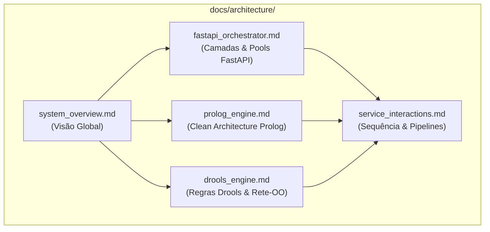

# Arquitetura do Sistema
### *Retail Returns & Exchanges Diagnostic Expert System*

---

## 1. Visão Geral da Secção

Esta secção contém a documentação técnica aprofundada da arquitetura da solução, cobrindo o ecossistema global de micro-serviços, o desenho interno dos motores de raciocínio simbólico (SWI-Prolog para o domínio de retalho e Apache KIE Drools para diagnóstico clínico de hemorragias), a camada de orquestração assíncrona em FastAPI e os fluxos detalhados de dados entre componentes.

O sistema baseia-se em princípios sólidos de engenharia de software: **Clean Architecture**, **separação estrita de responsabilidades**, **desacoplamento de protocolos de transporte**, **tolerância a falhas** e **explicabilidade nativa** (*Why / Why not* / *Fired Rules*).

---

## 2. Índice de Documentos de Arquitetura

| Documento | Propósito | Conteúdo Central |
|:---|:---|:---|
| [Visão Global do Sistema (`system_overview.md`)](system_overview.md) | Visão macro e ecossistema | Diagrama de arquitetura global, descrição das camadas, princípios de desenho ("Regra de Ouro"), stack tecnológica completa e portas de serviço. |
| [Arquitetura do Motor Prolog (`prolog_engine.md`)](prolog_engine.md) | Desenho do micro-serviço SWI-Prolog | Clean Architecture (api vs core), ciclo de vida do pedido, isolamento de I/O, papel dos *Prolog Dicts* como DTOs nativos e predicados de domínio. |
| [Arquitetura do Motor Drools (`drools_engine.md`)](drools_engine.md) | Desenho do micro-serviço Drools Engine | Arquitetura em camadas Spring Boot 3 / Java 21, Rete-OO via Drools 8.44, dual-strategy KieContainer, isolamento DTOs vs Factos de domínio, regras DRL de hemorragias e tratamento global de erros. |
| [Arquitetura do Orquestrador FastAPI (`fastapi_orchestrator.md`)](fastapi_orchestrator.md) | Desenho do backend orquestrador | Arquitetura em camadas (core, schemas, clients, services, api), gestão de ciclo de vida (*lifespan*), connection pooling com `httpx`, CORS e injeção de dependências. |
| [Interações entre Serviços e Fluxos de Dados (`service_interactions.md`)](service_interactions.md) | Comunicação e integração ponta-a-ponta | Diagramas de sequência detalhados (Prolog e Drools), pipelines de transformação de dados, DNS Docker, matriz de tratamento de erros e coexistência multi-motor. |

---

## 3. Mapa Visual de Componentes e Documentos

---

## 4. Navegação no Repositório de Documentação

* **Domínio & Conhecimento:** [Conhecimento de Negócio e Heurísticas](../domain/README.md)
* **APIs & Contratos:** [Referência de APIs e Schemas](../api/README.md)
* **Deploy & Operações:** [Guia de Deploy e Docker](../deployment/README.md)
* **Desenvolvimento:** [Guias de Desenvolvimento e Testes](../development/README.md)
* **Histórico:** [Planos e Histórico de Implementação](../history/README.md)

