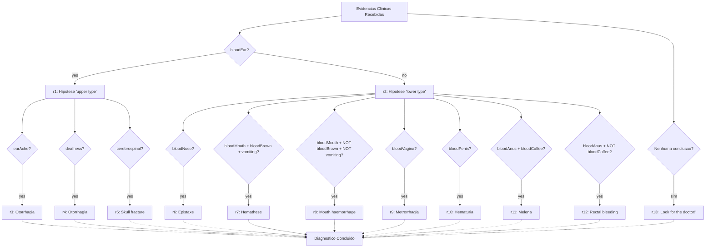
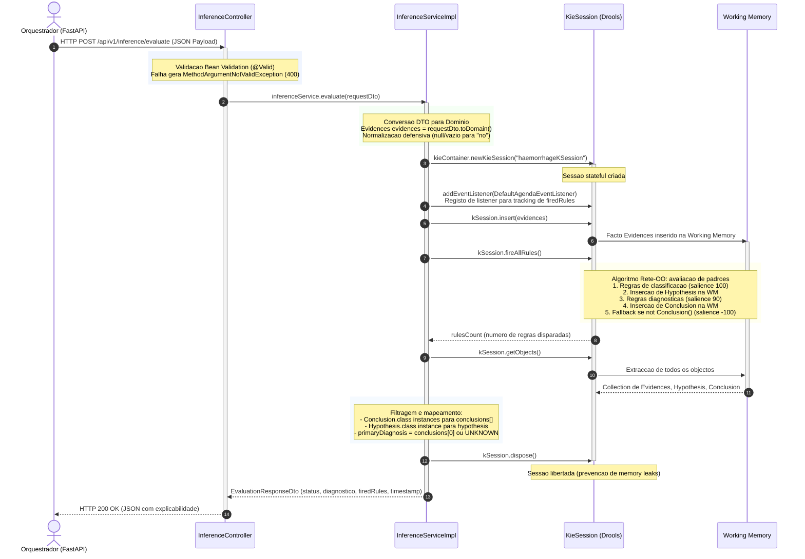

# Arquitetura Interna: Micro-servico Drools Engine
### *Motor de Inferencia Baseado em Regras de Producao*

---

## 1. Visao Geral e Papel no Sistema

O micro-servico **Drools Engine** ([`drools_engine/`](../../drools_engine)) constitui o segundo motor de inferencia pericial do sistema, baseado em **regras de producao** e no algoritmo **Rete-OO** implementado pelo Apache KIE Drools 8.44.

Enquanto o motor SWI-Prolog opera sobre logica declarativa de primeira ordem com encadeamento para a frente e mecanismos de explicabilidade bidirecional (*How / Why Not*), o Drools Engine aplica um paradigma complementar: regras de producao *if-then* compiladas numa rede de discriminacao Rete, proporcionando avaliacao eficiente de padroes sobre conjuntos de factos clinicos inseridos na memoria de trabalho (*Working Memory*).

O dominio clinico implementado centra-se no **diagnostico diferencial de hemorragias**, classificando evidencias clinicas observadas no paciente em hipoteses intermedias (tipo superior / tipo inferior) e deduzindo diagnosticos terminais (Otorrhagia, Epistaxe, Melena, entre outros) com rastreabilidade completa das regras disparadas (`firedRules`) para fins de explicabilidade.

---

## 2. Principios de Arquitectura e Organizacao do Codigo

O micro-servico segue uma arquitectura em camadas convencional do ecossistema Spring Boot, separando configuracao, transporte REST, logica de servico, factos de dominio Drools e contratos de dados:

```text
drools_engine/
├── Dockerfile                  # Contentorizacao multi-stage (Maven build + JRE runtime)
├── .dockerignore               # Exclusoes de contexto de build Docker
├── pom.xml                     # Definicao Maven com Spring Boot 3.3.4, Drools 8.44, Lombok
├── src/
│   ├── main/
│   │   ├── java/com/expert/drools/
│   │   │   ├── DroolsEngineApplication.java    # Entry point Spring Boot (@SpringBootApplication)
│   │   │   ├── config/
│   │   │   │   └── DroolsConfig.java           # Configuracao Spring e KieContainer (dual strategy)
│   │   │   ├── controllers/
│   │   │   │   ├── InferenceController.java    # Endpoint REST POST /api/v1/inference/evaluate
│   │   │   │   ├── HealthController.java       # Endpoint REST GET /api/v1/inference/health
│   │   │   │   └── GlobalExceptionHandler.java # Tratamento global de erros (@RestControllerAdvice)
│   │   │   ├── services/
│   │   │   │   ├── InferenceService.java       # Interface de servico (contrato)
│   │   │   │   └── InferenceServiceImpl.java   # Implementacao: orquestracao KieSession e inferencia
│   │   │   ├── models/
│   │   │   │   ├── Evidences.java              # Facto Drools: evidencias clinicas (Working Memory)
│   │   │   │   ├── Hypothesis.java             # Facto Drools: hipotese intermedia (upper/lower type)
│   │   │   │   └── Conclusion.java             # Facto Drools: diagnostico terminal com constantes
│   │   │   └── dtos/
│   │   │       ├── EvidencesRequestDto.java    # DTO de entrada REST com validacao @Pattern(yes|no)
│   │   │       ├── EvaluationResponseDto.java  # DTO de saida REST com diagnostico e firedRules
│   │   │       ├── HealthResponseDto.java      # DTO de saida REST para health check
│   │   │       └── ErrorResponseDto.java       # DTO padronizado de erro (400/500)
│   │   └── resources/
│   │       ├── application.properties          # Configuracao Spring Boot (porta, logging, Jackson)
│   │       ├── META-INF/
│   │       │   └── kmodule.xml                 # Definicao de KieBase e KieSession (haemorrhageKBase)
│   │       └── rules/
│   │           └── haemorrhage_rules.drl       # Regras DRL de diagnostico de hemorragias (13 regras)
│   └── test/
│       └── java/com/expert/drools/
│           ├── DroolsEngineApplicationTests.java   # Teste de contexto Spring Boot
│           ├── controllers/
│           │   └── InferenceControllerTest.java    # Testes de integracao REST (MockMvc)
│           └── services/
│               └── InferenceServiceTest.java       # Testes unitarios de inferencia por cenario
```

### 2.1 Camada de Configuracao (`config/`)
* **`DroolsConfig.java`:** Classe `@Configuration` responsavel pela criacao e exposicao do bean `KieContainer` com estrategia dual de inicializacao (ver Seccao 4).

### 2.2 Camada de Transporte REST (`controllers/`)
* **`InferenceController.java`:** Controlador `@RestController` que expoe `POST /api/v1/inference/evaluate` com validacao `@Valid` sobre o payload de entrada.
* **`HealthController.java`:** Controlador `@RestController` que expoe `GET /api/v1/inference/health` para verificacao do estado do motor.
* **`GlobalExceptionHandler.java`:** Componente `@RestControllerAdvice` que intercepta excepcoes globais e devolve payloads de erro padronizados (ver Seccao 7).

### 2.3 Camada de Servico (`services/`)
* **`InferenceService.java`:** Interface que define o contrato com dois metodos: `evaluate(EvidencesRequestDto)` e `getHealthStatus()`.
* **`InferenceServiceImpl.java`:** Implementacao `@Service` que gere o ciclo de vida da `KieSession`, insercao de factos, disparo de regras e extracao de conclusoes da Working Memory.

### 2.4 Factos de Dominio Drools (`models/`)
* **`Evidences.java`:** POJO Lombok (`@Data`, `@Builder`) representando os 13 indicadores clinicos binarios (`yes`/`no`) observados no paciente.
* **`Hypothesis.java`:** POJO que armazena hipoteses intermedias de classificacao (ex.: `"upper type"`, `"lower type"`).
* **`Conclusion.java`:** POJO com constantes estaticas para cada diagnostico terminal (ex.: `OTORRHAGIA`, `SKULL_FRACTURE`, `EPISTAXE`, etc.) e metodo `toString()` formatado.

### 2.5 Contratos de Transporte REST (`dtos/`)
* **`EvidencesRequestDto.java`:** DTO de entrada com 13 campos `@Pattern(^(?i)(yes|no)?$)`, metodo `toDomain()` para conversao defensiva e `@JsonInclude(NON_NULL)`.
* **`EvaluationResponseDto.java`:** DTO de saida com `status`, `primaryDiagnosis`, `conclusions`, `hypothesis`, `firedRules`, `timestamp` e `evidencesEvaluated`.
* **`HealthResponseDto.java`:** DTO com `status`, `service`, `version`, `activeKieBase`, `totalRules` e `timestamp`.
* **`ErrorResponseDto.java`:** DTO padronizado com `status`, `error`, `message`, `details` e `timestamp`.

---

## 3. Separacao entre Factos de Dominio e DTOs de Transporte

O micro-servico implementa uma separacao clara entre objectos de dominio que participam na inferencia Drools e objectos de transferencia de dados que definem o contrato da API REST:

| Camada | Pacote | Responsabilidade | Relacao com Drools |
|:---|:---|:---|:---|
| **Factos de Dominio** | `models/` | Objectos inseridos na Working Memory do Drools para avaliacao por regras | Directamente referenciados nos ficheiros `.drl` |
| **DTOs de Transporte** | `dtos/` | Serializacao/desserializacao JSON, validacao Bean Validation e contrato REST | Nunca entram na Working Memory |

### Mecanismo de Conversao: `toDomain()`

O metodo `EvidencesRequestDto.toDomain()` constitui a fronteira de conversao entre as duas camadas:

1. **Normalizacao Defensiva:** Cada campo e processado pela funcao `normalize(String)`, que converte valores `null` ou vazios para `"no"` e aplica `trim().toLowerCase()` para uniformizacao.
2. **Isolamento de Validacao:** A validacao `@Pattern` ocorre exclusivamente no DTO de entrada (camada de transporte), garantindo que os factos de dominio recebem apenas dados ja validados e normalizados.
3. **Imutabilidade Conceptual:** O objecto `Evidences` resultante do `toDomain()` e tratado como imutavel apos insercao na Working Memory -- as regras Drools nao alteram o facto `Evidences`, limitando-se a inserir novos objectos `Hypothesis` e `Conclusion`.

---

## 4. Configuracao e Inicializacao do KieContainer

A classe [`DroolsConfig`](../../drools_engine/src/main/java/com/expert/drools/config/DroolsConfig.java) implementa uma **estrategia dual** de inicializacao do `KieContainer`, garantindo resiliencia na presenca de diferentes ambientes de execucao:

### Estrategia 1: `KieClasspathContainer` (Prioritaria)

```text
KieServices.getKieClasspathContainer(classLoader)
    └── Carrega META-INF/kmodule.xml do classpath
    └── Compila automaticamente os .drl em packages configurados
    └── Verifica erros com container.verify()
    └── Se sem erros → retorna o container
    └── Se com erros → log de warning e fallback
```

### Estrategia 2: `KieFileSystem` (Fallback)

```text
KieServices.newKieFileSystem()
    ├── Carrega META-INF/kmodule.xml via PathMatchingResourcePatternResolver
    ├── Descoberta dinamica de ficheiros .drl em classpath*:rules/*.drl
    │   └── Para cada .drl encontrado: log + write no KieFileSystem virtual
    ├── KieBuilder.buildAll() → compilacao de regras
    ├── Verificacao de Results.hasMessages(ERROR)
    │   ├── Se erros → IllegalStateException com mensagem detalhada
    │   └── Se OK → newKieContainer(defaultReleaseId)
    └── IOException → IllegalStateException (falha de leitura de ficheiros)
```

### Configuracao do Modulo KIE (`kmodule.xml`)

```xml
<kmodule xmlns="http://www.drools.org/xsd/kmodule">
    <kbase name="haemorrhageKBase" default="true"
           eventProcessingMode="cloud" equalsBehavior="equality"
           packages="rules">
        <ksession name="haemorrhageKSession" type="stateful"
                  default="true" clockType="realtime"/>
    </kbase>
</kmodule>
```

* **`haemorrhageKBase`:** KieBase por omissao, modo de processamento `cloud` (nao-temporal), comportamento de igualdade por `equality`.
* **`haemorrhageKSession`:** Sessao `stateful` com relogio `realtime`, utilizada para inserir factos e disparar regras.
* **`packages="rules"`:** Instrui o compilador a procurar ficheiros `.drl` no pacote `rules`.

---

## 5. Base de Regras de Hemorragia (`haemorrhage_rules.drl`)

O ficheiro [`haemorrhage_rules.drl`](../../drools_engine/src/main/resources/rules/haemorrhage_rules.drl) define 13 regras de producao organizadas hierarquicamente em tres categorias, controladas por prioridades (`salience`):

### 5.1 Hierarquia de Prioridades

| Salience | Categoria | Regras | Proposito |
|:---:|:---|:---|:---|
| `100` | Classificacao | `r1`, `r2` | Determinar tipo de hemorragia (upper/lower) |
| `90` | Diagnostico | `r3` -- `r12` | Deduzir diagnostico terminal especifico |
| `-100` | Fallback | `r13` | Diagnostico desconhecido quando nenhuma regra diagnostica dispara |

### 5.2 Arvore de Decisao



### 5.3 Regras de Classificacao (salience 100)

* **`r1_upper_type_classification`:** Se `bloodEar == "yes"`, insere `Hypothesis("upper type")`.
* **`r2_lower_type_classification`:** Se `bloodEar == "no"`, insere `Hypothesis("lower type")`.

### 5.4 Regras Diagnosticas -- Tipo Superior (salience 90)

* **`r3_otorrhagia_ear_ache`:** `upper type` + `earAche == "yes"` → `Conclusion(OTORRHAGIA)`.
* **`r4_otorrhagia_deafness`:** `upper type` + `deafness == "yes"` → `Conclusion(OTORRHAGIA)`.
* **`r5_skull_fracture`:** `upper type` + `cerebrospinal == "yes"` → `Conclusion(SKULL_FRACTURE)`.

### 5.5 Regras Diagnosticas -- Tipo Inferior (salience 90)

* **`r6_epistaxe`:** `lower type` + `bloodNose == "yes"` → `Conclusion(EPISTAXE)`.
* **`r7_hemathese`:** `lower type` + `bloodMouth == "yes"` + `bloodBrown == "yes"` + `vomiting == "yes"` → `Conclusion(HEMATHESE)`.
* **`r8_mouth_haemorrhage`:** `lower type` + `bloodMouth == "yes"` + `bloodBrown == "no"` + `vomiting == "no"` → `Conclusion(MOUTH_HAEMORRHAGE)`.
* **`r9_metrorrhagia`:** `lower type` + `bloodVagina == "yes"` → `Conclusion(METRORRHAGIA)`.
* **`r10_hematuria`:** `lower type` + `bloodPenis == "yes"` → `Conclusion(HEMATURIA)`.
* **`r11_melena`:** `lower type` + `bloodAnus == "yes"` + `bloodCoffee == "yes"` → `Conclusion(MELENA)`.
* **`r12_rectal_bleeding`:** `lower type` + `bloodAnus == "yes"` + `bloodCoffee == "no"` → `Conclusion(RECTAL_BLEEDING)`.

### 5.6 Regra de Fallback (salience -100)

* **`r13_unknown_diagnosis_fallback`:** Se `not Conclusion()` (nenhuma conclusao na Working Memory), insere `Conclusion(UNKNOWN)` com a mensagem `"Look for the doctor!"`.

---

## 6. Ciclo de Vida do Pedido (Request-Response Lifecycle)

O diagrama de sequencia abaixo detalha a execucao completa de um pedido de avaliacao de evidencias clinicas dentro do micro-servico Drools:



### Tracking de Regras Disparadas para Explicabilidade

O servico regista um `DefaultAgendaEventListener` em cada `KieSession`, interceptando o evento `afterMatchFired` para capturar o nome de cada regra disparada. Esta lista (`firedRules`) e incluida na resposta JSON, proporcionando **transparencia total** sobre o raciocinio do motor:

```java
kSession.addEventListener(new DefaultAgendaEventListener() {
    @Override
    public void afterMatchFired(AfterMatchFiredEvent event) {
        String ruleName = event.getMatch().getRule().getName();
        firedRules.add(ruleName);
    }
});
```

---

## 7. Tratamento Global de Erros

O componente [`GlobalExceptionHandler`](../../drools_engine/src/main/java/com/expert/drools/controllers/GlobalExceptionHandler.java) intercepta excepcoes em todos os controladores REST e devolve payloads de erro padronizados atraves do `ErrorResponseDto`:

| Excepcao | Causa | Codigo HTTP | Campo `message` |
|:---|:---|:---:|:---|
| `MethodArgumentNotValidException` | Falha de validacao Bean Validation (`@Pattern`, `@Valid`) | `400 Bad Request` | `"Input validation failed"` |
| `HttpMessageNotReadableException` | JSON malformado, corpo vazio ou tipos incompativeis | `400 Bad Request` | `"Malformed JSON request body"` |
| `Exception` (generica) | Erro interno nao previsto (falha Drools, NPE, etc.) | `500 Internal Server Error` | `"An unexpected error occurred while processing the inference request"` |

### Estrutura do Payload de Erro

Todas as respostas de erro seguem a mesma estrutura `ErrorResponseDto`:

```json
{
  "status": 400,
  "error": "Bad Request",
  "message": "Input validation failed",
  "details": [
    "bloodEar: Value must be either 'yes' or 'no'"
  ],
  "timestamp": "2026-10-01T14:00:00Z"
}
```

O campo `details` e particularmente relevante em erros de validacao, onde cada violacao e listada individualmente com o nome do campo e a mensagem de restricao.

---

## 8. Documentos Relacionados

* [Visao Global da Arquitetura do Sistema](system_overview.md) -- Posicionamento do Drools Engine no ecossistema de micro-servicos.
* [Interacoes entre Servicos e Fluxos de Dados](service_interactions.md) -- Fluxo Orchestrator para Drools Engine e pipeline de transformacao.
* [Referencia da API do Motor Drools](../api/drools_engine_api.md) -- Especificacao tecnica dos endpoints `/api/v1/inference/*`.
* [Contentorizacao e Dockerfiles](../deployment/docker.md) -- Configuracao do contentor `expert-drools-engine`.
