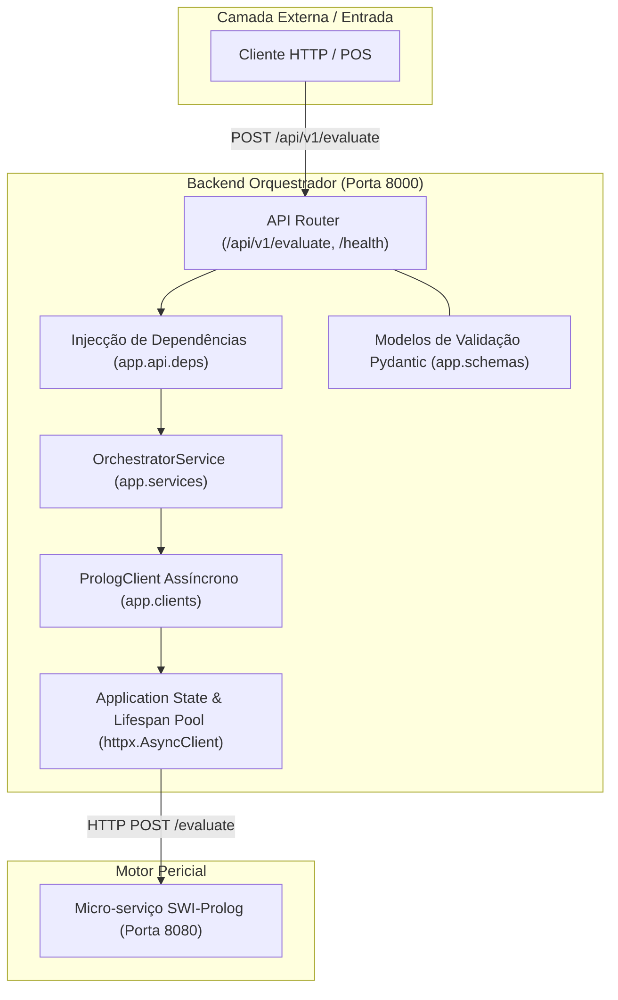
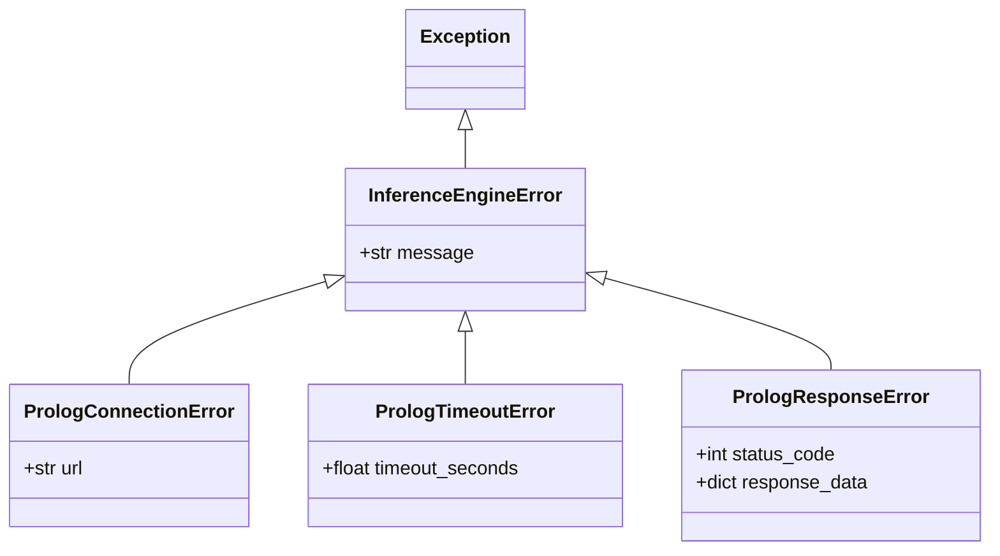

# Arquitetura Interna: Backend Orquestrador FastAPI
### *Camada de Orquestração, Validação de Schemas e Gestão de Conexões Assíncronas*

---

## 1. Visão Geral e Responsabilidades

O **Backend Orquestrador** ([`backend_orchestrator/`](../../backend_orchestrator)) atua como a espinha dorsal de comunicação do sistema, estabelecendo o canal exclusivo de comunicação entre clientes externos (Frontend POS, CLI, sistemas de caixa) e os múltiplos motores de inferência periciais (SWI-Prolog e, no futuro, Drools).

Construído em **Python 3.11** sobre o framework **FastAPI** e com validação declarativa através do **Pydantic v2**, o orquestrador obedece a uma arquitetura por camadas estritamente desacoplada:



---

## 2. Estrutura de Diretórios e Camadas de Código

A organização do código-fonte segue as melhores práticas da engenharia de software moderna:

```text
backend_orchestrator/
├── Dockerfile                  # Contentorização baseada em python:3.11-slim
├── .dockerignore               # Exclusão de caches (.pytest_cache, __pycache__, etc.)
├── requirements.txt            # Dependências fixadas (fastapi, uvicorn, pydantic, httpx, etc.)
├── .env.example                # Modelo de variáveis de ambiente
├── app/
│   ├── main.py                 # Ponto de entrada, configuração de Lifespan, CORS e routers
│   ├── core/                   # Núcleo de Infraestrutura e Configuração
│   │   ├── config.py           # Gestão centralizada de configurações (Pydantic BaseSettings)
│   │   └── exceptions.py       # Hierarquia de exceções personalizadas de inferência
│   ├── schemas/                # Data Transfer Objects (DTOs) e Validação Pydantic v2
│   │   ├── common.py           # EvaluationResponse, DecisionEnum, EngineSourceEnum
│   │   ├── scenario.py         # ScenarioInput (POC com validação estrita)
│   │   ├── retail.py           # Modelos de retalho: ItemSchema, PurchaseSchema, ItemCondition
│   │   └── health.py           # HealthResponse e estados de conectividade
│   ├── clients/                # Clientes de Transporte HTTP para Serviços Externos
│   │   └── prolog_client.py    # Cliente assíncrono httpx para o motor SWI-Prolog
│   ├── services/               # Camada de Negócio e Coordenação de Orquestração
│   │   └── orchestrator_service.py # Adaptação de modelos, agregação e síntese de respostas
│   └── api/                    # Camada de Exposição HTTP (REST API)
│       ├── deps.py             # Provedores de dependências (FastAPI Depends)
│       └── v1/
│           ├── router.py       # Agregação das rotas da API v1
│           └── endpoints/
│               ├── health.py   # Healthchecks (/health e /api/v1/health)
│               └── evaluate.py # Endpoint de avaliação (/api/v1/evaluate)
└── tests/                      # Suíte de Testes Automatizados Pytest
    ├── conftest.py             # Fixtures, mocks e configuração de ASGITransport
    ├── test_health.py          # Testes dos endpoints de saúde
    ├── test_schemas.py         # Testes de validação dos modelos Pydantic
    ├── test_prolog_client.py   # Testes unitários do cliente HTTP do Prolog
    └── test_orchestrator.py    # Testes do serviço e fluxo ponta-a-ponta
```

---

## 3. Gestão de Configuração (`app/core/config.py`)

A configuração do orquestrador é gerida pela classe [`Settings`](../../backend_orchestrator/app/core/config.py#L14-L52), baseada em `pydantic_settings.BaseSettings`:

* **Fontes de Leitura:** Lê automaticamente ficheiros `.env` locais ou variáveis de ambiente do sistema operativo / contentor Docker.
* **Validação de CORS:** O validador de campo `@field_validator("CORS_ORIGINS", mode="before")` permite especificar origens quer através de uma lista JSON (`["http://localhost:3000"]`) quer por valores separados por vírgula (`http://localhost:3000,http://localhost:5173`).
* **Instância Singleton:** Uma única instância `settings` é instanciada e partilhada por todo o ciclo de vida da aplicação.

```python
class Settings(BaseSettings):
    PROJECT_NAME: str = "Retail Returns & Exchanges Diagnostic Orchestrator"
    API_V1_STR: str = "/api/v1"
    DEBUG: bool = True
    PORT: int = 8000
    PROLOG_ENGINE_URL: str = "http://localhost:8080"
    PROLOG_TIMEOUT_SECONDS: float = 5.0
    CORS_ORIGINS: List[str] = ["http://localhost:3000", "http://localhost:5173", "http://localhost:8000"]
```

---

## 4. Gestão de Ciclo de Vida (*Lifespan*) e *Connection Pooling*

O arranque e encerramento do serviço é orquestrado através do gestor de contexto assíncrono `lifespan` em [`app/main.py`](../../backend_orchestrator/app/main.py#L20-L52):

### 4.1 Inicialização no Arranque (Startup)
1. É instanciado um cliente assíncrono partilhado `httpx.AsyncClient` configurado com `base_url=settings.PROLOG_ENGINE_URL` e timeout configurável (`settings.PROLOG_TIMEOUT_SECONDS`).
2. O `httpx.AsyncClient` mantém um **pool persistente de ligações TCP** reutilizáveis, eliminando o custo de *handshake* TCP/IP em cada pedido de inferência.
3. O cliente [`PrologClient`](../../backend_orchestrator/app/clients/prolog_client.py#L17-L148) e o serviço [`OrchestratorService`](../../backend_orchestrator/app/services/orchestrator_service.py#L15-L105) são injetados no estado global da aplicação (`app.state`).

### 4.2 Libertação no Encerramento (Shutdown)
Ao terminar o processo (sinal SIGTERM/SIGINT), o gestor de contexto encerra graciosa e assincronamente as ligações abertas através de `await http_client.aclose()`, prevenindo fugas de sockets no sistema anfitrião.

```python
@asynccontextmanager
async def lifespan(app: FastAPI) -> AsyncGenerator[None, None]:
    http_client = httpx.AsyncClient(
        base_url=settings.PROLOG_ENGINE_URL,
        timeout=settings.PROLOG_TIMEOUT_SECONDS,
        headers={"Content-Type": "application/json", "Accept": "application/json"},
    )
    prolog_client = PrologClient(client=http_client)
    orchestrator_service = OrchestratorService(prolog_client=prolog_client)

    app.state.http_client = http_client
    app.state.prolog_client = prolog_client
    app.state.orchestrator_service = orchestrator_service

    yield

    if not http_client.is_closed:
        await http_client.aclose()
```

---

## 5. Hierarquia de Exceções Personalizadas (`app/core/exceptions.py`)

Para isolar o domínio das especificidades de rede da biblioteca `httpx`, o sistema define uma hierarquia tipada de exceções:



* **`PrologConnectionError`:** Lançada quando o anfitrião do Prolog está inacessível (porta fechada, erro de DNS ou falha de socket). É convertida no endpoint para `HTTP 503 Service Unavailable`.
* **`PrologTimeoutError`:** Lançada quando o tempo de resposta excede `PROLOG_TIMEOUT_SECONDS`. Convertida para `HTTP 503 Service Unavailable`.
* **`PrologResponseError`:** Lançada quando o motor responde com código de erro 4xx ou 5xx (ex.: JSON malformado). Convertida para `HTTP 400 Bad Request`.

---

## 6. Mecanismo de Injecção de Dependências (`app/api/deps.py`)

O framework utiliza o padrão de **Inversão de Controlo (IoC)** através de `Depends`:

* **`get_prolog_client(request: Request) -> PrologClient`:** Extrai a instância gerida de `request.app.state.prolog_client`, evitando a re-criação supérflua de clientes.
* **`get_orchestrator_service(request: Request, prolog_client = Depends(...)) -> OrchestratorService`:** Fornece o serviço de orquestração reutilizando o estado partilhado.

Este desenho permite substituir facilmente o cliente real por um mock durante a execução de testes automatizados (`app.dependency_overrides`).

---

## 7. Documentos Relacionados

* [Visão Global da Arquitetura do Sistema](system_overview.md) — O ecossistema completo.
* [Arquitetura do Motor Prolog](prolog_engine.md) — O motor dedutivo coordenado pelo orquestrador.
* [Interações entre Serviços e Fluxos de Dados](service_interactions.md) — Diagrama de sequência ponta-a-ponta.
* [Referência da API do Orquestrador](../api/orchestrator_api_v1.md) — Documentação dos endpoints REST públicos.
* [Especificação de Schemas Pydantic / DTOs](../api/schemas.md) — DTOs detalhados.
