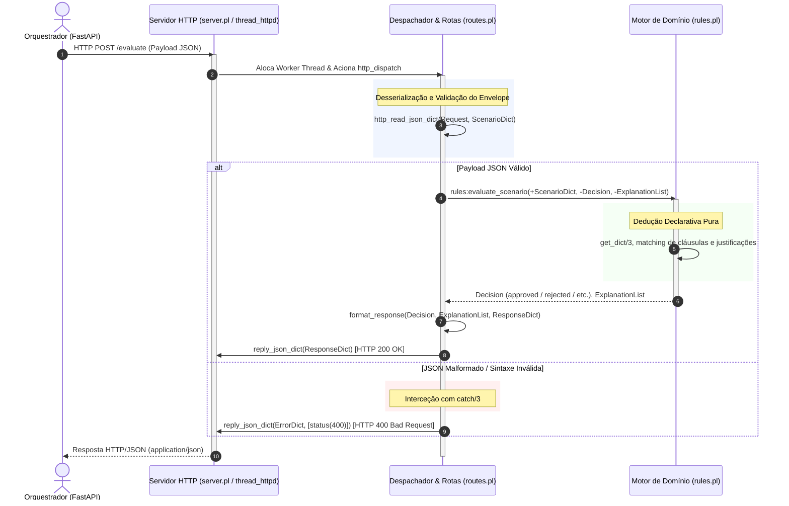

# Arquitetura Interna: Micro-serviço SWI-Prolog
### *Motor de Inferência Dedutiva em Clean Architecture*

---

## 1. Visão Geral e Papel no Sistema

O micro-serviço **SWI-Prolog** ([`prolog_engine/`](../../prolog_engine)) constitui o motor de inferência pericial baseado em lógica declarativa de primeira ordem.

A sua responsabilidade primordial consiste em receber representações factuais de cenários de devolução e troca, submetê-las à base de regras de negócio e deduzir deterministicamente o desfecho normativo acompanhado de uma cadeia estruturada de justificações (*Explicabilidade / Transparência*).

---

## 2. Princípios de Clean Architecture e Organização do Código

Para assegurar independência de protocolos de transporte, facilidade de manutenção e suporte a testes unitários ultrarrápidos, o micro-serviço adota os princípios de **Clean Architecture**:

```text
prolog_engine/
├── Dockerfile                  # Contentorização baseada na imagem oficial swipl:latest
├── .dockerignore               # Otimização do contexto de build da imagem Docker
├── src/
│   ├── api/                    # Camada de Transporte HTTP / Rede (I/O)
│   │   ├── server.pl           # Gestão do daemon HTTP multi-threaded (thread_httpd)
│   │   └── routes.pl           # Endpoints REST e serialização/desserialização JSON
│   ├── core/                   # Camada de Domínio / Regras de Negócio Puras
│   │   └── rules.pl            # Base de conhecimento declarativa e motor de inferência
│   └── main.pl                 # Entry point, bootstrapping e leitura de ambiente
└── tests/                      # Suíte de Testes Automatizados (PLUnit)
    ├── test_rules.pl           # Testes unitários do core de regras (7 cenários)
    └── test_api.pl             # Testes de integração HTTP e despacho (5 cenários)
```

### 2.1 Camada de Domínio / Lógica Pura (`src/core/rules.pl`)
* **Isolamento Total:** A camada Core desconhece por completo a existência de sockets TCP, portas de rede, servidores HTTP ou formatos de transmissão como JSON.
* **Prolog Declarativo Puro:** Opera unicamente com termos nativos do Prolog e dicionários abstratos (*Prolog Dicts*).
* **Testabilidade:** Pode ser testada diretamente na consola interativa `swipl` ou através de testes unitários PLUnit sem necessidade de iniciar o servidor web.

### 2.2 Camada de Transporte e Rede (`src/api/`)
* **Isolamento de I/O:** É a única secção do serviço com conhecimento de rede, protocolos HTTP e formatação de dados.
* **Módulos:**
  * `server.pl`: Inicializa o servidor HTTP concorrente através das bibliotecas nativas `library(http/thread_httpd)` e `library(http/http_dispatch)`.
  * `routes.pl`: Mapeia o caminho `/evaluate`, lê o fluxo JSON recebido, invoca a camada de domínio e converte a dedução num payload JSON de saída.
* **Regra Fundamental:** A camada de API **não** aplica nem contém regras de negócio; a sua única função é o transporte e adaptação de dados.

### 2.3 Ponto de Entrada (`src/main.pl`)
* Responsável pelo carregamento de todos os módulos (`api/server`, `api/routes`, `core/rules`).
* Lê a variável de ambiente `PORT` (por omissão `8080`).
* Inicializa o daemon na porta configurada e bloqueia a thread principal para manter o contentor Docker em execução contínua.

---

## 3. O Papel dos *Prolog Dicts* como DTOs Internos

A fronteira entre a Camada de Transporte (`src/api/routes.pl`) e a Camada de Domínio (`src/core/rules.pl`) assenta exclusivamente no uso de **Prolog Dicts** (dicionários nativos com tag, ex.: `json{scenario: "test", value: 42}`):

1. **Desserialização Segura:**  
   A camada de rotas recorre ao predicado nativo `http_read_json_dict/3` da biblioteca `library(http/http_json)`. O stream de bytes do corpo HTTP é imediatamente transformado num dicionário estruturado.
2. **Acesso Declarativo e Defensivo:**  
   Na camada de regras, a inspeção dos dados faz-se com `is_dict/1` e `get_dict/3`:
   ```prolog
   get_dict(value, ScenarioDict, Value)
   ```
   Caso uma chave obrigatória esteja ausente, o operador de unificação falha graciosamente, acionando de forma determinística os predicados de fallback sem lançar erros fatais de execução.
3. **Serialização Limpa:**  
   Após a conclusão da inferência, a camada de transporte constrói um novo dicionário de resposta e emite-o via `reply_json_dict/1` ou `reply_json_dict/2` com os cabeçalhos HTTP adequados (`application/json; charset=UTF-8`).

---

## 4. Ciclo de Vida do Pedido (Request-Response Lifecycle)

O diagrama abaixo detalha a sequência completa de execução de um pedido de inferência dentro do micro-serviço Prolog:



### Tratamento Defensivo de Erros de Sintaxe
A leitura do fluxo de entrada em `routes.pl` está protegida por um bloco `catch/3`:
```prolog
catch(
    http_read_json_dict(Request, DictIn),
    _Error,
    (
        reply_json_dict(json{
            status: "error",
            decision: "rejected",
            justification: ["Invalid JSON payload: malformed syntax or bad formatting"]
        }, [status(400)]),
        !
    )
)
```
Isto assegura que pedidos com JSON corrompido ou corpos vazios não provocam o encerramento do daemon nem lançam exceções não tratadas.

---

## 5. Especificação dos Predicados de Domínio

O ficheiro [`prolog_engine/src/core/rules.pl`](../../prolog_engine/src/core/rules.pl) exporta formalmente o predicado dedutivo:

```prolog
:- module(rules, [
    evaluate_scenario/3
]).
```

### Assinatura e Comportamento
```prolog
%!  evaluate_scenario(+ScenarioDict, -Decision, -ExplanationList) is det.
```

* **`+ScenarioDict`:** Dicionário nativo do SWI-Prolog contendo os factos do cenário a avaliar.
* **`-Decision`:** Átomo simbólico representativo da decisão deduzida (`approved`, `rejected` ou `error`).
* **`-ExplanationList`:** Lista de cadeias de caracteres contendo as justificações lógicas da dedução.

### Regras Implementadas na Prova de Conceito (POC)
1. **Regra 1 (Aprovação por valor exato):**  
   Se `value =:= 42`, deduz `approved` com justificações `["Value is 42", "Dummy rule matched"]`.
2. **Regra 2 (Rejeição por valor incorreto):**  
   Se `value` estiver presente mas for diferente de 42, deduz `rejected` com justificações `["Value is not 42", "Default fallback rule applied"]`.
3. **Regra 3 (Rejeição por ausência de atributo):**  
   Se a chave `value` estiver em falta no dicionário, deduz `rejected` com justificações `["Missing 'value' field in scenario", "Default fallback rule applied"]`.
4. **Regra 4 (Erro por tipo inválido):**  
   Se o argumento de entrada não for um dicionário Prolog (`\+ is_dict(ScenarioDict)`), deduz `error` com justificação `["Scenario payload is not a valid Prolog dictionary"]`.

*(Na evolução para o domínio de retalho, este predicado será expandido com cláusulas para avaliar itens de vestuário, recibos, prazos e higiene, conforme detalhado em [Heurísticas do Perito](../domain/expert_knowledge.md)).*

---

## 6. Documentos Relacionados

* [Visão Global da Arquitetura do Sistema](system_overview.md) — Posicionamento do micro-serviço no ecossistema global.
* [Arquitetura do Orquestrador FastAPI](fastapi_orchestrator.md) — Camada cliente que consome este serviço.
* [Interações entre Serviços e Fluxos de Dados](service_interactions.md) — Comunicação e contratos de transporte.
* [Referência da API do Motor Prolog](../api/prolog_engine_api.md) — Especificação técnica do endpoint `POST /evaluate`.
* [Contentorização e Dockerfiles](../deployment/docker.md) — Configuração do contentor `swipl:latest`.
