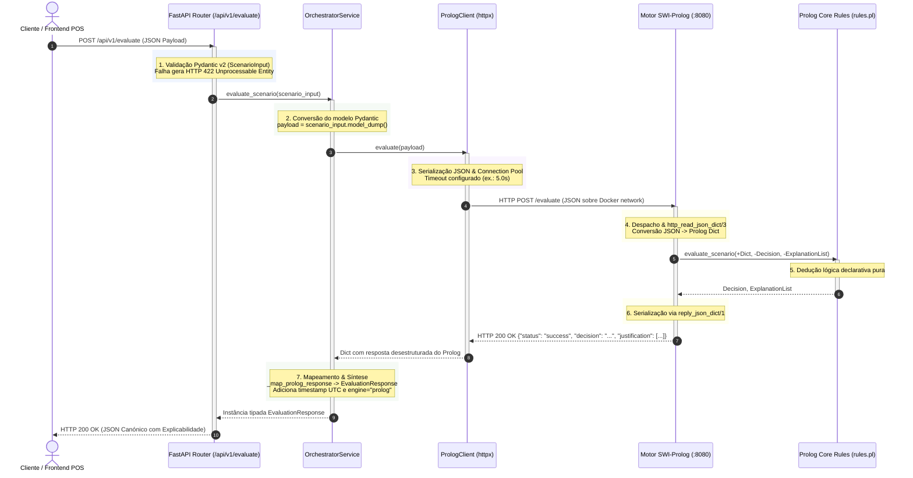
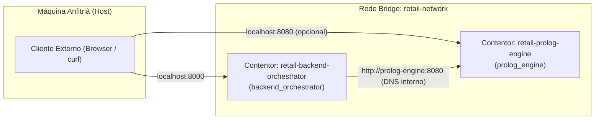
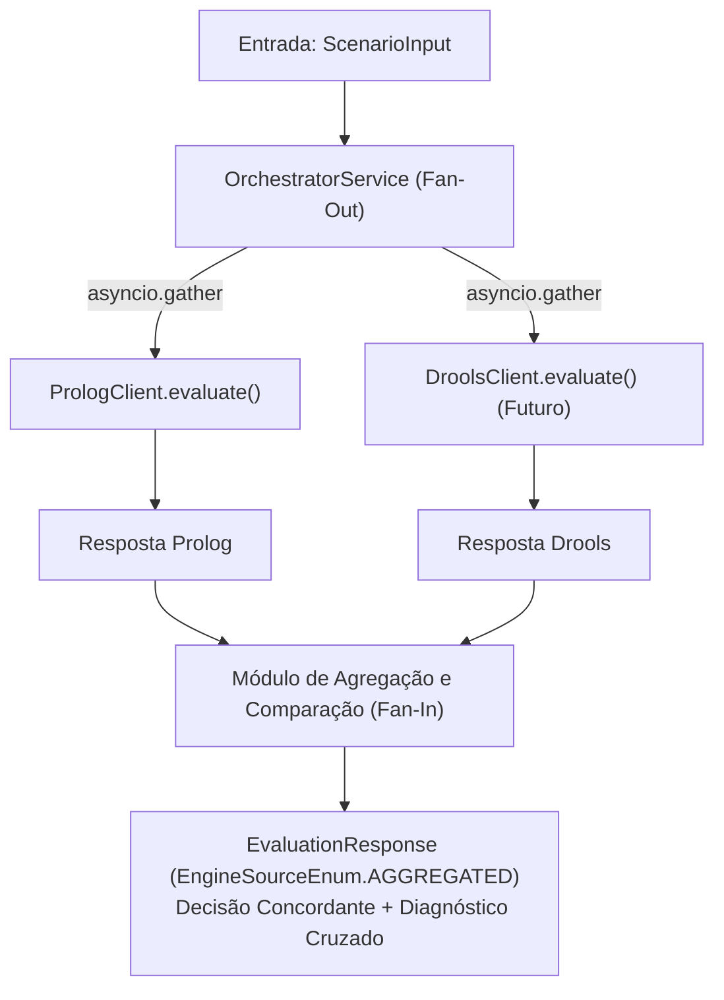

# Interações entre Serviços e Fluxos de Dados
### *Comunicação Inter-Serviços, Resolução DNS e Pipeline de Dados Ponta-a-Ponta*

---

## 1. Visão Geral da Comunicação

Num sistema distribuído de inteligência artificial pericial, a integridade da comunicação entre o orquestrador e os motores de regras é fundamental. 

Este documento detalha o ciclo de vida completo de uma transação ponta-a-ponta, a transformação de dados através das diferentes fronteiras de camada, a infraestrutura de rede Docker e as estratégias de mitigação de falhas.

---

## 2. Diagrama de Sequência Ponta-a-Ponta (End-to-End)

O diagrama abaixo descreve a interação completa desde o pedido inicial submetido pelo cliente/frontend até à resposta final sintetizada:



---

## 3. Pipeline de Transformação de Dados por Camada

A informação sofre transformações sucessivas e seguras à medida que atravessa as fronteiras dos subsistemas:

| Etapa | Fronteira / Componente | Formato de Dados | Exemplo / Representação |
|:---:|:---|:---|:---|
| **1** | Entrada no FastAPI | JSON Textual (HTTP Stream) | `{"scenario": "test", "value": 42}` |
| **2** | Camada de Rota | Instância Pydantic | `ScenarioInput(scenario='test', value=42)` |
| **3** | Serviço Orquestrador | Dicionário Python | `{"scenario": "test", "value": 42}` |
| **4** | Cliente HTTPX | JSON Serializado | Bytes em stream HTTP `POST /evaluate` |
| **5** | Camada HTTP Prolog | *Prolog Dict* com tag | `json{scenario: "test", value: 42}` |
| **6** | Camada Core Prolog | Termos Nativos Prolog | `Decision = approved`, `ExplanationList = ["Value is 42", ...]` |
| **7** | Resposta do Prolog | JSON Serializado | `{"status": "success", "decision": "approved", "justification": [...]}` |
| **8** | Retorno ao Orquestrador | Dicionário Python | `{"status": "success", "decision": "approved", ...}` |
| **9** | Saída Canónica | Modelo `EvaluationResponse` | `EvaluationResponse(status='success', decision=DecisionEnum.APPROVED, ...)` |
| **10**| Resposta ao Cliente | JSON Canónico Final | Serialização JSON compatível com Swagger OpenAPI |

---

## 4. Topologia de Rede e Resolução DNS

No ambiente operacional com **Docker Compose**, os serviços comunicam através da rede interna virtualizada:



### Resolução de Nomes:
* No ficheiro [`docker-compose.yml`](../../docker-compose.yml), o serviço Prolog tem o nome `prolog-engine`.
* O Docker Engine fornece um servidor de DNS interno (`127.0.0.11`) que resolve automaticamente a designação `prolog-engine` para o endereço IP dinâmico atribuído ao contentor dentro da rede `retail-network`.
* O orquestrador é configurado através da variável de ambiente:
  ```bash
  PROLOG_ENGINE_URL=http://prolog-engine:8080
  ```
* Em ambiente de desenvolvimento local fora do Docker, a variável recorre ao valor por omissão `http://localhost:8080`.

---

## 5. Matriz de Códigos de Erro e Tratamento de Exceções

O orquestrador atua como um escudo protetor para o cliente, interceptando anomalias e traduzindo-as em códigos HTTP padronizados:

| Cenário de Erro | Causa Raiz | Deteção / Exceção Interna | Código HTTP Devolvido | Payload de Erro |
|:---|:---|:---|:---:|:---|
| **JSON de Entrada Inválido** | Sintaxe JSON corrompida ou tipos errados | Pydantic `ValidationError` | `422 Unprocessable Entity` | Detalhe dos campos com falha de validação |
| **Motor Prolog Desligado** | Contentor offline ou falha de porta | `httpx.ConnectError` $\rightarrow$ `PrologConnectionError` | `503 Service Unavailable` | `{"detail": "Could not connect to Prolog engine at 'http://prolog-engine:8080'..."}` |
| **Timeout de Inferência** | Resposta excede `PROLOG_TIMEOUT_SECONDS` | `httpx.TimeoutException` $\rightarrow$ `PrologTimeoutError` | `503 Service Unavailable` | `{"detail": "Prolog engine timed out after 5.0s during evaluation..."}` |
| **Erro Interno no Motor** | Erro de sintaxe na rota do Prolog | `httpx.HTTPStatusError` $\rightarrow$ `PrologResponseError` | `400 Bad Request` | `{"detail": "Invalid JSON payload: malformed syntax..."}` |

---

## 6. Ponto de Extensão para o Motor Drools (Arquitetura Futura)

O método `evaluate_scenario` da classe [`OrchestratorService`](../../backend_orchestrator/app/services/orchestrator_service.py#L31-L61) foi desenhado com um ponto de extensão explícito para a integração do segundo motor de inferência:



Com este desenho, a inclusão do motor Drools não exigirá alterações na API pública nem no contrato com o frontend.

---

## 7. Documentos Relacionados

* [Visão Global da Arquitetura do Sistema](system_overview.md) — Diagrama e princípios globais.
* [Arquitetura do Motor Prolog](prolog_engine.md) — Processamento interno no SWI-Prolog.
* [Arquitetura do Orquestrador FastAPI](fastapi_orchestrator.md) — Camadas internas do orquestrador.
* [Referência da API Pública v1](../api/orchestrator_api_v1.md) — Especificação detalhada de endpoints.
* [Orquestração com Docker Compose](../deployment/docker_compose.md) — Rede e contentores.
