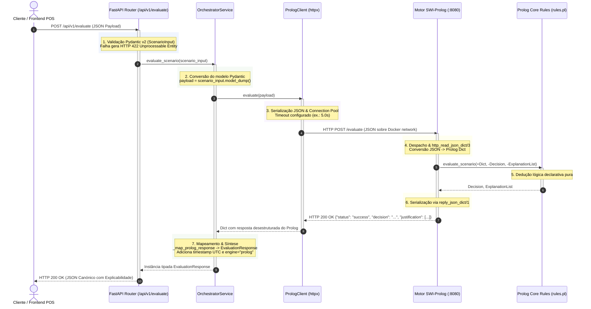
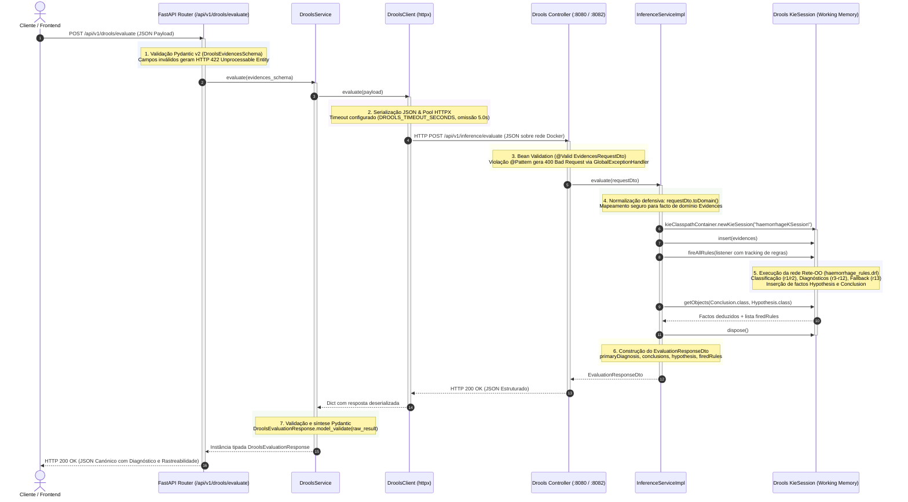
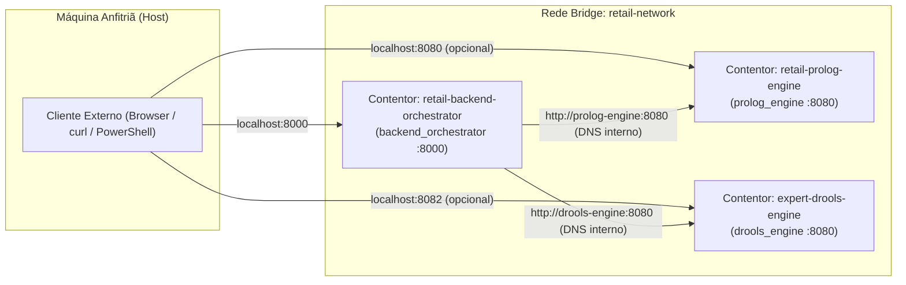
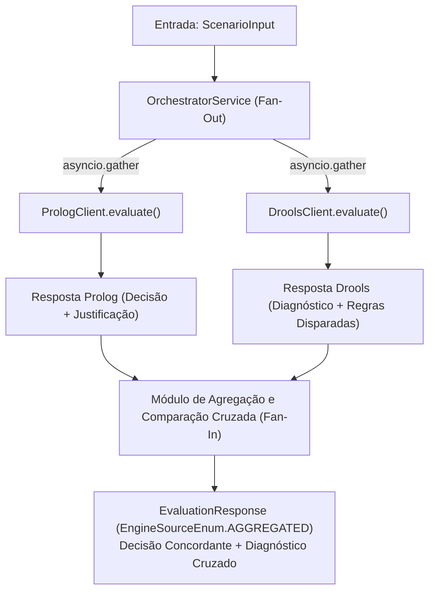

# Interações entre Serviços e Fluxos de Dados
### *Comunicação Inter-Serviços, Resolução DNS e Pipeline de Dados Ponta-a-Ponta*

---

## 1. Visão Geral da Comunicação

Num sistema distribuído de inteligência artificial pericial, a integridade da comunicação entre o orquestrador e os motores de regras é fundamental. 

O sistema integra dois motores simbólicos independentes:
1. **Motor SWI-Prolog (`prolog-engine`):** Lógica declarativa de primeira ordem para cenários de retalho e metaconhecimento forward-chaining.
2. **Motor Drools (`drools-engine`):** Regras de produção Rete-OO em Java/Spring Boot para diagnóstico diferencial clínico de hemorragias.

Este documento detalha o ciclo de vida completo das transações ponta-a-ponta de ambos os motores, as transformações de dados através das fronteiras de camada, a infraestrutura de rede Docker e as matrizes de tratamento de exceções.

---

## 2. Diagramas de Sequência Ponta-a-Ponta (End-to-End)

### 2.1 Ciclo de Vida do Pedido com Motor SWI-Prolog (Retalho / Domínio Pericial)

O diagrama abaixo descreve a interação completa desde o pedido de avaliação de devolução submetido pelo cliente/frontend até à resposta final sintetizada:



### 2.2 Ciclo de Vida do Pedido com Motor Drools (Diagnóstico Clínico de Hemorragias)

O diagrama abaixo ilustra a cadeia de processamento quando um pedido de avaliação clínica é submetido ao endpoint `/api/v1/drools/evaluate`:



---

## 3. Pipelines de Transformação de Dados por Camada

### 3.1 Pipeline do Motor SWI-Prolog (Retalho)

A informação de devoluções sofre transformações sucessivas entre a camada FastAPI e o motor Prolog:

| Etapa | Fronteira / Componente | Formato de Dados | Exemplo / Representação |
|:---:|:---|:---|:---|
| **1** | Entrada no FastAPI | JSON Textual (HTTP Stream) | `{"scenario": "test", "value": 42}` |
| **2** | Camada de Rota | Instância Pydantic | `ScenarioInput(scenario='test', value=42)` |
| **3** | Serviço Orquestrador | Dicionário Python | `{"scenario": "test", "value": 42}` |
| **4** | Cliente HTTPX | JSON Serializado | Bytes em stream HTTP `POST /evaluate` |
| **5** | Camada HTTP Prolog | *Prolog Dict* com tag | `json{scenario: "test", value: 42}` |
| **6** | Camada Core Prolog | Termos Nativos Prolog | `Decision = approved`, `ExplanationList = ["Value is 42", ...]` |
| **7** | Resposta do Prolog | JSON Serializado | `{"status": "success", "decision": "approved", "justification": [...]}` |
| **8** | Retorno ao Orquestrador | Dicionário Python | `{"status": "success", "decision": "approved", ...}` |
| **9** | Saída Canónica | Modelo `EvaluationResponse` | `EvaluationResponse(status='success', decision=DecisionEnum.APPROVED, ...)` |
| **10**| Resposta ao Cliente | JSON Canónico Final | Serialização JSON compatível com Swagger OpenAPI |

### 3.2 Pipeline do Motor Drools (Diagnóstico de Hemorragias)

O pipeline de avaliação clínica do Drools Engine assegura a separação estrita entre transporte REST e factos na Working Memory:

| Etapa | Fronteira / Componente | Formato de Dados | Exemplo / Representação |
|:---:|:---|:---|:---|
| **1** | Entrada no FastAPI | JSON Textual (HTTP Stream) | `{"bloodEar": "yes", "earAche": "yes"}` |
| **2** | Camada de Rota FastAPI | Schema Pydantic | `DroolsEvidencesSchema(bloodEar='yes', earAche='yes')` |
| **3** | Cliente HTTPX (`DroolsClient`) | JSON Serializado | Bytes em stream HTTP `POST /api/v1/inference/evaluate` |
| **4** | Controller Spring Boot | DTO Jakarta Validation | `EvidencesRequestDto(bloodEar="yes", earAche="yes", ...)` |
| **5** | Método de Conversão | Facto de Domínio Normalizado | `requestDto.toDomain() -> Evidences(bloodEar="yes", ...)` |
| **6** | Working Memory (Drools) | Factos em Memória (Rete-OO) | `kieSession.insert(evidences)` |
| **7** | Execução de Regras | Dedução de Hipóteses e Conclusões | `Hypothesis("upper type")`, `Conclusion("Otorrhagia")` |
| **8** | Construção da Resposta | DTO Spring Boot | `EvaluationResponseDto(status="SUCCESS", primaryDiagnosis="Otorrhagia", ...)` |
| **9** | Retorno ao Orquestrador | JSON Serializado / Dict Python | `{"status": "SUCCESS", "primaryDiagnosis": "Otorrhagia", ...}` |
| **10**| Modelo Canónico FastAPI | Schema `DroolsEvaluationResponse` | Pydantic validado com rastreabilidade `firedRules` |
| **11**| Resposta ao Cliente | JSON Canónico Final | Serialização JSON compatível com Swagger OpenAPI |

---

## 4. Topologia de Rede e Resolução DNS

No ambiente operacional com **Docker Compose**, todos os micro-serviços comunicam através da rede interna virtualizada em modo bridge (`retail-network`):



### Resolução de Nomes e Encaminhamento:
* No ficheiro [`docker-compose.yml`](../../docker-compose.yml), os serviços de inferência estão registados com os identificadores DNS `prolog-engine` e `drools-engine`.
* O Docker Engine fornece um servidor DNS interno (`127.0.0.11`) que resolve automaticamente os nomes dos serviços para os respetivos endereços IP dinâmicos atribuídos na rede `retail-network`.
* O orquestrador é configurado através das variáveis de ambiente:
  ```bash
  PROLOG_ENGINE_URL=http://prolog-engine:8080
  DROOLS_ENGINE_URL=http://drools-engine:8080
  ```
* Em ambiente de desenvolvimento local fora do Docker, as variáveis recorrem aos seguintes valores por omissão:
  ```bash
  PROLOG_ENGINE_URL=http://localhost:8080
  DROOLS_ENGINE_URL=http://localhost:8082
  ```

---

## 5. Matriz de Códigos de Erro e Tratamento de Exceções

O orquestrador atua como um escudo protetor para o cliente externo, intercetando anomalias em qualquer um dos motores de inferência e traduzindo-as em códigos HTTP normativos:

| Cenário de Erro | Componente / Causa Raiz | Deteção / Exceção Interna | Código HTTP Devolvido | Payload de Erro / Descrição |
|:---|:---|:---|:---:|:---|
| **JSON de Entrada Inválido (Prolog)** | Sintaxe JSON corrompida ou campos em falta na rota de retalho | Pydantic `ValidationError` | `422 Unprocessable Entity` | Detalhe dos campos com falha de validação |
| **JSON de Entrada Inválido (Drools)** | Sintaxe JSON corrompida ou tipos errados na rota Drools | Pydantic `ValidationError` | `422 Unprocessable Entity` | Detalhe dos campos com falha de validação |
| **Violação de Validação Bean (Drools)** | Valor diferente de `"yes"` ou `"no"` num campo clínico | `MethodArgumentNotValidException` no Drools $\rightarrow$ `DroolsResponseError` no Orquestrador | `400 Bad Request` | `{"detail": "Validation failed: bloodEar must be 'yes' or 'no'..."}` |
| **JSON Malformado no Motor Drools** | Payload HTTP malformado na entrada do Drools Engine | `HttpMessageNotReadableException` no Drools $\rightarrow$ `DroolsResponseError` | `400 Bad Request` | `{"detail": "Malformed JSON request payload"}` |
| **Motor Prolog Desligado** | Contentor offline, falha de porta ou DNS | `httpx.ConnectError` $\rightarrow$ `PrologConnectionError` | `503 Service Unavailable` | `{"detail": "Could not connect to Prolog engine at 'http://prolog-engine:8080'..."}` |
| **Motor Drools Desligado** | Contentor offline, JVM a arrancar ou porta 8080 indisponível | `httpx.ConnectError` $\rightarrow$ `DroolsConnectionError` | `503 Service Unavailable` | `{"detail": "Could not connect to Drools engine at 'http://drools-engine:8080'..."}` |
| **Timeout de Inferência (Prolog)** | Resposta excede `PROLOG_TIMEOUT_SECONDS` (omissão 5.0s) | `httpx.TimeoutException` $\rightarrow$ `PrologTimeoutError` | `503 Service Unavailable` | `{"detail": "Prolog engine timed out after 5.0s during evaluation..."}` |
| **Timeout de Inferência (Drools)** | Avaliação excede `DROOLS_TIMEOUT_SECONDS` (omissão 5.0s) | `httpx.TimeoutException` $\rightarrow$ `DroolsTimeoutError` | `503 Service Unavailable` | `{"detail": "Drools engine timed out after 5.0s during evaluation..."}` |
| **Erro Interno no Motor Prolog** | Erro de sintaxe na rota ou execução Prolog | `httpx.HTTPStatusError` $\rightarrow$ `PrologResponseError` | `400 Bad Request` | `{"detail": "Invalid JSON payload: malformed syntax..."}` |
| **Erro Interno no Motor Drools** | Exceção não tratada na execução do KieSession | `Exception` no Drools $\rightarrow$ `DroolsResponseError` | `400 Bad Request` | `{"detail": "Drools engine returned HTTP 500: Internal server error"}` |

---

## 6. Coexistência Multi-Motor e Ponto de Extensão para Avaliação Comparativa

Com a integração do micro-serviço Drools Engine, o sistema opera num modelo **multi-motor pericial**:

1. **Rotas Dedicadas por Paradigma:**
   - `/api/v1/evaluate` e `/api/v1/inference/*` comunicam com o motor declarativo **SWI-Prolog**.
   - `/api/v1/drools/evaluate` e `/api/v1/drools/health` comunicam com o motor de regras de produção **Drools**.
2. **Ponto de Extensão para Agregação e Comparação Cruzada:**
   A camada de serviço do orquestrador (`OrchestratorService`) está desenhada de modo a permitir um padrão *Fan-Out / Fan-In* assíncrono para cenários em que ambos os motores processem o mesmo domínio:



Graças ao desacoplamento garantido pelos clientes HTTP assíncronos (`PrologClient`, `DroolsClient`), a introdução de novos motores ou a agregação de decisões não acarreta alterações estruturais nos contratos dos clientes externos.

---

## 7. Documentos Relacionados

* [Visão Global da Arquitetura do Sistema](system_overview.md) — Diagrama e princípios globais do ecossistema.
* [Arquitetura do Motor Prolog](prolog_engine.md) — Processamento interno e Clean Architecture no SWI-Prolog.
* [Arquitetura do Motor Drools](drools_engine.md) — Arquitetura interna, Working Memory e regras DRL no Drools Engine.
* [Arquitetura do Orquestrador FastAPI](fastapi_orchestrator.md) — Camadas internas, lifespan e connection pooling em Python.
* [Referência da API do Motor Drools](../api/drools_engine_api.md) — Especificação técnica dos endpoints do Drools Engine.
* [Referência da API do Motor Prolog](../api/prolog_engine_api.md) — Especificação técnica dos endpoints do SWI-Prolog.
* [Referência da API Pública v1](../api/orchestrator_api_v1.md) — Especificação detalhada dos endpoints do orquestrador.
* [Orquestração com Docker Compose](../deployment/docker_compose.md) — Topologia de rede, variáveis e contentores.

