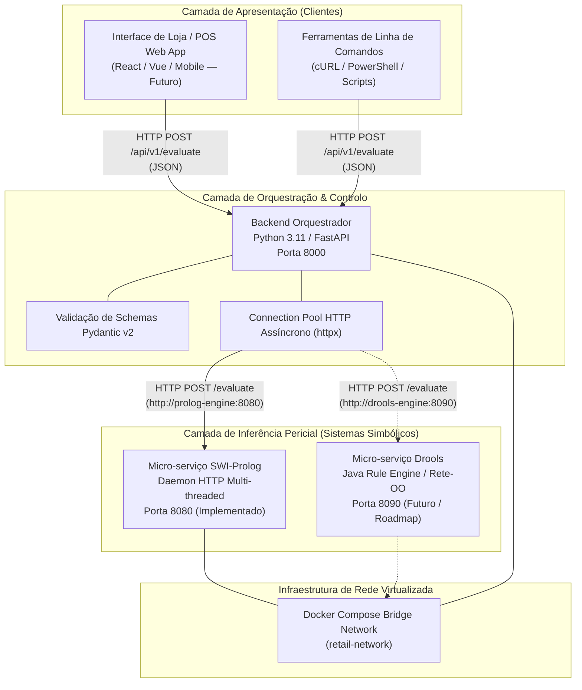

# Visão Global da Arquitetura do Sistema
### *Retail Returns & Exchanges Diagnostic Expert System*

---

## 1. Visão Geral do Ecossistema

O sistema adota uma arquitetura de micro-serviços distribuídos orientada a **inferência baseada em conhecimento**, separando de forma estrita o canal de comunicação e validação de dados da execução das regras de diagnóstico.

A solução é desenhada para permitir que múltiplos motores de inteligência artificial simbólica (inicialmente **SWI-Prolog** e, numa fase subsequente, **Java / Drools**) avaliem simultaneamente cenários de devolução de mercadorias no retalho, fornecendo decisões determinísticas e cadeias de justificação auditáveis (*Why / Why not*).

---

## 2. Componentes Estruturais do Sistema

### 2.1 Camada de Apresentação (Frontend / POS App)
* **Função:** Ponto de contacto com os operadores de balcão e gerentes de loja.
* **Comunicação:** Comunica **exclusivamente** com o Backend Orquestrador através da API REST pública na porta `8000`. Nunca interage diretamente com os motores de inferência.
* **Estado:** Planeado para o roadmap futuro do projeto.

### 2.2 Backend Orquestrador (FastAPI)
* **Função:** Ponto central de receção, validação, encaminhamento e agregação de respostas.
* **Tecnologia:** Python 3.11 com framework assíncrono **FastAPI** e biblioteca de validação **Pydantic v2**.
* **Responsabilidades:**
  1. Validação estrita de contratos de dados de entrada e serialização canónica de saída.
  2. Gestão de ciclo de vida e connection pooling via cliente HTTP assíncrono (`httpx.AsyncClient`).
  3. Conversão de erros de rede ou timeouts em códigos HTTP normativos (`503 Service Unavailable`, `400 Bad Request`).
  4. Suporte a Cross-Origin Resource Sharing (CORS) para interfaces web.
  5. Ponto de extensão para auditoria comparativa entre motores (Prolog vs Drools).

### 2.3 Micro-serviço Motor SWI-Prolog (`prolog-engine`)
* **Função:** Motor dedutivo de primeira ordem para diagnóstico pericial e explicabilidade.
* **Tecnologia:** SWI-Prolog (versão oficial `swipl:latest`), estruturado em **Clean Architecture**.
* **Responsabilidades:**
  1. Exposição de um daemon HTTP nativo multi-threaded (`thread_httpd`) na porta `8080`.
  2. Receção de factos em JSON e conversão declarativa em dicionários Prolog (*Prolog Dicts*).
  3. Execução de regras de inferência pura (`rules.pl`) sem dependências de rede.
  4. Dedução da decisão (`approved`, `rejected`, `store_credit_only`, `manager_override`) e geração da lista de justificações (`justification`).

### 2.4 Micro-serviço Motor Drools (`drools-engine` — Futuro)
* **Função:** Segundo motor de inferência baseado em regras de produção (*Forward Chaining* via algoritmo Rete-OO).
* **Tecnologia:** Java 17+ com Apache KIE / Drools Engine.
* **Responsabilidades:** Permitir comparação de desempenho, robustez e auditoria cruzada com o motor dedutivo Prolog.

---

## 3. Princípios Arquiteturais Fundamentais

### 3.1 A "Regra de Ouro": Separação Absoluta de Responsabilidades
> **REGRA DE OURO:** O Backend Orquestrador FastAPI **NÃO contém regras de negócio de retalho**.
> A sua única missão é validar contratos, orquestrar a comunicação entre sistemas e garantir resiliência. Todas as avaliações de elegibilidade de artigos, políticas de recibos, janelas temporais de devolução e regras sanitárias pertencem **exclusivamente aos motores de inferência periciais**.

### 3.2 Desacoplamento e Clean Architecture
Cada componente do sistema possui limites arquiteturais bem definidos:
* A camada core de regras do Prolog (`rules.pl`) desconhece que existe uma API HTTP ou tráfego de rede.
* O orquestrador trata os motores de inferência como serviços remotos independentes através de contratos HTTP/JSON bem especificados.
* O fracasso, lentidão ou substituição de um motor de inferência não corrompe a estabilidade da camada de orquestração.

### 3.3 Resiliência e Tolerância a Falhas
* O orquestrador aplica políticas de *timeout* estritas (por omissão 5.0 segundos) para impedir que lentidão num motor bloqueie os recursos do servidor.
* Se um motor de inferência estiver inacessível, o orquestrador devolve graciosamente um erro estruturado com código HTTP `503 Service Unavailable`, prevenindo crashes em cascata.

---

## 4. Stack Tecnológica Global

| Camada | Componente | Tecnologia / Framework | Versão / Base | Porta |
|:---|:---|:---|:---|:---:|
| **Orquestração** | Backend Orchestrator | Python / FastAPI / Pydantic v2 | Python 3.11-slim | `8000` |
| **Cliente HTTP** | Async Transport Client | HTTPX (`AsyncClient`) | httpx >= 0.27.0 | — |
| **Servidor ASGI** | Web Server Gateway | Uvicorn (Standard Worker) | uvicorn >= 0.30.0 | `8000` |
| **Motor Lógico** | Micro-serviço Prolog | SWI-Prolog (`thread_httpd`) | `swipl:latest` | `8080` |
| **Contentorização** | Virtualização de Serviços | Docker / Docker Compose | v2+ (Compose file 3.8+) | — |
| **Rede Interna** | Bridge Network | Docker Bridge (`retail-network`) | Driver nativo | — |

---

## 5. Documentos Relacionados

* [Arquitetura do Motor Prolog](prolog_engine.md) — Clean Architecture interna e ciclo de vida do micro-serviço SWI-Prolog.
* [Arquitetura do Orquestrador FastAPI](fastapi_orchestrator.md) — Estrutura interna de camadas, lifespan e connection pooling em Python.
* [Interações entre Serviços e Fluxos de Dados](service_interactions.md) — Diagrama de sequência ponta-a-ponta e tratamento de erros.
* [Contexto de Negócio e Enquadramento Académico](../domain/business_context.md) — Justificação teórica e caso de uso.
* [Orquestração com Docker Compose](../deployment/docker_compose.md) — Topologia e instruções operacionais de deploy.
