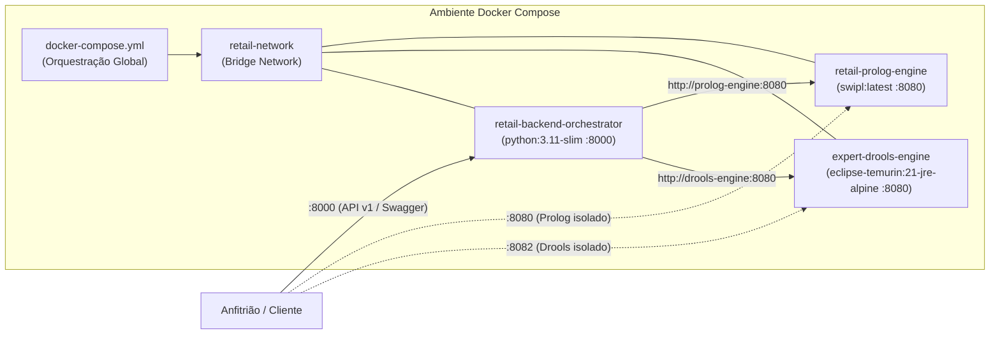

# Deploy, Contentorização e Operações
### *Sistema Pericial de Diagnóstico para Devoluções e Trocas no Retalho*

---

## 1. Visão Geral

Esta secção contém toda a documentação operacional e de infraestrutura necessária para compilar, configurar, orquestrar e manter os serviços do sistema, tanto em ambientes de desenvolvimento local como em preparação para cenários de integração contínua (CI/CD) e produção.

O sistema baseia-se numa arquitetura de três micro-serviços contentorizados em **Docker**, garantindo consistência estrita de runtime entre o interpretador **SWI-Prolog**, o ecossistema assíncrono **Python / FastAPI** e o motor de regras de produção **Java 21 / Spring Boot 3 (Drools Engine)**.



---

## 2. Índice de Documentos da Secção

| Documento | Ficheiro | Descrição e Propósito |
|:---|:---|:---|
| **Contentorização e Dockerfiles** | [`docker.md`](docker.md) | Especificação detalhada dos Dockerfiles de cada micro-serviço (`prolog_engine`, `drools_engine` e `backend_orchestrator`), imagens base, compilação multi-stage, otimizações de cache de camadas, regras de `.dockerignore` e instruções de build individual. |
| **Orquestração com Docker Compose** | [`docker_compose.md`](docker_compose.md) | Guia operacional completo do `docker-compose.yml`: resolução de rede bridge (`retail-network`), ordem de arranque (`depends_on`), ciclo de vida e comandos práticos (`up`, `logs`, `ps`, `down`) para o ecossistema de 3 serviços. |
| **Variáveis de Ambiente e Configuração** | [`environment_variables.md`](environment_variables.md) | Mapeamento exaustivo de todas as variáveis suportadas (`PORT`, `PROLOG_ENGINE_URL`, `DROOLS_ENGINE_URL`, `CORS_ORIGINS`, `application.properties`, etc.), ordem de precedência e tratamento de parâmetros de runtime. |
| **Resolução de Problemas (Troubleshooting)** | [`troubleshooting.md`](troubleshooting.md) | Catálogo de erros comuns (portas ocupadas 8000/8080/8082, conectividade DNS, timeouts, bloqueios de CORS, compilação DRL, memória JVM) e procedimentos passo-a-passo de mitigação. |

---

## 3. Guia de Início Rápido (Quick Start em 3 Comandos)

A partir da raiz do repositório:

```bash
# 1. Compilar as imagens e iniciar todo o ecossistema de três serviços em segundo plano
docker compose up --build -d

# 2. Validar a saúde dos serviços e conectividade entre contentores
curl -X GET http://localhost:8000/health
curl -X GET http://localhost:8082/api/v1/inference/health

# 3. Testar a avaliação de regras no Drools Engine (porta 8082)
curl -X POST http://localhost:8082/api/v1/inference/evaluate \
  -H "Content-Type: application/json" \
  -d '{"haematuria": "yes"}'
```

---

## 4. Portas e Resoluções de Rede

| Serviço | Porta Host | Porta Contentor | Hostname Interno Docker | Finalidade |
|:---|:---:|:---:|:---|:---|
| **FastAPI Orchestrator** | `8000` | `8000` | `orchestrator` | Ponto de entrada da API REST pública e Swagger UI (`/docs`). |
| **SWI-Prolog Engine** | `8080` | `8080` | `prolog-engine` | Motor de inferência dedutiva em lógica de primeira ordem. |
| **Drools Engine** | `8082` | `8080` | `drools-engine` | Motor de inferência por regras de produção (Java 21 / Spring Boot 3). |

---

## 5. Referências Cruzadas

* [Visão Geral da Arquitetura](../architecture/system_overview.md) — Diagrama e princípios estruturais do sistema.
* [Arquitetura do Motor Drools](../architecture/drools_engine.md) — Detalhes estruturais do micro-serviço Drools.
* [Referência de APIs](../api/README.md) — Documentação dos endpoints expostos pelos contentores.
* [API Interna do Motor Drools](../api/drools_engine_api.md) — Especificação REST do motor Drools.
* [Guia de Primeiros Passos (Local)](../development/getting_started.md) — Execução em ambiente de desenvolvimento sem Docker.
* [Estratégia de Testes](../development/testing.md) — Validação automatizada antes de construir as imagens.

