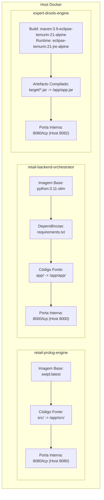

# Contentorização e Imagens Docker
### *Sistema Pericial de Diagnóstico para Devoluções e Trocas no Retalho*

---

## 1. Visão Geral

A arquitetura do sistema é desenhada para operar de forma contentorizada e isolada através do **Docker**. Cada micro-serviço possui um `Dockerfile` e um ficheiro `.dockerignore` próprios, otimizados para garantir:
* **Reprodutibilidade de ambiente:** Eliminação de discrepâncias entre desenvolvimento e produção ("funciona na minha máquina").
* **Isolamento de dependências:** SWI-Prolog, Python 3.11 e Java 21 / Spring Boot 3 executam em ambientes virtuais de contentores separados e herméticos.
* **Eficiência de compilação:** Aproveitamento sistemático da cache de camadas do Docker (*layer caching*) e compilação multi-stage.
* **Segurança e pegada reduzida:** Utilização de imagens *slim* / *alpine*, execução como utilizadores não-privilegiados e exclusão de artefactos desnecessários através de `.dockerignore`.



---

## 2. Tabela de Serviços e Portas

| Serviço | Diretório de Contexto | Imagem Base | Contentor Padrão | Porta Contentor | Porta Anfitrião (Host) |
|:---|:---|:---|:---|:---:|:---:|
| **Prolog Engine** | `prolog_engine/` | `swipl:latest` | `retail-prolog-engine` | `8080/tcp` | `8080` |
| **Drools Engine** | `drools_engine/` | `eclipse-temurin:21-jre-alpine` | `expert-drools-engine` | `8080/tcp` | `8082` |
| **Backend Orchestrator** | `backend_orchestrator/` | `python:3.11-slim` | `retail-backend-orchestrator` | `8000/tcp` | `8000` |

---

## 3. Especificação dos Dockerfiles

### 3.1 Micro-serviço SWI-Prolog (`prolog_engine/Dockerfile`)

Ficheiro fonte: [`prolog_engine/Dockerfile`](../../prolog_engine/Dockerfile)

```dockerfile
FROM swipl:latest

WORKDIR /app

COPY src/ /app/src/

EXPOSE 8080

ENV PORT=8080

CMD ["swipl", "-s", "src/main.pl", "-g", "main", "-t", "halt"]
```

#### Decisões de Engenharia:
1. **Imagem Base (`swipl:latest`):** Fornece a versão estável mais recente do interpretador oficial SWI-Prolog sobre base Linux Debian, contendo compiladas nativamente as bibliotecas multithreading (`library(http/thread_httpd)`) e o parser JSON (`library(http/http_json)`).
2. **Diretório de Trabalho (`WORKDIR /app`):** Normaliza o caminho de resolução dos módulos Prolog relativos.
3. **Cópia de Ficheiros:** Apenas o diretório `src/` é copiado. Os testes unitários (`tests/`) e ficheiros de documentação são omitidos da imagem de execução.
4. **Comando de Execução:** Inicia o SWI-Prolog carregando `src/main.pl`, dispara o predicado `main/0` que levanta o servidor HTTP e programa a terminação (`-t halt`) caso o processo seja interrompido por sinal SIGTERM.

#### Exclusões com `.dockerignore` ([`prolog_engine/.dockerignore`](../../prolog_engine/.dockerignore)):
* Metadados Git (`.git`, `.gitignore`)
* Testes PLUnit (`tests/`)
* Ficheiros Markdown (`*.md`)

---

### 3.2 Backend Orquestrador FastAPI (`backend_orchestrator/Dockerfile`)

Ficheiro fonte: [`backend_orchestrator/Dockerfile`](../../backend_orchestrator/Dockerfile)

```dockerfile
FROM python:3.11-slim

ENV PYTHONDONTWRITEBYTECODE=1 \
    PYTHONUNBUFFERED=1 \
    PORT=8000

WORKDIR /app

COPY requirements.txt /app/requirements.txt
RUN pip install --no-cache-dir --upgrade pip && \
    pip install --no-cache-dir -r /app/requirements.txt

COPY app/ /app/app/

EXPOSE 8000

CMD ["uvicorn", "app.main:app", "--host", "0.0.0.0", "--port", "8000"]
```

#### Decisões de Engenharia:
1. **Imagem Base (`python:3.11-slim`):** Reduz o tamanho da imagem final para ~150 MB (em comparação com >1 GB da imagem completa), eliminando compiladores e ferramentas de compilação C não exigidas pelas bibliotecas puras (FastAPI, Pydantic, HTTPX).
2. **Variáveis de Ambiente Críticas:**
   * `PYTHONDONTWRITEBYTECODE=1`: Impede o Python de gerar ficheiros temporários `.pyc` no disco do contentor.
   * `PYTHONUNBUFFERED=1`: Garante que o stdout/stderr é descarregado imediatamente sem buffering, permitindo que os logs sejam transmitidos em tempo real para o `docker logs`.
3. **Cache de Camadas (*Layer Caching*):** O ficheiro `requirements.txt` é copiado e instalado **antes** do código fonte (`COPY app/`). Desta forma, alterações no código Python não invalidam a camada de dependências (`pip install`), reduzindo os tempos de compilação subsequentes de minutos para frações de segundo.
4. **Servidor ASGI Uvicorn:** Vincula-se a `0.0.0.0` para aceitar tráfego de fora do contentor na porta `8000`.

#### Exclusões com `.dockerignore` ([`backend_orchestrator/.dockerignore`](../../backend_orchestrator/.dockerignore)):
* Caches do interpretador (`__pycache__`, `*.pyc`)
* Ambientes virtuais (`venv/`, `.venv/`, `env/`)
* Relatórios de teste e cobertura (`.pytest_cache`, `htmlcov`, `tests/`)
* Ficheiros de ambiente locais (`.env`)

---

### 3.3 Micro-serviço Drools Engine (`drools_engine/Dockerfile`)

Ficheiro fonte: [`drools_engine/Dockerfile`](../../drools_engine/Dockerfile)

```dockerfile
# ==============================================================================
# Stage 1: Build Stage using official Maven image with Temurin JDK 21 Alpine
# ==============================================================================
FROM maven:3.9-eclipse-temurin-21-alpine AS build

WORKDIR /app

# Copy pom.xml first to optimize Docker layer caching
COPY pom.xml .

# Download dependencies offline to accelerate subsequent builds
RUN mvn dependency:go-offline -B || true

# Copy application source code
COPY src ./src

# Build production executable JAR (running tests during build)
RUN mvn clean package -DskipTests

# ==============================================================================
# Stage 2: Lightweight Runtime Stage using minimal Alpine JRE 21
# ==============================================================================
FROM eclipse-temurin:21-jre-alpine AS runtime

WORKDIR /app

# Create non-privileged system user and group for enhanced container security
RUN addgroup -S appgroup && adduser -S appuser -G appgroup

# Copy built artifact from build stage
COPY --from=build /app/target/*.jar app.jar

# Set ownership of application files
RUN chown -R appuser:appgroup /app

# Switch to non-root user
USER appuser

# Expose microservice REST API port
EXPOSE 8080

# Environment configurations for containerized Java
ENV JAVA_OPTS="-XX:+UseContainerSupport -XX:MaxRAMPercentage=75.0"

# Application startup entrypoint
ENTRYPOINT ["sh", "-c", "java $JAVA_OPTS -jar app.jar"]
```

#### Decisões de Engenharia:
1. **Compilação Multi-Stage (*Multi-Stage Build*):**
   * **Stage 1 (Build):** Utiliza a imagem oficial `maven:3.9-eclipse-temurin-21-alpine` contendo o kit de desenvolvimento Java completo (JDK 21) e o gestor de compilação Apache Maven 3.9 sobre Alpine Linux.
   * **Otimização de Cache de Dependências:** O ficheiro `pom.xml` é copiado isoladamente antes do código-fonte e o comando `mvn dependency:go-offline -B || true` descarrega e pré-armazena as dependências Maven em cache de camada. Alterações nos ficheiros Java ou nas regras DRL não forçam o descarregamento repetido das bibliotecas.
   * **Empacotamento de Produção:** Executa `mvn clean package -DskipTests` gerando o JAR executável otimizado em `/app/target/*.jar`.
   * **Stage 2 (Runtime):** Utiliza a imagem mínima `eclipse-temurin:21-jre-alpine` (~180 MB), contendo unicamente o Java Runtime Environment (JRE 21) e descartando todas as ferramentas de compilação, o repositório local do Maven e o código-fonte intermediário.
2. **Princípio do Menor Privilégio e Segurança Não-Root:**
   * Criação do grupo de sistema `appgroup` e do utilizador de sistema não-privilegiado `appuser` sem permissões de administração (`RUN addgroup -S appgroup && adduser -S appuser -G appgroup`).
   * Atribuição estrita de permissões do diretório da aplicação (`RUN chown -R appuser:appgroup /app`).
   * Execução através da diretiva `USER appuser`, mitigando vulnerabilidades de escalamento de privilégios em caso de comprometimento do processo da JVM.
3. **Otimização da JVM para Contentorização:**
   * `ENV JAVA_OPTS="-XX:+UseContainerSupport -XX:MaxRAMPercentage=75.0"`: Ativa explicitamente a deteção de limites de memória e CPU impostos pelos subsistemas cgroups do Docker.
   * A flag `-XX:MaxRAMPercentage=75.0` instrui o coletor de lixo e gestor de memória da JVM a limitar a heap dinamicamente a 75% da RAM alocada ao contentor, salvaguardando os restantes 25% para a memória nativa da JVM (Metaspace, thread stacks, CodeCache) e evitando o encerramento do processo pelo *OOM Killer* do kernel Linux.
4. **Porta e Ponto de Entrada (*Entrypoint*):**
   * A porta interna do Spring Boot é `8080/tcp` (`EXPOSE 8080`), correspondendo ao porto padrão do servidor Tomcat embutido.
   * O ponto de entrada executa a JVM através de `sh -c` para expandir as flags dinâmicas de `JAVA_OPTS` passadas em tempo de execução.

#### Exclusões com `.dockerignore` ([`drools_engine/.dockerignore`](../../drools_engine/.dockerignore)):
* Ficheiros e artefactos de compilação locais (`target/`)
* Metadados e definições de IDEs (`.idea/`, `*.iml`)
* Histórico de controlo de versões (`.git/`, `.gitignore`)
* Ficheiros de registo e diagnóstico (`*.log`)

---

## 4. Instruções de Construção e Execução Individual (CLI)

Embora a orquestração via [Docker Compose](docker_compose.md) seja o método padrão recomendado, cada imagem pode ser construída e executada individualmente.

### 4.1 Micro-serviço Prolog Engine

#### 1. Construir a Imagem (Build):
```bash
# Executado a partir da raiz do repositório
docker build -t retail-prolog:latest -f prolog_engine/Dockerfile prolog_engine
```

#### 2. Executar o Contentor (Run):
```bash
docker run -d \
  --name retail-prolog-standalone \
  -p 8080:8080 \
  -e PORT=8080 \
  retail-prolog:latest
```

#### 3. Verificar Funcionamento:
```powershell
# Smoke test com PowerShell
(Invoke-RestMethod -Uri "http://localhost:8080/evaluate" -Method Post -ContentType "application/json" -Body '{"scenario":"test","value":42}') | ConvertTo-Json
```

#### 4. Parar e Limpar:
```bash
docker stop retail-prolog-standalone && docker rm retail-prolog-standalone
```

---

### 4.2 Backend Orquestrador FastAPI

#### 1. Construir a Imagem (Build):
```bash
# Executado a partir da raiz do repositório
docker build -t retail-orchestrator:latest -f backend_orchestrator/Dockerfile backend_orchestrator
```

#### 2. Executar o Contentor (Run em Rede Host ou com Ligação ao Prolog):
```bash
docker run -d \
  --name retail-orchestrator-standalone \
  -p 8000:8000 \
  -e PROLOG_ENGINE_URL=http://host.docker.internal:8080 \
  -e DEBUG=true \
  retail-orchestrator:latest
```
*(No Linux, substituir `host.docker.internal` pelo IP do gateway ou recorrer à rede partilhada do Docker Compose).*

#### 3. Verificar Funcionamento:
```powershell
curl.exe -X GET http://localhost:8000/health
```

#### 4. Parar e Limpar:
```bash
docker stop retail-orchestrator-standalone && docker rm retail-orchestrator-standalone
```

---

### 4.3 Micro-serviço Drools Engine

#### 1. Construir a Imagem (Build):
```bash
# Executado a partir da raiz do repositório
docker build -t expert-drools-engine:latest -f drools_engine/Dockerfile drools_engine
```

#### 2. Executar o Contentor (Run):
```bash
docker run -d \
  --name expert-drools-engine-standalone \
  -p 8082:8080 \
  -e PORT=8080 \
  expert-drools-engine:latest
```

#### 3. Verificar Funcionamento:

* **Healthcheck do Motor Drools (Bash / cURL):**
  ```bash
  curl -X GET http://localhost:8082/api/v1/inference/health
  ```

* **Healthcheck do Motor Drools (PowerShell Windows):**
  ```powershell
  (Invoke-RestMethod -Uri "http://localhost:8082/api/v1/inference/health" -Method Get) | ConvertTo-Json
  ```

* **Smoke Test de Avaliação Diagnóstica (Bash / cURL):**
  ```bash
  curl -X POST http://localhost:8082/api/v1/inference/evaluate \
    -H "Content-Type: application/json" \
    -d '{"bloodEar": "yes", "earAche": "yes"}'
  ```

* **Smoke Test de Avaliação Diagnóstica (PowerShell Windows):**
  ```powershell
  curl.exe -X POST http://localhost:8082/api/v1/inference/evaluate `
    -H "Content-Type: application/json" `
    -d '{\"bloodEar\": \"yes\", \"earAche\": \"yes\"}'
  ```

#### 4. Parar e Limpar:
```bash
docker stop expert-drools-engine-standalone && docker rm expert-drools-engine-standalone
```

---

## 5. Documentos Relacionados

* [Orquestração com Docker Compose](docker_compose.md) — Subida coordenada de todos os três serviços com rede partilhada.
* [Variáveis de Ambiente](environment_variables.md) — Todas as opções de configuração dos contentores.
* [Resolução de Problemas (Troubleshooting)](troubleshooting.md) — Diagnóstico de falhas de build, JVM ou rede.
* [Arquitetura do Motor Drools](../architecture/drools_engine.md) — Especificação interna do micro-serviço Drools.
* [API Interna do Motor Drools](../api/drools_engine_api.md) — Contratos REST detalhados do motor de inferência Drools.
* [Arquitetura Global](../architecture/system_overview.md) — Contexto de infraestrutura e serviços.
