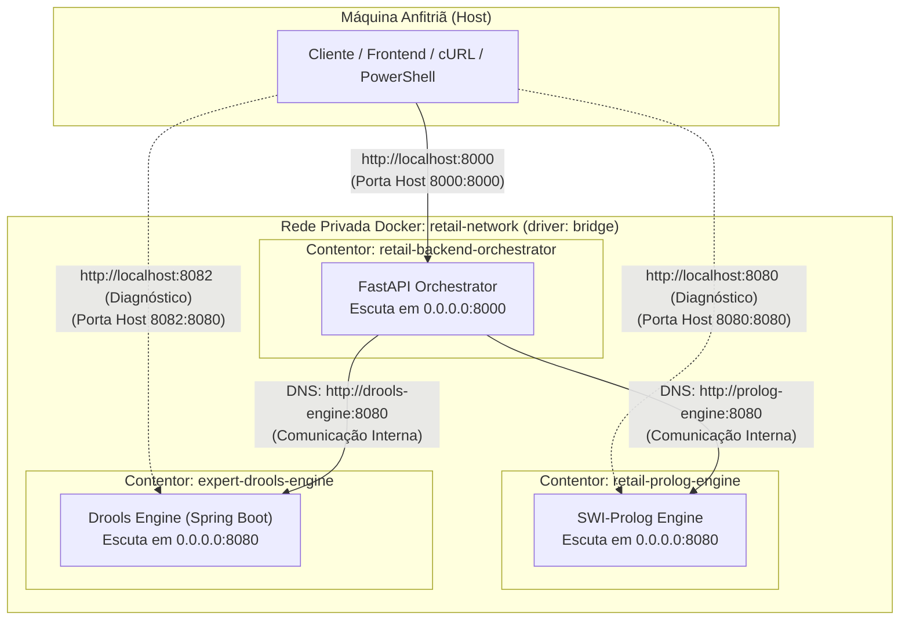

# Orquestração com Docker Compose
### *Sistema Pericial de Diagnóstico para Devoluções e Trocas no Retalho*

---

## 1. Visão Geral

A orquestração do ecossistema de micro-serviços é gerida declarativamente pelo ficheiro [`docker-compose.yml`](../../docker-compose.yml) localizado na raiz do projeto. O Docker Compose permite:
1. **Compilar e levantar todo o sistema de três micro-serviços com um único comando.**
2. **Criar uma rede bridge privada (`retail-network`)** onde os contentores comunicam por DNS interno sem depender de endereços IP estáticos.
3. **Controlar a ordem de inicialização** através da diretiva `depends_on`.
4. **Garantir alta disponibilidade local** com políticas automáticas de reinício (`unless-stopped`).



---

## 2. Anatomia do `docker-compose.yml`

Ficheiro de referência: [`docker-compose.yml`](../../docker-compose.yml)

```yaml
services:
  prolog-engine:
    build:
      context: ./prolog_engine
      dockerfile: Dockerfile
    container_name: retail-prolog-engine
    ports:
      - "8080:8080"
    environment:
      - PORT=8080
    restart: unless-stopped
    networks:
      - retail-network

  drools-engine:
    build:
      context: ./drools_engine
      dockerfile: Dockerfile
    container_name: expert-drools-engine
    ports:
      - "8082:8080"
    environment:
      - PORT=8080
    restart: unless-stopped
    networks:
      - retail-network

  orchestrator:
    build:
      context: ./backend_orchestrator
      dockerfile: Dockerfile
    container_name: retail-backend-orchestrator
    ports:
      - "8000:8000"
    environment:
      - PORT=8000
      - PROLOG_ENGINE_URL=http://prolog-engine:8080
      - PROLOG_TIMEOUT_SECONDS=5.0
      - DROOLS_ENGINE_URL=http://drools-engine:8080
      - DEBUG=true
      - CORS_ORIGINS=["http://localhost:3000","http://localhost:5173","http://localhost:8000"]
      - INFERENCE_ENGINE_ENABLED=true
    depends_on:
      - prolog-engine
      - drools-engine
    restart: unless-stopped
    networks:
      - retail-network

networks:
  retail-network:
    driver: bridge
```

### 2.1 Análise dos Serviços

#### 2.1.1 Serviço `prolog-engine`
* **Nome do contentor:** `retail-prolog-engine`.
* **Contexto de build:** `./prolog_engine` utilizando o `Dockerfile` correspondente.
* **Mapeamento de portas:** `"8080:8080"` expõe o serviço para permitir testes individuais diretos no host, embora em produção apenas o orquestrador necessite de comunicar com ele.
* **Rede:** Associado à rede bridge `retail-network`. O nome do serviço (`prolog-engine`) serve de hostname DNS automático para outros contentores da mesma rede.

#### 2.1.2 Serviço `drools-engine`
* **Nome do contentor:** `expert-drools-engine`.
* **Contexto de build:** `./drools_engine` utilizando o seu `Dockerfile` multi-stage (Maven 3.9 + Eclipse Temurin JDK 21 para compilação; JRE 21 Alpine para runtime).
* **Mapeamento de portas:** `"8082:8080"` expõe o micro-serviço na porta `8082` da máquina anfitriã, redirecionando o tráfego para a porta `8080` interna do Spring Boot. Isto evita qualquer colisão com a porta `8080` do Prolog Engine no anfitrião.
* **Injeção de Ambiente:** Define `PORT=8080`.
* **Rede:** Associado à rede bridge `retail-network`. O nome do serviço (`drools-engine`) atua como hostname DNS interno para os restantes contentores.
* **Política de Reinício:** `unless-stopped` garante a recuperação automática do processo da JVM em caso de encerramento anómalo.

#### 2.1.3 Serviço `orchestrator`
* **Nome do contentor:** `retail-backend-orchestrator`.
* **Contexto de build:** `./backend_orchestrator`.
* **Mapeamento de portas:** `"8000:8000"` (porta de entrada principal para a API pública do sistema pericial).
* **Dependências (`depends_on`):** Declara explicitamente dependência em ambos os motores de inferência (`prolog-engine` e `drools-engine`), garantindo que estes são inicializados antes do arranque do orquestrador.
* **Injeção de Ambiente:**
  * `PROLOG_ENGINE_URL=http://prolog-engine:8080`: Endereço interno DNS para contactar o motor Prolog.
  * `DROOLS_ENGINE_URL=http://drools-engine:8080`: Endereço interno DNS para contactar o motor Drools.
  * `INFERENCE_ENGINE_ENABLED=true`: Ativa os endpoints do motor de inferência académica (`sp_exp2.pl`).
  * `PROLOG_TIMEOUT_SECONDS=5.0`, `DEBUG=true`, `CORS_ORIGINS`.

### 2.2 Rede e Resolução DNS (`retail-network`)
A rede `retail-network` utiliza o driver `bridge`. O Docker configura um servidor DNS interno (no IP `127.0.0.11`) que resolve os nomes dos serviços do compose directly para o IP interno do contentor correspondente (`prolog-engine`, `drools-engine`, `orchestrator`). Isto assegura que mesmo que os contentores reiniciem e mudem de IP, a comunicação mantém-se inalterada.

---

## 3. Guia Operacional Passo-a-Passo

Todos os comandos devem ser executados a partir da **raiz do repositório**.

### Passo 1: Construir e Iniciar os Serviços

Para compilar as imagens a partir do código atualizado e iniciar os contentores em segundo plano (*detached mode*):

```bash
docker compose up --build -d
```

> [!TIP]
> A flag `--build` garante que quaisquer alterações recentes no código Python ou Prolog são incorporadas nas imagens recém-construídas.

---

### Passo 2: Verificar o Estado dos Contentores

Para validar se os três contentores estão em estado operacional (`Up` / `healthy`):

```bash
docker compose ps
```

**Resultado esperado:**
```text
NAME                           IMAGE                               COMMAND                  SERVICE         STATUS         PORTS
retail-backend-orchestrator    meia-equipa3-...-orchestrator       "uvicorn app.main:ap…"   orchestrator    Up 2 minutes   0.0.0.0:8000->8000/tcp
retail-prolog-engine           meia-equipa3-...-prolog-engine      "swipl -s src/main.p…"   prolog-engine   Up 2 minutes   0.0.0.0:8080->8080/tcp
expert-drools-engine           meia-equipa3-...-drools-engine      "sh -c 'java $JAVA_O…"   drools-engine   Up 2 minutes   0.0.0.0:8082->8080/tcp
```

---

### Passo 3: Acompanhar os Registos de Execução (Logs)

Para seguir em tempo real a emissão de logs de todos os três serviços:

```bash
docker compose logs -f
```

Para filtrar apenas os logs de um serviço específico:
```bash
# Registos do FastAPI Orchestrator
docker compose logs -f orchestrator

# Registos do micro-serviço Prolog Engine
docker compose logs -f prolog-engine

# Registos do micro-serviço Drools Engine
docker compose logs -f drools-engine
```

---

### Passo 4: Verificar a Saúde do Sistema (Healthcheck)

Com os contentores ativos, execute as verificações de integridade via terminal:

#### 4.1 Healthcheck do Backend Orquestrador:
**Em Bash / cURL:**
```bash
curl -X GET http://localhost:8000/health
```

**Em PowerShell (Windows):**
```powershell
curl.exe -X GET http://localhost:8000/health
# Ou via Invoke-RestMethod:
(Invoke-RestMethod -Uri http://localhost:8000/health) | ConvertTo-Json
```

**Resposta esperada (`HTTP 200 OK`):**
```json
{
  "status": "healthy",
  "prolog_engine": "connected",
  "timestamp": "2026-10-01T14:30:00.123456Z"
}
```

#### 4.2 Healthcheck Direto do Motor Drools (Porta 8082 Host):
**Em Bash / cURL:**
```bash
curl -X GET http://localhost:8082/api/v1/inference/health
```

**Em PowerShell (Windows):**
```powershell
(Invoke-RestMethod -Uri "http://localhost:8082/api/v1/inference/health" -Method Get) | ConvertTo-Json
```

**Resposta esperada (`HTTP 200 OK`):**
```json
{
  "status": "UP",
  "service": "drools-engine",
  "version": "1.0.0",
  "activeKieBase": "haemorrhageKBase",
  "totalRules": 13,
  "timestamp": "2026-10-01T14:30:00.000000Z"
}
```

---

### Passo 5: Testar Avaliação de Cenários via cURL

#### 5.1 Teste de Inferência Lógica (Prolog Engine via Orquestrador):
Submeta um teste de aprovação de devoluções no retalho:

**Bash / Linux / macOS:**
```bash
curl -X POST http://localhost:8000/api/v1/evaluate \
  -H "Content-Type: application/json" \
  -d '{"scenario": "test", "value": 42}'
```

**PowerShell (Windows):**
```powershell
curl.exe -X POST http://localhost:8000/api/v1/evaluate `
  -H "Content-Type: application/json" `
  -d '{\"scenario\": \"test\", \"value\": 42}'
```

**Resposta esperada (`HTTP 200 OK`):**
```json
{
  "status": "success",
  "decision": "approved",
  "justification": [
    "Value is 42",
    "Dummy rule matched"
  ],
  "engine": "prolog",
  "timestamp": "2026-10-01T14:30:00.000000Z",
  "message": null
}
```

#### 5.2 Teste de Diagnóstico Pericial (Drools Engine na Porta 8082):
Submeta um vetor de evidências clínicas ao motor Drools:

**Bash / Linux / macOS:**
```bash
curl -X POST http://localhost:8082/api/v1/inference/evaluate \
  -H "Content-Type: application/json" \
  -d '{"haematuria": "yes"}'
```

**PowerShell (Windows):**
```powershell
curl.exe -X POST http://localhost:8082/api/v1/inference/evaluate `
  -H "Content-Type: application/json" `
  -d '{\"haematuria\": \"yes\"}'
```

**Resposta esperada (`HTTP 200 OK`):**
```json
{
  "status": "success",
  "primaryDiagnosis": "haematuria_conclusion",
  "conclusions": [
    "haematuria_conclusion"
  ],
  "hypothesis": "lower_type",
  "firedRules": [
    "r1_classify_lower_type",
    "r3_diagnose_haematuria"
  ],
  "timestamp": "2026-10-01T14:30:00.000000Z",
  "evidencesEvaluated": 13
}
```

---

### Passo 6: Parar e Destruir os Serviços

Para parar a execução de forma graciosa e libertar os recursos de rede e as portas do anfitrião (`8000`, `8080` e `8082`):

```bash
docker compose down
```

Para parar os serviços e **eliminar também as imagens compiladas localmente** (útil para libertar espaço em disco ou rebuild limpo):

```bash
docker compose down --rmi local
```

---

## 4. Tabela Rápida de Comandos Operacionais

| Operação | Comando | Descrição |
|:---|:---|:---|
| **Subida Completa** | `docker compose up --build -d` | Compila e arranca os 3 serviços em background. |
| **Listar Serviços** | `docker compose ps` | Exibe o estado e mapeamento de portas dos contentores. |
| **Logs Contínuos** | `docker compose logs -f` | Transmite logs unificados de todos os micro-serviços. |
| **Logs do Drools** | `docker compose logs -f drools-engine` | Transmite logs exclusivos da JVM / Drools. |
| **Reiniciar Orquestrador** | `docker compose restart orchestrator` | Reinicia apenas o contentor FastAPI. |
| **Reiniciar Drools** | `docker compose restart drools-engine` | Reinicia apenas o contentor Drools Engine. |
| **Reiniciar Prolog** | `docker compose restart prolog-engine` | Reinicia apenas o contentor Prolog Engine. |
| **Parar Serviços** | `docker compose stop` | Interrompe a execução preservando os contentores. |
| **Destruir Serviços** | `docker compose down` | Para e remove contentores e rede bridge criada. |
| **Limpeza Completa** | `docker compose down --rmi local -v` | Remove contentores, redes, volumes e imagens locais. |

---

## 5. Documentos Relacionados

* [Contentorização e Imagens Docker](docker.md) — Especificação individual de cada Dockerfile.
* [Variáveis de Ambiente](environment_variables.md) — Configurações suportadas por cada serviço.
* [Resolução de Problemas (Troubleshooting)](troubleshooting.md) — Diagnóstico de falhas de portas, DNS ou JVM.
* [Arquitetura do Motor Drools](../architecture/drools_engine.md) — Visão arquitetural do motor de produção Drools.
* [API Interna do Motor Drools](../api/drools_engine_api.md) — Especificação completa dos endpoints e modelos do Drools.
* [API Pública v1](../api/orchestrator_api_v1.md) — Especificação de todos os endpoints expostos pelo Compose.
