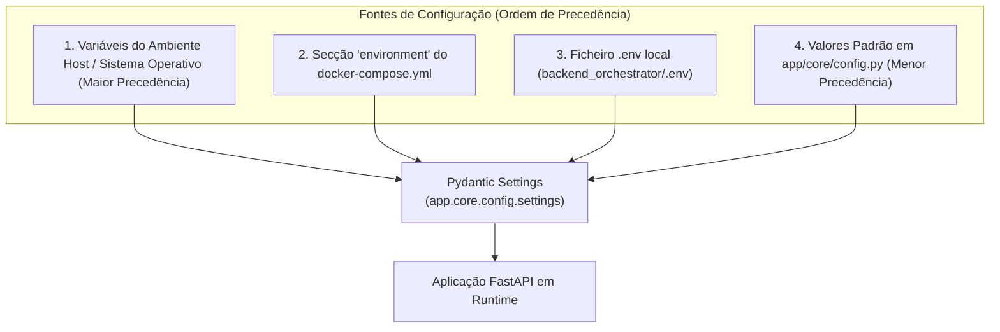

# Variáveis de Ambiente e Configuração
### *Sistema Pericial de Diagnóstico para Devoluções e Trocas no Retalho*

---

## 1. Visão Geral

A configuração do sistema segue as diretrizes do **Twelve-Factor App**, isolando a configuração do código-fonte através de **variáveis de ambiente**.

No backend orquestrador FastAPI, a leitura, validação e tipagem estrita das configurações é assegurada pela biblioteca **Pydantic Settings** através da classe [`Settings`](../../backend_orchestrator/app/core/config.py#L14) em [`backend_orchestrator/app/core/config.py`](../../backend_orchestrator/app/core/config.py). No micro-serviço SWI-Prolog, o ponto de entrada [`src/main.pl`](../../prolog_engine/src/main.pl) lê diretamente as variáveis do sistema operativo através de `getenv/2`.



---

## 2. Variáveis do Micro-serviço SWI-Prolog (`prolog_engine`)

| Variável | Tipo | Valor por Defeito | Obrigatória | Descrição |
|:---|:---|:---|:---:|:---|
| `PORT` | Inteiro | `8080` | Não | Porta TCP na qual o daemon HTTP do SWI-Prolog escuta e processa pedidos. |

* **Como é lida no código Prolog ([`src/main.pl`](../../prolog_engine/src/main.pl)):**
  ```prolog
  (   getenv('PORT', PortAtom),
      atom_number(PortAtom, Port)
  ->  true
  ;   Port = 8080
  )
  ```

---

## 3. Variáveis do Backend Orquestrador (`backend_orchestrator`)

Ficheiro de definição: [`backend_orchestrator/app/core/config.py`](../../backend_orchestrator/app/core/config.py)  
Ficheiro modelo: [`backend_orchestrator/.env.example`](../../backend_orchestrator/.env.example)

| Variável | Tipo | Valor Padrão (Local) | Valor no Docker Compose | Descrição Detalhada |
|:---|:---|:---|:---|:---|
| `PROJECT_NAME` | `string` | `"Retail Returns & Exchanges Diagnostic Orchestrator"` | *(Herda default)* | Nome identificador do serviço utilizado nos metadados OpenAPI e logs. |
| `API_V1_STR` | `string` | `"/api/v1"` | *(Herda default)* | Prefixo canónico de rota para todos os endpoints da versão 1 da API. |
| `DEBUG` | `boolean` | `true` | `true` | Ativa o modo de depuração, recarregamento a quente (*auto-reload*) e logs verbosos. |
| `PORT` | `integer` | `8000` | `8000` | Porta TCP onde o servidor ASGI Uvicorn escuta conexões. |
| `PROLOG_ENGINE_URL` | `string` | `"http://localhost:8080"` | `"http://prolog-engine:8080"` | URL base para contactar a API HTTP interna do micro-serviço SWI-Prolog. |
| `PROLOG_TIMEOUT_SECONDS` | `float` | `5.0` | `5.0` | Tempo limite máximo de espera (em segundos) para respostas do motor Prolog antes de disparar `HTTP 503`. |
| `CORS_ORIGINS` | `list[str]` | `["http://localhost:3000", ...]` | `["http://localhost:3000", "http://localhost:5173", "http://localhost:8000"]` | Lista de origens autorizadas pelo middleware CORS. Suporta formato JSON string ou strings separadas por vírgula. |

---

## 4. Tratamento Especial de Variáveis (CORS Parser)

A variável `CORS_ORIGINS` possui um validador personalizado (`@field_validator`) em [`config.py`](../../backend_orchestrator/app/core/config.py#L36) que suporta dois formatos de injeção em ambiente produtivo ou Docker:

1. **Formato JSON Array (Recomendado):**
   ```bash
   CORS_ORIGINS='["http://localhost:3000","http://frontend.retalho.meia:80"]'
   ```
2. **Formato CSV (Valores separados por vírgula):**
   ```bash
   CORS_ORIGINS="http://localhost:3000,http://frontend.retalho.meia:80"
   ```

---

## 5. Diferença entre Ambiente Local e Ambiente Docker

O valor da variável `PROLOG_ENGINE_URL` é a principal diferença de configuração entre correr o projeto diretamente na máquina (*bare-metal*) ou via contentores:

* **Em Execução Local (sem Docker):**
  Ambos os serviços correm no anfitrião. O orquestrador acede ao Prolog através de:
  ```ini
  PROLOG_ENGINE_URL="http://localhost:8080"
  ```

* **Em Execução via Docker Compose:**
  Cada serviço corre no seu próprio contentor com endereço IP isolado. O Docker Compose injeta a variável no contentor do orquestrador para apontar para o nome DNS do contentor vizinho:
  ```yaml
  environment:
    - PROLOG_ENGINE_URL=http://prolog-engine:8080
  ```

---

## 6. Criação de Ficheiro Local `.env`

Para personalizar parâmetros em desenvolvimento local sem alterar o código, copie o ficheiro de exemplo:

```bash
# A partir da pasta backend_orchestrator
cp .env.example .env
```

Conteúdo de [`backend_orchestrator/.env.example`](../../backend_orchestrator/.env.example):
```ini
PROJECT_NAME="Retail Returns & Exchanges Diagnostic Orchestrator"
API_V1_STR="/api/v1"
DEBUG=true
PORT=8000
PROLOG_ENGINE_URL="http://localhost:8080"
PROLOG_TIMEOUT_SECONDS=5.0
CORS_ORIGINS=["http://localhost:3000","http://localhost:5173","http://localhost:8000"]
```

> [!CAUTION]
> Ficheiros `.env` reais estão explicitamente excluídos pelo [.gitignore](../../.gitignore) e [.dockerignore](../../backend_orchestrator/.dockerignore) para evitar a fuga acidental de credenciais sensíveis.

---

## 7. Documentos Relacionados

* [Orquestração com Docker Compose](docker_compose.md) — Onde os valores em contentor são formalmente injetados.
* [Contentorização e Imagens Docker](docker.md) — Exposição de portas e variáveis padrão de runtime.
* [Resolução de Problemas (Troubleshooting)](troubleshooting.md) — Como diagnosticar timeouts de rede e URLs incorretos.
* [Arquitetura do Orquestrador](../architecture/fastapi_orchestrator.md) — Implementação de `Settings` e ciclo de vida.
