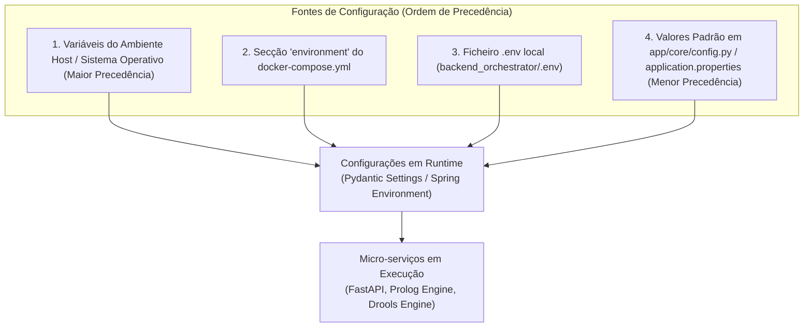

# Variáveis de Ambiente e Configuração
### *Sistema Pericial de Diagnóstico para Devoluções e Trocas no Retalho*

---

## 1. Visão Geral

A configuração do sistema segue as diretrizes do **Twelve-Factor App**, isolando a configuração do código-fonte através de **variáveis de ambiente**.

* **Backend Orquestrador FastAPI:** A leitura, validação e tipagem estrita das configurações é assegurada pela biblioteca **Pydantic Settings** através da classe [`Settings`](../../backend_orchestrator/app/core/config.py#L14) em [`backend_orchestrator/app/core/config.py`](../../backend_orchestrator/app/core/config.py).
* **Micro-serviço SWI-Prolog:** O ponto de entrada [`src/main.pl`](../../prolog_engine/src/main.pl) lê diretamente as variáveis do sistema operativo através de `getenv/2`.
* **Micro-serviço Drools Engine:** A parametrização assenta nas propriedades externalizadas do **Spring Boot 3** definidas em [`application.properties`](../../drools_engine/src/main/resources/application.properties), com suporte a sobrescrita via variáveis de ambiente de contentor e argumentos de runtime da JVM (`JAVA_OPTS`).



---

## 2. Variáveis do Micro-serviço SWI-Prolog (`prolog_engine`)

| Variável | Tipo | Valor por Defeito | Obrigatória | Descrição |
|:---|:---|:---|:---:|:---|
| `PORT` | Inteiro | `8080` | Não | Porta TCP na qual o daemon HTTP do SWI-Prolog escuta e processa pedidos. |

* **Como é lida no código Prolog ([`src/main.pl`](../../prolog_engine/src/main.pl)):**
  ```prolog
  (   getenv('PORT', PortAtom),
      atom_number(PortAtom, Port)
  ->  true
  ;   Port = 8080
  )
  ```

---

## 3. Variáveis e Propriedades do Micro-serviço Drools Engine (`drools_engine`)

Ficheiro de configuração base: [`drools_engine/src/main/resources/application.properties`](../../drools_engine/src/main/resources/application.properties)

| Propriedade / Variável | Tipo | Valor Padrão | Obrigatória | Descrição Detalhada |
|:---|:---|:---|:---:|:---|
| `server.port` | Inteiro | `8080` | Não | Porta TCP interna na qual o servidor Tomcat embutido do Spring Boot escuta pedidos HTTP. |
| `spring.application.name` | `string` | `"drools-engine"` | Não | Nome identificador da aplicação no contexto Spring Boot. |
| `logging.level.com.expert.drools` | `string` | `DEBUG` | Não | Nível de detalhe dos registos da camada aplicacional Drools (controladores, serviços de inferência). |
| `logging.level.org.drools` | `string` | `INFO` | Não | Nível de detalhe dos registos internos do motor de inferência Apache KIE Drools. |
| `spring.jackson.deserialization.fail-on-unknown-properties` | `boolean` | `false` | Não | Tolerância a campos desconhecidos no payload JSON de entrada sem emissão de erro. |
| `spring.jackson.serialization.indent-output` | `boolean` | `true` | Não | Ativação de formatação estruturada com indentação (*pretty-print*) nas respostas JSON serializadas. |
| `JAVA_OPTS` | `string` | `"-XX:+UseContainerSupport -XX:MaxRAMPercentage=75.0"` | Não | Opções da JVM passadas no Dockerfile para deteção de quotas de contentor e gestão dinâmica de memória heap. |

* **Sobrescrita de Configurações no Spring Boot:**
  O Spring Boot converte automaticamente variáveis de ambiente do sistema em propriedades aplicacionais. Por exemplo, a variável `SERVER_PORT=8080` ou `LOGGING_LEVEL_ORG_DROOLS=DEBUG` pode ser injetada no contentor Docker sem necessidade de alterar o ficheiro `application.properties`.

---

## 4. Variáveis do Backend Orquestrador (`backend_orchestrator`)

Ficheiro de definição: [`backend_orchestrator/app/core/config.py`](../../backend_orchestrator/app/core/config.py)  
Ficheiro modelo: [`backend_orchestrator/.env.example`](../../backend_orchestrator/.env.example)

| Variável | Tipo | Valor Padrão (Local) | Valor no Docker Compose | Descrição Detalhada |
|:---|:---|:---|:---|:---|
| `PROJECT_NAME` | `string` | `"Retail Returns & Exchanges Diagnostic Orchestrator"` | *(Herda default)* | Nome identificador do serviço utilizado nos metadados OpenAPI e logs. |
| `API_V1_STR` | `string` | `"/api/v1"` | *(Herda default)* | Prefixo canónico de rota para todos os endpoints da versão 1 da API. |
| `DEBUG` | `boolean` | `true` | `true` | Ativa o modo de depuração, recarregamento a quente (*auto-reload*) e logs verbosos. |
| `PORT` | `integer` | `8000` | `8000` | Porta TCP onde o servidor ASGI Uvicorn escuta conexões. |
| `PROLOG_ENGINE_URL` | `string` | `"http://localhost:8080"` | `"http://prolog-engine:8080"` | URL base para contactar a API HTTP interna do micro-serviço SWI-Prolog. |
| `PROLOG_TIMEOUT_SECONDS` | `float` | `5.0` | `5.0` | Tempo limite máximo de espera (em segundos) para respostas do motor Prolog antes de disparar `HTTP 503`. |
| `DROOLS_ENGINE_URL` | `string` | `"http://localhost:8082"` | `"http://drools-engine:8080"` | URL base para contactar a API HTTP interna do micro-serviço Drools Engine (Java 21 / Spring Boot 3). |
| `DROOLS_TIMEOUT_SECONDS` | `float` | `5.0` | `5.0` | Tempo limite máximo de espera (em segundos) para respostas do motor Drools antes de disparar `HTTP 503`. |
| `CORS_ORIGINS` | `list[str]` | `["http://localhost:3000", ...]` | `["http://localhost:3000", "http://localhost:5173", "http://localhost:8000"]` | Lista de origens autorizadas pelo middleware CORS. Suporta formato JSON string ou strings separadas por vírgula. |
| `INFERENCE_ENGINE_ENABLED` | `boolean` | `true` | `true` | Ativação/desativação funcional (*feature toggle*) do **motor de inferência de exemplo dos professores (`sp_exp2.pl` do Moodle)** e dos respetivos endpoints REST `/api/v1/inference/*`. Permite isolar o motor de exemplo académico sem qualquer impacto no motor de regras do retalho (`/api/v1/evaluate`). |

### 4.1 Segmentação Funcional: Motor de Exemplo dos Professores vs. Motor de Retalho

A variável `INFERENCE_ENGINE_ENABLED` atua como um interruptor de isolamento estrito entre os dois subsistemas Prolog coexistentes no projeto:

* **Motor 1: Motor de Exemplo dos Professores (`sp_exp2.pl` do Moodle):**
  * **Origem:** Diretamente adaptado do material fornecido pelos docentes no Moodle:  
    `prolog_engine/Ficheiros de Apoio Sistemas Periciais_ sp_exp1.pl, sp_exp2.pl e base de conhecimento-20260928/` (`sp_exp2.pl` e `veiculos2.txt`).
  * **Objetivo:** Fornecer a implementação de referência académica do sistema pericial *forward-chaining* lecionado nas aulas, incluindo rastreamento causal de deduções, justificações How (`como/1`), justificações Why-Not (`porque_nao/1`) e base de conhecimento de teste de veículos (`vehicles.pl`).
  * **Endpoints expostos:** `/api/v1/inference/load`, `/api/v1/inference/run`, `/api/v1/inference/facts`, `/api/v1/inference/how`, `/api/v1/inference/whynot`, `/api/v1/inference/reset`.
  * **Controlo:** Quando `INFERENCE_ENGINE_ENABLED=false`, estes endpoints são completamente omitidos do FastAPI e da documentação OpenAPI/Swagger.

* **Motor 2: Motor Pericial do Domínio de Retalho (Devoluções e Trocas — Regras Dustin Hopper):**
  * **Origem:** Regras do domínio de negócio das devoluções e trocas a retalho (`prolog_engine/src/core/rules.pl`).
  * **Objetivo:** Avaliar a elegibilidade de devolução de produtos de vestuário e calçado (período de devolução, estado de etiquetas, recibo, higiene).
  * **Endpoints expostos:** `/api/v1/evaluate`.
  * **Estado Atual:** Atualmente opera como **Prova de Conceito (POC)** inicial. **O desenvolvimento aprofundado e completo deste motor fica reservado para fases posteriores do projeto.**
  * **Controlo:** Permanece sempre ativo independentemente do valor de `INFERENCE_ENGINE_ENABLED`.

---

## 5. Tratamento Especial de Variáveis (CORS Parser)

A variável `CORS_ORIGINS` possui um validador personalizado (`@field_validator`) em [`config.py`](../../backend_orchestrator/app/core/config.py#L39) que suporta dois formatos de injeção em ambiente produtivo ou Docker:

1. **Formato JSON Array (Recomendado):**
   ```bash
   CORS_ORIGINS='["http://localhost:3000","http://frontend.retalho.meia:80"]'
   ```
2. **Formato CSV (Valores separados por vírgula):**
   ```bash
   CORS_ORIGINS="http://localhost:3000,http://frontend.retalho.meia:80"
   ```

---

## 6. Diferença entre Ambiente Local e Ambiente Docker

Os URLs dos motores de inferência (`PROLOG_ENGINE_URL` e `DROOLS_ENGINE_URL`) constituem a principal diferença de configuração entre correr o projeto diretamente na máquina (*bare-metal*) ou através do Docker Compose:

* **Em Execução Local (sem Docker):**
  Todos os serviços executam no anfitrião (*host*). O orquestrador acede a cada motor através das portas do host:
  ```ini
  PROLOG_ENGINE_URL="http://localhost:8080"
  DROOLS_ENGINE_URL="http://localhost:8082"
  ```

* **Em Execução via Docker Compose:**
  Cada micro-serviço corre no seu próprio contentor isolado na rede bridge `retail-network`. O Docker Compose injeta as variáveis no contentor do orquestrador apontando diretamente para os nomes de serviço DNS internos:
  ```yaml
  environment:
    - PROLOG_ENGINE_URL=http://prolog-engine:8080
    - DROOLS_ENGINE_URL=http://drools-engine:8080
  ```

---

## 7. Criação de Ficheiro Local `.env`

Para personalizar parâmetros em desenvolvimento local sem alterar o código, copie o ficheiro de exemplo:

```bash
# A partir da pasta backend_orchestrator
cp .env.example .env
```

Conteúdo de [`backend_orchestrator/.env.example`](../../backend_orchestrator/.env.example):
```ini
PROJECT_NAME="Retail Returns & Exchanges Diagnostic Orchestrator"
API_V1_STR="/api/v1"
DEBUG=true
PORT=8000
PROLOG_ENGINE_URL="http://localhost:8080"
PROLOG_TIMEOUT_SECONDS=5.0
DROOLS_ENGINE_URL="http://localhost:8082"
DROOLS_TIMEOUT_SECONDS=5.0
CORS_ORIGINS=["http://localhost:3000","http://localhost:5173","http://localhost:8000"]
# Feature toggle para o motor de inferência de exemplo dos professores (sp_exp2.pl do Moodle / endpoints /api/v1/inference/*)
INFERENCE_ENGINE_ENABLED=true
```

> [!CAUTION]
> Ficheiros `.env` reais estão explicitamente excluídos pelo [.gitignore](../../.gitignore) e [.dockerignore](../../backend_orchestrator/.dockerignore) para evitar a fuga acidental de credenciais sensíveis.

---

## 8. Documentos Relacionados

* [Orquestração com Docker Compose](docker_compose.md) — Onde os valores em contentor são formalmente injetados.
* [Contentorização e Imagens Docker](docker.md) — Exposição de portas e variáveis padrão de runtime.
* [Resolução de Problemas (Troubleshooting)](troubleshooting.md) — Como diagnosticar timeouts de rede e URLs incorretos.
* [Arquitetura do Motor Drools](../architecture/drools_engine.md) — Implementação das regras e ciclo de vida do motor Drools.
* [API Interna do Motor Drools](../api/drools_engine_api.md) — Contratos e parâmetros suportados pela API REST do Drools.
* [Arquitetura do Orquestrador](../architecture/fastapi_orchestrator.md) — Implementação de `Settings` e ciclo de vida.
