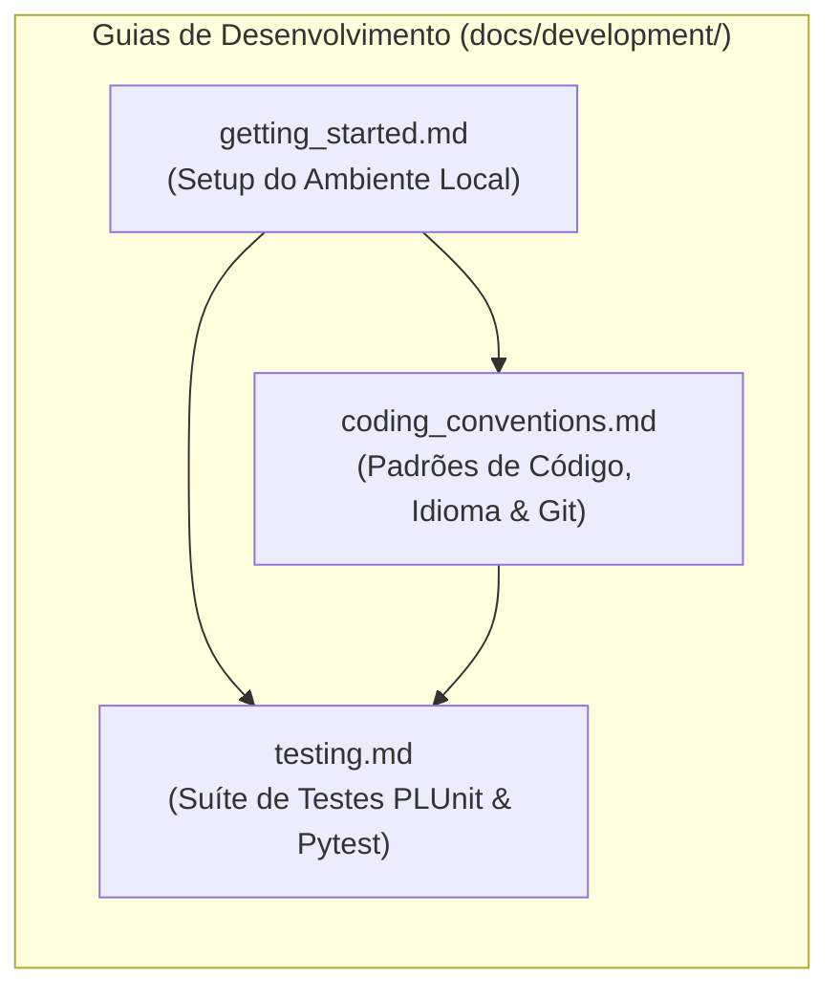

# Guias de Desenvolvimento e Engenharia
### *Sistema Pericial de Diagnóstico para Devoluções e Trocas no Retalho — MEIA 2026/2027*

---

## 1. Visão Geral

Esta secção reúne toda a documentação orientada à equipa de engenharia de software e investigadores responsáveis pelo desenvolvimento, manutenção, expansão e teste do ecossistema **Retail Returns & Exchanges Diagnostic Expert System**.

O projeto conjuga dois mundos tecnológicos distintos — a programação em lógica dedutiva com **SWI-Prolog** e a orquestração assíncrona orientada a serviços com **Python / FastAPI**. Esta secção fornece as instruções e padrões necessários para trabalhar em ambos com rigor, consistência e produtividade.



---

## 2. Índice de Documentos da Secção

| Documento | Ficheiro | Descrição e Propósito |
|:---|:---|:---|
| **Guia de Primeiros Passos** | [`getting_started.md`](getting_started.md) | Instruções passo-a-passo para clonar o repositório, configurar o ambiente virtual Python, arrancar os serviços localmente (nativos ou com Docker Compose) e validar o funcionamento inicial (*smoke test*). |
| **Estratégia e Execução de Testes** | [`testing.md`](testing.md) | Arquitetura de testes do sistema (65 testes automatizados com 100% de sucesso), detalhe dos testes PLUnit em Prolog, suíte Pytest com `ASGITransport` em FastAPI e comandos práticos de execução. |
| **Convenções de Código e Boas Práticas** | [`coding_conventions.md`](coding_conventions.md) | Regra de ouro arquitetural (separação estrita orquestrador ≠ regras de negócio), padrões de idioma (código em inglês, documentação em pt-PT), estrutura de módulos Prolog, tipagem Pydantic v2 e padrões Git. |

---

## 3. Comandos Rápidos de Desenvolvimento

### 3.1 Arranque Local Rápido (Dois Terminais)

```bash
# Terminal 1 — Iniciar o Motor SWI-Prolog (Porta 8080)
cd prolog_engine
swipl src/main.pl

# Terminal 2 — Iniciar o Backend FastAPI com Hot Reload (Porta 8000)
# No Windows (PowerShell):
.\.venv\Scripts\Activate.ps1
python -m uvicorn app.main:app --app-dir backend_orchestrator --reload --port 8000

# No Linux / macOS (Bash):
source .venv/bin/activate
uvicorn app.main:app --app-dir backend_orchestrator --reload --port 8000
```

### 3.2 Executar Todos os Testes Automatizados

```bash
# Testes do Motor Prolog (12 testes: 7 unitários + 5 integração)
swipl -g "run_tests, halt" -s prolog_engine/tests/test_rules.pl
swipl -g "run_tests, halt" -s prolog_engine/tests/test_api.pl

# Testes do Backend Orquestrador (53 testes automatizados Pytest)
# No Windows (PowerShell):
.\.venv\Scripts\pytest backend_orchestrator/tests -v

# No Linux / macOS (Bash):
pytest backend_orchestrator/tests -v
```

---

## 4. Matriz de Ferramentas de Desenvolvimento

| Domínio | Ferramenta / Biblioteca | Finalidade Principal |
|:---|:---|:---|
| **Motor Lógico** | SWI-Prolog 9.x/10.x | Interpretador e daemon HTTP de inferência dedutiva. |
| **Testes Prolog** | `library(plunit)` | Framework nativo de testes unitários e de integração. |
| **Backend Web** | FastAPI + Uvicorn | Framework assíncrono REST e servidor ASGI. |
| **Modelagem de Dados** | Pydantic v2 & `pydantic-settings` | DTOs tipados, validação de regras de sintaxe e `.env`. |
| **Cliente HTTP** | HTTPX (`AsyncClient`) | Comunicação assíncrona resiliente com os motores lógicos. |
| **Testes Python** | Pytest, Pytest-Asyncio, Pytest-Mock | Testes assíncronos e mocks de transporte ASGI em memória. |
| **Type Checking** | Pyright / Pylance | Análise estática de tipos conforme [`pyrightconfig.json`](../../pyrightconfig.json). |

---

## 5. Referências Cruzadas

* [Visão Geral da Arquitetura](../architecture/README.md) — Estrutura e interação entre serviços do ecossistema.
* [Deploy e Operações](../deployment/README.md) — Guias de Dockerfiles, Docker Compose e resolução de problemas operacionais.
* [Referência de APIs](../api/README.md) — Contratos REST, esquemas de entrada/saída e endpoints OpenAPI.
* [Domínio de Negócio e Conhecimento](../domain/README.md) — Contexto de devoluções no retalho e heurísticas do perito humano.
