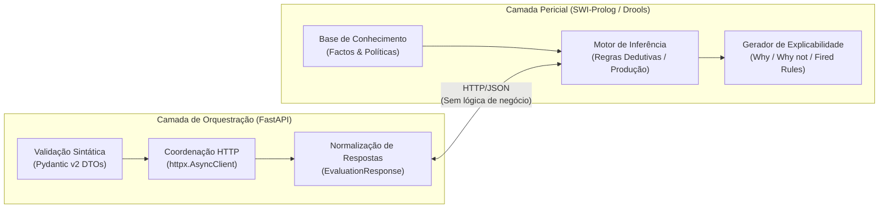

# Convenções de Código, Idioma e Boas Práticas
### *Sistema Pericial de Diagnóstico para Devoluções e Trocas no Retalho — MEIA 2026/2027*

---

## 1. Visão Geral

Este documento define os padrões de engenharia de software, convenções de estilo, organização modular e regras de colaboração adotadas no desenvolvimento do **Retail Returns & Exchanges Diagnostic Expert System**.

A adesão a estas diretrizes garante a manutenibilidade a longo prazo, legibilidade uniforme entre equipas e alinhamento com os objetivos académicos do Mestrado em Engenharia de Inteligência Artificial (MEIA).

---

## 2. A Regra de Ouro da Arquitetura

> [!IMPORTANT]
> **Separação Estrita de Responsabilidades (Orquestrador ≠ Regras de Negócio):**
> O backend orquestrador FastAPI **NUNCA** implementa regras de negócio, limites de prazo de devolução, cálculos de elegibilidade ou tomadas de decisão pericial.
> 
> * **Backend Orquestrador (FastAPI):** Valida esquemas sintáticos (Pydantic), coordena a comunicação assíncrona HTTP com os motores de inferência e agrega respostas canónicas.
> * **Motores Periciais (SWI-Prolog / Drools):** Detêm a custódia exclusiva das bases de conhecimento, predicados de inferência dedutiva e cadeias de explicabilidade (*Why / Why not*).



---

## 3. Convenções de Idioma

Para garantir a coerência internacional do código e a conformidade académica dos relatórios, adota-se uma divisão estrita de idiomas:

| Elemento | Idioma Adotado | Justificação & Exemplos |
|:---|:---:|:---|
| **Código-Fonte (Python / Prolog / Java)** | **Inglês** | Variáveis, funções, predicados, classes (`ScenarioInput`, `evaluate_scenario/3`, `EvidencesRequestDto`). |
| **Docstrings e Comentários Técnicos** | **Inglês** | Documentação inline no código-fonte para ferramentas de linting, IDEs e Javadoc. |
| **Documentação Técnica & Manuais** | **Português (pt-PT)** | Manuais em `docs/`, guias operacionais, relatórios académicos e READMEs. |
| **Diagramas Mermaid (Labels)** | **Português (pt-PT)** | Diagramas arquiteturais e de sequência orientados à leitura da equipa/docência. |
| **Mensagens de Commit (Git)** | **Inglês** | Histórico uniforme do repositório (`feat: add drools engine microservice`). |
| **Contratos de API (JSON Keys & Values)** | **Inglês** | Chaves e valores de APIs REST (`{"status": "success", "decision": "approved"}`). |

---

## 4. Padrões de Código para SWI-Prolog (`prolog_engine/`)

### 4.1 Estrutura Modular Estrita

Todo o ficheiro Prolog deve ser um módulo formalmente declarado, explicitando apenas os predicados públicos através do cabeçalho `:- module(nome, [exportados])`:

```prolog
:- module(rules, [
    evaluate_scenario/3
]).

/** <module> Retail Rules Inference Engine
 *
 * Implements deductive reasoning rules and explainability chains
 * for retail return scenarios.
 */
```

### 4.2 Clean Architecture: Transporte vs. Domínio

* **Camada de Transporte (`src/api/`):** Os módulos [`server.pl`](../../prolog_engine/src/api/server.pl) e [`routes.pl`](../../prolog_engine/src/api/routes.pl) tratam apenas de arranque do daemon HTTP, parsing de JSON e serialização de respostas HTTP.
* **Camada de Domínio (`src/core/`):** O módulo [`rules.pl`](../../prolog_engine/src/core/rules.pl) opera de forma puramente lógica sobre Dicionários Prolog (`Dicts`), sem dependência de bibliotecas web ou sockets.

### 4.3 Utilização de Prolog Dicts como DTOs Internos

Os dados de entrada e saída devem utilizar **Prolog Dictionaries** (`_{chave: Valor}`) para tipagem chave-valor expressiva e manipulação ergonómica:

```prolog
% Acesso idiomático a campos de um dicionário Prolog
evaluate_scenario(Input, Decision, Explanations) :-
    is_dict(Input),
    get_dict(value, Input, Value),
    Value =:= 42,
    !,
    Decision = approved,
    Explanations = ["Value is 42", "Dummy rule matched"].
```

### 4.4 Determinismo e Explicabilidade

1. **Uso de Cut (`!`):** Quando uma regra pericial atinge uma conclusão definitiva e inequívoca, utilize o corte (`!`) para evitar *backtracking* espúrio que geraria respostas ambíguas.
2. **Explicabilidade Obrigatória:** Todo o predicado de avaliação deve unificar uma lista de strings (`Explanations`) fundamentando os factos verificados (*Why*) ou as falhas de política detetadas (*Why not*).

---

## 5. Padrões de Código para Python & FastAPI (`backend_orchestrator/`)

### 5.1 Tipagem Estática Completa (Type Hints)

Todo o código Python deve utilizar anotações de tipo estritas compatíveis com Python 3.11+ e `from __future__ import annotations`:

* Todas as funções e métodos devem declarar tipos para argumentos e retorno (`-> None`, `-> EvaluationResponse`, etc.).
* Utilize `typing.Optional`, `typing.List`, `typing.Dict` ou os equivalentes modernos nativos (`list[str]`, `dict[str, Any]`, `X | None`).

### 5.2 Modelos de Dados Pydantic v2

Os DTOs (*Data Transfer Objects*) devem ser implementados como subclasses de `pydantic.BaseModel`:

* Utilize `Field(...)` com metadados descritivos, exemplos e restrições numéricas (`ge=0`, `gt=0`).
* Utilize enumerações tipadas (`StrEnum` ou `Enum` com herança de `str`) para campos categóricos finitos como `decision` e `engine`.
* Nunca aceda diretamente a `__dict__`; utilize `model_dump()` ou `model_dump_json()`.

```python
from enum import Enum
from pydantic import BaseModel, Field

class DecisionEnum(str, Enum):
    APPROVED = "approved"
    REJECTED = "rejected"
    PENDING = "pending"
    ERROR = "error"

class ScenarioInput(BaseModel):
    scenario: str = Field(..., min_length=1, description="Scenario identifier")
    value: int | float = Field(..., description="Numeric value to evaluate")

    model_config = {
        "json_schema_extra": {
            "example": {"scenario": "test", "value": 42}
        }
    }
```

### 5.3 Programação Assíncrona e Gestão de Recursos

* Todos os endpoints e chamadas de rede externas devem ser implementados com corrotinas assíncronas (`async def` e `await`).
* Nunca instancie clientes `httpx.Client` síncronos dentro de rotas assíncronas (bloquearia o *event loop*).
* O ciclo de vida do pool de ligações HTTP partilhado deve ser gerido centralmente pelo manipulador de contexto `lifespan` em [`app/main.py`](../../backend_orchestrator/app/main.py).

### 5.4 Injeção de Dependências com FastAPI

Para facilitar testes unitários com mocks, utilize a injeção nativa `fastapi.Depends`:

```python
@router.post("/evaluate", response_model=EvaluationResponse)
async def evaluate_scenario(
    payload: ScenarioInput,
    service: OrchestratorService = Depends(get_orchestrator_service),
) -> EvaluationResponse:
    return await service.evaluate(payload)
```

---

## 6. Padrões de Código para Java, Spring Boot e Drools (`drools_engine/`)

### 6.1 Separação Rigorosa: Factos de Domínio vs. DTOs de Transporte

* **Factos de Domínio (`models/`):** As classes [`Evidences.java`](../../drools_engine/src/main/java/com/expert/drools/models/Evidences.java), [`Hypothesis.java`](../../drools_engine/src/main/java/com/expert/drools/models/Hypothesis.java) e [`Conclusion.java`](../../drools_engine/src/main/java/com/expert/drools/models/Conclusion.java) representam exclusivamente factos inseridos e manipulados na *Working Memory* do Drools. Nunca devem ser expostas diretamente como modelos de pedido ou resposta da API REST.
* **DTOs de Transporte (`dtos/`):** As classes [`EvidencesRequestDto.java`](../../drools_engine/src/main/java/com/expert/drools/dtos/EvidencesRequestDto.java) e [`EvaluationResponseDto.java`](../../drools_engine/src/main/java/com/expert/drools/dtos/EvaluationResponseDto.java) definem os contratos JSON da API. O método de conversão `toDomain()` em `EvidencesRequestDto` é responsável por sanitizar e normalizar valores antes da inserção na sessão Drools.

### 6.2 Utilização do Project Lombok

Para minimizar código boilerplate mantendo a integridade orientada a objetos:
* Utilize anotações Lombok nos modelos e DTOs: `@Data`, `@Builder`, `@NoArgsConstructor`, `@AllArgsConstructor`.
* Para injeção de dependências imutável em controllers e services, utilize `@RequiredArgsConstructor` sobre campos declarados como `private final`.

### 6.3 Bean Validation Declarativa

Todos os DTOs de entrada devem aplicar validação declarativa com anotações padrão Jakarta:
* Validação de restrição de domínio clínico: `@Pattern(regexp = "yes|no", message = "Field must be 'yes' or 'no'")`.
* Validação obrigatória nos controladores REST com `@Valid` antes do processamento:
  ```java
  @PostMapping("/evaluate")
  public ResponseEntity<EvaluationResponseDto> evaluate(
          @Valid @RequestBody EvidencesRequestDto requestDto) { ... }
  ```

### 6.4 Convenções de Regras DRL (`haemorrhage_rules.drl`)

* **Nomeação das Regras:** Nomes descritivos em snake_case prefixados por identificador de ordenação (ex.: `r1_upper_type`, `r3_otorrhagia_ear_ache`, `r13_fallback_unknown`).
* **Controlo de Salience:** Utilização explícita do atributo `salience` para governar a precedência de disparo na agenda de execução Rete (classificadores preliminares com prioridade superior a diagnósticos terminais, e regras de fallback com menor prioridade).
* **Metadados:** Anotação semântica com `@category("diagnostic")` ou `@category("classification")`.
* **Explicabilidade:** Registo obrigatório de cada regra disparada na lista de rastreabilidade (`firedRules`) através de listeners de agenda.

### 6.5 Gestão de Recursos da KieSession

* As instâncias de `KieSession` devem ser criadas por pedido e libertadas deterministicamente num bloco `finally`:
  ```java
  KieSession kieSession = kieContainer.newKieSession();
  try {
      // Inserção de factos e disparo de regras
      kieSession.fireAllRules();
  } finally {
      kieSession.dispose();
  }
  ```

---

## 7. Configuração de Type Checking e Análise Estática

O projeto disponibiliza um ficheiro de configuração para o motor de tipagem estática **Pyright** / **Pylance** na raiz do repositório:

[`pyrightconfig.json`](../../pyrightconfig.json):
```json
{
  "venvPath": ".",
  "venv": ".venv",
  "extraPaths": [
    "backend_orchestrator"
  ]
}
```

Esta configuração assegura que:
1. O analisador estático do VS Code / IDE utiliza o interpretador Python do ambiente virtual `.venv`.
2. A diretoria `backend_orchestrator` é tratada como raiz de módulos adicionais, permitindo importações como `from app.schemas...` sem avisos falsos de módulos não encontrados.

---

## 8. Convenções de Controlo de Versões (Git)

### 8.1 Mensagens de Commit (Conventional Commits)

Os commits no repositório devem seguir a especificação [Conventional Commits](https://www.conventionalcommits.org/):

```text
<tipo>(<âmbito opcional>): <descrição no imperativo em inglês>

[corpo opcional explicativo]
```

**Prefixos Padronizados:**
- `feat`: Adição de nova funcionalidade (ex: novo endpoint ou regra pericial).
- `fix`: Correção de um bug ou tratamento de exceção.
- `docs`: Criação ou atualização de documentação técnica ou READMEs.
- `test`: Adição ou refatoração de testes unitários ou de integração.
- `refactor`: Alteração de código que não adiciona funcionalidades nem corrige bugs.
- `chore`: Atualização de configurações de build, dependências ou ficheiros `.gitignore`.

**Exemplos Práticos:**
- `feat(orchestrator): implement async prolog client with connection pooling`
- `feat(drools): implement haemorrhage rules and kiecontainer service`
- `fix(prolog): handle malformed json payloads with 400 bad request`
- `docs(development): add testing strategy and coverage matrix`
- `test(drools): add unit tests for clinical haemorrhage rules`

### 8.2 Regras de Exclusão do Git (`.gitignore`)

O ficheiro [`.gitignore`](../../.gitignore) na raiz do repositório previne a inclusão involuntária de artefactos transitórios:
- **Ambientes Virtuais & Python:** `.venv/`, `__pycache__/`, `*.pyc`, `.pytest_cache/`.
- **Ficheiros SWI-Prolog:** `*.qlf`, `prolog.dump`.
- **Artefactos Java & Maven:** `target/`, `*.class`, `*.jar`, `.m2/`.
- **Configurações Pessoais & IDEs:** `.vscode/` (exceto ficheiros partilhados), `.idea/`, `*.iml`, `.DS_Store`, `Thumbs.db`.
- **Segredos & Credenciais:** Ficheiros `.env`, `.env.local`, certificados e chaves privadas.

---

## 9. Referências Cruzadas

* [Guia de Primeiros Passos](getting_started.md) — Configuração e execução local dos serviços.
* [Estratégia e Execução de Testes](testing.md) — Como escrever e executar testes alinhados com estas convenções.
* [Arquitetura do Orquestrador](../architecture/fastapi_orchestrator.md) — Camadas e componentes do serviço Python.
* [Arquitetura do Motor Prolog](../architecture/prolog_engine.md) — Padrão Clean Architecture no micro-serviço SWI-Prolog.
* [Arquitetura do Motor Drools](../architecture/drools_engine.md) — Camadas, DTOs e regras de produção em Java.
* [Referência de Esquemas e Contratos](../api/schemas.md) — Especificação detalhada dos modelos Pydantic e DTOs Java.
