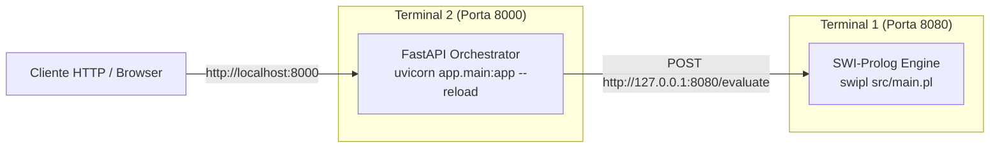

# Guia de Primeiros Passos e Ambiente de Desenvolvimento
### *Sistema Pericial de Diagnóstico para Devoluções e Trocas no Retalho — MEIA 2026/2027*

---

## 1. Visão Geral

Este documento orienta novos programadores e investigadores no processo de configuração do ambiente de desenvolvimento local para o projeto **Retail Returns & Exchanges Diagnostic Expert System**.

O sistema pode ser executado em dois modos complementares:
1. **Modo Local Nativo:** Execução direta dos processos SWI-Prolog e FastAPI na máquina anfitriã, ideal para iteração rápida no código-fonte, desenvolvimento de regras e depuração interativa.
2. **Modo Contentorizado (Docker Compose):** Orquestração completa dos serviços em contentores isolados interligados por rede interna privada, ideal para validação integrada e reprodução exata do ambiente de produção.

Para aprofundar a orquestração contentorizada, consulte [Orquestração com Docker Compose](../deployment/docker_compose.md).

---

## 2. Pré-requisitos de Sistema

Antes de iniciar a configuração, certifique-se de que dispõe das seguintes ferramentas instaladas e operacionais no seu sistema operativo (Windows, Linux ou macOS):

| Ferramenta | Versão Mínima | Finalidade | Verificação de Instalação |
|:---|:---:|:---|:---|
| **Git** | 2.30+ | Controlo de versões e clonagem do repositório | `git --version` |
| **Python** | 3.11+ *(suporta 3.9+)* | Runtime do backend orquestrador FastAPI | `python --version` |
| **SWI-Prolog** | 9.x ou 10.x (64-bit) | Interpretador do motor de inferência dedutiva | `swipl --version` |
| **Docker Desktop** *(Opcional)* | 24.0+ | Contentorização e execução via Docker Compose | `docker --version` |
| **Docker Compose** *(Opcional)* | v2.20+ | Orquestração multi-contentor dos micro-serviços | `docker compose version` |

> [!NOTE]
> No Windows, certifique-se de que o executável `swipl.exe` se encontra adicionado à variável de ambiente `PATH` do sistema durante a instalação do SWI-Prolog.

---

## 3. Obtenção do Código-Fonte

Clone o repositório Git para a sua máquina local e aceda à pasta raiz do projeto:

```bash
# Clonar o repositório
git clone https://github.com/Santiago-1211173/meia-equipa3-challenge1-26_27.git

# Aceder à diretoria do projeto
cd meia-equipa3-challenge1-26_27
```

A estrutura de alto nível do repositório organiza-se da seguinte forma:

```text
meia-equipa3-challenge1-26_27/
├── backend_orchestrator/ # Serviço FastAPI (Python)
├── prolog_engine/ # Serviço de Inferência (SWI-Prolog)
├── docs/ # Documentação técnica e arquitetural
├── docker-compose.yml # Definição multi-serviço Docker Compose
├── pyrightconfig.json # Configuração de type checking Pyright
└── README.md # Visão geral do repositório
```

---

## 4. Configuração do Ambiente Python (Backend Orquestrador)

O backend orquestrador utiliza dependências modernas de Python, incluindo FastAPI, Uvicorn, Pydantic v2 e HTTPX. Recomenda-se vivamente o isolamento das dependências através de um ambiente virtual (`.venv`).

### 4.1 Criação e Ativação do Ambiente Virtual

A partir da raiz do repositório:

**No Windows (PowerShell):**
```powershell
# 1. Criar o ambiente virtual na pasta .venv
python -m venv .venv

# 2. Ativar o ambiente virtual
.\.venv\Scripts\Activate.ps1
```

*(Se o PowerShell bloquear a execução de scripts, execute previamente `Set-ExecutionPolicy -Scope Process -ExecutionPolicy Bypass`).*

**No Linux / macOS (Bash / Zsh):**
```bash
# 1. Criar o ambiente virtual na pasta .venv
python3 -m venv .venv

# 2. Ativar o ambiente virtual
source .venv/bin/activate
```

### 4.2 Instalação das Dependências

Com o ambiente virtual ativo, instale as bibliotecas necessárias para execução e testes:

```bash
pip install --upgrade pip
pip install -r backend_orchestrator/requirements.txt
```

As principais bibliotecas instaladas incluem:
- `fastapi`: Framework web assíncrono de alto desempenho.
- `uvicorn[standard]`: Servidor ASGI para produção e desenvolvimento.
- `pydantic` & `pydantic-settings`: Validação robusta de esquemas de dados e gestão de definições.
- `httpx`: Cliente HTTP assíncrono para comunicação com o motor Prolog.
- `pytest`, `pytest-asyncio`, `pytest-mock`: Ferramentas para a suíte de testes automatizados.

### 4.3 Configuração de Variáveis de Ambiente

O backend orquestrador suporta parametrização via variáveis de ambiente com carregamento automático a partir de ficheiro `.env`. Copie o modelo de exemplo fornecido:

**No Windows (PowerShell):**
```powershell
Copy-Item "backend_orchestrator\.env.example" "backend_orchestrator\.env"
```

**No Linux / macOS (Bash):**
```bash
cp backend_orchestrator/.env.example backend_orchestrator/.env
```

O ficheiro `.env` pré-configura as portas padrão para desenvolvimento local na máquina anfitriã (`http://127.0.0.1:8080` para o Prolog). Para a lista completa de variáveis suportadas, consulte [Variáveis de Ambiente](../deployment/environment_variables.md).

---

## 5. Execução Local Passo-a-Passo (Sem Docker)

Para depurar e iterar rapidamente no código, os dois serviços podem ser executados lado a lado em dois terminais distintos.



### Passo 1: Iniciar o Motor SWI-Prolog (Terminal 1)

Abra o primeiro terminal, navegue para o diretório `prolog_engine` e inicie o servidor HTTP Prolog:

```bash
cd prolog_engine
swipl src/main.pl
```

Deverá observar a seguinte confirmação nos registos do terminal:

```text
[CONFIG] Loading environment configuration...
[CONFIG] Port: 8080
[SERVER] Initializing Prolog HTTP server daemon on port 8080...
[SERVER] Prolog HTTP server daemon successfully started on port 8080
[ROUTES] Registering POST handler for /evaluate
[MAIN] System initialization complete. Ready for queries.
```

O micro-serviço Prolog permanece ativo e à escuta de pedidos HTTP na porta `8080`.

### Passo 2: Iniciar o Backend Orquestrador FastAPI (Terminal 2)

Abra um segundo terminal, ative o ambiente virtual e execute o servidor ASGI Uvicorn em modo de recarregamento automático (`--reload`):

**Opção A — A partir da raiz do repositório:**
```powershell
# Ativar venv (se necessário)
.\.venv\Scripts\Activate.ps1

# Executar Uvicorn apontando para a diretoria da aplicação
python -m uvicorn app.main:app --app-dir backend_orchestrator --reload --host 127.0.0.1 --port 8000
```

**Opção B — A partir da pasta `backend_orchestrator`:**
```powershell
cd backend_orchestrator
uvicorn app.main:app --reload --host 127.0.0.1 --port 8000
```

Deverá observar a confirmação de arranque do Uvicorn e o registo do ciclo de vida (*lifespan*):

```text
INFO: Will watch for changes in 'backend_orchestrator'
INFO: Uvicorn running on http://127.0.0.1:8000 (Press CTRL+C to quit)
INFO: Started reloader process
INFO: Application startup complete.
```

---

## 6. Execução Alternativa com Docker Compose

Caso prefira não instalar o interpretador SWI-Prolog ou pretenda testar a integração exata dos contentores de rede, utilize o Docker Compose:

```bash
# Compilar e arrancar os dois contentores em background
docker compose up --build -d

# Visualizar o estado dos contentores
docker compose ps

# Acompanhar os registos unificados em tempo real
docker compose logs -f
```

Para instruções completas de operações e comandos de paragem, consulte [Orquestração com Docker Compose](../deployment/docker_compose.md).

---

## 7. Verificação e Validação do Sistema (Smoke Tests)

Com ambos os serviços em execução, execute os testes rápidos a seguir para validar a integridade da comunicação.

### 7.1 Teste de Diagnóstico e Saúde (Health Check)

Valide que o backend orquestrador está ativo e com ligação estabelecida ao motor Prolog:

**Via PowerShell:**
```powershell
Invoke-RestMethod -Uri "http://localhost:8000/health" -Method Get | ConvertTo-Json
```

**Via cURL (Bash):**
```bash
curl -X GET http://localhost:8000/health
```

**Resposta esperada (HTTP 200 OK):**
```json
{
  "status": "healthy",
  "prolog_engine": "connected",
  "timestamp": "2026-09-27T20:55:00.123456Z"
}
```

### 7.2 Teste de Avaliação Pericial (Cenário POC Aprovado)

Submeta um cenário de teste com valor `42` para validar o fluxo ponta-a-ponta de inferência e a cadeia de explicabilidade:

**Via PowerShell:**
```powershell
$payload = @{
    scenario = "test"
    value = 42
} | ConvertTo-Json

Invoke-RestMethod -Uri "http://localhost:8000/api/v1/evaluate" `
  -Method Post `
  -ContentType "application/json" `
  -Body $payload | ConvertTo-Json
```

**Via cURL (Bash):**
```bash
curl -X POST http://localhost:8000/api/v1/evaluate \
  -H "Content-Type: application/json" \
  -d '{"scenario": "test", "value": 42}'
```

**Resposta esperada (HTTP 200 OK):**
```json
{
  "status": "success",
  "decision": "approved",
  "justification": [
    "Value is 42",
    "Dummy rule matched"
  ],
  "engine": "prolog"
}
```

### 7.3 Acesso à Documentação Interativa OpenAPI

O FastAPI gera automaticamente interfaces gráficas interativas e esquemas OpenAPI baseados nos modelos Pydantic:

* **Swagger UI:** Aceda a [`http://localhost:8000/docs`](http://localhost:8000/docs) para explorar e disparar pedidos interativos.
* **ReDoc:** Aceda a [`http://localhost:8000/redoc`](http://localhost:8000/redoc) para leitura da documentação formal das APIs.
* **OpenAPI JSON:** Disponível em [`http://localhost:8000/openapi.json`](http://localhost:8000/openapi.json).

---

## 8. Resumo de URLs e Portas de Desenvolvimento

| Recurso | URL Local | Descrição |
|:---|:---|:---|
| **API Pública do Orquestrador** | `http://localhost:8000` | Ponto de entrada REST para o Frontend e clientes externos. |
| **Health Check Global** | `http://localhost:8000/health` | Diagnóstico de integridade e verificação de ping ao Prolog. |
| **Avaliação de Cenários** | `http://localhost:8000/api/v1/evaluate` | Endpoint principal de orquestração de inferência pericial. |
| **Swagger UI Interativo** | `http://localhost:8000/docs` | Interface gráfica OpenAPI para testes no navegador. |
| **API Interna SWI-Prolog** | `http://localhost:8080/evaluate` | Motor de inferência dedutiva (apenas comunicação interna). |

---

## 9. Próximos Passos

Após confirmar a execução bem-sucedida do sistema em ambiente local:
* Consulte a [Estratégia e Execução de Testes](testing.md) para correr a suíte de testes automatizados unitários e de integração.
* Consulte as [Convenções de Código e Boas Práticas](coding_conventions.md) antes de submeter alterações de código.
* Consulte a [Referência de APIs](../api/README.md) para conhecer em detalhe os contratos e modelos de dados do sistema.
