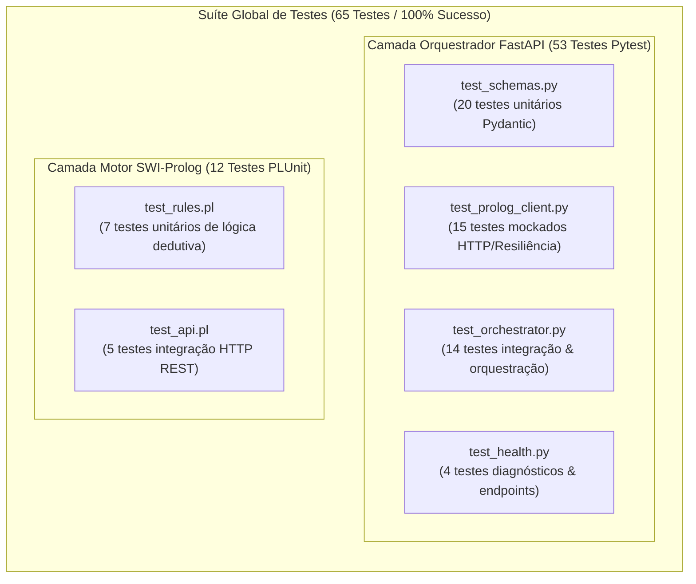

# Estratégia e Execução de Testes Automatizados
### *Sistema Pericial de Diagnóstico para Devoluções e Trocas no Retalho — MEIA 2026/2027*

---

## 1. Visão Geral

A integridade, previsibilidade e explicabilidade das decisões periciais no ecossistema **Retail Returns & Exchanges Diagnostic Expert System** são garantidas por uma estratégia de testes automatizados em múltiplas camadas.

O projeto adota a pirâmide de testes de engenharia de software moderna, separando testes em dois domínios tecnológicos especializados:

1. **Motor de Inferência Dedutiva (SWI-Prolog):** Testes unitários para regras de inferência lógica e testes de integração para o ciclo de vida do servidor HTTP e desserialização de JSON. Implementados com a biblioteca nativa `library(plunit)`.
2. **Backend Orquestrador (Python / FastAPI):** Testes unitários para validação de esquemas Pydantic v2, testes unitários mockados para o cliente HTTP assíncrono e testes de integração com transporte ASGI em memória (`httpx.ASGITransport`). Implementados com `pytest`, `pytest-asyncio` e `pytest-mock`.



---

## 2. Testes do Motor SWI-Prolog (`prolog_engine/tests/`)

Os testes do motor Prolog utilizam a biblioteca nativa `plunit`, integrada no ecossistema SWI-Prolog, sem necessidade de ferramentas externas adicionais.

### 2.1 Testes Unitários de Regras de Negócio (`test_rules.pl`)

O ficheiro [`prolog_engine/tests/test_rules.pl`](../../prolog_engine/tests/test_rules.pl) valida de forma isolada a função de avaliação lógica [`evaluate_scenario/3`](../../prolog_engine/src/core/rules.pl). O teste verifica diretamente dicionários Prolog (`_{scenario: ..., value: ...}`):

| ID / Teste | Cenário de Entrada | Decisão Esperada | Justificação Esperada |
|:---|:---|:---:|:---|
| `approved_exact_42` | `_{scenario: "test", value: 42}` | `approved` | `["Value is 42", "Dummy rule matched"]` |
| `approved_float_42` | `_{scenario: "test", value: 42.0}` | `approved` | `["Value is 42", "Dummy rule matched"]` |
| `rejected_different_value` | `_{scenario: "test", value: 15}` | `rejected` | `["Value is not 42", "Default fallback rule applied"]` |
| `rejected_non_numeric_value` | `_{scenario: "test", value: "hello"}` | `rejected` | `["Value is not 42", "Default fallback rule applied"]` |
| `rejected_missing_value_field` | `_{scenario: "test", other: 100}` | `rejected` | `["Missing 'value' field in scenario", "Default fallback rule applied"]` |
| `error_invalid_dict_atom` | `not_a_dict` (átomo inválido) | `error` | `["Scenario payload is not a valid Prolog dictionary"]` |
| `error_invalid_dict_list` | `[scenario, test]` (lista) | `error` | `["Scenario payload is not a valid Prolog dictionary"]` |

**Comando de Execução:**
```bash
swipl -g "run_tests, halt" -s prolog_engine/tests/test_rules.pl
```

### 2.2 Testes de Integração da API HTTP (`test_api.pl`)

O ficheiro [`prolog_engine/tests/test_api.pl`](../../prolog_engine/tests/test_api.pl) testa o ciclo de vida completo do servidor HTTP. Para evitar conflitos de porta com instâncias de desenvolvimento ativas, a suíte arranca dinamicamente um servidor de teste numa porta isolada (`8989`), executa chamadas HTTP reais com `library(http/http_client)` e encerra o servidor na limpeza (`cleanup`):

| Teste | Método & Rota | Entrada | Validação Realizada |
|:---|:---:|:---|:---|
| `post_evaluate_approved` | `POST /evaluate` | `{"scenario": "test", "value": 42}` | Resposta 200, status `success`, decisão `approved` e array de justificações. |
| `post_evaluate_rejected_value_mismatch` | `POST /evaluate` | `{"scenario": "test", "value": 15}` | Resposta 200, status `success`, decisão `rejected`. |
| `post_evaluate_rejected_missing_value` | `POST /evaluate` | `{"scenario": "test"}` | Resposta 200, status `success`, fallback acionado. |
| `post_evaluate_malformed_json` | `POST /evaluate` | Payload de texto `"invalid { json"` | Interceção correta e retorno de código HTTP `400 Bad Request`. |
| `default_port_fallback` | Predicado bootstrap | Resolução de porta padrão | Garante que `get_port/1` resolve porta numérica inteira válida (`> 0`). |

**Comando de Execução:**
```bash
swipl -g "run_tests, halt" -s prolog_engine/tests/test_api.pl
```

---

## 3. Testes do Backend Orquestrador (`backend_orchestrator/tests/`)

A suíte Python foi concebida para ser determinística, rápida (execução em menos de 1 segundo) e completamente independente de processos externos em execução na rede.

### 3.1 Fixtures e Arquitetura de Mocks (`conftest.py`)

O ficheiro central [`conftest.py`](../../backend_orchestrator/tests/conftest.py) estabelece as fundações de injeção de dependências para os testes:

* **Injeção de Dependências Dinâmica:** O FastAPI permite sobrescrever geradores de dependência em tempo de execução via `app.dependency_overrides`. O `conftest.py` substitui `get_prolog_client` e `get_orchestrator_service` por instâncias mockadas (`AsyncMock`).
* **Transporte ASGI em Memória (`ASGITransport`):** Em vez de abrir uma porta TCP real no anfitrião (o que causaria lentidão e conflitos), o cliente de teste `httpx.AsyncClient(transport=ASGITransport(app=test_app))` comunica diretamente com a pilha ASGI do FastAPI em memória.
* **Limpeza Automática:** Cada fixture assíncrona limpa os `dependency_overrides` e o estado da aplicação no final de cada teste, garantindo isolamento absoluto entre casos de teste.

```python
# Exemplo de configuração de transporte assíncrono em conftest.py
@pytest_asyncio.fixture
async def async_client(test_app: FastAPI) -> AsyncGenerator[AsyncClient, None]:
    transport = ASGITransport(app=test_app)
    async with AsyncClient(transport=transport, base_url="http://testserver") as client:
        yield client
```

### 3.2 Suíte de Validação de Esquemas (`test_schemas.py`) — 20 Testes

Testa exaustivamente todas as classes Pydantic v2 do projeto:

1. **`ScenarioInput` (POC):**
   - Aceitação de inteiros válidos (`value=42`), floats (`value=42.5`), zero e valores negativos.
   - Rejeição estrita com `ValidationError` de valores alfanuméricos (`"not_a_number"`), objetos vazios e strings em branco para o campo `scenario`.
2. **`EvaluationResponse`:**
   - Valores padrão (`engine=EngineSourceEnum.PROLOG`, timestamp em formato UTC ISO-8601).
   - Suporte e validação de todos os valores de `DecisionEnum` (`approved`, `rejected`, `pending`, `error`).
   - Rejeição de valores de enumeração não reconhecidos.
   - Serialização e desserialização JSON canónicas.
3. **`HealthResponse`:**
   - Validação da estrutura de diagnóstico e obrigatoriedade de campos.
4. **Esquemas Futuros de Retalho (`RetailReturnScenarioInput`):**
   - Validação do modelo completo de retalho (`ItemCondition`, `days_since_purchase >= 0`, `purchase_price > 0`, canais de venda e formas de pagamento).

### 3.3 Suíte do Cliente HTTP Prolog (`test_prolog_client.py`) — 15 Testes

Valida a resiliência do [`PrologClient`](../../backend_orchestrator/app/clients/prolog_client.py) perante múltiplos cenários de rede:

1. **Hierarquia de Exceções Personalizadas:**
   - Confirma que `PrologConnectionError`, `PrologTimeoutError` e `PrologResponseError` herdam da classe base [`InferenceEngineError`](../../backend_orchestrator/app/clients/prolog_client.py).
   - Validação de atributos específicos de erro (`status_code`, `response_body`).
2. **Chamadas de Avaliação:**
   - Casos de sucesso para decisões `approved` e `rejected`.
   - Aceitação indiferenciada de instâncias Pydantic (`ScenarioInput`) ou dicionários nativos Python (`dict`).
3. **Resiliência e Tratamento de Falhas:**
   - Conversão de `httpx.ConnectError` em `PrologConnectionError`.
   - Conversão de `httpx.TimeoutException` em `PrologTimeoutError`.
   - Conversão de respostas HTTP 400 ou 500 do motor em `PrologResponseError`.
4. **Health Check e Gestão de Recursos:**
   - Retorno booleano `True` em caso de sucesso e `False` resiliente perante falha de conexão ou timeout (sem lançar exceções não tratadas).
   - Validação de saída limpa como gestor de contexto assíncrono (`async with`).

### 3.4 Suíte de Orquestração e Integração de Endpoints (`test_orchestrator.py`) — 14 Testes

Testa a lógica do serviço [`OrchestratorService`](../../backend_orchestrator/app/services/orchestrator_service.py) e o endpoint público `POST /api/v1/evaluate`:

1. **Cenário A (Aprovação):** Envio de `value=42` gera resposta HTTP 200, `decision: approved` e array de justificações preenchido.
2. **Cenário B (Rejeição):** Envio de `value=15` gera resposta HTTP 200, `decision: rejected` e justificações de fallback.
3. **Cenário C (Falha de Conexão):** Quando o motor Prolog está indisponível (`PrologConnectionError`), o orquestrador responde com HTTP **503 Service Unavailable** e mensagem explicativa clara.
4. **Cenário D (Timeout do Motor):** Quando o motor excede o tempo limite (`PrologTimeoutError`), o orquestrador responde com HTTP **503 Service Unavailable**.
5. **Erro de Regras/Sintaxe:** Quando o Prolog retorna erro estruturado, o orquestrador converte para HTTP **400 Bad Request**.
6. **Validação de Payload:** Tipos inválidos ou payloads vazios são intercetados pela camada de validação e respondem com HTTP **422 Unprocessable Entity**.
7. **Normalização de Dados:** Garantia de que respostas do Prolog com justificações em string singular são automaticamente convertidas para lista `["..."]`.
8. **Ciclo de Vida (Lifespan):** Valida a inicialização e encerramento correto do pool HTTP no arranque e encerramento da aplicação.

### 3.5 Suíte de Diagnóstico (`test_health.py`) — 4 Testes

Valida os endpoints de infraestrutura e monitorização:
- `GET /health` com motor conectado (`prolog_engine: connected`).
- `GET /health` com motor desconectado (`prolog_engine: disconnected`), mantendo código HTTP 200 para permitir diagnóstico a balanceadores de carga.
- `GET /api/v1/health` (rota versionada alternativa).
- `GET /` (metadados e ponteiros de documentação).

---

## 4. Matriz Consolidada de Cobertura de Testes

| Componente | Ficheiro de Teste | Tecnologia | Casos de Teste | Taxa de Sucesso |
|:---|:---|:---:|:---:|:---:|
| **Motor Prolog (Core)** | [`prolog_engine/tests/test_rules.pl`](../../prolog_engine/tests/test_rules.pl) | PLUnit | 7 | 100% |
| **Motor Prolog (API)** | [`prolog_engine/tests/test_api.pl`](../../prolog_engine/tests/test_api.pl) | PLUnit | 5 | 100% |
| **Orquestrador (Esquemas)** | [`backend_orchestrator/tests/test_schemas.py`](../../backend_orchestrator/tests/test_schemas.py) | Pytest | 20 | 100% |
| **Orquestrador (Cliente HTTP)** | [`backend_orchestrator/tests/test_prolog_client.py`](../../backend_orchestrator/tests/test_prolog_client.py) | Pytest | 15 | 100% |
| **Orquestrador (Serviço & API)** | [`backend_orchestrator/tests/test_orchestrator.py`](../../backend_orchestrator/tests/test_orchestrator.py) | Pytest | 14 | 100% |
| **Orquestrador (Saúde)** | [`backend_orchestrator/tests/test_health.py`](../../backend_orchestrator/tests/test_health.py) | Pytest | 4 | 100% |
| **TOTAL CONSOLIDADO** | **6 Ficheiros de Teste** | **PLUnit + Pytest** | **65 Testes** | **100%** |

---

## 5. Guia Prático de Execução

### 5.1 Executar a Suíte Completa do Orquestrador (Pytest)

Com o ambiente virtual ativado:

**No Windows (PowerShell):**
```powershell
.\.venv\Scripts\pytest backend_orchestrator/tests -v
```

**No Linux / macOS (Bash):**
```bash
pytest backend_orchestrator/tests -v
```

**Comandos Úteis de Pytest:**
```bash
# Executar apenas um ficheiro específico
pytest backend_orchestrator/tests/test_orchestrator.py -v

# Filtrar testes por nome/palavra-chave (ex: testar apenas timeouts)
pytest backend_orchestrator/tests -k "timeout" -v

# Exibir traços de erro resumidos em caso de falha
pytest backend_orchestrator/tests --tb=short

# Imprimir outputs de consola de imediato (sem captura de stdout)
pytest backend_orchestrator/tests -s
```

### 5.2 Executar a Suíte Completa do Prolog (PLUnit)

A partir da raiz do repositório:

```bash
# Executar testes unitários de regras
swipl -g "run_tests, halt" -s prolog_engine/tests/test_rules.pl

# Executar testes de integração HTTP
swipl -g "run_tests, halt" -s prolog_engine/tests/test_api.pl
```

---

## 6. Boas Práticas para Novos Testes

Ao adicionar novas regras periciais ou novos endpoints, observe as seguintes diretrizes:

1. **Separação Obrigatória:**
   - Adicione regras e testes lógicos no módulo Prolog correspondente.
   - Adicione testes de validação sintática e serialização nos testes Pydantic do orquestrador.
2. **Determinismo:**
   - Não crie testes que dependam de servidores ou portas fixas em execução na máquina de quem testa.
   - Utilize mocks para chamadas remotas no Pytest e portas dinâmicas/efémeras nos testes de integração Prolog.
3. **Cobertura de Casos de Fronteira:**
   - Cada nova regra pericial deve incluir pelo menos: 1 caso de aprovação, 1 caso de rejeição e 1 teste com payload malformado ou campos em falta.
4. **Verificação de Explicabilidade:**
   - Todo o teste de avaliação deve validar explicitamente o campo `justification`, confirmando que a lista contém motivos inteligíveis e alinhados com o diagnóstico pretendido.

---

## 7. Referências Cruzadas

* [Guia de Primeiros Passos](getting_started.md) — Configuração do ambiente local de execução.
* [Convenções de Código](coding_conventions.md) — Padrões de código e estruturação de módulos.
* [Referência de Esquemas Pydantic](../api/schemas.md) — Definição dos modelos de dados validados na suíte.
* [Orquestração com Docker Compose](../deployment/docker_compose.md) — Validação em ambiente contentorizado.
