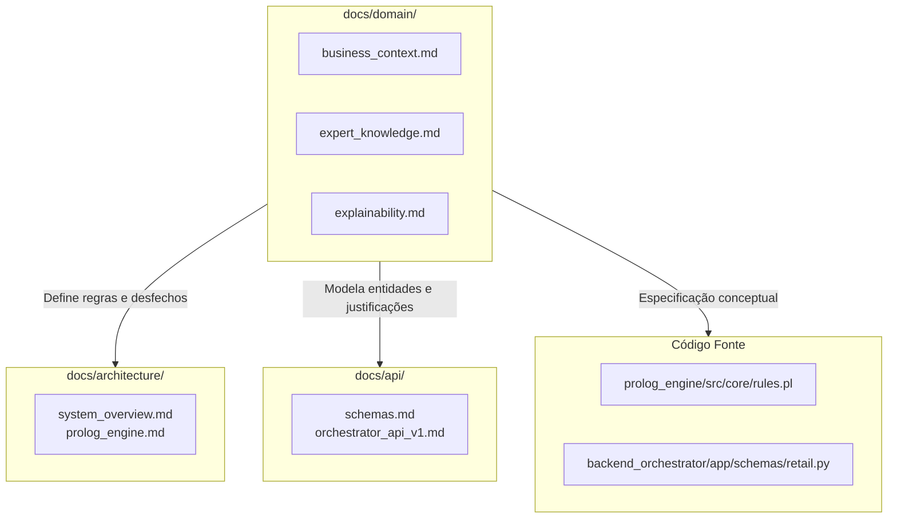

# Domínio de Negócio e Base de Conhecimento
### *Sistema Pericial de Diagnóstico para Devoluções e Trocas no Retalho*

---

## 1. Visão Geral da Secção

Esta secção documenta o conhecimento de domínio que fundamenta o sistema pericial, o enquadramento académico do projeto e os requisitos mandatórios de transparência e explicabilidade do diagnóstico (*Why / Why not*).

O objetivo primordial consiste em traduzir a experiência operacional e as heurísticas recolhidas com peritos humanos da linha da frente de retalho em especificações rigorosas, permitindo a sua subsequente formalização lógica em motores de inferência dedutiva (SWI-Prolog) e de regras de produção (Drools).

---

## 2. Índice de Documentos

| Documento | Propósito | Tópicos Centrais |
|:---|:---|:---|
| [Contexto de Negócio (`business_context.md`)](business_context.md) | Enquadramento académico e operacional | Mestrado MEIA (ENGCIA & PPROGIA), Desafio Challenges 4Teams (Equipa 3), caso de uso de retalho, papel do perito Dustin Hopper e fatores operacionais modelados. |
| [Heurísticas do Perito (`expert_knowledge.md`)](expert_knowledge.md) | Base de conhecimento e regras empíricas | Aviso sobre a natureza preliminar das heurísticas, conceitos-chave, árvore concetual de decisão, categorias de desfecho (`DecisionEnum`) e mapeamento para Prolog e Drools. |
| [Explicabilidade e Transparência (`explainability.md`)](explainability.md) | Requisito de diagnóstico explicativo | Filosofia *Why / Why not*, estrutura de `justification[]`, propagação da justificação desde o Prolog até ao FastAPI, e cenários práticos de retalho. |

---

## 3. Relação com as Restantes Secções do Sistema

---

## 4. Navegação no Repositório de Documentação

* **Arquitetura:** [Visão Global da Arquitetura](../architecture/README.md)
* **APIs & Contratos:** [Referência de APIs e Schemas](../api/README.md)
* **Deploy & Operações:** [Guia de Deploy e Docker](../deployment/README.md)
* **Desenvolvimento:** [Guias de Desenvolvimento e Testes](../development/README.md)
* **Histórico:** [Planos e Histórico de Implementação](../history/README.md)
