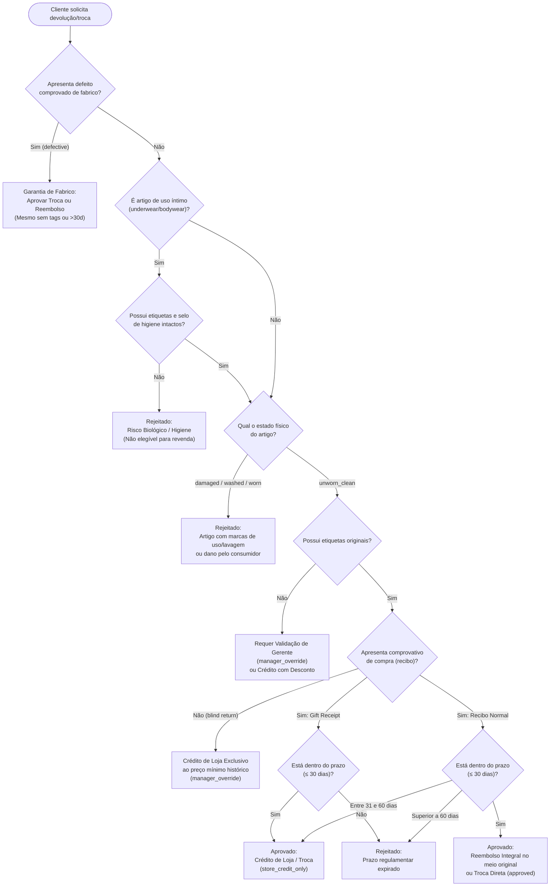

# Base de Conhecimento e Heurísticas do Perito
### *Regras Empíricas e Modelação Lógica para Devoluções e Trocas*

---

> [!WARNING]
> ### Aviso Metodológico: Natureza das Heurísticas em Rascunho
> As regras, critérios e fluxos operacionais descritos neste documento representam o **conhecimento empírico bruto** partilhado pelo perito de retalho Dustin Hopper (recolhido através de entrevistas e documentação interna de loja).
> 
> Estas heurísticas constituem uma especificação conceptual de partida e **não devem ser transpostas diretamente para código sem prévia formalização lógica**. É responsabilidade da engenharia do conhecimento eliminar ambiguidades, resolver potenciais conflitos de regras e codificar a lógica formalmente nos motores de inferência dedutiva (SWI-Prolog) e de produção (Drools).

---

## 1. Conceitos-Chave Extraídos do Perito

A tomada de decisão no balcão de retalho divide-se em cinco dimensões avaliadas cumulativamente:

### 1.1 Elegibilidade e Integridade do Artigo (*Item Attributes*)
* **Categoria Sanitária (*Intimate / Underwear*):** Produtos de contacto íntimo (peças interiores, fatos de banho, cosméticos abertos) possuem uma política de tolerância zero após quebra do selo original, devido a restrições legais de saúde pública e risco biológico (*biohazard*).
* **Presença de Etiquetas Originais (*Tags & Packaging*):** A fixação das etiquetas de fábrica ou da loja comprova que o produto não foi utilizado em ambiente social e permite a sua reintegração direta no expositor de vendas.
* **Estado Físico do Artigo (*Physical Condition*):**
  * `unworn_clean`: Artigo imaculado, sem odores, sem marcas de uso ou lavagem.
  * `worn`: Artigo que evidencia marcas de uso continuado (sujidade, desgaste de tecido).
  * `washed`: Artigo lavado pelo cliente (frequentemente associado a encolhimento ou perda de características de fábrica).
  * `damaged`: Artigo danificado por negligência do utilizador (rasgões acidentais, nódoas não removíveis).
  * `defective`: Defeito comprovado de fabrico (costuras desalinhadas, fechos avariados de origem, defeito no tingimento), o qual sobrepõe salvaguardas ao consumidor independentemente do estado das etiquetas.

### 1.2 Comprovativo de Compra (*Proof of Purchase*)
* **Recibo Fiscal Válido (*Standard Receipt*):** Documento original (impresso ou em formato digital na aplicação da loja) que atesta o preço exato pago, promoções aplicadas e data exata de compra.
* **Recibo de Oferta (*Gift Receipt*):** Comprovativo que omite o valor monetário pago, conferindo direito à substituição por outro artigo ou emissão de crédito de loja, mas **bloqueando expressamente o reembolso em dinheiro ou estorno em conta**.
* **Ausência de Comprovativo (*Blind Return*):** Situação em que o cliente não apresenta qualquer talão. Requer cálculo do preço mais baixo praticado no sistema informático (*lowest promotional price*) e restringe o desfecho a crédito de loja sob autorização ou supervisão.

### 1.3 Prazos Operacionais (*Timeframe & Elapsed Days*)
* **Janela Padrão (≤ 30 dias):** Prazo contratual padrão para devolução integral ou troca direta de mercadoria em estado novo.
* **Ajuste de Preço (≤ 14 dias):** Janela reduzida em que o cliente solicita a devolução da diferença monetária caso o produto tenha entrado em campanha promocional posterior.
* **Janela Alargada (31 a 60 dias):** Prazo em que o reembolso direto já não é autorizado pela política da empresa, convertendo-se exclusivamente em vale de compras / saldo em cartão de cliente.
* **Fora de Prazo (> 60 dias):** Rejeição liminar do pedido, salvo defeito de fabrico comprovado ou intervenção extraordinária de gerência.

### 1.4 Canal e Mercado de Origem (*Sales Channel*)
* **Loja Física Normal (*Physical Store*):** Elegível para devolução direta e troca no balcão.
* **Loja Outlet / Liquidação (*Outlet / Final Sale*):** Artigos adquiridos com desconto agressivo em regime de "venda final", onde as políticas de loja habitualmente excluem devoluções, salvo defeito técnico.
* **Comércio Eletrónico (*Online Order*):** Sujeito a período legal de livre resolução com regras específicas de logística e conferência de devolução remota.

### 1.5 Método Original de Pagamento (*Tender*)
* Devoluções financeiras devem respeitar a regra de integridade do método original de liquidação: numerário devolve numerário; cartão bancário estorna para o mesmo cartão; pagamentos diferidos (*Afterpay / Klarna*) requerem anulação na respetiva plataforma; compras com recibo de prenda revertem para vale de compras (*store credit*).

---

## 2. Fluxo Conceptual de Decisão

Abaixo apresenta-se a árvore de triagem conceptual que orienta a priorização e resolução das regras:



---

## 3. Formalização Lógica para os Motores de Inferência

A tradução deste conhecimento conceptual nos sistemas de regras realiza-se mediante a separação estrita de responsabilidades:

### 3.1 Mapeamento no Micro-serviço Prolog (`prolog_engine`)
O Prolog utiliza raciocínio dedutivo de primeira ordem (*SLD-Resolution* com *pattern matching* sobre dicionários nativos):

* **Predicado Central:**
  ```prolog
  evaluate_retail_return(+ScenarioDict, -Decision, -JustificationList)
  ```
* **Predicados Auxiliares Modulares:**
  * `is_hygiene_violation(+ItemDict)`: Unifica se `is_underwear = true` e (`has_tags = false` ou `condition \= unworn_clean`).
  * `is_manufacturing_defect(+ItemDict)`: Unifica quando `condition = defective`.
  * `check_return_window(+PurchaseDict, -WindowStatus)`: Classifica a janela temporal em `within_standard` (<=30), `within_extended` (31..60) ou `expired` (>60).
  * `resolve_payment_policy(+PurchaseDict, -AllowedTender)`: Determina se o estorno pode ser em dinheiro ou restrito a vale de loja.

### 3.2 Mapeamento no Micro-serviço Drools (Java Rule Engine)
O motor Drools emprega o algoritmo *Rete-OO* baseado em regras de produção reativas:

```java
// Exemplo de modelação conceptual de regra Drools (LHS / RHS)
rule "Rejeitar Artigo Intimo Sem Selo de Higiene"
when
    $item : Item( isUnderwear == true, hasTags == false || condition != ItemCondition.UNWORN_CLEAN )
    $scenario : RetailScenario( item == $item )
then
    $scenario.setDecision(DecisionEnum.REJECTED);
    $scenario.addJustification("Artigo de vestuário íntimo sem selo de higiene intacto");
    $scenario.addJustification("Violação das normas regulamentares de saúde e higiene pública");
end
```

---

## 4. Categorias de Desfecho Normativo (`DecisionEnum`)

As heurísticas convergem para as quatro categorias determinísticas definidas no contrato do sistema:

1. **`approved` (Aprovado):** Cumpre todas as normas de elegibilidade, prazos e comprovativos. Elegível para estorno financeiro no meio original de liquidação ou troca direta de mercadoria.
2. **`store_credit_only` (Crédito Exclusivo de Loja):** Devolução aceite, mas o reembolso em numerário/bancário está impedido (recibo de oferta, prazo entre 31 e 60 dias, ou troca de tamanho/cor).
3. **`manager_override` (Intervenção de Gerência):** Situações de exceção que exigem aprovação hierárquica superior (etiquetas em falta em artigos caros, devoluções sem recibo, suspeita de dano ambíguo).
4. **`rejected` (Rejeitado):** Violação direta e insanável das políticas da loja (fora de prazo, violação de higiene em roupa íntima, marcas visíveis de desgaste ou lavagem).

---

## 5. Documentos Relacionados

* [Contexto de Negócio e Enquadramento Académico](business_context.md) — Visão global e papel do perito.
* [Requisito Primordial: Explicabilidade e Transparência](explainability.md) — Mecanismo de auditoria explicativa (*Why/Why not*).
* [Especificação de Schemas Pydantic / DTOs](../api/schemas.md) — DTOs formais de entrada e saída.
* [Arquitetura do Motor Prolog](../architecture/prolog_engine.md) — Implementação da Clean Architecture em Prolog.
