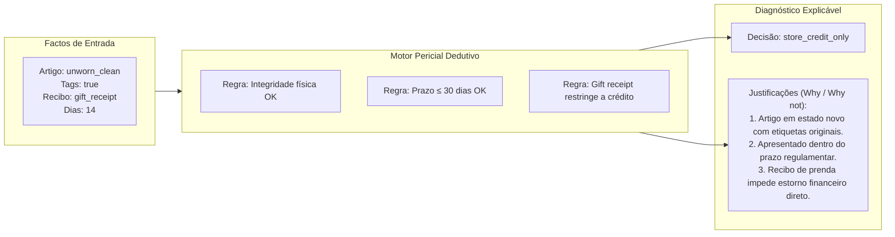
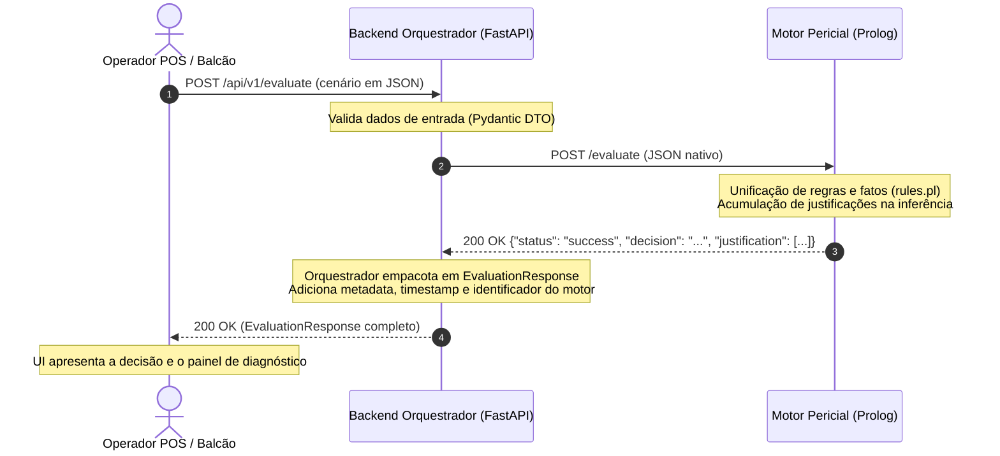

# Requisito Primordial: Explicabilidade e Transparência
### *Diagnóstico Explicativo em Sistemas Periciais de Retalho (Why / Why not)*

---

## 1. Filosofia de Diagnóstico e Transparência

Em ambientes operacionais de retalho, uma decisão automatizada emitida por um sistema de Inteligência Artificial sem fundamentação compreensível é inaceitável:

1. **Impacto no Relacionamento com o Consumidor:** Um cliente ao balcão a quem é recusada uma devolução ou limitado o estorno a crédito de loja necessita de uma justificação clara, objetiva e imediata dos motivos da decisão. A recusa sem explicação gera tensão no balcão e degrada a confiança na marca.
2. **Capacitação dos Colaboradores:** Os operadores de caixa e assistentes de loja necessitam de compreender a regra de negócio aplicada para poderem argumentar com segurança e rigor normativo perante o cliente.
3. **Auditoria e Conformidade Legal:** As decisões de recusa ou reembolso estão sujeitas a escrutínio legal, direitos de proteção ao consumidor e políticas fiscais. Cada avaliação deve ser plenamente auditável e reproduzível.
4. **Superação do Paradigma "Caixa-Negra":** Ao contrário de modelos conexionistas (*Machine Learning / Deep Learning*), onde as predições são opacas e estatísticas, o raciocínio dedutivo simbólico em sistemas periciais garante que cada conclusão decorre de premissas factuais explícitas e regras auditáveis.

O sistema foi concebido sob o princípio de **Explicabilidade Nativa (*Explainability by Design*)**: a justificação não é uma reflexão posterior gerada heuristicamente, mas sim a transcrição direta das regras lógicas ativadas durante o processo de inferência.



---

## 2. Estrutura da Cadeia de Justificações (`justification[]`)

O contrato de dados do sistema estabelece que todas as respostas de avaliação integram uma lista estruturada de cadeias explicativas no campo `justification: list[str]` do modelo canónico [`EvaluationResponse`](../api/schemas.md#evaluationresponse):

```json
{
  "status": "success",
  "decision": "approved",
  "justification": [
    "Premissa fáctica verificada",
    "Regra de política comercial satisfeita",
    "Conclusão e modalidade de reembolso autorizada"
  ],
  "engine": "prolog",
  "timestamp": "2026-09-27T20:30:00Z"
}
```

### Regras de Construção da Cadeia Explicativa:
* **Ordem Lógica Causal:** As justificações são ordenadas das premissas para a conclusão (avaliação física do artigo $\rightarrow$ validação do comprovativo $\rightarrow$ validação do prazo $\rightarrow$ determinação do método de liquidação).
* **Dupla Perspetiva (*Why / Why not*):**
  * *Why (Porquê):* Quais os critérios concretos que fundamentaram a decisão positiva ou a restrição imposta.
  * *Why not (Porque não):* Se foi recusado o reembolso em numerário, explicar explicitamente o impedimento (ex.: *"Porque não foi estornado no cartão: Comprovativo apresentado é talão de oferta"*).
* **Multi-critério Cumulativo:** Caso existam múltiplas infrações à política (ex.: artigo fora de prazo E sem comprovativo de compra), o sistema regista todos os motivos de rejeição em vez de abortar silenciosamente no primeiro erro.

---

## 3. Fluxo de Geração e Propagação da Explicabilidade

A cadeia de justificações nasce no motor dedutivo e é propagada de forma transparente até à camada de apresentação:



### Mecânica Interna por Camada:
1. **No Motor Prolog (`prolog_engine/src/core/rules.pl`):**  
   O predicado dedutivo central possui a assinatura:
   ```prolog
   evaluate_scenario(+ScenarioDict, -Decision, -JustificationList)
   ```
   À medida que as cláusulas unificam com sucesso, a lista `JustificationList` é construída declarativamente através de listas de strings.
2. **Na Camada HTTP do Prolog (`prolog_engine/src/api/routes.pl`):**  
   O resultado é serializado no payload de resposta JSON:
   ```json
   {
     "status": "success",
     "decision": "approved",
     "justification": ["Value is 42", "Dummy rule matched"]
   }
   ```
3. **No Cliente HTTP do Orquestrador (`backend_orchestrator/app/clients/prolog_client.py`):**  
   O cliente assíncrono `httpx` recebe o JSON e deserializa o array `justification`.
4. **No Serviço Orquestrador (`backend_orchestrator/app/services/orchestrator_service.py`):**  
   Os dados são encapsulados no modelo Pydantic `EvaluationResponse`, garantindo a integridade dos tipos e adicionando carimbo temporal UTC e origem do motor (`EngineSourceEnum.PROLOG`).

---

## 4. Exemplos Concretos de Diagnósticos de Retalho

Abaixo ilustram-se cenários práticos representativos do domínio de devoluções:

### Cenário A: Aprovação Integral de Devolução (`approved`)
* **Situação:** Cliente comprou uma camisola há 12 dias, apresenta recibo fiscal e o artigo está impecável com etiquetas.
* **Corpo do Pedido:**
  ```json
  {
    "scenario": "retail_return",
    "item": {
      "category": "apparel",
      "is_underwear": false,
      "has_tags": true,
      "condition": "unworn_clean"
    },
    "purchase": {
      "has_receipt": true,
      "is_gift_receipt": false,
      "days_since_purchase": 12,
      "channel": "physical_store",
      "payment_method": "credit_card"
    }
  }
  ```
* **Diagnóstico Produzido (HTTP 200 OK):**
  ```json
  {
    "status": "success",
    "decision": "approved",
    "justification": [
      "Artigo de vestuário não íntimo em estado novo e com etiquetas originais intactas.",
      "Comprovativo de compra válido apresentado dentro da janela regulamentar de 30 dias (12 dias decorridos).",
      "Devolução aprovada com reembolso integral através do método original de liquidação (cartão de crédito)."
    ],
    "engine": "prolog",
    "timestamp": "2026-09-27T20:45:00Z"
  }
  ```

---

### Cenário B: Rejeição por Risco Sanitário (*Biohazard* / Higiene) (`rejected`)
* **Situação:** Cliente tenta devolver uma peça de roupa interior cuja embalagem foi aberta e as etiquetas removidas.
* **Corpo do Pedido:**
  ```json
  {
    "scenario": "retail_return",
    "item": {
      "category": "intimate",
      "is_underwear": true,
      "has_tags": false,
      "condition": "worn"
    },
    "purchase": {
      "has_receipt": true,
      "is_gift_receipt": false,
      "days_since_purchase": 5,
      "channel": "physical_store",
      "payment_method": "cash"
    }
  }
  ```
* **Diagnóstico Produzido (HTTP 200 OK):**
  ```json
  {
    "status": "success",
    "decision": "rejected",
    "justification": [
      "Artigo classificado como vestuário íntimo sujeito a restrições legais de proteção de saúde pública.",
      "Ausência de selo sanitário e etiquetas protetoras originais.",
      "Presença de sinais de utilização ou manuseamento pessoal incompatível com revenda.",
      "Rejeição estrita por violação da política de higiene e segurança sanitária (risco biológico)."
    ],
    "engine": "prolog",
    "timestamp": "2026-09-27T20:45:00Z"
  }
  ```

---

### Cenário C: Restrição a Crédito de Loja por Talão de Oferta (`store_credit_only`)
* **Situação:** O cliente recebeu o artigo como prenda, possui talão de oferta e solicita a devolução aos 20 dias da compra.
* **Diagnóstico Produzido (HTTP 200 OK):**
  ```json
  {
    "status": "success",
    "decision": "store_credit_only",
    "justification": [
      "Artigo em estado de conservação conforme e dentro da janela padrão de devoluções (20 dias).",
      "Comprovativo apresentado em regime de talão de oferta (gift receipt).",
      "Política de loja impede a conversão em numerário ou estorno bancário para compras em regime de prenda.",
      "Autorizada emissão de vale de compras de valor equivalente ou substituição imediata por outro artigo."
    ],
    "engine": "prolog",
    "timestamp": "2026-09-27T20:45:00Z"
  }
  ```

---

### Cenário D: Encaminhamento para Supervisão de Gerência (`manager_override`)
* **Situação:** Artigo de elevado valor sem comprovativo de compra (*blind return*) ou com etiquetas danificadas.
* **Diagnóstico Produzido (HTTP 200 OK):**
  ```json
  {
    "status": "success",
    "decision": "manager_override",
    "justification": [
      "Ausência de comprovativo fiscal de compra (devolução sem talão / blind return).",
      "Artigo em bom estado aparente, mas o histórico da transação não foi localizado automaticamente.",
      "Requer autorização presencial do gerente de turno para validação do preço mínimo histórico e emissão excecional de crédito de loja."
    ],
    "engine": "prolog",
    "timestamp": "2026-09-27T20:45:00Z"
  }
  ```

---

## 5. Exemplos de Execução e Teste de Explicabilidade

Para validar a obtenção de respostas explicativas no ambiente de desenvolvimento:

### Exemplo via cURL (Linux / macOS / Git Bash):
```bash
curl -X POST http://localhost:8000/api/v1/evaluate \
  -H "Content-Type: application/json" \
  -d '{
    "scenario": "test",
    "value": 42
  }'
```

### Exemplo via PowerShell (Windows):
```powershell
$body = @{
    scenario = "test"
    value = 42
} | ConvertTo-Json

$response = Invoke-RestMethod -Uri "http://localhost:8000/api/v1/evaluate" `
    -Method Post `
    -ContentType "application/json" `
    -Body $body

$response | ConvertTo-Json -Depth 5
```

**Output Explicativo Obtido:**
```json
{
  "status": "success",
  "decision": "approved",
  "justification": [
    "Value is 42",
    "Dummy rule matched"
  ],
  "engine": "prolog",
  "timestamp": "2026-09-27T20:48:15.123456Z",
  "message": null
}
```

---

## 6. Documentos Relacionados

* [Contexto de Negócio e Enquadramento Académico](business_context.md) — Objetivos e enquadramento no MEIA.
* [Base de Conhecimento e Heurísticas do Perito](expert_knowledge.md) — Árvore concetual de regras de retalho.
* [Referência da API do Orquestrador](../api/orchestrator_api_v1.md) — Endpoints REST e parâmetros.
* [Especificação de Schemas Pydantic / DTOs](../api/schemas.md) — Modelo canónico `EvaluationResponse`.
