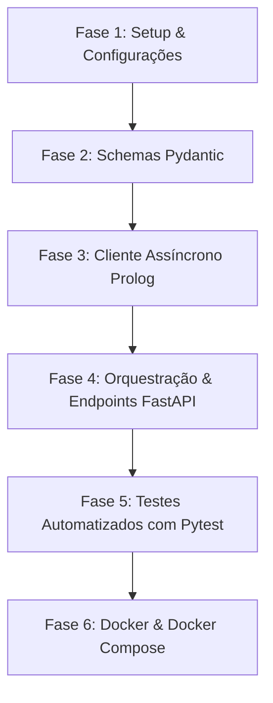

# PLANO DE IMPLEMENTAÇÃO: BACKEND ORQUESTRADOR (FASTAPI)
### *Retail Returns & Exchanges Expert System — Orchestration Layer*

> **Instruções para o Agente LLM / Engenheiro de IA no Terminal Integrado:**
> * **Papel:** Atua como Engenheiro de Software Sénior e Especialista em Arquitetura de Sistemas de IA.
> * **Regra de Ouro da Arquitetura:** O Orquestrador **NÃO** deve conter regras de negócio de retalho (essas pertencem estritamente ao motor Prolog e futuro motor Drools). O papel do FastAPI é validação de esquemas (Pydantic), coordenação de chamadas assíncronas aos motores via HTTP (`httpx`), agregação de respostas, tratamento resiliente de erros e disponibilização de uma API limpa para o Frontend.
> * **Modo de Execução Faseado:** **NÃO implementes todas as fases em simultâneo.** Executa estritamente a fase solicitada pelo utilizador (ex.: "Executa a Fase 1"). Após concluir cada fase, corre os comandos de validação/testes especificados e apresenta um relatório de conformidade conciso antes de avançar para a fase seguinte.
> * **Convenção de Idioma:** Código, nomes de ficheiros, variáveis e *docstrings* em **Inglês**; documentação técnica, mensagens de commit e explicações no chat em **Português (pt-PT)**.

---

## 1. Referências Arquiteturais e Contexto do Projeto

Antes de iniciares a implementação de qualquer fase, consulta e respeita a documentação de referência já aprovada no repositório:
1. [docs/Main_context.md](file:///c:/Users/santi/Desktop/meia-equipa3-challenge1-26_27/docs/Main_context.md) — Visão global do MEIA (ENGCIA/PPROGIA), caso de uso de retalho do perito Dustin Hopper e requisito crítico de **Explicabilidade** (*Why/Why not*).
2. [docs/architecture.md](file:///c:/Users/santi/Desktop/meia-equipa3-challenge1-26_27/docs/architecture.md) — Princípios de *Clean Architecture*, ciclo de vida do request e isolamento entre camadas.
3. [docs/api_contracts.md](file:///c:/Users/santi/Desktop/meia-equipa3-challenge1-26_27/docs/api_contracts.md) — Contratos JSON de entrada e saída do endpoint `/evaluate` do motor Prolog.
4. [README.md](file:///c:/Users/santi/Desktop/meia-equipa3-challenge1-26_27/README.md) — Estado geral da solução e mapa do ecossistema.
5. [prolog_engine/](file:///c:/Users/santi/Desktop/meia-equipa3-challenge1-26_27/prolog_engine/) — Micro-serviço SWI-Prolog já implementado e testado (escuta em `http://localhost:8080/evaluate`).

---

## 2. Estrutura de Diretórios Alvo

A implementação do orquestrador residirá na pasta `backend_orchestrator/` e integrará um ficheiro `docker-compose.yml` na raiz:

```text
meia-equipa3-challenge1-26_27/
├── docker-compose.yml                      # [Fase 6] Orquestração local: Prolog (8080) + FastAPI (8000)
├── docs/                                  # Documentação de arquitetura e contratos
├── prolog_engine/                         # Micro-serviço SWI-Prolog (100% operacional)
└── backend_orchestrator/                  # [NOVO] Micro-serviço Orquestrador FastAPI
    ├── .dockerignore                       # Otimização do build Docker
    ├── Dockerfile                          # [Fase 6] Imagem base Python slim
    ├── requirements.txt                    # [Fase 1] Dependências do projeto
    ├── .env.example                        # [Fase 1] Template de variáveis de ambiente
    ├── .env                                # [Fase 1] Configurações locais (ignorado no git)
    ├── app/
    │   ├── __init__.py
    │   ├── main.py                         # [Fase 4] Entry point FastAPI, CORS e Lifespan
    │   ├── core/
    │   │   ├── __init__.py
    │   │   └── config.py                   # [Fase 1] Configuração com Pydantic BaseSettings
    │   ├── schemas/
    │   │   ├── __init__.py
    │   │   ├── common.py                   # [Fase 2] Schemas canónicos de resposta e enums
    │   │   ├── scenario.py                 # [Fase 2] Schemas do cenário POC (scenario, value)
    │   │   └── retail.py                   # [Fase 2] Schemas de preparação para o domínio de retalho
    │   ├── clients/
    │   │   ├── __init__.py
    │   │   └── prolog_client.py            # [Fase 3] Cliente HTTP assíncrono httpx para o Prolog
    │   ├── services/
    │   │   ├── __init__.py
    │   │   └── orchestrator_service.py     # [Fase 4] Coordenação de inferência e agregação
    │   └── api/
    │       ├── __init__.py
    │       └── v1/
    │           ├── __init__.py
    │           ├── router.py               # [Fase 4] Agregador de rotas v1
    │           └── endpoints/
    │               ├── __init__.py
    │               ├── health.py           # [Fase 4] Healthcheck e diagnóstico de conectividade
    │               └── evaluate.py         # [Fase 4] Endpoint POST /api/v1/evaluate
    └── tests/
        ├── __init__.py
        ├── conftest.py                     # [Fase 5] Fixtures pytest e mocks de rede
        ├── test_health.py                  # [Fase 5] Testes ao endpoint de saúde
        ├── test_schemas.py                 # [Fase 5] Validação de serialização Pydantic
        └── test_orchestrator.py            # [Fase 5] Testes de orquestração (mocks e integração)
```

---

## 3. Contrato de Interação com o Motor Prolog

O cliente HTTP assíncrono (`prolog_client.py`) comunicará com o micro-serviço Prolog seguindo a especificação já validada:

* **URL:** `{PROLOG_ENGINE_URL}/evaluate` (predefinição: `http://localhost:8080/evaluate`)
* **Método:** `POST`
* **Headers:** `Content-Type: application/json`, `Accept: application/json`
* **Payload Enviado (POC):**
  ```json
  {
    "scenario": "test",
    "value": 42
  }
  ```
* **Payload Recebido de Sucesso (HTTP 200 OK):**
  ```json
  {
    "status": "success",
    "decision": "approved",
    "justification": [
      "Value is 42",
      "Dummy rule matched"
    ]
  }
  ```
* **Payload Recebido de Rejeição (HTTP 200 OK):**
  ```json
  {
    "status": "success",
    "decision": "rejected",
    "justification": [
      "Value is not 42",
      "Default fallback rule applied"
    ]
  }
  ```
* **Payload Recebido de Erro (HTTP 400 Bad Request):**
  ```json
  {
    "status": "error",
    "message": "Invalid JSON payload or missing required parameters",
    "decision": "error",
    "justification": []
  }
  ```

---

## 4. Roteiro de Implementação Faseada



---

### FASE 1: Setup Base e Gestão de Configurações
**Objetivo:** Criar o esqueleto do projeto Python, configurar as dependências e criar a gestão de configurações tipadas.

*   [x] **Subfase 1.1: Criação da Árvore de Diretórios e Ficheiros Iniciais**
    *   Criar a pasta `backend_orchestrator/` e as subpastas `app/`, `app/core/`, `app/schemas/`, `app/clients/`, `app/services/`, `app/api/v1/endpoints/` e `tests/`.
    *   Incluir ficheiros `__init__.py` vazios em todas as pastas Python para estruturar os pacotes.

*   [x] **Subfase 1.2: Ficheiro de Dependências (`requirements.txt`)**
    *   Criar `backend_orchestrator/requirements.txt` com as versões adequadas:
        ```text
        fastapi>=0.110.0,<0.112.0
        uvicorn[standard]>=0.28.0,<0.31.0
        pydantic>=2.6.0,<2.9.0
        pydantic-settings>=2.2.0,<2.5.0
        httpx>=0.27.0,<0.28.0
        pytest>=8.0.0,<8.3.0
        pytest-asyncio>=0.23.0,<0.24.0
        pytest-mock>=3.12.0,<3.15.0
        ```

*   [x] **Subfase 1.3: Variáveis de Ambiente e Configuração Centralizada (`config.py`)**
    *   Criar `backend_orchestrator/.env.example` e `backend_orchestrator/.env` contendo:
        ```ini
        PROJECT_NAME="Retail Returns & Exchanges Diagnostic Orchestrator"
        API_V1_STR="/api/v1"
        DEBUG=true
        PORT=8000
        PROLOG_ENGINE_URL="http://localhost:8080"
        PROLOG_TIMEOUT_SECONDS=5.0
        CORS_ORIGINS=["http://localhost:3000","http://localhost:5173","http://localhost:8000"]
        ```
    *   Criar `backend_orchestrator/app/core/config.py` utilizando `pydantic_settings.BaseSettings`:
        *   Definir classe `Settings` com tipagem estrita para todas as variáveis acima.
        *   Instanciar `settings = Settings()`.

*   **Critérios de Validação da Fase 1:**
    *   Executar script de verificação no terminal:
        ```powershell
        python -c "from app.core.config import settings; print(f'Config OK: {settings.PROJECT_NAME}, Prolog URL: {settings.PROLOG_ENGINE_URL}')"
        ```
    *   Confirmar que as variáveis carregam com sucesso a partir de `.env` ou dos valores padrão.

---

### FASE 2: Schemas de Dados (Pydantic DTOs)
**Objetivo:** Modelar com rigor os contratos de entrada e saída, garantindo validação de tipos, valores padrão e documentação OpenAPI automática.

*   [x] **Subfase 2.1: Schemas Canónicos de Resposta (`app/schemas/common.py`)**
    *   Definir enumerações para o resultado da inferência:
        *   `DecisionEnum`: `approved`, `rejected`, `store_credit_only`, `manager_override`, `error`.
        *   `EngineSourceEnum`: `prolog`, `drools`, `aggregated`.
    *   Definir o modelo canónico de resposta ao cliente `EvaluationResponse`:
        *   `status: str` (ex.: `"success"`, `"error"`)
        *   `decision: DecisionEnum`
        *   `justification: list[str]` (cadeia explicativa *Why/Why not*)
        *   `engine: EngineSourceEnum = EngineSourceEnum.prolog`
        *   `timestamp: datetime`

*   [x] **Subfase 2.2: Schemas de Entrada do POC Atual (`app/schemas/scenario.py`)**
    *   Criar `ScenarioInput` compatível com o contrato POC de [`docs/api_contracts.md`](file:///c:/Users/santi/Desktop/meia-equipa3-challenge1-26_27/docs/api_contracts.md):
        *   `scenario: str` (ex.: `"test"`)
        *   `value: Union[int, float]` (ex.: `42`)
    *   Adicionar exemplos no `model_config` para enriquecer a documentação interativa Swagger.

*   [x] **Subfase 2.3: Schemas de Extensão para o Domínio de Retalho (`app/schemas/retail.py`)**
    *   Criar antecipadamente os modelos que representarão os cenários de devolução reais de loja (para uso quando as regras forem especificadas):
        *   `ItemCondition`: `unworn_clean`, `worn`, `washed`, `damaged`, `defective`.
        *   `ItemSchema`: `category: str`, `is_underwear: bool`, `has_tags: bool`, `condition: ItemCondition`.
        *   `PurchaseSchema`: `has_receipt: bool`, `is_gift_receipt: bool = False`, `days_since_purchase: int`, `channel: str = "physical_store"`, `payment_method: str = "credit_card"`.
        *   `RetailReturnScenarioInput`: `scenario: Literal["retail_return"]`, `item: ItemSchema`, `purchase: PurchaseSchema`.

*   **Critérios de Validação da Fase 2:**
    *   Criar um teste simples ou correr no terminal a validação dos esquemas:
        ```powershell
        python -c "from app.schemas.scenario import ScenarioInput; from app.schemas.common import EvaluationResponse; s = ScenarioInput(scenario='test', value=42); print(s.model_dump_json())"
        ```
    *   Verificar rejeição de payloads com tipos inválidos (ex.: string passada em vez de número).

---

### FASE 3: Cliente HTTP Assíncrono do Prolog (`prolog_client.py`)
**Objetivo:** Construir o componente de transporte entre o FastAPI e o micro-serviço SWI-Prolog com resiliência, gestão de timeouts e tratamento elegante de erros de rede.

*   [x] **Subfase 3.1: Exceções Personalizadas de Domínio**
    *   Criar classes de erro em `app/core/exceptions.py` (ou dentro do módulo do cliente):
        *   `InferenceEngineError(Exception)`
        *   `PrologConnectionError(InferenceEngineError)` (para falhas de ligação TCP/DNS)
        *   `PrologTimeoutError(InferenceEngineError)` (para timeouts de inferência)
        *   `PrologResponseError(InferenceEngineError)` (para respostas com status 4xx ou 5xx)

*   [x] **Subfase 3.2: Implementação do Cliente `PrologClient` (`app/clients/prolog_client.py`)**
    *   Utilizar `httpx.AsyncClient` com reutilização de ligações (connection pooling).
    *   Método `async def evaluate(self, payload: dict) -> dict`:
        *   Efetua `POST` assíncrono para `{settings.PROLOG_ENGINE_URL}/evaluate`.
        *   Aplica `timeout=settings.PROLOG_TIMEOUT_SECONDS`.
        *   Captura `httpx.ConnectError` -> lança `PrologConnectionError`.
        *   Captura `httpx.TimeoutException` -> lança `PrologTimeoutError`.
        *   Captura `httpx.HTTPStatusError` -> extrai o JSON de erro do Prolog e lança `PrologResponseError`.
        *   Devolve o dicionário serializado do Prolog.
    *   Método `async def check_health(self) -> bool`:
        *   Executa um teste rápido de conectividade ou submete um payload mínimo para verificar se o motor está ativo.

*   **Critérios de Validação da Fase 3:**
    *   Validar o cliente contra o servidor Prolog em execução (porta 8080) com script assíncrono rápido ou teste unitário com mock.

---

### FASE 4: Camada de Orquestração, Endpoints REST e Aplicação Principal
**Objetivo:** Criar a API FastAPI pública com Swagger, suporte a CORS, orquestração de pedidos e gestão de ciclo de vida.

*   [x] **Subfase 4.1: Serviço Orquestrador (`app/services/orchestrator_service.py`)**
    *   Criar a classe `OrchestratorService`:
        *   Injeta o `PrologClient`.
        *   Método `async def evaluate_scenario(self, scenario_data: ScenarioInput) -> EvaluationResponse`:
            *   Converte o modelo Pydantic num dicionário de factos.
            *   Invoca `prolog_client.evaluate(payload)`.
            *   Mapeia o retorno do Prolog para o modelo canónico `EvaluationResponse` (com `engine="prolog"`, `decision`, `justification`).
            *   *(Nota arquitetural: Deixar o ponto de extensão preparado para futuramente invocar o motor Drools e comparar/agregar os diagnósticos).*

*   [x] **Subfase 4.2: Endpoints REST (`app/api/v1/endpoints/`)**
    *   `health.py`:
        *   Endpoint `GET /health` que retorna o estado do orquestrador (`"status": "healthy"`) e o estado da ligação ao Prolog (`"prolog_engine": "connected" | "disconnected"`).
    *   `evaluate.py`:
        *   Endpoint `POST /api/v1/evaluate` recebendo `ScenarioInput` e retornando `EvaluationResponse`.
        *   Tratamento de exceções específicas:
            *   `PrologConnectionError` / `PrologTimeoutError` -> Devolve `HTTP 503 Service Unavailable` com JSON explicativo.
            *   `PrologResponseError` -> Devolve `HTTP 400 Bad Request`.
    *   `router.py`:
        *   Agrega os routers de `health` e `evaluate` com prefixo `/api/v1`.

*   [x] **Subfase 4.3: Aplicação Principal e Lifespan (`app/main.py`)**
    *   Configurar a instância `FastAPI` com título, descrição e versão informativas.
    *   Configurar o middleware `CORSMiddleware` usando `settings.CORS_ORIGINS` (imprescindível para o Frontend).
    *   Implementar o gestor de contexto assíncrono `lifespan` para inicializar a sessão do `httpx.AsyncClient` no arranque e encerrá-la elegantemente no encerramento da aplicação.
    *   Registar o router global `api_v1_router`.

*   **Critérios de Validação da Fase 4:**
    *   Iniciar a aplicação via uvicorn:
        ```powershell
        uvicorn app.main:app --host 0.0.0.0 --port 8000 --reload
        ```
    *   Aceder à documentação interativa Swagger em `http://localhost:8000/docs`.
    *   Testar chamada ao endpoint `/health` e `/api/v1/evaluate`.

---

### FASE 5: Suíte de Testes Automatizados (`pytest`)
**Objetivo:** Garantir 100% de cobertura nos cenários de sucesso, rejeição, schemas inválidos e falhas de rede.

*   [x] **Subfase 5.1: Fixtures de Teste (`tests/conftest.py`)**
    *   Configurar `pytest_plugins = ('pytest_asyncio',)`
    *   Criar fixture para `httpx.AsyncClient` apontando para a aplicação FastAPI (`transport=ASGITransport(app=app)`).
    *   Criar fixtures de *mocking* para o `PrologClient` para simular cenários sem depender do serviço Prolog estar ligado.

*   [x] **Subfase 5.2: Testes Unitários e de Integração Mockada**
    *   `test_health.py`: Verifica se `GET /health` responde HTTP 200 OK.
    *   `test_schemas.py`: Valida parsing e rejeição de payloads incorretos.
    *   `test_orchestrator.py`:
        *   Cenário A: Sucesso com aprovação (`value = 42` -> `decision: "approved"`).
        *   Cenário B: Sucesso com rejeição (`value = 15` -> `decision: "rejected"`).
        *   Cenário C: Falha de conectividade (Prolog offline -> `HTTP 503 Service Unavailable`).
        *   Cenário D: Timeout do motor Prolog -> `HTTP 503 Service Unavailable`.

*   **Critérios de Validação da Fase 5:**
    *   Executar todos os testes no terminal:
        ```powershell
        pytest backend_orchestrator/tests -v
        ```
    *   Garantir que todos os testes passam a 100%.

---

### FASE 6: Contentorização e Orquestração Local (`Docker Compose`)
**Objetivo:** Permitir a subida integrada de todo o ecossistema (Prolog + FastAPI) com um único comando.

*   [x] **Subfase 6.1: Dockerfile do Orquestrador (`backend_orchestrator/Dockerfile`)**
    *   Imagem base: `python:3.11-slim`.
    *   Otimizações de runtime: `PYTHONDONTWRITEBYTECODE=1` e `PYTHONUNBUFFERED=1`.
    *   Cópia de `requirements.txt` e instalação sem cache (`pip install --no-cache-dir -r requirements.txt`) aproveitando o cache de camadas do Docker.
    *   Cópia do código `app/` para `/app/app`.
    *   Exclusões de ficheiros desnecessários (`.venv`, `tests/`, `.env`, `__pycache__`) configuradas em `backend_orchestrator/.dockerignore`.
    *   Exposição da porta `8000`.
    *   Comando de execução: `CMD ["uvicorn", "app.main:app", "--host", "0.0.0.0", "--port", "8000"]`.

*   [x] **Subfase 6.2: Docker Compose na Raiz (`docker-compose.yml`)**
    *   Definir os dois serviços em rede partilhada em modo bridge (`retail-network`):
        1.  `prolog-engine`:
            *   Contexto de build: `./prolog_engine`
            *   Portas expostas: `8080:8080`
            *   Contentor: `retail-prolog-engine`
            *   Variáveis: `PORT=8080`
        2.  `orchestrator`:
            *   Contexto de build: `./backend_orchestrator`
            *   Portas expostas: `8000:8000`
            *   Contentor: `retail-backend-orchestrator`
            *   Variáveis de ambiente: `PROLOG_ENGINE_URL=http://prolog-engine:8080` (resolução DNS interna entre contentores)
            *   `depends_on`: `prolog-engine`
            *   Política de reinício: `restart: unless-stopped`

---

#### 6.3 O Que Foi Implementado e Decisões Técnicas

1. **Isolamento de Responsabilidades e DNS Interno:**
   * O orquestrador FastAPI comunica diretamente com o motor de inferência Prolog através da rede privada interna `retail-network`, recorrendo ao nome de serviço `http://prolog-engine:8080`.
   * A porta `8080` do Prolog continua exposta para o anfitrião para fins de depuração independente, e a porta `8000` do FastAPI é a porta de entrada principal para clientes e Frontend.
2. **Construção Leve e Otimizada (`Dockerfile`):**
   * A imagem `python:3.11-slim` reduz a superfície de vulnerabilidades e o tamanho final da imagem.
   * A separação entre a instalação de dependências e a cópia de código permite recompilar alterações de código em segundos sem reinstalar pacotes Python.
   * O ficheiro `.dockerignore` previne que variáveis de ambiente locais sensíveis (`.env`), caches de teste (`.pytest_cache`) ou testes unitários sejam incluídos na imagem final.
3. **Validação Estrutural:**
   * O ficheiro `docker-compose.yml` foi validado sintaticamente e semanticamente através de `docker compose config`.
   * Os 53 testes de regressão automatizados (`pytest backend_orchestrator/tests`) confirmam a compatibilidade total dos endpoints e clientes HTTP.

---

#### 6.4 Guia Operacional: Como Levantar os Contentores e Testar com cURL

##### Passo 1: Pré-Requisito
Certifica-te de que o **Docker Desktop** (ou o serviço daemon do Docker) está em execução na máquina anfitriã.

##### Passo 2: Construir e Iniciar os Contentores
A partir da raiz do repositório (`meia-equipa3-challenge1-26_27/`):

```bash
docker compose up --build -d
```
* **O que faz:**
  * Compila a imagem do motor SWI-Prolog (`prolog_engine/Dockerfile`).
  * Compila a imagem do orquestrador FastAPI (`backend_orchestrator/Dockerfile`).
  * Cria a rede `retail-network`.
  * Inicia primeiro o `prolog-engine` e, de seguida, o `orchestrator` em segundo plano (`-d`).

##### Passo 3: Verificar o Estado dos Contentores e Logs
Para listar os contentores ativos e os mapeamentos de portas:
```bash
docker compose ps
```

Para inspecionar os logs em tempo real:
```bash
# Logs combinados de ambos os serviços
docker compose logs -f

# Apenas logs do orquestrador FastAPI
docker compose logs -f orchestrator

# Apenas logs do micro-serviço Prolog
docker compose logs -f prolog-engine
```

##### Passo 4: Verificar a Saúde do Sistema (Healthcheck)
Testa se o orquestrador está operacional e se consegue comunicar com o Prolog através do DNS interno:

* **Em Bash / Linux / macOS / Git Bash:**
  ```bash
  curl -X GET http://localhost:8000/health
  ```

* **Em PowerShell (Windows):**
  ```powershell
  curl.exe -X GET http://localhost:8000/health
  ```
  *Ou com Invoke-RestMethod:*
  ```powershell
  (Invoke-RestMethod -Uri http://localhost:8000/health) | ConvertTo-Json
  ```

* **Resposta esperada (HTTP 200 OK):**
  ```json
  {
    "status": "healthy",
    "prolog_engine": "connected"
  }
  ```

##### Passo 5: Testar Avaliação de Cenários via cURL (`POST /api/v1/evaluate`)

###### Cenário A: Aprovação de Regra (`value = 42`)
* **Em Bash / Linux / Git Bash:**
  ```bash
  curl -X POST http://localhost:8000/api/v1/evaluate \
    -H "Content-Type: application/json" \
    -d '{"scenario": "test", "value": 42}'
  ```

* **Em PowerShell (Windows):**
  ```powershell
  curl.exe -X POST http://localhost:8000/api/v1/evaluate `
    -H "Content-Type: application/json" `
    -d '{\"scenario\": \"test\", \"value\": 42}'
  ```
  *Ou via Invoke-RestMethod:*
  ```powershell
  $body = @{ scenario = "test"; value = 42 } | ConvertTo-Json
  Invoke-RestMethod -Uri http://localhost:8000/api/v1/evaluate -Method Post -ContentType "application/json" -Body $body
  ```

* **Resposta esperada (HTTP 200 OK):**
  ```json
  {
    "status": "success",
    "decision": "approved",
    "justification": [
      "Value is 42",
      "Dummy rule matched"
    ],
    "engine": "prolog",
    "timestamp": "2026-09-27T19:35:00.000000Z"
  }
  ```

###### Cenário B: Rejeição de Regra (`value = 15`)
* **Em Bash / Linux / Git Bash:**
  ```bash
  curl -X POST http://localhost:8000/api/v1/evaluate \
    -H "Content-Type: application/json" \
    -d '{"scenario": "test", "value": 15}'
  ```

* **Em PowerShell (Windows):**
  ```powershell
  curl.exe -X POST http://localhost:8000/api/v1/evaluate `
    -H "Content-Type: application/json" `
    -d '{\"scenario\": \"test\", \"value\": 15}'
  ```

* **Resposta esperada (HTTP 200 OK):**
  ```json
  {
    "status": "success",
    "decision": "rejected",
    "justification": [
      "Value is not 42",
      "Default fallback rule applied"
    ],
    "engine": "prolog",
    "timestamp": "2026-09-27T19:35:10.000000Z"
  }
  ```

##### Passo 6: Parar e Destruir os Contentores
Para encerrar a execução dos serviços de forma limpa e libertar as portas 8000 e 8080:

```bash
docker compose down
```
*(Opcional) Para remover também as imagens compiladas:*
```bash
docker compose down --rmi local
```

---

## 5. Instruções de Interação para o Agente LLM

Ao receber comandos do utilizador como:
* *"Inicia a Fase 1"*
* *"Implementa a Fase 2"*
* *"Testa a Fase 3"*

O agente LLM deve:
1. Ler os ficheiros de suporte necessários antes de escrever código.
2. Criar ou editar os ficheiros estritamente pertencentes à fase em questão.
3. Não criar código incompleto ou com comentários `// TODO: implement later` em métodos críticos.
4. Executar os comandos de validação no terminal e verificar que não há erros sintáticos ou de importação.
5. Apresentar um resumo claro da fase concluída com a indicação dos ficheiros criados e do comando de teste executado.
