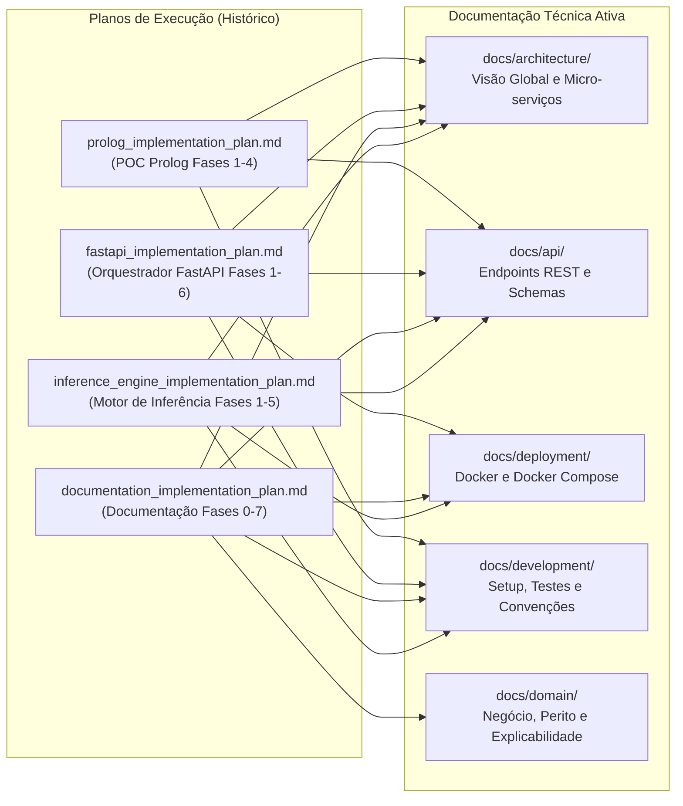

# Histórico e Planos de Implementação
### *Arquivo de Engenharia, Roteiros de Execução e Relatórios de Progresso*

---

## 1. Visão Geral da Secção

Esta secção preserva a memória histórica e os artefactos de planeamento de engenharia que guiaram a construção iterativa do **Sistema Pericial de Diagnóstico para Devoluções e Trocas no Retalho**.

Aqui residem os planos de implementação faseados originais, os critérios de validação utilizados em cada etapa e os relatórios de execução técnica que registaram a transição desde as provas de conceito (POC) iniciais até à maturidade dos micro-serviços.

> [!NOTE]
> **Estatuto dos Documentos:** Os documentos nesta pasta são de cariz **histórico e imutável**. Servem para auditoria académica, rastreabilidade de decisões e consulta de como o sistema foi desenvolvido fase a fase. Para o desenvolvimento ativo e operação contínua do sistema, utilize a documentação técnica consolidada nas secções temáticas (`architecture/`, `api/`, `deployment/`, `domain/`, `development/`).

---

## 2. Índice de Documentos Históricos

| Documento | Fases Cobertas | Estado | Resumo e Conteúdo |
|:---|:---:|:---:|:---|
| [Plano de Implementação do Prolog (`prolog_implementation_plan.md`)](prolog_implementation_plan.md) | Fases 1 a 4 | **100% Concluído** | Setup base, regras de inferência pura (`rules.pl`), camada de transporte HTTP (`server.pl`, `routes.pl`), testes PLUnit (12 testes) e contentorização Docker (`swipl:latest`). |
| [Plano de Implementação do Orquestrador FastAPI (`fastapi_implementation_plan.md`)](fastapi_implementation_plan.md) | Fases 1 a 6 | **100% Concluído** | Setup de configurações tipadas, schemas Pydantic DTOs, cliente HTTP assíncrono `httpx`, endpoints REST v1, suíte de 53 testes Pytest e orquestração integrada via Docker Compose. |
| [Plano de Implementação da Documentação (`documentation_implementation_plan.md`)](documentation_implementation_plan.md) | Fases 0 a 7 | **100% Concluído** | Reorganização da documentação técnica profissional em subdiretórios temáticos, redação de guias de arquitetura, contratos de APIs, deploy, domínio, desenvolvimento e revisão final. |
| [Plano do Motor de Inferência Pericial (`inference_engine_implementation_plan.md`)](inference_engine_implementation_plan.md) | Fases 1 a 5 | **100% Concluído** | Adaptação modular de `sp_exp2.pl` para microserviços, base de conhecimento `vehicles`, rotas REST Prolog `/inference/*`, cliente e serviço Python, schemas Pydantic v2, endpoints FastAPI `/api/v1/inference/*`, toggle `INFERENCE_ENGINE_ENABLED`, testes automatizados PLUnit + Pytest e documentação. |

---

## 3. Relação entre o Histórico e a Documentação Ativa

O diagrama abaixo ilustra como o trabalho documentado nos planos históricos migrou e foi formalizado na atual estrutura de documentação técnica profissional:

---

## 4. Navegação no Repositório de Documentação

* **Arquitetura:** [Visão Global da Arquitetura](../architecture/README.md)
* **APIs & Contratos:** [Referência de APIs e Schemas](../api/README.md)
* **Deploy & Operações:** [Guia de Deploy e Docker](../deployment/README.md)
* **Domínio:** [Domínio de Negócio e Conhecimento Pericial](../domain/README.md)
* **Desenvolvimento:** [Guias de Desenvolvimento e Testes](../development/README.md)
* **Índice Geral:** [Documentação do Projeto](../README.md)
