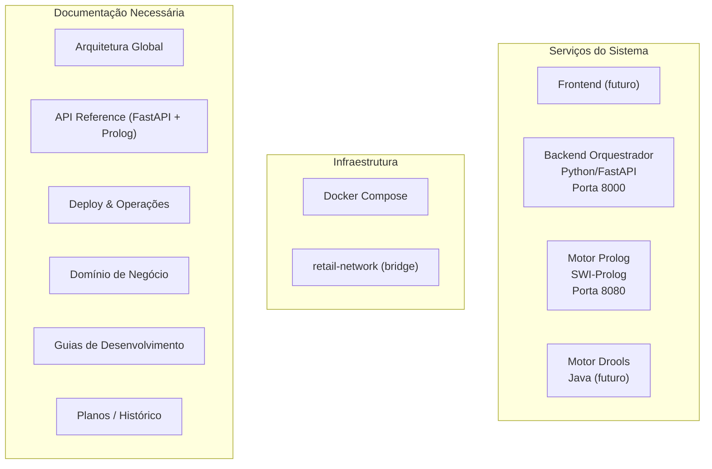
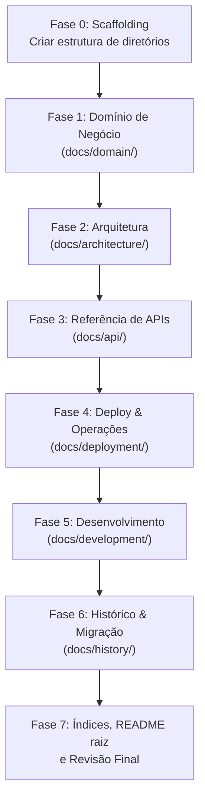

# Histórico de Implementação: Documentação Técnica Profissional
### *Plano de Execução e Registo de Fases — 100% Concluído e Validado*

> [!NOTE]
> **Documento de Arquivo Histórico:** Este documento constitui o registo histórico do plano de implementação e relatório de execução da reorganização e criação da documentação técnica profissional do projeto (Fases 0 a 7, concluídas a 27 de Setembro de 2026).
> Para a documentação técnica consolidada e atualizada de referência, consulte:
> * [Índice Geral da Documentação](../README.md)
> * [Domínio de Negócio e Conhecimento](../domain/README.md)
> * [Arquitetura do Sistema](../architecture/README.md)
> * [Referência de APIs e Schemas](../api/README.md)
> * [Deploy, Contentorização e Operações](../deployment/README.md)
> * [Guias de Desenvolvimento e Testes](../development/README.md)

---

## INSTRUÇÕES PARA O AGENTE LLM (LER PRIMEIRO)

> **ATENÇÃO:** Este bloco é a secção mais importante deste documento. Deve ser lido e compreendido na íntegra **antes** de qualquer ação de implementação. Contém todo o contexto, regras e referências necessárias para executar cada fase com precisão.

### Papel e Identidade
- **Papel:** Atua como **Engenheiro de Software Sénior** e **Especialista em Documentação Técnica de Sistemas Distribuídos**.
- **Contexto:** Estás a trabalhar num projeto de **Mestrado em Engenharia de Inteligência Artificial (MEIA)** — Challenges 4Teams, Equipa 3 (Ano Letivo 2026/2027).
- **Projeto:** Sistema Pericial de Diagnóstico para Devoluções e Trocas no Retalho (*Retail Returns & Exchanges Diagnostic Expert System*), com foco em **Explicabilidade** (*Why / Why not*).
- **O teu objetivo:** Implementar documentação técnica profissional, fase a fase, reorganizando o diretório `docs/` numa hierarquia clara de subdiretórios temáticos.

### Convenções de Idioma
| Elemento | Idioma |
|:---|:---|
| Documentação técnica, READMEs, explicações | **Português (pt-PT)** |
| Código, variáveis, nomes de ficheiros, docstrings | **Inglês** |
| Diagramas Mermaid (labels) | **Português (pt-PT)** |
| Exemplos de cURL/PowerShell (output) | **Inglês** (JSON nativo) |

### Referências Obrigatórias do Repositório
Antes de implementares qualquer fase, deves ter conhecimento dos seguintes ficheiros. **Lê cada ficheiro listado na secção "Fontes de Referência" da fase que estás a executar.**

**Localização do repositório:** `c:\Users\santi\Desktop\meia-equipa3-challenge1-26_27\`

| Ficheiro | Caminho Absoluto | Propósito |
|:---|:---|:---|
| README principal | `README.md` | Visão geral do projeto, arquitetura, contratos API, Docker, roadmap |
| Contexto do domínio | `docs/Main_context.md` | Contexto pericial e académico, heurísticas do perito Dustin Hopper |
| Arquitetura Prolog | `docs/architecture.md` | Clean Architecture do micro-serviço Prolog, ciclo de vida, Docker CLI |
| Contratos API Prolog | `docs/api_contracts.md` | Contratos JSON do endpoint `/evaluate` (POC + evolução retalho) |
| Plano FastAPI | `docs/fastapi_orchestrator_plan.md` | Plano de implementação do backend orquestrador (6 fases concluídas) |
| Plano Prolog | `Implementation_plan_start.md` | Plano e relatório de execução do POC Prolog (4 fases concluídas) |
| Docker Compose | `docker-compose.yml` | Definição dos serviços Prolog (8080) + FastAPI (8000) |
| Config FastAPI | `backend_orchestrator/app/core/config.py` | Pydantic BaseSettings com todas as variáveis de ambiente |
| Schemas Pydantic | `backend_orchestrator/app/schemas/` | DTOs: `common.py`, `scenario.py`, `retail.py`, `health.py` |
| Cliente Prolog | `backend_orchestrator/app/clients/prolog_client.py` | Cliente HTTP assíncrono httpx com exceções personalizadas |
| Serviço Orquestrador | `backend_orchestrator/app/services/orchestrator_service.py` | Coordenação de inferência e mapeamento de respostas |
| Entry point FastAPI | `backend_orchestrator/app/main.py` | Lifespan, CORS, router global |
| Endpoints v1 | `backend_orchestrator/app/api/v1/` | `router.py`, `endpoints/health.py`, `endpoints/evaluate.py` |
| Regras Prolog | `prolog_engine/src/core/rules.pl` | Predicados de inferência e explicabilidade |
| Servidor Prolog | `prolog_engine/src/api/server.pl` | Daemon HTTP multi-threaded |
| Rotas Prolog | `prolog_engine/src/api/routes.pl` | Handlers REST e serialização JSON |
| Testes Prolog | `prolog_engine/tests/` | `test_rules.pl` (7 unit) + `test_api.pl` (5 integration) |
| Testes FastAPI | `backend_orchestrator/tests/` | `conftest.py`, `test_health.py`, `test_schemas.py`, `test_orchestrator.py`, `test_prolog_client.py` |

### Protocolo de Execução Faseada

1. **Execução estritamente faseada:** Implementa **apenas** a fase solicitada pelo utilizador (ex.: "Executa a Fase 2"). **NÃO** implementes múltiplas fases em simultâneo.
2. **Leitura prévia obrigatória:** Antes de escrever qualquer documento, **lê todos os ficheiros** listados na secção "Fontes de Referência" da fase em questão. Usa a ferramenta `view_file` para cada ficheiro referenciado.
3. **Criação de ficheiros:** Cria cada ficheiro `.md` com conteúdo completo e final — sem placeholders `TODO`, sem secções vazias, sem promessas de "conteúdo a adicionar posteriormente".
4. **Validação pós-fase:** Após concluir cada fase, executa os comandos PowerShell especificados nos "Critérios de Validação" e apresenta o resultado.
5. **Relatório de conclusão:** Após cada fase, apresenta:
   - Lista de ficheiros criados/modificados (com caminhos)
   - Resumo do conteúdo de cada ficheiro (2-3 linhas)
   - Resultado dos critérios de validação
   - Indicação de que a fase está pronta para revisão

### Regras de Qualidade da Documentação

1. **Sem instruções de agente LLM nos documentos finais:** A documentação técnica gerada **NÃO deve conter** directivas para LLMs, prompts de sistema, ou frases como "Atua como...". Essas pertencem exclusivamente aos planos de implementação (pasta `history/`).
2. **Precisão técnica acima de tudo:** Todo o conteúdo deve corresponder ao **código real implementado**. Verifica assinaturas de funções, nomes de variáveis, portas, e schemas diretamente no código-fonte.
3. **Cross-referencing obrigatório:** Todos os documentos devem incluir links relativos para documentos relacionados noutras secções (ex.: "Para detalhes de deploy, consulte [Docker Compose](../deployment/docker_compose.md)").
4. **Diagramas em Mermaid:** Utiliza Mermaid para todos os diagramas (arquitetura, sequência, fluxo). Usa labels em Português (pt-PT). Coloca aspas em labels com caracteres especiais.
5. **Exemplos práticos obrigatórios:** Cada documento de API ou operações deve incluir exemplos concretos com comandos cURL/PowerShell, payloads JSON e responses esperadas.
6. **Ausência de duplicação:** Cada informação tem um **único local canónico**. Os restantes documentos devem apontar para esse local com link, em vez de repetir o conteúdo.
7. **READMEs de navegação:** Cada subdiretório tem um `README.md` que serve como índice com título descritivo, lista de ficheiros com link e breve descrição, e referências cruzadas.

### Arquitetura do Sistema (Resumo para Contexto)

O sistema é composto por micro-serviços orquestrados:

```
┌─────────────┐ HTTP/JSON ┌──────────────────────┐ POST /evaluate ┌─────────────────┐
│ Frontend │ ◄──────────────► │ Backend Orquestrador │ ◄──────────────────► │ Motor Prolog │
│ (futuro) │ │ Python / FastAPI │ JSON │ SWI-Prolog │
│ │ │ Porta 8000 │ │ Porta 8080 │
└─────────────┘ └──────────────────────┘ └─────────────────┘
                                           │
                                           │ (futuro)
                                           ▼
                                   ┌─────────────────┐
                                   │ Motor Drools │
                                   │ Java (futuro) │
                                   └─────────────────┘
```

**Regra de ouro:** O orquestrador FastAPI **NÃO contém regras de negócio**. Apenas valida schemas, coordena chamadas HTTP aos motores de inferência e agrega respostas.

---

## 0. AUDITORIA DO ESTADO ATUAL DA DOCUMENTAÇÃO

### 0.1 Inventário de Ficheiros Existentes

| Ficheiro | Localização | Conteúdo | Tamanho | Estado |
|:---|:---|:---|:---:|:---|
| `README.md` | [README.md](../../README.md) | README principal do projeto com visão geral, arquitetura, contratos API, instruções Docker e roadmap | 13.5 KB | Completo mas desatualizado (não reflete o backend orquestrador já implementado) |
| `Main_context.md` | [docs/Main_context.md](../Main_context.md) | Contexto pericial, académico, heurísticas do perito Dustin Hopper e guidelines LLM | 5.5 KB | Bom, mas mistura contexto de negócio com instruções de agente |
| `architecture.md` | [docs/architecture.md](../architecture.md) | Arquitetura do micro-serviço Prolog: Clean Architecture, ciclo de vida, Docker CLI | 14 KB | Cobre apenas o Prolog; falta toda a arquitetura do FastAPI e do sistema global |
| `api_contracts.md` | [docs/api_contracts.md](../api_contracts.md) | Contratos JSON do endpoint `/evaluate` do Prolog (POC + evolução retalho) | 2.8 KB | Contrato apenas Prolog→Orquestrador; falta API pública v1 do FastAPI |
| `fastapi_orchestrator_plan.md` | [docs/fastapi_orchestrator_plan.md](../fastapi_orchestrator_plan.md) | Plano faseado de implementação do backend FastAPI (6 fases, todas concluídas) | 24.8 KB | Plano de execução, não documentação técnica — deve ser movido para histórico |
| `Implementation_plan_start.md` | [Implementation_plan_start.md](../../Implementation_plan_start.md) | Plano e relatório de execução do POC Prolog (4 fases, todas concluídas) | 18 KB | Plano de execução na raiz — deve ser arquivado |

### 0.2 Problemas Identificados

1. **Documentação flat e sem hierarquia:** Todos os docs estão num único diretório sem subdivisão lógica.
2. **Duplicação de conteúdo:** Informação sobre contratos API, Docker e arquitetura está repetida entre README, architecture.md e os planos de implementação.
3. **Planos de execução misturados com docs técnicos:** Os ficheiros `fastapi_orchestrator_plan.md` e `Implementation_plan_start.md` são planos de trabalho/relatórios de progresso, não documentação técnica de referência.
4. **Falta documentação do FastAPI:** O backend orquestrador está 100% implementado (6 fases concluídas) mas não tem documentação técnica própria.
5. **Sem documentação de deploy/operações:** Falta guia consolidado de Docker Compose, variáveis de ambiente, troubleshooting.
6. **Sem documentação das interações entre serviços:** Falta diagrama e especificação completa da comunicação inter-serviços.
7. **Sem índice de navegação:** Sem README.md nos subdiretórios para orientar a leitura.

### 0.3 Componentes do Sistema a Documentar



---

## 1. ESTRUTURA DE DIRETÓRIOS ALVO

A nova organização da documentação seguirá esta hierarquia:

```text
docs/
├── README.md # Índice geral da documentação com links
│
├── architecture/ # Arquitetura do Sistema
│ ├── README.md # Índice da secção de arquitetura
│ ├── system_overview.md # Visão global e diagrama de alto nível
│ ├── prolog_engine.md # Arquitetura interna do micro-serviço Prolog
│ ├── fastapi_orchestrator.md # Arquitetura interna do backend orquestrador
│ └── service_interactions.md # Comunicação inter-serviços e fluxos de dados
│
├── api/ # Referência de APIs
│ ├── README.md # Índice da secção de APIs
│ ├── orchestrator_api_v1.md # API pública do FastAPI (POST /api/v1/evaluate, GET /health)
│ ├── prolog_engine_api.md # API interna do motor Prolog (POST /evaluate)
│ └── schemas.md # Modelos Pydantic / DTOs e validações
│
├── deployment/ # Deploy e Operações
│ ├── README.md # Índice da secção de deploy
│ ├── docker.md # Dockerfiles, imagens e builds individuais
│ ├── docker_compose.md # Orquestração com Docker Compose
│ ├── environment_variables.md # Variáveis de ambiente e configuração
│ └── troubleshooting.md # Resolução de problemas comuns
│
├── domain/ # Domínio de Negócio e Base de Conhecimento
│ ├── README.md # Índice da secção de domínio
│ ├── business_context.md # Contexto académico MEIA + caso de uso de retalho
│ ├── expert_knowledge.md # Heurísticas do perito Dustin Hopper
│ └── explainability.md # Requisito de Explicabilidade (Why/Why not)
│
├── development/ # Guias de Desenvolvimento
│ ├── README.md # Índice da secção de desenvolvimento
│ ├── getting_started.md # Setup do ambiente local + pré-requisitos
│ ├── testing.md # Estratégia e execução de testes (PLUnit + Pytest)
│ └── coding_conventions.md # Convenções de código, idioma, estilo
│
└── history/ # Histórico e Planos de Implementação
    ├── README.md # Índice da secção de histórico
    ├── prolog_implementation_plan.md # [migrado] Implementation_plan_start.md
    └── fastapi_implementation_plan.md # [migrado] fastapi_orchestrator_plan.md
```

---

## 2. ROTEIRO DE IMPLEMENTAÇÃO FASEADA



---

### FASE 0: Scaffolding — Criação da Estrutura de Diretórios

**Objetivo:** Criar toda a árvore de subdiretórios e ficheiros `README.md` placeholder em `docs/`.

**Tarefas:**
- [x] Criar os subdiretórios: `architecture/`, `api/`, `deployment/`, `domain/`, `development/`, `history/`
- [x] Criar um ficheiro `README.md` placeholder em cada subdiretório com título e descrição breve
- [x] Criar o `docs/README.md` principal com índice e links para todos os subdiretórios
- [x] **NÃO mover nem eliminar** os ficheiros existentes nesta fase

**Critérios de Validação:**
```powershell
Get-ChildItem -Path "docs" -Recurse -Filter "README.md" | Select-Object FullName
# Deve listar 7 ficheiros README.md (1 raiz + 6 subdiretórios)
```

---

### FASE 1: Documentação do Domínio de Negócio (`docs/domain/`)

**Objetivo:** Separar e formalizar o conhecimento de domínio, contexto académico e requisitos de explicabilidade.

**Fontes de Referência (ficheiros a consultar):**
- [docs/Main_context.md](../Main_context.md) — Secções 1–4 (contexto do projeto, arquitetura conceptual, heurísticas do perito)
- [README.md](../../README.md) — Secção 1 (Visão Geral) e Secção 4 (Requisito de Explicabilidade)
- [prolog_engine/src/core/rules.pl](../../prolog_engine/src/core/rules.pl) — Regras de inferência (para referência de implementação)

**Tarefas:**

- [x] **1.1: `docs/domain/business_context.md`**
  - Enquadramento académico (MEIA, ENGCIA, PPROGIA, Challenges 4Teams, Equipa 3)
  - Objetivo do projeto: incorporar conhecimento humano em sistemas de IA
  - Caso de uso: devoluções e trocas no retalho (*Returns & Exchanges*)
  - Perito de domínio: Dustin Hopper (papel e contribuição)
  - Factores operacionais modelados (elegibilidade, comprovativos, prazos, canais, métodos de pagamento)

- [x] **1.2: `docs/domain/expert_knowledge.md`**
  - Conceitos-chave extraídos do perito (elegibilidade do produto, comprovativo de compra, prazos, canal, tender)
  - Fluxo conceptual de decisão (árvore de decisão simplificada)
  - **Aviso claro:** As heurísticas são rascunhos do perito e requerem formalização lógica
  - Mapeamento futuro para predicados Prolog e regras Drools

- [x] **1.3: `docs/domain/explainability.md`**
  - Requisito primordial de Explicabilidade (*Explainability & Transparency*)
  - Estrutura da cadeia de justificações (*Why / Why not*)
  - Exemplos concretos de output explicativo (approval com motivos, rejection com motivos)
  - Como o `justification[]` é gerado pelo motor Prolog e propagado pelo orquestrador

- [x] **1.4: `docs/domain/README.md`** — Atualizar com índice e descrições dos ficheiros criados

**Critérios de Validação:**
- Todos os ficheiros legíveis e sem referências a instruções de agente LLM (são docs técnicos, não prompts)
- Links internos entre documentos funcionais

---

### FASE 2: Documentação de Arquitetura (`docs/architecture/`)

**Objetivo:** Documentar a arquitetura global do sistema e de cada componente individual de forma profissional e orientada a referência técnica.

**Fontes de Referência (ficheiros a consultar):**
- [docs/architecture.md](../architecture.md) — Secções 1–5 (arquitetura Prolog, Clean Architecture, ciclo de vida, integração global, explicabilidade)
- [README.md](../../README.md) — Secção 2 (Arquitetura da Solução Global), Secção 3 (Micro-serviço Prolog)
- [docs/fastapi_orchestrator_plan.md](../fastapi_orchestrator_plan.md) — Secções 2–4 (estrutura de diretórios, contrato com Prolog, decisões técnicas)
- **Código-fonte do backend orquestrador:**
  - [backend_orchestrator/app/main.py](../../backend_orchestrator/app/main.py)
  - [backend_orchestrator/app/core/config.py](../../backend_orchestrator/app/core/config.py)
  - [backend_orchestrator/app/clients/prolog_client.py](../../backend_orchestrator/app/clients/prolog_client.py)
  - [backend_orchestrator/app/services/orchestrator_service.py](../../backend_orchestrator/app/services/orchestrator_service.py)
  - [backend_orchestrator/app/api/deps.py](../../backend_orchestrator/app/api/deps.py)
- **Código-fonte do Prolog:**
  - [prolog_engine/src/main.pl](../../prolog_engine/src/main.pl)
  - [prolog_engine/src/api/server.pl](../../prolog_engine/src/api/server.pl)
  - [prolog_engine/src/api/routes.pl](../../prolog_engine/src/api/routes.pl)
  - [prolog_engine/src/core/rules.pl](../../prolog_engine/src/core/rules.pl)
- [docker-compose.yml](../../docker-compose.yml)

**Tarefas:**

- [x] **2.1: `docs/architecture/system_overview.md`**
  - Diagrama de alto nível do ecossistema completo (Mermaid `flowchart`)
  - Descrição de cada componente: Frontend (futuro), Backend Orquestrador (FastAPI), Motor Prolog, Motor Drools (futuro)
  - Princípios arquiteturais: micro-serviços, separação de preocupações, orquestração centralizada
  - Regra de ouro: o orquestrador **não contém** regras de negócio
  - Stack tecnológica de cada camada

- [x] **2.2: `docs/architecture/prolog_engine.md`**
  - Migrar e refinar o conteúdo de [docs/architecture.md](../architecture.md) secções 2–5
  - Estrutura de diretórios do `prolog_engine/` com tree e explicação de cada ficheiro
  - Clean Architecture: camada de transporte (`api/`) vs camada de domínio (`core/`)
  - Papel dos Prolog Dicts como DTOs internos
  - Diagrama de sequência do ciclo de vida do pedido (Mermaid)
  - Predicados exportados e assinatura de `evaluate_scenario/3`

- [x] **2.3: `docs/architecture/fastapi_orchestrator.md`**
  - **NOVO** — Documentar a arquitetura interna do backend orquestrador a partir do código real:
  - Estrutura de diretórios do `backend_orchestrator/` com tree e explicação
  - Camadas: `core/` (config), `schemas/` (DTOs Pydantic), `clients/` (HTTP client), `services/` (orquestração), `api/v1/` (endpoints REST)
  - Gestão de configuração com Pydantic BaseSettings
  - Cliente HTTP assíncrono (`httpx.AsyncClient`) com connection pooling
  - Lifespan management e ciclo de vida do `httpx.AsyncClient`
  - Sistema de exceções personalizadas (`InferenceEngineError` e derivadas)
  - Middleware CORS configurável
  - Injecção de dependências (FastAPI `Depends`)

- [x] **2.4: `docs/architecture/service_interactions.md`**
  - **NOVO** — Diagrama de sequência completo ponta-a-ponta (Frontend → FastAPI → Prolog → FastAPI → Frontend)
  - Fluxo de dados detalhado: transformação de schemas Pydantic → dict → JSON → Prolog Dict → Decision → JSON → EvaluationResponse
  - Resolução DNS interna via Docker Compose (`http://prolog-engine:8080`)
  - Cenários de erro: timeout, conexão recusada, payload inválido
  - Mapeamento de HTTP status codes em cada ponto do fluxo
  - Ponto de extensão para o motor Drools (futuro)

- [x] **2.5: `docs/architecture/README.md`** — Atualizar com índice e descrições

**Critérios de Validação:**
- Diagramas Mermaid renderizam corretamente
- Referências ao código apontam para ficheiros reais
- Sem duplicação de informação entre os documentos da secção

---

### FASE 3: Referência de APIs (`docs/api/`)

**Objetivo:** Criar a referência técnica completa de todas as APIs do sistema, incluindo schemas, exemplos request/response, e códigos de erro.

**Fontes de Referência (ficheiros a consultar):**
- [docs/api_contracts.md](../api_contracts.md) — Contratos JSON do Prolog
- [docs/fastapi_orchestrator_plan.md](../fastapi_orchestrator_plan.md) — Secção 3 (contratos), Secção 6.4 (exemplos cURL)
- **Schemas Pydantic (código-fonte):**
  - [backend_orchestrator/app/schemas/common.py](../../backend_orchestrator/app/schemas/common.py)
  - [backend_orchestrator/app/schemas/scenario.py](../../backend_orchestrator/app/schemas/scenario.py)
  - [backend_orchestrator/app/schemas/retail.py](../../backend_orchestrator/app/schemas/retail.py)
  - [backend_orchestrator/app/schemas/health.py](../../backend_orchestrator/app/schemas/health.py)
- **Endpoints (código-fonte):**
  - [backend_orchestrator/app/api/v1/](../../backend_orchestrator/app/api/v1/) — Routers e endpoints

**Tarefas:**

- [x] **3.1: `docs/api/orchestrator_api_v1.md`**
  - **Base URL:** `http://localhost:8000`
  - **Endpoint `GET /health`:**
    - Descrição, headers, response schema, exemplo (cURL + PowerShell)
    - Status codes: 200 (healthy), estados do `prolog_engine` (connected/disconnected)
  - **Endpoint `POST /api/v1/evaluate`:**
    - Descrição, headers obrigatórios
    - Request body schema (referência ao `ScenarioInput`)
    - Response schema (referência ao `EvaluationResponse`)
    - Exemplos completos: aprovação (`value=42`), rejeição (`value=15`), erro (payload inválido)
    - Exemplos cURL/PowerShell para cada cenário
    - Error responses: 400 (Bad Request/Pydantic validation), 503 (Prolog indisponível/timeout), 422 (Unprocessable Entity)
  - Nota sobre documentação interativa Swagger em `/docs` e ReDoc em `/redoc`

- [x] **3.2: `docs/api/prolog_engine_api.md`**
  - Migrar e refinar o conteúdo de [docs/api_contracts.md](../api_contracts.md)
  - **Base URL:** `http://localhost:8080` (ou `http://prolog-engine:8080` na rede Docker)
  - **Endpoint `POST /evaluate`:**
    - Schema da request (POC: `scenario` + `value`)
    - Schema da response (`status`, `decision`, `justification`)
    - Tabela de campos com tipos e obrigatoriedade
    - Exemplos de sucesso, rejeição e erro
    - Schema futuro para cenários de retalho
  - Nota: esta API é **interna** — o Frontend comunica apenas com o orquestrador

- [x] **3.3: `docs/api/schemas.md`**
  - Documentar todos os modelos Pydantic do sistema a partir do código:
    - `ScenarioInput` (POC)
    - `EvaluationResponse` (resposta canónica)
    - `DecisionEnum`, `EngineSourceEnum` (enumerações)
    - `HealthResponse`
    - `ItemCondition`, `ItemSchema`, `PurchaseSchema`, `RetailReturnScenarioInput` (modelos de retalho futuros)
  - Para cada modelo: campos, tipos, valores por defeito, validações, exemplos `model_dump_json()`

- [x] **3.4: `docs/api/README.md`** — Atualizar com índice e descrições

**Critérios de Validação:**
- Cada endpoint documentado tem pelo menos 2 exemplos (sucesso + erro)
- Schemas correspondem ao código real em `app/schemas/`

---

### FASE 4: Documentação de Deploy e Operações (`docs/deployment/`)

**Objetivo:** Criar um guia operacional completo para construção, deploy e gestão do ecossistema em desenvolvimento e (futuro) produção.

**Fontes de Referência (ficheiros a consultar):**
- [docker-compose.yml](../../docker-compose.yml) — Definição dos serviços
- [backend_orchestrator/Dockerfile](../../backend_orchestrator/Dockerfile)
- [backend_orchestrator/.dockerignore](../../backend_orchestrator/.dockerignore)
- [prolog_engine/Dockerfile](../../prolog_engine/Dockerfile)
- [prolog_engine/.dockerignore](../../prolog_engine/.dockerignore)
- [backend_orchestrator/.env.example](../../backend_orchestrator/.env.example)
- [backend_orchestrator/app/core/config.py](../../backend_orchestrator/app/core/config.py) — Para mapear todas as variáveis de ambiente
- [docs/fastapi_orchestrator_plan.md](../fastapi_orchestrator_plan.md) — Secção 6 (Docker & Compose)
- [docs/architecture.md](../architecture.md) — Secção 6 (Contentorização Prolog)
- [README.md](../../README.md) — Secção 5 (Como Executar e Testar)

**Tarefas:**

- [x] **4.1: `docs/deployment/docker.md`**
  - Descrição de cada Dockerfile (Prolog e FastAPI)
  - Imagens base utilizadas (`swipl:latest`, `python:3.11-slim`) e justificação
  - Otimizações de build (cache de camadas, `.dockerignore`)
  - Instruções de build individual para cada serviço
  - Tabela de portas por serviço

- [x] **4.2: `docs/deployment/docker_compose.md`**
  - Estrutura do `docker-compose.yml` com explicação de cada secção
  - Rede `retail-network` e resolução DNS interna
  - Ordem de arranque (`depends_on`) e política de reinício
  - Guia operacional passo-a-passo:
    - `docker compose up --build -d`
    - `docker compose ps` / `docker compose logs -f`
    - Healthcheck manual
    - `docker compose down` / `docker compose down --rmi local`
  - Diagrama de rede (Mermaid) mostrando portas e resolução DNS

- [x] **4.3: `docs/deployment/environment_variables.md`**
  - Tabela completa de todas as variáveis de ambiente:
    - Variável, tipo, valor por defeito, obrigatoriedade, descrição
  - Variáveis do Prolog Engine: `PORT`
  - Variáveis do Orquestrador: `PROJECT_NAME`, `API_V1_STR`, `DEBUG`, `PORT`, `PROLOG_ENGINE_URL`, `PROLOG_TIMEOUT_SECONDS`, `CORS_ORIGINS`
  - Como o `docker-compose.yml` injeta as variáveis e overrides os defaults
  - Referência ao `.env.example` como template

- [x] **4.4: `docs/deployment/troubleshooting.md`**
  - Problemas comuns e soluções:
    - Prolog não arranca (porta ocupada, imagem não construída)
    - FastAPI não conecta ao Prolog (DNS, rede, timeout)
    - Erros de CORS no Frontend
    - Contentores a reiniciar em loop
    - Testes falharem com conexão recusada
  - Comandos de diagnóstico úteis (`docker compose logs`, `docker inspect`, etc.)

- [x] **4.5: `docs/deployment/README.md`** — Atualizar com índice e descrições

**Critérios de Validação:**
- Guia operacional testável: seguir os passos deve permitir levantar o sistema do zero
- Tabela de variáveis de ambiente corresponde ao código em `config.py`

---

### FASE 5: Guias de Desenvolvimento (`docs/development/`)

**Objetivo:** Documentar o setup do ambiente de desenvolvimento, estratégia de testes e convenções do projeto.

**Fontes de Referência (ficheiros a consultar):**
- [backend_orchestrator/requirements.txt](../../backend_orchestrator/requirements.txt) — Dependências Python
- [backend_orchestrator/tests/conftest.py](../../backend_orchestrator/tests/conftest.py) — Fixtures e mocks
- [backend_orchestrator/tests/](../../backend_orchestrator/tests/) — Suíte de testes completa (6 ficheiros)
- [prolog_engine/tests/](../../prolog_engine/tests/) — Testes PLUnit
- [README.md](../../README.md) — Secção 5.2 e 5.3 (execução local e testes)
- [docs/Main_context.md](../Main_context.md) — Secção 5 (Guidelines LLM — guardar convenções relevantes)
- [pyrightconfig.json](../../pyrightconfig.json) — Configuração de type checking
- [.gitignore](../../.gitignore) — Regras de exclusão Git

**Tarefas:**

- [x] **5.1: `docs/development/getting_started.md`**
  - Pré-requisitos: Docker Desktop, SWI-Prolog (9.x/10.x), Python 3.11+, Git
  - Clone do repositório
  - Setup do ambiente Python (venv, `pip install -r requirements.txt`)
  - Execução local do Prolog (sem Docker): `swipl src/main.pl`
  - Execução local do FastAPI (sem Docker): `uvicorn app.main:app --reload`
  - Execução completa via Docker Compose (referência a `docs/deployment/docker_compose.md`)
  - Verificação rápida (smoke test) com cURL

- [x] **5.2: `docs/development/testing.md`**
  - Estratégia de testes do projeto:
    - **Prolog:** testes unitários (PLUnit) para camada core + testes de integração HTTP
    - **FastAPI:** testes unitários (schemas), testes mockados (orquestração), testes de integração (endpoints)
  - Comandos de execução:
    - Testes Prolog: `swipl -g "run_tests, halt" -s prolog_engine/tests/test_rules.pl`
    - Testes FastAPI: `pytest backend_orchestrator/tests -v`
  - Descrição dos ficheiros de teste e cenários cobertos
  - Fixtures e mocking: como o `conftest.py` configura o `httpx.AsyncClient` com `ASGITransport`
  - Tabela de cobertura: 12 testes Prolog (7 unit + 5 integration) + testes Pytest

- [x] **5.3: `docs/development/coding_conventions.md`**
  - Convenção de idioma: código em Inglês, documentação em Português (pt-PT)
  - Estrutura de módulos Prolog (`:- module(name, [exports])`)
  - Estrutura de pacotes Python (FastAPI + Pydantic v2)
  - Type checking: Pyright/Pyrefly configuração
  - Git: mensagens de commit, branching (se aplicável)
  - Regra de ouro: separação de responsabilidades — orquestrador ≠ regras de negócio

- [x] **5.4: `docs/development/README.md`** — Atualizar com índice e descrições

**Critérios de Validação:**
- Getting started testável: um novo developer deve conseguir seguir o guia e levantar o sistema
- Comandos de teste correspondem à estrutura de ficheiros real

---

### FASE 6: Migração e Arquivo de Planos de Implementação (`docs/history/`)

**Objetivo:** Mover os planos de execução e relatórios de progresso para uma secção de histórico, preservando o contexto de evolução do projeto.

**Fontes de Referência (ficheiros a mover/migrar):**
- [Implementation_plan_start.md](../../Implementation_plan_start.md) — Plano Prolog (mover da raiz)
- [docs/fastapi_orchestrator_plan.md](../fastapi_orchestrator_plan.md) — Plano FastAPI

**Tarefas:**

- [x] **6.1: `docs/history/prolog_implementation_plan.md`**
  - Mover `Implementation_plan_start.md` da raiz para `docs/history/prolog_implementation_plan.md`
  - Adicionar cabeçalho de arquivo com nota: *"Este documento é o histórico do plano de implementação do micro-serviço Prolog. Para documentação técnica de referência, consulte [docs/architecture/prolog_engine.md]."*
  - Remover o ficheiro original da raiz (ou criar redirect/nota)

- [x] **6.2: `docs/history/fastapi_implementation_plan.md`**
  - Mover `docs/fastapi_orchestrator_plan.md` para `docs/history/fastapi_implementation_plan.md`
  - Adicionar cabeçalho de arquivo com nota: *"Este documento é o histórico do plano de implementação do backend orquestrador FastAPI. Para documentação técnica de referência, consulte [docs/architecture/fastapi_orchestrator.md]."*
  - Remover o ficheiro original

- [x] **6.3: `docs/history/README.md`** — Atualizar com índice e explicação do propósito da secção

- [x] **6.4: Limpeza dos ficheiros originais**
  - Remover `Implementation_plan_start.md` da raiz
  - Remover `docs/fastapi_orchestrator_plan.md`
  - Remover `docs/architecture.md` (conteúdo migrado para `docs/architecture/prolog_engine.md`)
  - Remover `docs/api_contracts.md` (conteúdo migrado para `docs/api/prolog_engine_api.md`)
  - Remover `docs/Main_context.md` (conteúdo migrado para `docs/domain/`)

**Critérios de Validação:**
- Zero ficheiros de documentação "soltos" na raiz do projeto (excepto README.md)
- Zero ficheiros "soltos" em `docs/` (tudo nos subdiretórios)
- Nenhuma referência quebrada nos documentos migrados

> [!CAUTION]
> **Fase de eliminação de ficheiros.** Antes de remover ficheiros originais, confirmar com o utilizador que toda a informação relevante foi migrada.

---

### FASE 7: Índices Finais, README Raiz e Revisão Global

**Objetivo:** Atualizar o README principal do projeto, finalizar todos os índices de navegação e fazer uma revisão de coerência global.

**Tarefas:**

- [x] **7.1: Atualizar `README.md` do projeto (raiz)**
  - Refletir o estado atual completo (Prolog + FastAPI implementados)
  - Simplificar: visão geral, diagrama de arquitetura, quick start (3 comandos), links para docs
  - Remover duplicação de contratos API e instruções Docker (apontar para `docs/`)
  - Atualizar a secção "Estrutura de Ficheiros" com a nova árvore
  - Atualizar badges se necessário
  - Manter a secção de Roadmap (Drools, Frontend)

- [x] **7.2: Finalizar `docs/README.md`**
  - Índice de navegação completo com links para todos os documentos
  - Breve descrição de cada secção (1-2 linhas)
  - Diagrama de mapa da documentação (Mermaid opcional)

- [x] **7.3: Verificar todos os README.md dos subdiretórios**
  - Confirmar que cada README tem:
    - Título descritivo
    - Lista de ficheiros com descrição e link
    - Referências cruzadas para documentos relacionados noutras secções

- [x] **7.4: Revisão de coerência global**
  - Verificar que nenhum documento referencia ficheiros que já não existem
  - Confirmar que a informação não está duplicada entre secções
  - Verificar que os diagramas Mermaid renderizam corretamente
  - Confirmar que todos os links relativos apontam para ficheiros válidos

**Critérios de Validação:**
```powershell
# Verificar que todos os READMEs existem
Get-ChildItem -Path "docs" -Recurse -Filter "README.md" | Measure-Object
# Resultado esperado: Count = 7

# Verificar que não há ficheiros soltos em docs/
Get-ChildItem -Path "docs" -File -Exclude "README.md"
# Resultado esperado: 0 ficheiros (tudo nos subdiretórios)

# Verificar que não há ficheiros .md soltos na raiz (excepto README.md)
Get-ChildItem -Path "." -Filter "*.md" -File | Where-Object { $_.Name -ne "README.md" }
# Resultado esperado: 0 ficheiros
```

---

## 4. MAPA DE MIGRAÇÃO DE CONTEÚDO

Esta tabela indica de onde vem o conteúdo para cada novo documento:

| Novo Documento | Fontes Principais | Conteúdo Novo |
|:---|:---|:---|
| `architecture/system_overview.md` | README.md §2, Main_context.md §2 | Diagrama actualizado com FastAPI |
| `architecture/prolog_engine.md` | architecture.md §1-5 (completo) | Refinamento e formalização |
| `architecture/fastapi_orchestrator.md` | — | **100% novo** (baseado no código) |
| `architecture/service_interactions.md` | architecture.md §3-4, fastapi_plan §3 | Diagrama ponta-a-ponta **novo** |
| `api/orchestrator_api_v1.md` | fastapi_plan §6.4 | **Maioritariamente novo** |
| `api/prolog_engine_api.md` | api_contracts.md (completo) | Refinamento |
| `api/schemas.md` | — | **100% novo** (baseado no código) |
| `deployment/docker.md` | architecture.md §6, fastapi_plan §6.1 | Consolidação |
| `deployment/docker_compose.md` | fastapi_plan §6.2-6.4 | Refinamento |
| `deployment/environment_variables.md` | fastapi_plan §Fase 1 | **Maioritariamente novo** |
| `deployment/troubleshooting.md` | — | **100% novo** |
| `domain/business_context.md` | Main_context.md §1-2, README.md §1 | Reorganização |
| `domain/expert_knowledge.md` | Main_context.md §4 | Reorganização |
| `domain/explainability.md` | README.md §Explicabilidade, architecture.md §5 | Consolidação |
| `development/getting_started.md` | README.md §5 | Expansão |
| `development/testing.md` | Implementation_plan, fastapi_plan §Fase 5 | **Maioritariamente novo** |
| `development/coding_conventions.md` | Main_context.md §5 | **Maioritariamente novo** |
| `history/prolog_implementation_plan.md` | Implementation_plan_start.md | Migração directa |
| `history/fastapi_implementation_plan.md` | fastapi_orchestrator_plan.md | Migração directa |
