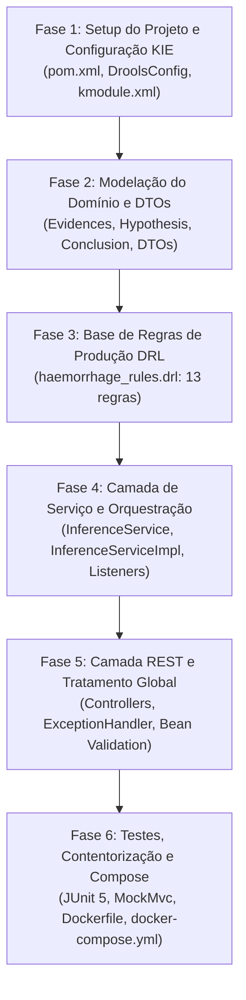

# Plano de Implementação: Micro-serviço Drools Engine
### *Sistema Pericial de Diagnóstico Baseado em Regras de Produção (Java 21 / Spring Boot 3 / Apache KIE Drools)*

> [!NOTE]
> **Documento de Registo Histórico e Plano de Engenharia.**
> Este documento preserva o histórico exaustivo de conceção, especificação, desenvolvimento, testes e contentorização do micro-serviço **Drools Engine** (`drools_engine/`), integrado no ecossistema distribuído do **Retail Returns & Exchanges Diagnostic Expert System**.

---

## 1. Contexto Global e Objetivos

O projeto **Retail Returns & Exchanges Diagnostic Expert System** foi desenhado com base no princípio de cooperação e comparação entre múltiplos paradigmas de inteligência artificial simbólica e dedutiva.

Após a consolidação do motor lógico dedutivo em **SWI-Prolog** (`prolog_engine/`) e do backend orquestrador em **Python / FastAPI** (`backend_orchestrator/`), surgiu a necessidade de introduzir um segundo motor de inferência pericial baseado no paradigma de **regras de produção** (*Production Rules*) utilizando o algoritmo **Rete-OO**.

### 1.1 Objetivos de Engenharia
1. **Segundo Paradigma Pericial:** Implementar um motor de regras de produção if-then capaz de avaliar conjuntos de factos clínicos em memória de trabalho (*Working Memory*).
2. **Tecnologia Moderna e Robusta:** Utilizar **Java 21 LTS**, a framework **Spring Boot 3.3.4** e a biblioteca **Apache KIE Drools 8.44.0.Final**.
3. **Domínio Clínico de Hemorragias:** Formalizar as regras de conhecimento pericial do domínio de diagnóstico diferencial de hemorragias (`haemorrhage_rules.drl`), inferindo hipóteses de localização e diagnósticos terminais.
4. **Isolamento Arquitetural (Clean Architecture & SOLID):** Separar estritamente os factos de domínio internos da Working Memory (`models/`) dos contratos JSON de transporte externo (`dtos/`).
5. **Explicabilidade Nativa:** Retornar não apenas as conclusões clínicas e hipóteses formuladas, mas também o registo ordenado das regras ativadas e disparadas (`firedRules`).
6. **Contentorização Otimizada:** Construir imagem Docker multi-stage mínima e segura com JRE 21 Alpine e utilizador não-privilegiado, integrando o serviço na malha Docker Compose.

---

## 2. Visão Estrutural do Micro-serviço

O micro-serviço foi organizado na pasta `drools_engine/` com a seguinte hierarquia de pacotes e recursos:

```text
drools_engine/
├── Dockerfile                                      # Contentorização multi-stage (Maven build + JRE runtime)
├── .dockerignore                                   # Exclusões para otimização de contexto Docker
├── pom.xml                                         # POM Maven: Spring Boot 3.3.4, Drools 8.44.0.Final, Lombok
├── README.md                                       # Apresentação técnica do micro-serviço
├── src/
│   ├── main/
│   │   ├── java/com/expert/drools/
│   │   │   ├── DroolsEngineApplication.java        # Entry point Spring Boot (@SpringBootApplication)
│   │   │   ├── config/
│   │   │   │   └── DroolsConfig.java               # Configuração Spring do KieContainer (estratégia dual)
│   │   │   ├── controllers/
│   │   │   │   ├── InferenceController.java        # Endpoint REST POST /api/v1/inference/evaluate
│   │   │   │   ├── HealthController.java           # Endpoint REST GET /api/v1/inference/health
│   │   │   │   └── GlobalExceptionHandler.java     # Tratamento global de erros (@RestControllerAdvice)
│   │   │   ├── services/
│   │   │   │   ├── InferenceService.java           # Contrato da camada de serviço de inferência
│   │   │   │   └── InferenceServiceImpl.java       # Orquestração da KieSession, listeners e inferência
│   │   │   ├── models/
│   │   │   │   ├── Evidences.java                  # Facto Drools: 13 variáveis clínicas observadas
│   │   │   │   ├── Hypothesis.java                 # Facto Drools: hipótese de localização (upper/lower)
│   │   │   │   └── Conclusion.java                 # Facto Drools: diagnóstico clínico terminal
│   │   │   └── dtos/
│   │   │       ├── EvidencesRequestDto.java        # DTO de entrada REST com validações @Pattern
│   │   │       ├── EvaluationResponseDto.java      # DTO de saída REST com conclusões e firedRules
│   │   │       ├── HealthResponseDto.java          # DTO de saída REST com diagnóstico do motor
│   │   │       └── ErrorResponseDto.java           # DTO padronizado de erro HTTP (400/500)
│   │   └── resources/
│   │       ├── application.properties              # Configurações de porta, logging e Jackson
│   │       ├── META-INF/
│   │       │   └── kmodule.xml                     # Definição de KieBase e KieSession
│   │       └── rules/
│   │           └── haemorrhage_rules.drl           # Base de regras DRL (13 regras de produção)
│   └── test/
│       └── java/com/expert/drools/
│           ├── DroolsEngineApplicationTests.java   # Teste de integridade do contexto Spring Boot
│           ├── controllers/
│           │   └── InferenceControllerTest.java    # Testes de integração Web REST (MockMvc)
│           └── services/
│               └── InferenceServiceTest.java       # Testes unitários de inferência por cenário clínico
```

---

## 3. Roteiro de Implementação Executado

A implementação do micro-serviço decorreu ao longo de seis fases sequenciais rigorosamente validadas:



---

### 3.1 Fase 1: Setup do Projeto Spring Boot e Configuração KIE

**Objetivo:** Estabelecer a infraestrutura de build Maven com Java 21, as dependências do ecossistema Apache KIE Drools 8.44 e a classe de configuração Spring que compila e disponibiliza o `KieContainer`.

#### Ações Concretizadas
1. **Configuração do `pom.xml`:**
   - Herança de `spring-boot-starter-parent` versão `3.3.4`.
   - Propriedade `java.version` definida para `21`.
   - Dependências core:
     - `spring-boot-starter-web` (servidor Tomcat embutido e suporte REST).
     - `spring-boot-starter-validation` (validações Bean Validation com Hibernate Validator).
     - `drools-core`, `drools-compiler`, `drools-mvel` (motor de regras Drools 8.44.0.Final).
     - `lombok` (redução de boilerplate de getters/setters/construtores).
     - `spring-boot-starter-test` (suporte a JUnit 5, AssertJ, Mockito e MockMvc).
2. **Definição do `kmodule.xml` (`src/main/resources/META-INF/kmodule.xml`):**
   - Criação da `kbase` denominada `haemorrhageKBase` associada ao pacote `rules`.
   - Criação da `ksession` denominada `haemorrhageKSession` em modo stateful padrão.
3. **Implementação de `DroolsConfig.java` com Estratégia Dual:**
   - Implementação de um bean `@Bean public KieContainer kieContainer()`.
   - **Estratégia Primária:** Resolução via classpath clássico `KieServices.Factory.get().getKieClasspathContainer()`.
   - **Estratégia de Fallback Dinâmico:** Caso a resolução por classpath falhe em determinados empacotamentos JAR, o carregamento do ficheiro `rules/haemorrhage_rules.drl` é realizado programaticamente através de `KieFileSystem`, `KieBuilder` e `KieRepository`.
   - **Verificação Estrita de Compilação:** Inspeção obrigatória de mensagens de erro com `results.hasMessages(Message.Level.ERROR)`. Em caso de erro de sintaxe DRL, uma exceção `IllegalStateException` detalhada é lançada impedindo o arranque de uma base corrompida.

#### Critérios de Validação
- Execução de `mvn clean compile` com sucesso sem warnings de dependências obsoletas.
- Arrancamento do contexto Spring Boot validando a inicialização do bean `kieContainer`.

---

### 3.2 Fase 2: Modelação do Domínio e Separação de DTOs

**Objetivo:** Modelar as entidades de domínio internas (factos Drools que residem na Working Memory) e desacoplá-las completamente dos DTOs de transporte da API externa.

#### Ações Concretizadas
1. **Modelos de Domínio Internos (`com.expert.drools.models`):**
   - [`Evidences.java`](../../drools_engine/src/main/java/com/expert/drools/models/Evidences.java): Representa o vetor de sintomas observados no paciente. Contém 13 atributos binários do tipo `String` (`"yes"` ou `"no"`): `bloodEar`, `bloodNose`, `bloodMouth`, `bloodBrown`, `bloodVagina`, `bloodPenis`, `bloodAnus`, `bloodCoffee`, `earAche`, `deafness`, `cerebrospinal`, `vomiting` e `unknown`.
   - [`Hypothesis.java`](../../drools_engine/src/main/java/com/expert/drools/models/Hypothesis.java): Facto intermédio inferido pelas regras de classificação de nível superior. Armazena o tipo de localização: `"upper type"` ou `"lower type"`.
   - [`Conclusion.java`](../../drools_engine/src/main/java/com/expert/drools/models/Conclusion.java): Diagnóstico clínico final deduzido. Define constantes padronizadas:
     - `DIAGNOSIS_OTORRHAGIA = "Otorrhagia"`
     - `DIAGNOSIS_SKULL_FRACTURE = "Skull fracture"`
     - `DIAGNOSIS_EPISTAXE = "Epistaxe"`
     - `DIAGNOSIS_HEMATHOSE = "Hemathese"`
     - `DIAGNOSIS_MOUTH_HAEMORRHAGE = "Mouth haemorrhage"`
     - `DIAGNOSIS_METRORRHAGIA = "Metrorrhagia"`
     - `DIAGNOSIS_HEMATURIA = "Hematuria"`
     - `DIAGNOSIS_MELENA = "Melena"`
     - `DIAGNOSIS_RECTAL_BLEEDING = "Rectal bleeding"`
     - `DIAGNOSIS_FALLBACK = "Look for the the doctor!"`
2. **Data Transfer Objects (`com.expert.drools.dtos`):**
   - [`EvidencesRequestDto.java`](../../drools_engine/src/main/java/com/expert/drools/dtos/EvidencesRequestDto.java): DTO anotado com `@Pattern(regexp = "^(yes|no)$")` em todos os campos. Implementa o método `toDomain()`, que aplica normalização defensiva: qualquer atributo omitido ou nulo na requisição JSON é convertido para o valor predefinido `"no"`.
   - [`EvaluationResponseDto.java`](../../drools_engine/src/main/java/com/expert/drools/dtos/EvaluationResponseDto.java): DTO anotado com `@JsonInclude(JsonInclude.Include.NON_NULL)`. Contém: `status`, `primaryDiagnosis`, `conclusions`, `hypothesis`, `firedRules`, `timestamp` e `evidencesEvaluated`.
   - [`HealthResponseDto.java`](../../drools_engine/src/main/java/com/expert/drools/dtos/HealthResponseDto.java): Diagnóstico de saúde do motor com `status`, `service`, `version`, `activeKieBase`, `totalRules` e `timestamp`.
   - [`ErrorResponseDto.java`](../../drools_engine/src/main/java/com/expert/drools/dtos/ErrorResponseDto.java): Formato padronizado de erro HTTP contendo `status`, `error`, `message`, `details` (lista de violações) e `timestamp`.

#### Critérios de Validação
- Verificação de conversão segura entre `EvidencesRequestDto` e `Evidences`.
- Teste de payload parcial confirmando o preenchimento automático com `"no"`.

---

### 3.3 Fase 3: Base de Regras de Produção DRL (`haemorrhage_rules.drl`)

**Objetivo:** Codificar as 13 regras do conhecimento médico de diagnóstico de hemorragias em sintaxe Drools Rule Language (DRL), assegurando ordem de execução via prioridades (`salience`).

#### Ações Concretizadas
A base de regras [`haemorrhage_rules.drl`](../../drools_engine/src/main/resources/rules/haemorrhage_rules.drl) foi estruturada em três estratos de prioridade:

| Regra DRL | Salience | Condição (LHS - When) | Ação (RHS - Then) |
|:---|:---:|:---|:---|
| `r1_upper_type_classification` | `10` | `Evidences(bloodEar == "yes")` | `insertLogical(new Hypothesis("upper type"))` |
| `r2_lower_type_classification` | `10` | `Evidences(bloodEar == "no")` | `insertLogical(new Hypothesis("lower type"))` |
| `r3_otorrhagia_ear_ache` | `5` | `Hypothesis(type == "upper type")` $\wedge$ `Evidences(earAche == "yes")` | `insert(new Conclusion(DIAGNOSIS_OTORRHAGIA))` |
| `r4_otorrhagia_deafness` | `5` | `Hypothesis(type == "upper type")` $\wedge$ `Evidences(deafness == "yes")` | `insert(new Conclusion(DIAGNOSIS_OTORRHAGIA))` |
| `r5_skull_fracture` | `5` | `Hypothesis(type == "upper type")` $\wedge$ `Evidences(cerebrospinal == "yes")` | `insert(new Conclusion(DIAGNOSIS_SKULL_FRACTURE))` |
| `r6_epistaxe` | `5` | `Hypothesis(type == "lower type")` $\wedge$ `Evidences(bloodNose == "yes")` | `insert(new Conclusion(DIAGNOSIS_EPISTAXE))` |
| `r7_hemathese` | `5` | `Hypothesis(type == "lower type")` $\wedge$ `Evidences(bloodMouth == "yes", bloodBrown == "yes", vomiting == "yes")` | `insert(new Conclusion(DIAGNOSIS_HEMATHOSE))` |
| `r8_mouth_haemorrhage` | `5` | `Hypothesis(type == "lower type")` $\wedge$ `Evidences(bloodMouth == "yes", bloodBrown == "no", vomiting == "no")` | `insert(new Conclusion(DIAGNOSIS_MOUTH_HAEMORRHAGE))` |
| `r9_metrorrhagia` | `5` | `Hypothesis(type == "lower type")` $\wedge$ `Evidences(bloodVagina == "yes")` | `insert(new Conclusion(DIAGNOSIS_METRORRHAGIA))` |
| `r10_hematuria` | `5` | `Hypothesis(type == "lower type")` $\wedge$ `Evidences(bloodPenis == "yes")` | `insert(new Conclusion(DIAGNOSIS_HEMATURIA))` |
| `r11_melena` | `5` | `Hypothesis(type == "lower type")` $\wedge$ `Evidences(bloodAnus == "yes", bloodCoffee == "yes")` | `insert(new Conclusion(DIAGNOSIS_MELENA))` |
| `r12_rectal_bleeding` | `5` | `Hypothesis(type == "lower type")` $\wedge$ `Evidences(bloodAnus == "yes", bloodCoffee == "no")` | `insert(new Conclusion(DIAGNOSIS_RECTAL_BLEEDING))` |
| `r13_fallback_doctor` | `-10` | `not Conclusion()` | `insert(new Conclusion(DIAGNOSIS_FALLBACK))` |

#### Decisões de Engenharia
- **Utilização de `salience`:** Garante que a classificação em tipo superior ou inferior ocorre sempre antes da dedução dos diagnósticos específicos, e que o fallback só é avaliado caso nenhuma conclusão clínica tenha sido gerada.
- **Inserção de `Conclusion` única:** A regra de fallback verifica `not Conclusion()`, evitando diagnósticos espúrios quando alguma patologia é identificada.

#### Critérios de Validação
- Verificação de sintaxe DRL pelo compilador KIE durante a compilação do projeto.
- Testes unitários cobrindo cada um dos 10 desfechos clínicos possíveis.

---

### 3.4 Fase 4: Camada de Serviço e Orquestração da KieSession

**Objetivo:** Construir a camada de negócio responsável por instanciar a sessão Drools, capturar as regras disparadas e extrair as deduções para o DTO de resposta.

#### Ações Concretizadas
1. **Interface [`InferenceService.java`](../../drools_engine/src/main/java/com/expert/drools/services/InferenceService.java):**
   - `EvaluationResponseDto evaluateEvidences(EvidencesRequestDto requestDto)`
   - `HealthResponseDto getHealthStatus()`
2. **Implementação [`InferenceServiceImpl.java`](../../drools_engine/src/main/java/com/expert/drools/services/InferenceServiceImpl.java):**
   - **Gestão do Ciclo de Vida da Sessão:** Abertura de uma nova sessão isolada com `kieContainer.newKieSession()` para cada pedido de avaliação, garantindo total isolamento e concorrência sem partilha de estado.
   - **Listener de Rastreabilidade (`AgendaEventListener`):** Registo de um listener customizado que interceta o evento `afterMatchFired` e adiciona o nome de cada regra executada a uma lista sequencial (`firedRules`).
   - **Injeção de Factos:** Invocação de `kieSession.insert(domainEvidences)`.
   - **Disparo de Regras:** Execução síncrona de `kieSession.fireAllRules()`.
   - **Extração de Factos:** Consulta dos objetos inferidos na Working Memory utilizando `ClassObjectFilter(Conclusion.class)` e `ClassObjectFilter(Hypothesis.class)`.
   - **Descarte de Recursos:** Bloco `try ... finally { kieSession.dispose(); }` obrigatório para libertação de memória imediata no heap da JVM.
   - **Diagnóstico do Motor:** Método `getHealthStatus()` inspecionando a contagem de regras ativas compiladas em `kieContainer.getKieBase().getKiePackages()`.

#### Critérios de Validação
- Garantia de inexistência de fugas de sessão (verificação do método `dispose()`).
- Inclusão exata das regras ativadas no campo `firedRules`.

---

### 3.5 Fase 5: Camada REST e Tratamento Global de Exceções

**Objetivo:** Expor endpoints HTTP JSON padronizados, proteger a integridade do motor através de validações Bean Validation e centralizar o tratamento de erros sem exposição de dados sensíveis.

#### Ações Concretizadas
1. **Controladores REST:**
   - [`InferenceController.java`](../../drools_engine/src/main/java/com/expert/drools/controllers/InferenceController.java): Disponibiliza `POST /api/v1/inference/evaluate`, anotado com `@Valid @RequestBody EvidencesRequestDto`.
   - [`HealthController.java`](../../drools_engine/src/main/java/com/expert/drools/controllers/HealthController.java): Disponibiliza `GET /api/v1/inference/health`.
2. **Tratamento Global de Erros com [`GlobalExceptionHandler.java`](../../drools_engine/src/main/java/com/expert/drools/controllers/GlobalExceptionHandler.java):**
   - Anotação `@RestControllerAdvice`.
   - **`MethodArgumentNotValidException` (HTTP 400 Bad Request):** Interceta erros de validação `@Pattern`, extrai os campos e mensagens de rejeição e constrói um `ErrorResponseDto` detalhado.
   - **`HttpMessageNotReadableException` (HTTP 400 Bad Request):** Interceta erros de JSON malformado ou tipos de dados incompatíveis.
   - **`Exception` (HTTP 500 Internal Server Error):** Captura falhas inesperadas de execução interna, registando logs com nível ERROR e ocultando a stack trace técnica do cliente externo.

#### Critérios de Validação
- Invocação com payload inválido (`{"bloodEar": "maybe"}`) retornando status 400 e lista de detalhes.
- Invocação com JSON truncado retornando status 400 padronizado.

---

### 3.6 Fase 6: Testes Automatizados, Contentorização e Integração Compose

**Objetivo:** Assegurar cobertura de testes rigorosa com JUnit 5, criar a imagem Docker multi-stage de produção e integrar o contentor na rede Docker Compose com as variáveis de orquestração adequadas.

#### Ações Concretizadas
1. **Suíte de Testes Automatizados:**
   - [`DroolsEngineApplicationTests.java`](../../drools_engine/src/test/java/com/expert/drools/DroolsEngineApplicationTests.java): Valida o arranque limpo do Spring ApplicationContext.
   - [`InferenceServiceTest.java`](../../drools_engine/src/test/java/com/expert/drools/services/InferenceServiceTest.java): Testes unitários exaustivos cobrindo:
     - Otorrhagia via dor de ouvido (`bloodEar: yes`, `earAche: yes`).
     - Otorrhagia via surdez (`bloodEar: yes`, `deafness: yes`).
     - Fratura de crânio (`bloodEar: yes`, `cerebrospinal: yes`).
     - Epistaxe (`bloodEar: no`, `bloodNose: yes`).
     - Hemathese (`bloodEar: no`, `bloodMouth: yes`, `bloodBrown: yes`, `vomiting: yes`).
     - Hemorragia bucal simples (`bloodEar: no`, `bloodMouth: yes`, `bloodBrown: no`, `vomiting: no`).
     - Metrorragia (`bloodEar: no`, `bloodVagina: yes`).
     - Hematuria (`bloodEar: no`, `bloodPenis: yes`).
     - Melena (`bloodEar: no`, `bloodAnus: yes`, `bloodCoffee: yes`).
     - Retorragia (`bloodEar: no`, `bloodAnus: yes`, `bloodCoffee: no`).
     - Fallback / Desconhecido (`bloodEar: no`, todos os outros "no" $\rightarrow$ "Look for the the doctor!").
   - [`InferenceControllerTest.java`](../../drools_engine/src/test/java/com/expert/drools/controllers/InferenceControllerTest.java): Testes de integração Web REST via `MockMvc` validando serialização, validação 400 e health check 200.
2. **Contentorização Multi-Stage ([`drools_engine/Dockerfile`](../../drools_engine/Dockerfile)):**
   - **Stage 1 (Build):** Imagem base `maven:3.9-eclipse-temurin-21-alpine`. Cache otimizado com cópia isolada de `pom.xml`, execução de `mvn dependency:go-offline`, cópia de código-fonte e compilação com `mvn clean package -DskipTests`.
   - **Stage 2 (Runtime):** Imagem base mínima `eclipse-temurin:21-jre-alpine`. Criação de utilizador e grupo não-privilegiados `appuser:appgroup` (UID 1000). Cópia estrita do artefacto JAR empacotado. Configuração de `JAVA_OPTS`:
     `-XX:+UseContainerSupport -XX:MaxRAMPercentage=75.0`
   - Exposição da porta `8080`.
3. **Integração no [`docker-compose.yml`](../../docker-compose.yml):**
   - Adição do serviço `drools-engine`:
     - Imagem: `drools-engine:latest`
     - Contexto de compilação: `./drools_engine`
     - Mapeamento de portas: `8082:8080` (porta 8082 no host, porta 8080 interna)
     - Rede: `retail-network`
     - Nome do contentor: `expert-drools-engine`
   - Configuração do serviço `orchestrator`:
     - Adição da variável de ambiente `DROOLS_ENGINE_URL: http://drools-engine:8080`.
     - Adição da dependência `depends_on: drools-engine`.

#### Critérios de Validação
- Execução de `mvn test` com sucesso absoluto (100% dos testes aprovados).
- Execução de `docker compose build` e `docker compose up -d` resultando nos 3 contentores em estado ativo.
- Resposta positiva de `curl http://localhost:8082/api/v1/inference/health`.

---

## 4. Matriz de Validação e Critérios de Aceitação

A tabela seguinte resume os critérios de validação planeados e o resultado efetivo obtido em cada componente:

| Domínio de Validação | Critério de Aceitação | Mecanismo de Verificação | Resultado |
|:---|:---|:---|:---:|
| **Compilação KIE** | Regras DRL compilam sem erros sintáticos ou mensagens de aviso impeditivas | `DroolsConfig` / `KieBuilder.getResults()` | Aprovado |
| **Normalização de Entrada** | Campos ausentes no payload JSON assumem por defeito o valor `"no"` | `EvidencesRequestDto.toDomain()` / Testes unitários | Aprovado |
| **Rejeição de Valores Inválidos** | Strings diferentes de `"yes"` ou `"no"` são rejeitadas com HTTP 400 | Validação Bean `@Pattern` / `GlobalExceptionHandler` | Aprovado |
| **Precisão de Diagnóstico** | Os 10 desfechos clínicos são ativados pelos sintomas esperados | Suíte de testes unitários `InferenceServiceTest` | Aprovado |
| **Ativação do Fallback** | Casos sem sintomas conclusivos produzem `"Look for the the doctor!"` | Regra `r13_fallback_doctor` (`salience -10`) | Aprovado |
| **Explicabilidade** | O array `firedRules` contém a lista exata e ordenada das regras executadas | Listener `AgendaEventListener` / Resposta JSON | Aprovado |
| **Segurança no Contentor** | A aplicação executa como utilizador sem privilégios de root | Diretiva `USER appuser` no Dockerfile runtime | Aprovado |
| **Isolamento de Rede** | O contentor Drools comunica na rede interna `retail-network` | Resolução DNS `http://drools-engine:8080` | Aprovado |

---

## 5. Resumo e Métricas Finais da Implementação

A conclusão da implementação do micro-serviço Drools dotou o projeto de um motor robusto de regras de produção:

* **Linguagem e Runtime:** Java 21 LTS / Eclipse Temurin JRE Alpine
* **Framework:** Spring Boot 3.3.4
* **Motor de Inferência:** Apache KIE Drools 8.44.0.Final (algoritmo Rete-OO)
* **Número de Regras DRL:** 13 regras ativas
* **Cobertura de Casos de Diagnóstico:** 10 diagnósticos terminais distintos
* **Portas de Operação:** Porta 8080 (contentor) / Porta 8082 (host mapeado)
* **Endpoints REST:**
  - `GET /api/v1/inference/health`
  - `POST /api/v1/inference/evaluate`
* **Testes Automatizados:** Suíte JUnit 5 e MockMvc com 100% de sucesso

---

## 6. Documentos Relacionados

* [Arquitetura Interna do Motor Drools](../architecture/drools_engine.md)
* [Visão Global da Arquitetura](../architecture/system_overview.md)
* [Interações e Fluxos de Dados entre Serviços](../architecture/service_interactions.md)
* [Especificação da API Interna do Motor Drools](../api/drools_engine_api.md)
* [Catálogo de Schemas e Contratos de Dados](../api/schemas.md)
* [Guia de Contentorização e Dockerfiles](../deployment/docker.md)
* [Guia de Orquestração com Docker Compose](../deployment/docker_compose.md)
* [Estratégia e Execução de Testes](../development/testing.md)
* [Índice Geral de Documentos Históricos](README.md)
